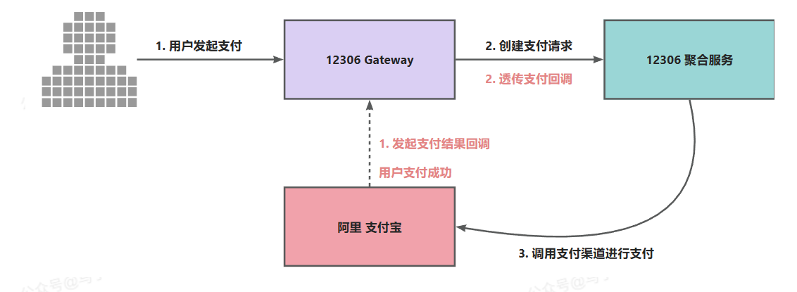
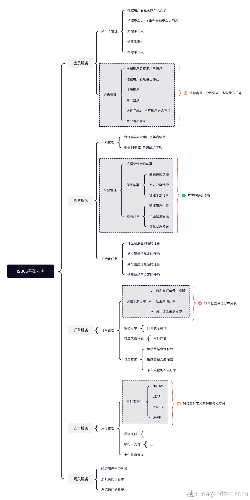
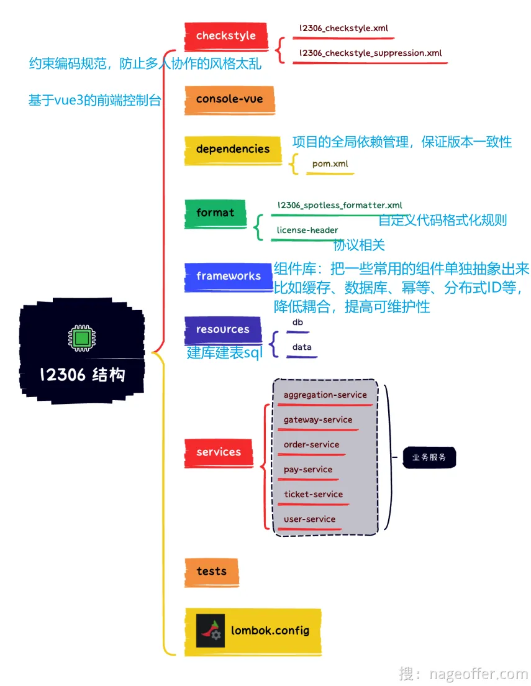

# 12306系统概览

## 怎么启动项目

> 这部分后面有空来补一下具体流程，还挺麻烦的……当时花了不少时间才配完环境，启动成功这个项目。

中间件：需要安装**docker**进行部署

后端：如果是单体项目的话，**依次启动** aggregation-Service 和 GateWay-Service

前端：需要安装Node.js（这边最好安装npm，然后选定特定版本的），然后启动前端页面

## 如何发起一笔支付？

当用户支付完一笔订单后，支付宝付款渠道接收到支付结果后，**对请求支付的系统进行支付结果回调**

### 关于支付配置的细节

**内网穿透**：由于支付宝回调的地址一定是要在公网上可以访问的，如果提供本地地址，支付宝是访问不到的。

出于本地联调的方便，可以**将本地的开发环境网络配置为公网可访问**，这就需要**内网穿透技术**

所以我们可以用常用的 **NetApp** 工具，去开通**内网穿透**

## 关于核心业务

## 模块结构梳理

