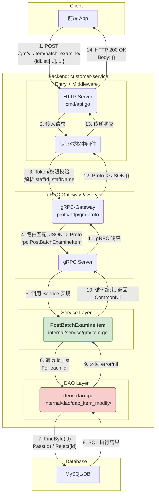

# Requirements of 0119

## BatchExamineItem

初来时一头雾水，在这两周的学习中，我发现这个 customer- service 项目没有一个靠谱的技术文档，说的直白点，就是技术文档写的一坨史；所以需要我直接看代码去理解业务逻辑，而且很操蛋的是代码没有注释，只能一点点问 AI；

### Question A: 这个 “RPC” 是什么东西，它怎么路由到业务层的方法上去的？

问题也可以这样表述：前端发过来那个URL，是怎么一步步经过调用，变成后端业务层的逻辑进行执行的？

首先是**API 定义**，在 gm.proto 文件里面，通过 rpc PostExamineItem(...) 定义了一个远程过程调用。然后通过 option(google.api.http) 注解，将其绑定到一个 http 路由上面，比如说 Post /gm/v1/item/examine/

然后涉及到一个事：**代码自动生成**，当运行 scripts/gen_proto.sh 脚本时，protoc 会根据 .proto 生成两个**很重要**的 Go 文件：

- pkg/gen/api/gm.pb.go: 这个是定义了 Go 的服务接口(gm_serviceServer), 其中包含了不少方法的签名（比如说 PostExamineItem）

> 这边备注一下，省的后面又忘了：这个 **PostExamineItem** 是用来审批单条邮件 VIP 道具的方法；

- pkg/gen/api/gm_http.pb.go: 这个是**路由**的关键， 这玩意会生成一个 RegisterServiceHttpHandler 函数， 这个函数内部里面实现了一个 HTTP 处理器， 负责解析收到的 HTTP 请求，然后去调用 gm_serviceServer 接口的 PostExamineItem 方法；
  
**业务逻辑**（就是那个 service）的实现，是在业务层实现各种各样的接口。比如说，在 item.go 里面，去定义一个 Service 结构体，并且让他实现 gm_serviceServer 接口。也就是说，Service 结构体必须提供一个和接口签名完全一致的 PostExamineItem 方法。

关于**服务注册和启动**， 在项目的启动文件中，就是那个 server.go 里面，会将上面的所有部分组装起来：

- 创建一个 gin 的 HTTP 引擎
- 创建一个 gm 服务的的服务实例（也就是 internal/service/gm/item.go 里面那个 Service）
- 调用自动生成的那个 RegisterGmServiceHandler 函数，去把 gin 引擎和 gm 服务实例传递进去；

上面这堆东西看起来很复杂，再精简一下表述：对于 HTTP 请求到具体的业务逻辑实现函数的完整调用链，当一个请求到达匹配的 URL 时，gin 会把他交给 RegisterGmServiceHandler 生成的处理器，处理器再调用比如说在 item.go 中生成的 PostExamineItem 方法；

### Question B: 这边使用了 gRPC + Gateway 模式，这个 Gateway 是什么东西？

### Question C: gm 是什么东西？是不是一个 package name 下面，只能有一个被定义的 struct example？

### Question D: 为什么代码没有注释？

### Question E: 怎么查看一个页面中的表格查询对应的后端源码？

这个的话，得用开发者工具。需要在点进去那个页面的时候，就按 command+alt+I，然后一般是查看 list 对应的 网络部分信息相关的 **URL**

### Question F: project, err := dao.DefaultProjectDao(c).FindProjectCtx(ctx) 这一行代码里这个 project 是什么东西？

### Question G: 前端页面没有数据，无法进行修改操作，这没数据我怎么查看URL？

即使我可以问AI那个URL在哪，那部分的代码逻辑在项目的什么位置。但是这终究不是长久之计，我需要前端的数据……

### Question H: 那个“配置文件”是前端那边提供的，还是后端项目里哪段代码逻辑生成的？我压根没找到哪个func实现了这个功能……

user:yangxiaoliang
password:yangxiaoliang

feature/test

功能点分配到角色，角色分配到我自己

角色管理

---

对于 **/gm/v1/item/batch_examine** 在整个项目中执行过程的流程图

## /gm/v1/item/batch_examine 请求处理全流程详解

现在，我们可以将所有信息串联起来，形成一个完整的、针对此 URL 的处理流程。

1. 入口 (Entrypoint): cmd/api.go

   - main 函数启动 HTTP 服务器，监听端口。

2. HTTP 请求

   - 前端（或其他客户端）向 /gm/v1/item/batch_examine/ 发起一个 POST HTTP 请求。
请求的 Body 是一个 JSON 对象，格式类似：{"id_list": [1, 2, 3], "action": 0, "reason": "审批通过"}。

3. 中间件 (Middleware)

   - 请求被 HTTP 服务器接收，进入中间件链。
   - Token 校验: 从请求头 Authorization 中提取 Token，验证其有效性，并解析出操作员的 staffId 和 staffName，然后将它们存入 gin.Context 中。
   - 权限管理: 检查该 staffId 是否有权限访问 api-/gm/v1/item/batch_examine/-POST 这个资源。

4. 路由与代理 (Routing & Proxy): gRPC-Gateway

   - 请求通过中间件后，到达 gRPC-Gateway。
   - gRPC-Gateway 根据 proto/http/gm.proto 中的定义，匹配到 POST /gm/v1/item/batch_examine/ 路由。
   - 它将 HTTP 请求的 JSON Body 反序列化成 *api.PostBatchExamineReq 这个由 protobuf 生成的 Go 结构体。
   - gRPC-Gateway 随后发起一个对内部 gRPC 服务的调用，目标是 gm_service 的 PostBatchExamineItem 方法。

5. gRPC 服务端 & Service 实现

   - 内部的 gRPC 服务器接收到请求，并将其分发到 internal/service/gm/item.go 中 Service 结构体实现的 PostBatchExamineItem 方法。

6. 业务逻辑层 (Service Layer): PostBatchExamineItem 函数

函数开始执行。
从 gin.Context 中获取之前中间件存入的 staffId 和 staffName。
遍历请求体中的 id_list。
For each id in id_list:
调用 dao_item_modify.DItemDao(c).FindById(id) 查询当前记录的状态。
检查记录是否处于可审批的状态 (status == 1)。
如果审批动作是“通过” (in.Action == 0):
调用 dao_item_modify.DItemDao(c).Pass(...) 将数据库中的记录状态更新为“已通过”，并记录审批人、审批意见。
如果设置了定时发送，还会调用 AddItemJob (可能是添加到定时任务队列) 和 dao_item_modify.DItemDao(c).Sending(...) 更新状态为“发送中”。
如果审批动作是“拒绝” (in.Action != 0):
调用 dao_item_modify.DItemDao(c).Reject(...) 将数据库中的记录状态更新为“已拒绝”，并记录审批人、审批意见。
如果在任何步骤中发生错误，记录日志并继续处理下一个 ID。

7. 数据访问层 (DAO Layer): internal/dao/dao_item_modify/item_dao.go

DAO 层的方法接收到 Service 层的调用。
使用 GORM（或其他 ORM）将 Go 结构体操作转换为 SELECT, UPDATE 等 SQL 语句。
向数据库发送 SQL 并执行。

8. 数据库 (Database)

数据库执行 SQL 语句，更新 item_record 之类的表。

9. 返回响应 (Response Flow)

PostBatchExamineItem 函数执行完毕，返回一个 *api.CommonNil (表示成功，无特殊数据返回) 和一个 ErrCodeSuccess。
响应沿着调用链路原路返回：gRPC Server -> gRPC-Gateway。
gRPC-Gateway 将 *api.CommonNil 序列化为一个空的 JSON 对象 {}。
gRPC-Gateway 最终向前端返回一个 HTTP 200 OK 响应，Body 为 {}。

## Question I: 现在这个前后端联调非常麻烦，每次都要重新在Jenkins上部署一下，有没有什么简便点的方法？
