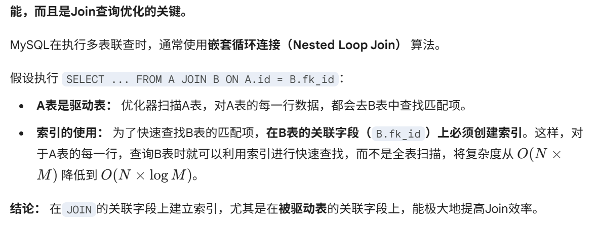
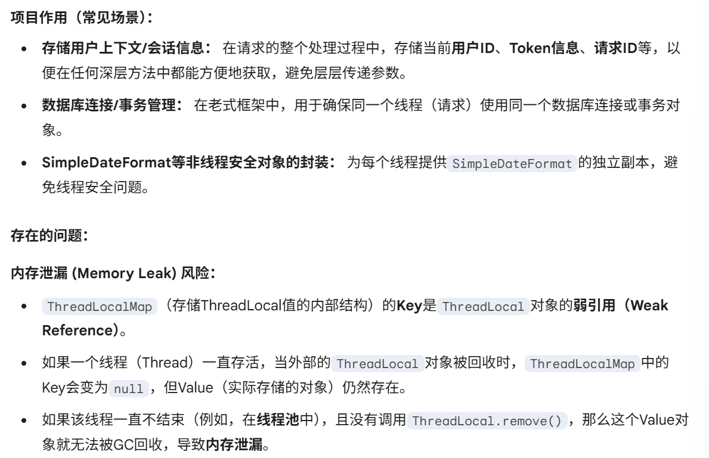
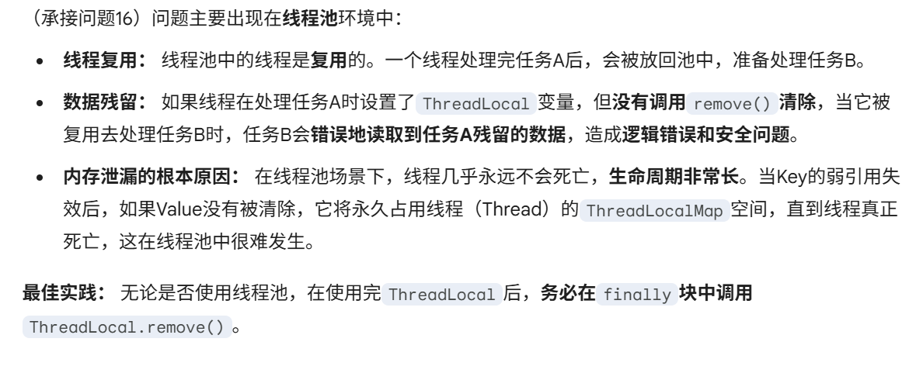
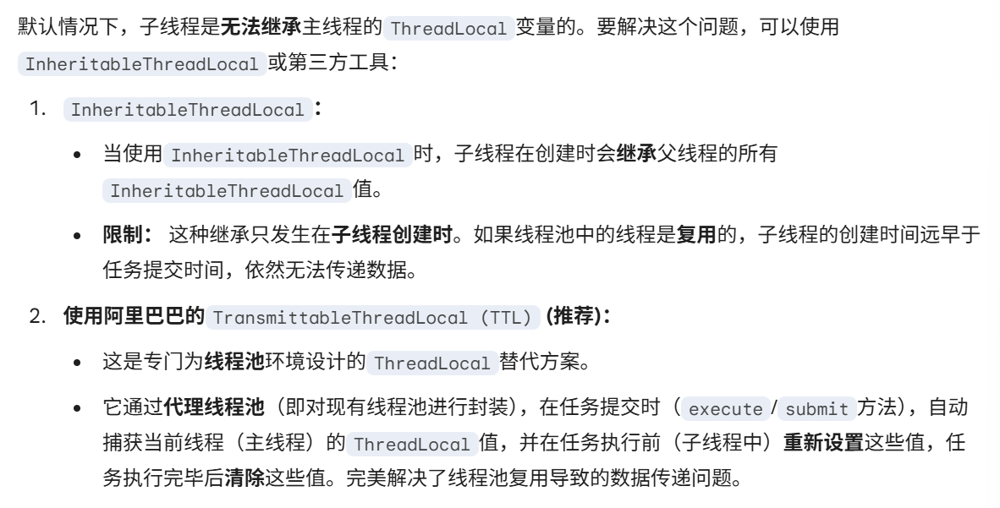
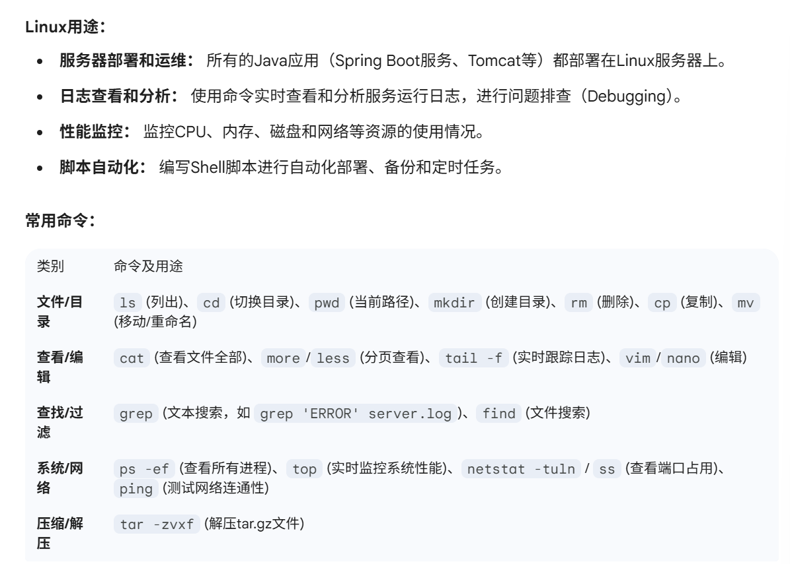
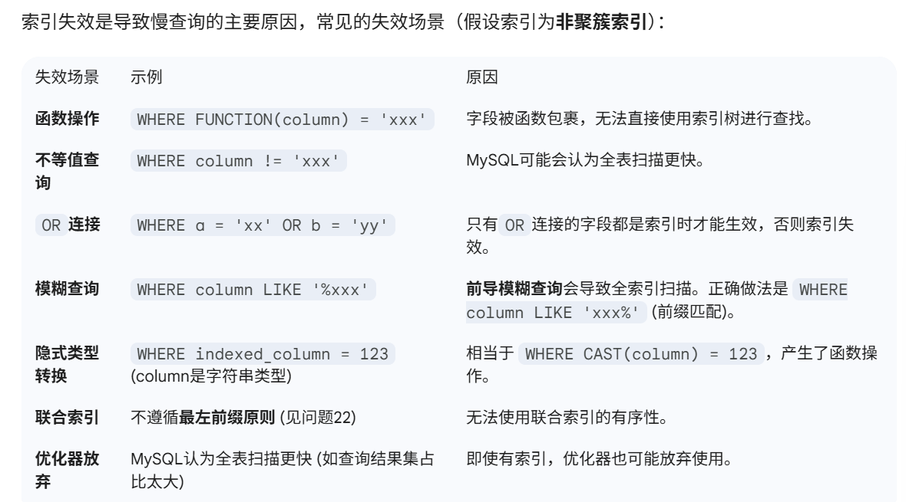
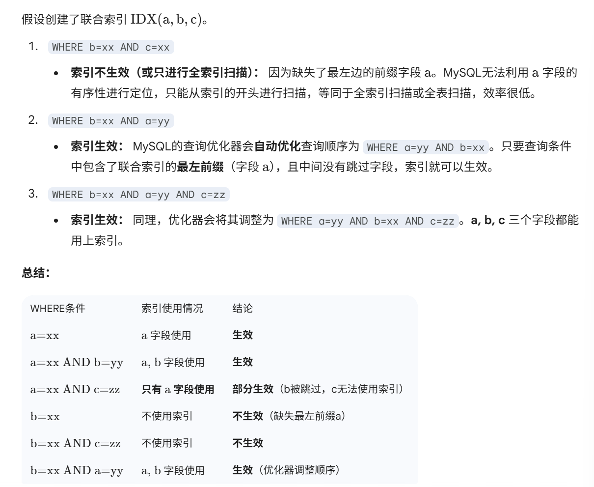
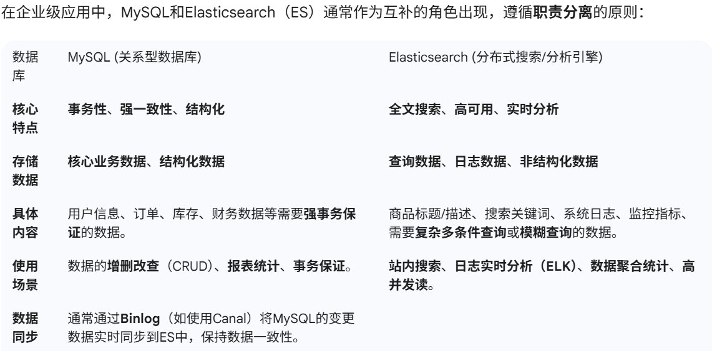

# 27实习-百度日常后端一面

Q：说下tcp和udp的区别

> TCP是面向连接（三次握手、四次挥手），而UDP无连接
> TCP可靠，保证数据顺序、不丢包；而UDP不可靠，可能丢包、乱序
> TCP**传输形式**是**字节流**，而UDP是**数据报**
> TCP的头部开销很大，而UDP较小
> TCP传输速度较慢，因为有确认和重传；而UDP很快，因为无需连接和确认
> TCP有拥塞控制，而UDP没有
> TCP适合文件传输，HTTP/HTTPS，邮件；而UDP适合实时视频/音频，DNS，NTP

Q：说下浏览器输入url会发生什么

> 1. **URL解析和HSTS检查**：浏览器对输入的URL进行解析，并检查是否需要HSTS强制跳转到HTTPS
> 2. **DNS解析**：查找本地缓存、HOST文件。如果没有，就向本地DNS服务器发起查询，将域名解析为对应的**IP地址**
> 3. **三次握手（建立TCP连接）**：浏览器利用**IP地址**和**端口号**，向目标服务器建立**TCP连接**（SYN、SYN-ACK、ACK）
> 4. **发送HTTP请求**：浏览器向服务器发送HTTP请求报文（包括请求行、请求头、请求体）。（如果是HTTPS，此处会进行TLS/SSL握手，建立加密通道）
> 5. **服务器处理请求**：服务器接受请求，进行处理（如路由、权限验证、查询数据库）
> 6. **服务器返回HTTP相应**：服务器向浏览器返回HTTP响应报文（包括状态行、响应头、响应体）
> 7. **四次挥手（关闭TCP连接）**：浏览器接收完数据之后，双方进行四次挥手，关闭TCP连接
> 8. **浏览器渲染**：浏览器解析HTML、CSS、JavaScript，构建**DOM树**和**CSSOM树**，生成**渲染树**，最后进行布局和绘制，将页面展示给用户

进程的通信方式

> Inter-Process Communication
>
> - 管道（Pipe）： 半双工通信，数据只能单向流动，分为匿名管道（只能用于父子进程或兄弟进程）和命名管道（可用于不相关进程）。
> - 信号量（Semaphore）： 用于进程间同步，控制对共享资源的访问，本质上是一个计数器。
> - 信号（Signal）： 异步通信方式，用于通知进程发生了某种事件（如中断、终止）。
> - 消息队列（Message Queue）： 链表形式的消息列表，存放在内核中，允许不同进程发送和接收消息。
> - 共享内存（Shared Memory）： 允许不同进程共享同一块物理内存，是最快的一种IPC方式，但需要信号量等机制进行同步。
> - 套接字（Socket）： 主要用于网络间或不同主机间的通信，也可以用于同一主机上的进程通信。

线程的通信方式

> 线程是进程的执行单元，它们共享进程的地址空间和资源，因此通信方式相对简单：
>
> - 共享内存/变量： 这是最主要的通信方式。一个线程修改了共享变量的值，另一个线程可以立即看到。但需要使用锁（synchronized、ReentrantLock）、volatile、原子类等机制来保证线程安全。
> - 使用Object的wait()/notify()/notifyAll()： 用于线程间的等待和唤醒机制。
> - 使用Condition： 结合Lock实现更灵活的等待/通知机制。
> - 使用CountDownLatch、CyclicBarrier等并发工具类： 实现更高级的线程同步和协作。
> - 使用ThreadLocal： 虽然不是严格意义上的通信，但可以为每个线程提供独立的变量副本，避免共享数据的竞争。
> - BlockingQueue： 生产者-消费者模式中最常用的通信方式，队列作为缓冲区。

我看你实习写了数据库多表联查优化，数据库多表联查如何优化的

> 使用正确的JOIN类型：
>
> - 只使用需要的字段，避免SELECT *。
> - 优先使用内连接（INNER JOIN），而非交叉连接（CROSS JOIN）。
> - 如果只需查询从表的数据，考虑使用外连接（LEFT JOIN/RIGHT JOIN）。
>
> 创建和使用索引：
>
> - 在JOIN条件的字段上创建索引。MySQL在执行连接操作时，通常会将其中一个表作为驱动表，另一个作为被驱动表。驱动表和被驱动表关联字段都需要有索引，尤其是在被驱动表上创建索引至关重要。
> - 确保索引能被用到（避免索引失效，见问题21）。
>
> 小表驱动大表：
>
> - 对于LEFT JOIN，左侧（驱动表）应是小表。
> - 对于INNER JOIN，MySQL优化器会自动选择最优策略，但也可以使用STRAIGHT_JOIN强制指定驱动表。
> - 原则： 尽量减少被驱动表访问次数。
>
> 分步查询替代Join：
>
> - 对于非常复杂的Join或大表Join，可以考虑先通过子查询/单个查询获取ID集合，再通过**IN或EXISTS**进行第二次查询，减少Join的复杂性，提高缓存命中率。

实习时候针对mysql多表联查缓慢问题，具体如何解决的

>以一个实际案例来回答：
>
> - 场景： 订单服务查询订单详情，需要联查Order（订单表）、User（用户表）、OrderItem（订单项表），查询速度在5秒以上。
>
> 具体解决步骤：
>
> 分析慢查询： 使用EXPLAIN分析SQL语句的执行计划，发现type为ALL或index，且rows值非常大。
>
> 优化索引（主要解决）：
>
> - 在JOIN的关联字段上（如order.user_id、order_item.order_id）创建普通索引。
> - 在WHERE条件的过滤字段上创建联合索引（遵循最左前缀原则）。
>
> 调整SQL语句：
>
> - 移除SELECT *，只查询需要的字段。
> - 将WHERE条件放在能使用索引的表上先进行过滤，减少Join的数据量。
>
> 技术架构优化（治本）：
>
> - 数据冗余： 将用户name和phone等高频查询的字段冗余到Order表中，减少Join操作。
> - 分库分表： 对大表进行垂直或水平拆分。
> - 引入缓存： 对于不常变动的基础数据（如用户信息），使用Redis进行缓存，查数据时先查缓存。
> - 引入ES： 将查询需求复杂的非结构化数据或高并发读请求的数据导入到Elasticsearch，通过ES进行快速的多条件查询。

springboot的启动注解是什么，具体有哪些子注解

>Spring Boot的启动注解是：@SpringBootApplication
>
>它是一个复合注解（Meta-Annotation），由以下三个核心子注解组成：
>
>@SpringBootConfiguration
>
> - 相当于Spring框架的@Configuration。
>
> - 用于标记当前类是一个配置类，可以将该类作为Spring应用上下文的Bean定义源。
>
> @EnableAutoConfiguration
>
> - 这是Spring Boot自动配置的核心。
>
> - 它根据项目中所添加的依赖，自动配置相应的Bean（例如，如果引入了spring-boot-starter-web，它就会自动配置Tomcat和Spring MVC）。
>
> @ComponentScan
>
> - 用于组件扫描。
>
> - 默认会扫描当前类所在的包及其子包下的所有被@Component、@Service、@Repository、@Controller等注解标记的类，并将它们注册为Spring Bean。

**HTTP**是无状态的，那怎么让它有状态的存放信息呢

>虽然HTTP协议本身是无状态的，但可以通过以下几种技术手段在应用层实现“状态”管理：
>
> **Cookie**：
>
> - 服务器通过HTTP响应头Set-Cookie将数据（如Session ID）发送给浏览器。
>
> - 浏览器将Cookie保存在本地，并在后续的每次请求中通过HTTP请求头Cookie将数据发送回服务器。
>
> - 特点： 数据存在客户端，安全性较差，容量有限。
>
> **Session**：
>
> - 服务器在会话开始时创建一个Session对象，并生成一个唯一的Session ID。
>
> - 服务器将Session ID通过Cookie或URL重写的方式发送给浏览器。
>
> - 服务器将实际状态数据存储在服务器端（内存、数据库、Redis等）。
>
> - 特点： 数据存在服务器端，安全性高，但占用服务器资源。
>
> **Token (如JWT)**：
>
> - 用户登录成功后，服务器生成一个包含用户身份信息的Token（如JWT），返回给客户端。
>
> - 客户端将Token保存在本地（如LocalStorage）。
>
> - 客户端在后续请求中，通过Authorization头将Token发送给服务器。
>
> - 特点： 无状态，服务器无需存储Session信息，减轻服务器压力，适用于微服务架构。

你项目用了**JWT**是吧，那假如这时候我别人吩前获取到了你的**JWT**，它能实现登陆吗

> - JWT（JSON Web Token） 的核心在于**校验而非保密**。一个有效的JWT包含用户的身份信息（在Payload中），并且使用服务器存储的Secret Key进行了签名（Signature）。
>
> - 任何获得了有效的、未过期的JWT的人，都可以将其放在HTTP请求头的Authorization字段中，服务器在校验签名后，会认为这个请求是合法的，从而实现“登陆”或身份伪造。
>
> 结论： JWT必须像密码一样被保护，一旦泄露，就意味着身份信息泄露和权限盗用。

**JWT**一般设置时效性，如何实现只能单次登陆

> **引入黑名单机制（主流）**：
>
> - 在用户登出或Token被盗用时，将该Token ID (JTI) 或整个Token存储到Redis中，并设置一个过期时间（与Token的剩余有效期一致）。
>
> - 每次请求时，先在Redis的黑名单中检查该Token是否存在。如果存在，则拒绝访问。
>
> **刷新Token机制**（单点登录/会话管理）：
>
> - 在JWT的Payload中加入一个唯一的会话ID。
>
> - 在Redis中存储该会话ID，并关联JWT的有效期。
>
> - 当用户进行登出操作时，只需将Redis中该会话ID对应的记录删除或标记为无效，即可实现强制Token失效。下次请求时，服务器发现找不到对应的会话ID，即拒绝访问。

14mysql的多表联查的join索引还能用吗

15讲一下redis的zset的底层结构

> Redis的Sorted Set（有序集合，ZSet） 底层使用了两种数据结构，会根据存储的数据量和元素大小进行自适应切换：
> ziplist（压缩列表）：
>
> - 当ZSet中存储的元素数量较少（默认小于128个）且元素值较小（默认元素长度小于64字节）时，Redis会使用ziplist，它是一种节省内存的线性结构。
>
> skiplist（跳跃表） + hashtable：
>
> - 当不满足ziplist的使用条件时，Redis会使用**skiplist（跳跃表）** 和 hashtable（哈希表） 组合来存储。
>   - 跳跃表 (skiplist)： 用于实现有序性。它是一个多层级的有序链表，每一层都是下一层链表的子集。通过跳跃表，可以在 $O(\log N)$ 的时间复杂度内完成插入、删除和查找操作，同时支持范围查找（如ZRANGE）。
>   - 哈希表 (hashtable)： 用于实现快速查找。它存储了member到score的映射关系，可以在 $O(1)$ 的时间复杂度内根据member快速获取其score，这对于更新分数、判断元素是否存在等操作非常重要。

**ThreadLocal**在你项目作用是什么，会有什么问题

讲下为什么会产生这些问题

你刚刚说到线程池容易数据错乱，假如我这时候线程池有个任务，需要读取主线程的数据，主线程设置了ThreadLocal，可以有什么办法

linux用过吗，一般拿来做什么，常用的命令用过哪些

mysql你说你用到了索引，那你说说索引失效的场景有哪些

最左前缀原则，比如创立了联合索引a,b,c，我输入where b=xx and c=xx索引生效吗，假如ba呢，bac生效吗(这里我觉得生效，但他好像不信)

你实习的数据库用了mysql和es，他们分别存储什么数据的一般

作者：求求你给我个offer吧
链接：<https://www.nowcoder.com/feed/main/detail/0d09d310c0b94b9ba5f0fb65f0f4d6d6?anchorPoint=comment>
来源：牛客网
