# Computer Networks

## 网络模型

### 关于OSI模型

- 应用层、表示层、会话层
- 传输层、网络层
- 数据链路层、物理层

### TCP/IP模型

- 应用层：支持HTTP、SMTP等最终用户进程
- 传输层：处理主机到主机的通信（TCP、UDP）
- 网络层：寻址和路由数据包（IP协议）
- 网络接口层 / 链路层：通过网络的物理电线、电缆或者无线信道移动比特

> 上面所提到的“路由”，指的是“为数据包选择路径的决策过程”，而不是指整个数据传输行为

### TCP、IP位置

- TCP位于**传输层**
- IP位于**网络层**

## 关于应用层

### 应用层的协议

HTTP、HTTPS、CDN、DNS、FTP
以上均是应用层协议

- HTTP/HTTPS：用于**网页浏览**，浏览器和web服务器之间通过其来请求HTML页面
- SMTP/POP3/IMAP：用于**电子邮件**
- FTP：用于**文件传输**
- DNS：用于**域名解析**
- SSH：用于**安全远程登录**
- WebSocket：用于**全双工实时通信**

> 所谓的**应用层协议**，实际上是指在网络通信中，**专门为特定应用程序或者服务制定的“对话规则和标准**。也就是说，其规定**应用程序之间交换的信息的含义、格式、顺序以及应对方式**

### HTTP报文的组成

- 请求报文
- 响应报文

#### 请求报文

- 请求行：请求方法、请求目标、HTTP协议版本
- 请求头部：包括请求的附加信息
- 空行
- 请求体

#### 响应报文

- 状态行：包含HTTP协议版本、状态码和状态信息
- 响应头部：包含关于响应的附加信息
- 空行
- 响应体：包含响应的数据，通常是服务器返回的HTML、JSON等内容

### HTTP常用状态码

- 1xx：**提示信息**，协议处理的中间状态
- 2xx：**成功**，报文被收到并且被正确处理
- 3xx：**重定向**，客户端请求资源发生变动，需要用新的URL重新发送，从而重新获取资源
- 4xx：客户端发送的**报文有误**！服务器无法进行处理，这个就是错误码
- 5xx：客户端**请求报文**正确，但是**服务器处理时，内部发生了错误**，属于服务器端的错误码

常见的一些具体状态码：

- 200：请求成功
- 301：永久重定向，请求资源已经不存在！需要用新的URL再次访问
- 302：临时重定向，请求的资源还在，但是暂时需要另一个URL访问
- 404：无法找到此页面
- 405：请求的方法类型不支持
- 500：服务器内部出错！！！
- 502 Bad Gateway：作为网关或者代理工作的服务器尝试执行请求时，**从上游服务器收到无效的响应**
- 504 Gateway Time-out：作为网关或者代理工作的服务器尝试执行请求时，**未能及时从上游服务器收到响应**

### HTTP层请求的类型

- GET：用于请求获取指定资源，通常用来获取数据
- POST：用于向服务器提交数据
- PUT：用于向服务器**更新指定资源**
- DELETE：用于请求服务器**删除**指定资源
- HEAD：类似**GET**请求，但是只返回资源的头部信息

### 关于GET和POST使用场景的区别

根据RFC规范，**GET**的语义是**从服务器获取指定的资源**

而**POST**的语义是**根据请求负荷（报文body）对指定的资源做出处理**

从RFC规范定义的语义来看：

> 这边提到的“幂等”这个词，指的是“一个相同的请求，无论执行一次还是多次，对服务器状态造成的改变是完全相同的。”

- **GET**方法是安全且幂等的
- **POST**不安全，并且不幂等。因此，浏览器一般不会缓存POST请求，也不能将POST请求保存为书签。

### 关于HTTP的长连接

**HTTP**协议采用的是**请求-应答**的模式，也就是说：客户端发起了请求，服务端才会返回响应

所谓的**请求-应答**模式是什么样的呢？

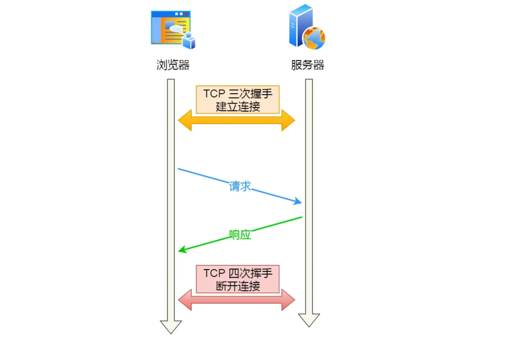

客户端和服务端先建立**TCP**连接（三次握手），然后进行请求-响应模式，最后释放TCP连接（四次挥手）

所谓的**HTTP短连接**：每次请求都经历 建立TCP -> 请求资源 -> 响应资源 -> 释放连接

但是这个短连接的效率非常低，**一次连接只能请求一次资源**

怎么解决这个问题了？随之而来的是**HTTP长连接**，HTTP的 Keep-Alive 实现了这个功能

HTTP长连接的特点：只要任意一端没有明确提出断开连接，则保持 TCP 连接状态

### HTTP 默认端口

HTTP 是 80， HTTPS 默认是 443

### HTTP1.1 对请求的拆包过程

在 HTTP/1.1中，请求的拆包是通过**请求头**中的“Content-Length”字段来实现的，这个字段的值表示**请求正文的字节数**

### HTTP断点重传

这HTTP头谁记得住……

这个是什么呢？其实是：HTTP/1.1协议支持的特性，需要客户端记录当前的下载进度，并且在需要续传的时候，通知服务端本次需要下载的内容片段

### HTTP为什么不安全？

很显然的，HTTP是**明文传输**，安全上存在巨大风险

- 窃听：通信链路可以获取通信内容
- 篡改：植入广告
- 冒充：冒充淘宝网站，进行诈骗

由此，我们引入了**HTTPS**！！！

HTTPS和HTTP区别在于什么地方呢？HTTPS在 HTTP 和 TCP 层之间加入了**SSL/TLS协议**

同时带来了**信息加密、校验机制和身份证书**

### HTTP和HTTPS的区别

- HTTP是超文本传输协议，信息是明文传输，存在安全风险问题；HTTPS通过在HTTP和TCP之间加入了SSL/TLS安全协议，使得加密传输报文
- HTTP连接建立相对简单，TCP三次握手之后，即可开始HTTP的报文传输；HTTPS在TCP三次握手之后，还需要进行SSL/TLS的握手过程，才可进入加密报文传输
- 两个默认端口不同，HTTP的是80，HTTPS的是443
- HTTPS协议需要向CA申请数字证书，来保证服务器身份的可信

### HTTPS握手的过程

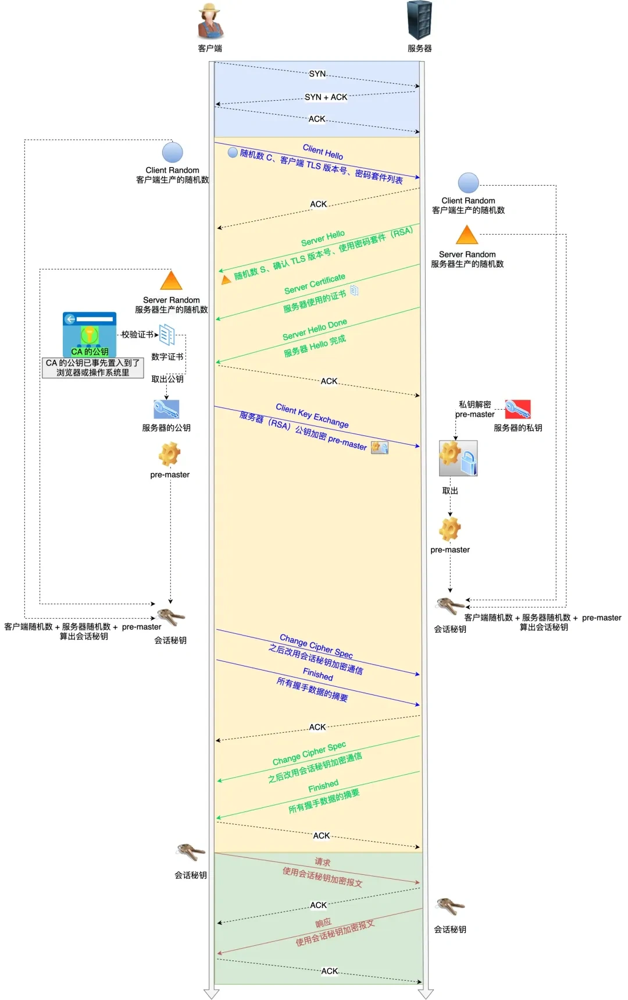

> 这个图很复杂，需要耐心分析
> 我发现了，这边这种提到的什么“握手”是双向而言的；也就是说，客户端发出一次东西，算一次握手。而服务端发出一次东西，也算一次握手。

#### TLS第一次握手

由客户端向服务器发起加密通信请求，也就是**ClientHello**请求。客户端在这一步主要向服务器发送如下信息

- 客户端支持的TLS协议版本
- 客户端生产的随机数（Client Random）
- 客户端支持的密码套件列表：比如RSA加密算法

#### TLS第二次握手

服务端收到客户端请求后，向客户端发出响应，也就是**ServerHello**

- 确认TLS协议版本是否支持
- 服务器生产的随机数（Server Random）
- 确认的密码套件列表
- 服务器的数字证书

#### TLS第三次握手

客户端收到服务器的回应之后，通过浏览器或者OS中的**CA公钥**，验证服务器的数字证书的真实性

此后，如果证书没问题，客户端从数字证书取出服务器公钥，并用其加密报文，向服务器发送如下信息：

- 一个随机数（pre-master key），这个随机数会被服务器公钥加密
- 加密通信算法改变通知，表示此后所有信息都会用“会话密钥”进行**加密通信**
- **客户端握手结束通知**，表示客户端的握手阶段已经结束。

此时，服务端和客户端同时拥有三个随机数（**Client Random、Server Random、pre-master key**），然后用双方协商的加密算法，去生成本次通信的会话密钥

#### TLS第四次握手

服务器收到客户端的第三个随机数后，通过协商的加密算法，计算出本次通信的“会话密钥”

向客户端发送信息：

- 加密通信算法改变通知，随后的信息都将用会话密钥加密通信
- 服务器握手结束通知，表示服务器的握手阶段已经结束

### HTTPS如何防范中间人的攻击

通过**加密**和**身份校验机制**来防范中间人攻击

- 加密：HTTPS握手期间，会通过非对称加密的方式，来协商出对称加密密钥
- 身份校验：服务器申请数字证书后，发给客户端。客户端验证证书的合法性，验证通过之后，把证书里的公钥拿过来加密通信数据，然后把加密后的数据发给服务器，然后由服务端用私钥解密

中间人如果要攻击，他会怎么得逞呢？他会**冒充服务器**，然后和客户端建立连接，并且同时和服务器建立连接

但是显然他的招数会失效

- 攻击者**无法获取服务器的私钥**，所以没办法正确解密客户端发送的加密数据
- 客户端会在建立的时候，**验证服务器的证书**。如果证书验证失败或者存在问题，客户端会发出警告或者中止连接

### HTTP1.1和2.0的区别

- 头部压缩：采用**HPACK**算法，HTTP/2会**压缩头**，协议会帮助消除多个请求中头里面重复的部分；（怎么实现的呢？在客户端和服务器同时维护一张头信息表，所有字段都会存入这个表，生成一个**索引号**，之后不发送同样字段，而是发送索引号）
- 二进制格式：HTTP/2采用**二进制格式**发送报文，不同于HTTP/1.1采用的纯文本形式发送报文。注意到，头信息和数据体都是二进制，并且统称为**帧**：**头信息帧**（Headers Frame）和**数据帧**（Data Frame）。直接解析二进制报文，这样能**增加数据传输效率**
- 并发传输：引入Stream概念
- 服务器主动推送资源：HTTP/2在一定程度上改善了传统的“请求-应答”工作模式，服务端不再是被动相应，而是**主动**向客户端发送信息

### HTTP进行TCP连接之后，什么时候发生中断

- 当服务端或者客户端执行close系统调用时，会发送FIN报文，此时执行四次挥手的过程
- 当发送方发送Data后，接收方超过一段时间没有响应**ACK报文**，发送方重发数据达到最大次数后，就会断开TCP连接
- 当HTTP长时间没有请求和响应的时候，超过一段时间，就会释放连接

### HTTP、SOCKET、TCP区别

- HTTP是应用层协议，定义了客户端和服务器之间交换的数据格式和规则
- SOCKET是通信的一端，用于**提供网络通信的接口**，实际上，SOCKET是计算机网络中的一种抽象概念
- TCP是**传输层协议**，用于负责在网络中建立可靠的数据传输连接

### 关于DNS

DNS：Domain Name System(域名系统)

其是用于将域名转换为对应的IP地址的**分布式数据库系统**

**DNS**中的域名都是用**句点**来进行分隔，比如说<www.server.com>，此处的句点表示**不同层次之间的间隔**

注意到，在域名中，**越靠右的位置表示其层级越高**

还有一件事：（实际上，域名最后还有一个点，举个例子<www.server.com.>，最后那个·表示**根域名**）

### DNS 域名解析的工作流程

1. 客户端发出DNS请求，询问 <www.server.com> 的IP是啥，并发送给本地的DNS服务器
2. 本地域名服务器收到客户端请求后，如果缓存的表格中，能找到 <www.server.com>，就会直接返回IP地址。如果没有，就会去问根域名服务器。根域名服务器是最高层级的服务器，**不直接作用于域名解析，而是指明道路。**
3. 根DNS收到来自本地DNS的请求后，转达请求给**顶级域名服务器**（此处是.com）
4. 本地DNS转而询问顶级域名服务器
5. 顶级域名服务器转达请求给**权威DNS服务器**
6. **权威DNS服务器**将查询到的IP地址告诉本地DNS
7. 本地DNS再将IP地址返回给客户端，客户端和目标建立连接

以上是**DNS的解析过程**

DNS的默认端口号是53

### DNS的底层实现

**DNS**基于**UDP协议**实现，使用**UDP协议**来进行**域名解析和数据传输**，因为基于UDP实现DNS能提供**低延迟、简单快速、轻量级**的特性，更加适合于DNS这种需要快速响应的域名解析服务

### HTTP的无状态特性

**HTTP**是**无状态**的，这意味每个请求都是**独立**的。服务器不会在每个请求之间，都保留关于客户端状态的信息，在每个HTTP请求中，服务器不会记住之前的请求或者会话状态。

### 携带cookie的HTTP请求

携带**Cookie**的**HTTP**请求实际上是在一定程度上，实现了状态保持，因为Cookie是用来在客户端存储会话信息和状态信息的一种机制

虽然说，Cookie是HTTP协议簇的一部分，但是HTTP协议在设计初衷上，仍然保持了**无状态特性**

### Cookie和Session的区别

Cookie和Session都是Web开发中，用于跟踪用户状态的技术

- 存储位置：Cookie的数据存储在客户端，而Session的数据存储在服务器端
- 数据容量：无论是单个Cookie，还是浏览器对每个**域名**的总Cookie数量，都有限制；Session理论上没有限制，因为其存储在服务器上
- 安全性：Cookie相对更不安全，因为其数据存储在**客户端**，容易受到XSS（跨站脚本攻击）的威胁；而**Session**比**Cookie**更安全，因为敏感数据存储在服务器端
- 生命周期：Cookie可以设置过期时间，过期后自动删除。也可以设置为会话Cookie，浏览器关闭时自动删除；Session在默认情况下，用户关闭浏览器时，Session结束
- 性能：Cookie在使用时，数据随每个请求发送到服务器，可能会影响网路传输效率；使用Session时，由于数据存储在服务器端。每次请求都需要查询服务器上的Session数据，这样可能会**增加服务器的负载**

### Token & Session & Cookie

- Session：存储于服务器，可以理解为是一个状态列表。其拥有一个**唯一识别编号**SessionID，通常存放在Cookie中。服务器收到Cookie后，解析出SessionID，再去Session列表中查找。这样才能查找到Session，依赖于Cookie
- Cookie类似于一个**令牌**，装有SessionID。存储在客户端，浏览器通常会自动添加
- Token也类似于一个令牌，无状态。用户信息被加密到Token中，服务器收到Token后，进行解密，确认是哪个用户

### 如果客户端禁用Cookie，Session还能使用吗？

默认情况下，禁用Cookie之后，**Session**无法正常使用

有两个办法可以绕过这个问题，但是会引入额外的复杂性和风险

- URL重写
- 隐藏表单字段

### 数据存储在LocalStorage / Cookie

- 存储容量：Cookie的存储容量相对较小，而LocalStorage 的存储容量很大，所以存储大量数据的话，LocalStorage更加适合
- 数据发送：Cookie在每次HTTP请求中，都会自动发送到服务器，这使得Cookie能适用于在客户端和服务器之间传递数据；而LocalStorage 的数据不会主动发送到服务器，仅仅在浏览器端存储数据，所以LocalStorage 适用于在同意域名下的不同页面共享数据
- 生命周期：Cookie可以设置一个过期时间，使得数据在指定时间后自动过期；LocalStorage的数据永久存储在浏览器中，除非通过JavaScript 代码将其手动删除
- 安全性：Cookie 的安全性非常差，因为Cookie在每次HTTP请求中，都会自动发送到服务器

### 数据存放 Cookie / LocalStorage 的选择

Cookie 适用于 在客户端和服务器之间传递数据、跨域访问或者设置过期时间；

LocalStorage 适用于在同一域名下的不同页面之间，共享数据、存储大量数据或者永久存储数据

### JWT 令牌和传统方式的区别

- 无状态性：JWT是无状态的令牌，不需要在服务器端存储会话信息
- 安全性：JWT采用密钥对令牌进行签名，确保令牌的真实性和完整性。也就是说，只有持有正确密钥的服务器才能对令牌进行验证和解析
- 跨域支持：JWT令牌可以直接在不同域之间进行传递，适用于跨域访问的场景

### JWT令牌的字段

- 头部（Header）
- 载荷（Payload）
- 签名（Signature）

**头部**和**载荷**均为JSON格式，使用Base64编码进行序列化。
**签名**部分是对头部、载荷和密钥进行签名后的结果

### JWT 令牌为什么能解决集群部署

在传统的基于会话和Cookie的身份验证方式中，会话信息通常存储在服务器的内存或者数据库中。
但是，在**集群部署**中，不同服务器之间没有共享的会话信息，导致用户在不同服务器之间切换时，需要重新登录。要么就是引入额外的共享机制（比如说Redis），增加复杂性和性能开销

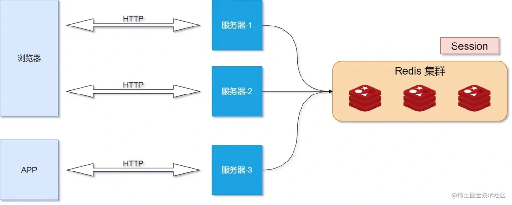

但是，JWT令牌通过在令牌中，包含所有的身份验证和会话信息，使得服务器无需存储会话信息，从而解决在集群部署中的**身份验证**和**会话管理**问题。

### JWT的缺点

**JWT** 一旦派发出去之后，在失效前都是有效的，没办法及时撤销JWT

为了解决这个问题，需要在业务层增加判断逻辑，比如说增加**黑名单**机制。可以使用内存数据库，比如说Redis维护一个黑名单，如果想让某个 JWT 失效的话，就直接将这个 JWT 加入到黑名单中去

### JWT 令牌如果泄漏，如何解决？

- 及时失效令牌：当检测到 JWT 令牌泄漏或者存在风险时，需要立即将其标记为失效状态
- 刷新令牌：JWT令牌通常具有一定的有效期，过期后需要重新获取新的令牌
- 使用黑名单：服务器可以维护一个令牌的黑名单，将泄漏的令牌添加到黑名单中去

### 前端如何存储JWT

JSON Web Token，也就是JWT，是当前最流行的**跨域认证解决方案**

这种解决方式是什么呢？服务器不保存Session数据，**所有数据都保存到客户端，每次请求都发回服务器**

客户端收到服务器返回的JWT，可以存储在三种地方

- LocalStorage （本地存储）
- Session Storage（会话存储）
- Cookie

### RPC的使用缘由

- RPC 本质上不是协议，而是一种调用方式。像 gRPC 和 Thrift 这样的具体实现，才是协议。他们是实现了 RPC 调用的协议
- HTTP 主要采用 B/S 架构，而 RPC 主要采用 C/S 架构。很多软件支持**多端**，所以**对外**常用 HTTP 协议，而内部集群的微服务之间采用 RPC 协议进行通讯

### HTTP 长连接 和 WebSocket 有什么区别？

- **TCP协议**本身是**全双工**的，但是我们最常用的 HTTP/1.1，虽然是基于 TCP 的协议，但是其是**半双工**的。因此，我们需要使用支持全双工的 **WebSocket** 协议
- 应用场景区别：在 HTTP/1.1 中，只要客户端不问，服务端就不答。基于如此的特点，对于**登录页面**这种简单的场景，我们可以采用**定时轮询或者长轮询**的方式去实现**服务器推送**的效果；而对于客户端和服务端之间需要频繁交互的场景，比如说网页游戏，则可以考虑使用 WebSocket 协议

### Nginx 有哪些负载均衡算法？

- 轮询：按照顺序将请求分配给后端服务器
- IP哈希：根据客户端IP地址的Hash值，来确定分配请求的后端服务器
- URL Hash：根据访问的URL的Hash结果，来分配请求
- 最短相应时间：根据后端服务器的响应时间来分配请求，响应时间短的优先分配
- 加权轮询：根据权重分配请求给后端服务器，权重越高的服务器获得更多的请求

注意，Nginx位于七层网络结构中的**应用层**，用于**负载均衡**

## 关于传输层

> ok，要有耐心

### TCP 头部

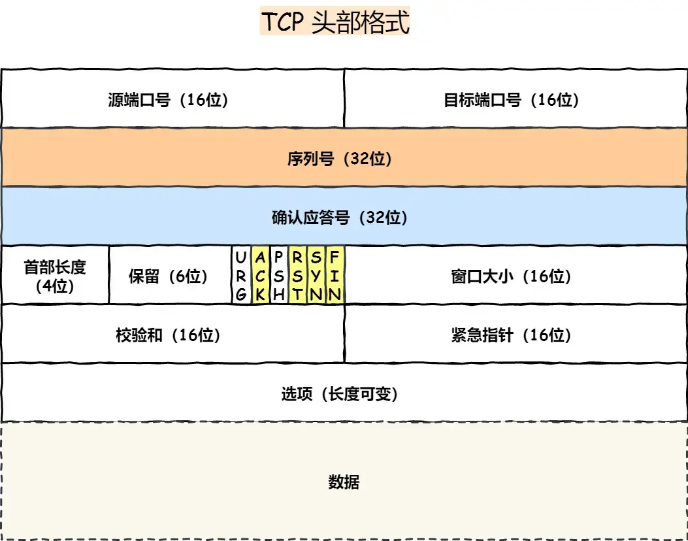

- 序列号：用于在建立连接时，计算机生成的随机数作为其**初始值**。每发送一次数据，就**累加**一次该**数据字节数**的大小，**用来解决网络包乱序问题**
- 确认应答号：指下一次**期望**收到的数据的序列号，发送端收到这个确认应答之后，认为这个序号之前的数据都被正常接收到，**用来解决丢包的问题**

### TCP 三次握手过程

**TCP**是面向连接的协议，所以使用**TCP**之前必须建立连接，而建立连接时通过**三次握手**来进行的

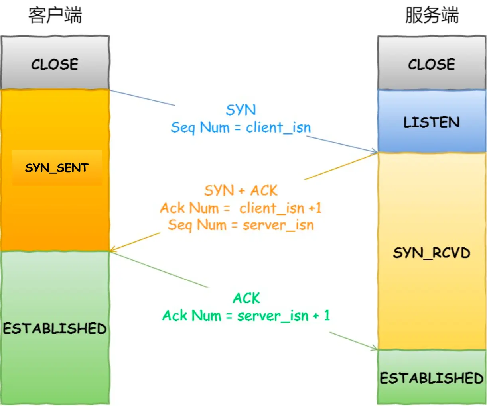

- 开始时刻，客户端、服务端均处于 CLOSE 状态，先是服务端主动监听某个端口，处于 **LISTEN** 状态

> 此处注意，client_isn 中的 isn 指的是 initial Sequence Number，也就是**初始化序列号**的含义

- 客户端随机初始化序号（Client_isn），将这个序列号放到TCP头部的序列号中，并同时将 SYN 标志置为1，表示 **SYN** 报文。将第一个 **SYN** 报文发送给服务端，表示向服务端发送连接，注意**此时报文不包含应用层数据**，此后，客户端处于 **SYN-SENT**状态
- 服务端接收到客户端的 **SYN** 报文后，首先服务端随机初始化自己的序号（**server_isn**），将此序列号填入 **TCP** 头部的序号字段中，其次将TCP头部的**确认应答号**设置为 **client_isn + 1**，之后将 **SYN** 和 **ACK** 设置为1。最后该报文发送到客户端，该报文不包含应用层数据，之后服务端处于 **SYN-RCVD** 状态
- 客户端收到服务端报文后，需要向服务端回应最后一个应答报文。首先，该应答报文 TCP 头部 **ACK** 设定为1，其次 **确认应答号** 字段填入 **server_isn + 1**，最后将该报文发送给服务端。注意，此次报文可以携带**客户端**发送到**服务端**的数据，最后客户端处于 **ESTABLISHED** 状态
- 服务端收到客户端应答后，也进入 **ESTABLISHED** 状态

综上，TCP三次握手中，**前两次握手不可以携带数据，第三次握手可以携带数据**

### TCP 三次握手建立连接的原因

- 三次握手可以阻止重复历史连接的初始化

> 旧的 **SYN**报文称为**历史连接**，**TCP**使用三次握手建立连接时，最主要原因就是**防止历史连接初始化了连接**。如果是两次握手连接，就无法阻止历史连接，这是为什么呢？
>
> 两次握手的情况下，服务端没有中间状态来给客户端阻止历史连接，导致服务端可能建立一个历史连接，造成资源的浪费
>
> 要解决这种现象，最好的办法是：在服务器发送数据之前，也就是建立连接之前，要阻止掉历史连接。这样，才不会造成资源浪费。而实现这个功能，需要进行三次握手。

- 三次握手才可以同步双方的初始序列号

> 序列号的作用：
>
> - 接收方可以去除重复的数据
> - 接收方可以根据数据包的序列号按序接收
> - 可以表示发出去的数据包中，哪些是对方已经收到的

- 三次握手可以避免资源浪费

> 如果只有两次握手，当**客户端**发送的 **SYN** 报文在网络中阻塞，客户端没有接收到 **ACK** 报文，就会重新发送 **SYN**，由于没有第三次握手，服务端不清楚客户端是否收到了自己回复的 **ACK** 报文，所以服务端每次收到一个 **SYN**，就只能先主动建立一个连接
>
> 这样会导致：如果客户端发送的 SYN 报文在网络中阻塞，重复发送多次 SYN 报文，那么服务端就会在收到请求之后，建立多个冗余的无效连接，造成不必要的资源浪费

### TCP 三次握手，客户端第三次发送的确认包丢失后，发生了什么？

如果服务端一直收不到客户端第三次握手发的**确认报文**，就会触发**超时重传机制**，重传**SYN-ACK**报文，直到收到第三次握手，或者达到最大重传次数。

注意！ACK报文是不会重传的，如果ACK丢了，就由对方重新传送对应的报文

### 三次握手和Accept的关系

TCP建立三次握手之后，连接会被保存到内核的全连接队列，调用Accept就是**将连接取出来后，给用户程序使用**

### 客户端发送的第一个 SYN 报文，如果服务器没有收到会怎么样？

此处的处理机制和上文相似，客户端想和服务端建立TCP连接时，第一个发的就是 SYN 报文，然后进入 **SYN_SENT**状态

此后，如果**客户端**一直收不到服务端的 **SYN-ACK** 报文，就会触发**超时重传**机制，并且重传的 **SYN** 报文的序列号是一样的

在Linux系统中，客户端的 SYN 报文最大重传次数由 **tcp_syn_retries** 限制，每一次超时重传后等待时间是上一次的两倍

### 服务器收到第一个 SYN 报文，回复的 SYN + ACK 报文丢失了怎么办

注意，第二次握手的 **SYN-ACK** 报文实际上由两个目的：

- 第二次握手的 **ACK**，是对第一个握手的确认报文
- 第二次握手的 **SYN**，是服务端发起建立 **TCP** 连接的报文

也就是说，如果第二次握手丢了，客户端会触发超时重传机制，重传 **SYN** 报文（第一次握手）；而服务端也会触发重传机制，重传 **SYN-ACK** 报文（第二次握手）。

### 第一次握手，客户端发送 SYN 报文，服务端回复 ACK 报文，这个过程中服务端的内部工作？

服务端收到客户端发起的 **SYN** 请求后，内核会将其连接储存到**半连接队列**，并向客户端相应 **SYN + ACK**。

接着客户端会返回 **ACK**，服务端收到第三次握手后的**ACK**后，内核会将连接从**半连接队列**中移除，然后创建新的完全的连接。将其添加到 **Accept** 队列，等待进程调用 **accept** 函数时，将连接取出。

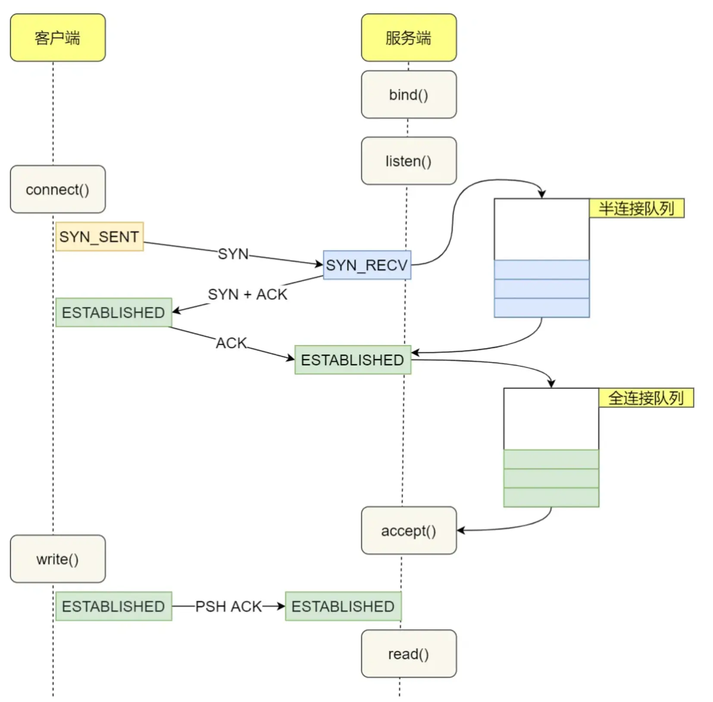

### 大量 SYN 包发送给服务端后，服务端发生的事

有可能会导致 TCP 半连接队列打满，这样**TCP 半连接队列满后，后续再收到 SYN 报文会发生丢弃**，导致**客户端** 无法和服务端发生连接

为了避免 **SYN** 攻击，有如下四种方式：

- 方案一：调大 **netdev_max_backlog**

可以将这个东西认为是一个类似**缓冲队列**的概念：当**网卡接收数据包**的速度大于**内核处理**的速度时，会有一个队列来保存这些数据包

- 方案二：增大 **TCP** 半连接队列

需要调三个参数，这玩意就看看吧

- 方式三：开启 net.ipv4.tcp_syncookies

具体的过程：

> - 当 **SYN队列**满了之后，后续服务端收到的 SYN 包。不会丢弃，而是根据算法算出一个 Cookie 值。
> - 把Cookie值放到第二次握手报文的 **序列号** 中，然后服务端第二次握手返回给客户端
> - 服务端收到客户端的应答报文后（第三次握手），服务端去检查这个 ACK 报文的合法性（通过 Cookie）。如果合法，就将其放到 Accept 队列中去。
> - 最后，应用程序调用 Accept() 接口，从 Accept() 队列中取出连接

- 方案四：减少 **SYN + ACK** 的重传次数

当服务端遭受 **SYN** 攻击时，会有大量处于 **SYN_REVC** 状态（这是服务器那边的）的 **TCP** 连接，处于这个状态的 **TCP** 连接会重传 **SYN + ACK**的重传次数，从而加速处于 **SYN_REVC** 状态的 **TCP** 连接断开

### TCP的四次挥手过程

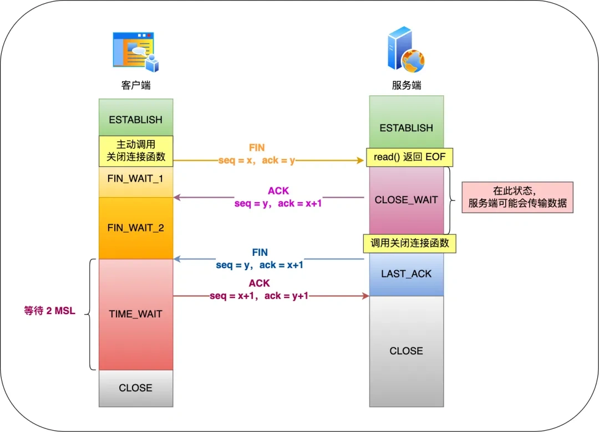

客户端是 **Client**，而服务端是 **Server**

> 实际上，这是两回合的 FIN - ACK 交互过程，并且服务端有个 读/发 完已有数据的过程

- 第一次挥手：客户端主动调用关闭连接的函数，发送 **FIN** 报文。这个 **FIN** 报文代表客户端不再发送数据，进入 **FIN_WAIT_1** 状态
- 第二次挥手：服务端收到 **FIN** 报文，然后马上回复一个 **ACK** 确认报文，此时 **服务端** 进入 **CLOSE_WAIT** 状态。在收到 **FIN** 报文时，**TCP协议栈**会为 **FIN** 包插入一个文件结束符 **EOF** 到接收缓冲区中，服务端应用程序通过Read 调用来感知这个 **FIN** 包，这个 **EOF** 被放在**已经排队等候的其他已经接收的数据之后**。由此，必须要等到 Read 接收完缓冲区已经接收的数据；
- 第三次挥手：接着，当服务端在 read 数据的时候，最后自然会读到 **EOF**。此时，**Read() 返回0**。这时，服务端应用程序如果有数据要发送的话，就发完数据后才调用关闭连接的函数。**如果服务端没有数据要发送的话，就会直接调用关闭连接的函数**。此时，服务端发送一个 **FIN** 包，这个FIN包代表服务端不会再发送任何数据，此后处于 **LAST_ACK**状态
- 第四次挥手：客户端接收到服务端的 **FIN** 包，并发送 **ACK** 确认包给服务端，此时客户端进入 **TIME_WAIT** 状态
- 服务端收到 **ACK** 确认包之后，就进入了最后的 **CLOSE** 状态
- 客户端经过 **2MSL** 等待时间后，也进入 **CLOSE** 状态

### 为什么四次握手中间服务器发的两次不能变成一次？

服务器在收到客户端发送的 **FIN** 报文时，内核会马上回复一个 **ACK** 应答报文。但是，**服务端应用程序可能还有数据要发送，所以并不能立即发送FIN报文。而是应当将发送 FIN 报文的控制权交给服务端应用程序**

不过，第二次挥手和第三次挥手其实也是**能合并**的，**没有数据发送并且开启了 TCP 延迟确认机制**，那么第二和第三次挥手就会合并传输，此时出现了三次挥手

### 第三次挥手一直没发，会发生什么？

当**客户端**收到 ACK 报文后，会进入 **FIN_WAIT2**状态。此时，在等待对方发送FIN报文，关闭对方的发送通道。

- 如果连接采用 shutdown 函数关闭，连接可以一直处于 **FIN_WAIT2** 状态，因为其可能还会发送或者接受数据
- 如果是采用 **close** 函数关闭的孤儿连接，由于无法再接受或者发送数据，所以这个状态不会持续很久便会很快关闭。

### 断开连接时，客户端FIN包丢失，服务端的状态？

客户端调用 **close** 函数，向服务端发送 **FIN** 报文，试图和服务端断开连接。此时，客户端的连接进入 **FIN_WAIT_1** 状态。

一般来说，正常状况下，如果及时收到**服务端** （被关闭方）的 ACK，那么客户端会变为 **FIN_WAIT2** 状态

如果第一次挥手丢了，客户端迟迟收不到被动方的 **ACK** 的话，就会触发**超时重传机制**

当客户端重传 **FIN** 报文的次数超过 **tcp_orphan_retries** 后，就不会继续发送 **FIN** 报文，就会等待上一次超时时间 $\times 2$。此后，**客户端直接进入 close 状态，而服务端还是 ESTABLISHED** 状态。

### 为什么四次挥手之后，客户端要等待 2MSL

MSL：Maximum Segment Lifetime，也就是**报文最大生存时间**

**TCP**报文基于 **IP** 协议，而 **IP** 头中有一个 **TTL** 字段，是 **IP** 数据包可以经过的最大路由数

MSL 和 TTL 的区别：MSL 的单位是时间，而 TTL 是经过路由条数。所以 MSL 要 $\geq$ TTL 消耗到为0 的时间，从而确保报文已经被自然消亡。

可以得出这样的结论：**2MSL时长** 实际上是相当于 **至少允许报文丢失一次**

### 服务端出现大量的 timewait 有哪些原因

服务端主动断开连接的原因：

- 场景一：**HTTP** 没有使用长连接

自 HTTP/1.1之后，默认开启了 **Keep-Alive**（也就是长连接）

但是如果你把 Keep-Alive 关了，就只有短连接。短连接是什么东西呢？是下面这样：

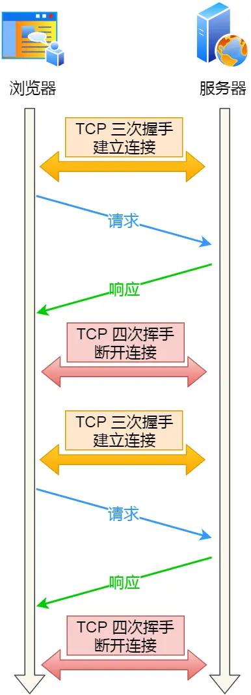

根据大部分Web服务的实现，不管哪一方禁用了 **HTTP Keep-Alive**，都是**由服务端主动关闭连接**

那么，此时**服务端**上就会出现 **TIME_WAIT** 状态的连接

- 场景二：**HTTP** 长连接超时

如果**客户端** 在完成一个 **HTTP** 请求之后，在60s内，都没有再发起新的请求。当定时器的时间一到，NGINX 就会触发回调函数来关闭该连接，此时 **服务端** 就会出现 **TIME_WAIT** 状态的连接

场景三：**HTTP长连接**的请求数量达到上限

比如说NGINX的 **keepalive_requests** 这个参数，用于记录当前 **HTTP** 长连接上，已经接收并且处理的客户端请求的数量。如果达到这个参数限制的上限，NGINX就会主动关闭这个**长连接**。此时，服务端就会出现 **TIME_WAIT** 状态的连接

对于一些QPS很高的场景，需要调整 NGINX的 keepalive_requests 参数，防止服务器端出现大量的 **TIME_WAIT** 状态

### TCP 和 UDP 的区别

- 连接：**TCP** 是面向连接的传输层协议，传输数据之前，需要先建立连接；而 **UDP** 是不需要连接的，即刻传输数据
- 服务对象：**TCP** 是一对一的两点服务，而 **UDP** 是支持一对多、一对一、多对多的交互通信
- 可靠性：**TCP** 是可靠交付数据的，数据可以无差错、不丢失、不重复、按需到达；而 **UDP** 是不可靠的
- 拥堵控制、流量控制：**TCP** 拥有拥塞控制和流量控制机制，保证数据传输的安全性。**UDP** 没有，即使网络非常拥堵，也不会影响 **UDP** 的发送速率
- 首部开销：TCP首部长度较长，会有一定的开销；而UDP首部只有8个字节，开销较小且长度固定不变
- 传输方式：TCP是流式传输，没有边界，但是保证顺序和可靠；UDP是一个个包的发送，有边界，但是可能会丢包或者乱序

### TCP 为什么可靠传输？

- 连接管理：三次握手和四次挥手。连接管理机制可以建立起可靠的连接
- 序列号：TCP将每个字节的数据都进行了编号，这就是序列号
- 确认应答：接收方接收数据后，会回传 **ACK** 报文，报文中有此次确认的序列号
- 超时重传：应用与**数据包丢失**和**确认包丢失**两个部分

### 怎么用UDP实现 HTTP

**UDP**是不可靠传输的，但是基于**UDP**的**QUIC协议**可以实现类似**TCP**的可靠性传输

### TCP粘包如何解决？

> 所谓的TCP粘包，其本质是接收方无法从字节流中，区分每个消息的边界。（比如说接收方一次性收到了 Packet A + Packet B 的全部数据）

- 方案一：固定长度的消息

这个不咋用，每个用户的消息长度固定，但是灵活性不好

- 方案二：特殊字符作为边界

我们可以在两个用户消息之间，**插入一个特殊的字符串**。这样，接收方在接收数据时，读取到这个特殊字符，就会认为已经读完一个完整的消息。

需要注意，如果消息内容中恰好有这个特殊字符，需要对其进行转义

- 方案三：自定义消息结构

比如说，包头+数据。包头中有一个字段，说明紧随其后的数据有多大。当接收方接收到包头的大小后，开始解析包头的内容，然后知道数据的长度。

### TCP 的拥塞控制

> 恶性循环案例：网络发生拥堵，继续发送大量数据包，导致数据包时延、丢失；**TCP**此时重传数据，但是这导致了网络的负担更重，带来更大的延迟和更多的丢包

于是，引入**拥塞控制**的概念，控制的目的：**避免`发送方`的数据填满整个网络**

为了在`发送方`调节所要发送数据的量，定义**拥塞窗口**的概念

**拥塞窗口 cwnd** 是发送方维护的一个状态变量，其根据**网络的拥塞程度而动态变化**

拥塞窗口 cwnd的变化规则：

- 只要网络中没有出现拥塞，**cwnd**即增大
- 只要网络中出现了拥塞，**cwnd** 减小

如果**发送方**未在规定时间内接收到**ACK**应答报文，也就是发生了**超时重传**，就会认为网络出现了拥塞

拥塞控制主要采用了四个算法：

- 慢启动
- 拥塞避免
- 拥塞发生
- 快速恢复

#### 关于慢启动

**慢启动**算法：每次发送发接收到一个**ACK**，拥塞窗口cwnd的大小加一

这样的话，慢启动发包的个数是**指数性的增长**

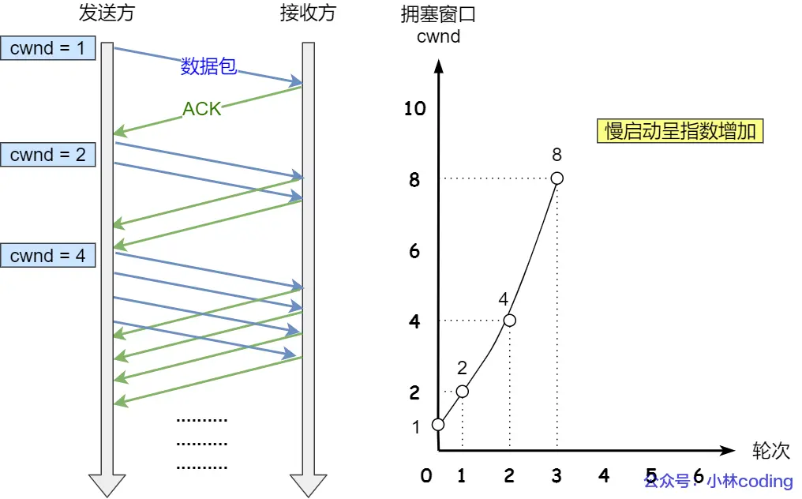

慢启动增长到一定程度后，会采用**拥塞避免算法**（这个由**慢启动门限 ssthresh**决定）

#### 关于 拥塞避免算法

规则：每当收到一个ACK，cwnd增加 1 / cwnd

此时，cwnd的增长变成了**线性增长**

如此增长之后，网络慢慢进入**拥塞**的状态，便出现了丢包现象。此时，需要对丢失的数据包进行重传。

我们便引入了**拥塞发生算法**

#### 关于拥塞发生算法

**重传机制**有两种：

- 超时重传
- 快速重传

##### 发生超时重传的拥塞发生算法

- ssthresh 设置为 cwnd / 2
- cwnd 重置为 1

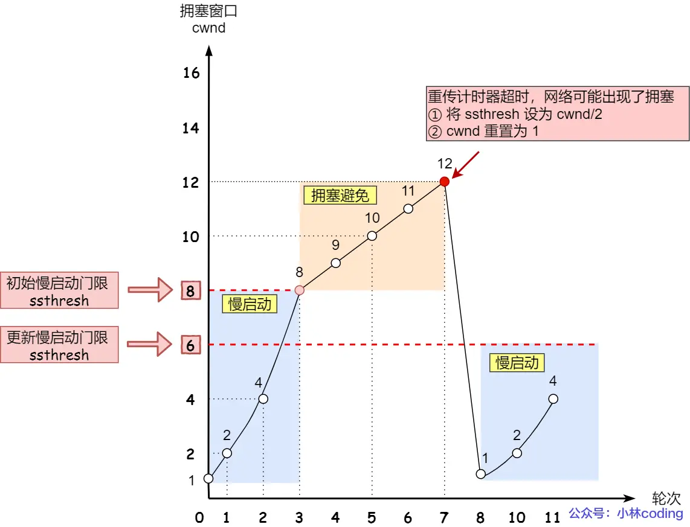

也就是说，这个时候直接开始重新**慢启动**，但这样太剧烈了

##### 发生快速重传的拥塞发生算法

- cwnd = cwnd / 2
- ssthresh = cwnd
- 进入快速恢复算法

#### 关于 快速恢复算法

**快速重传**和**快速恢复**算法一般同时使用

进入快速恢复之前：

- cwnd = cwnd / 2;
- ssthresh = cwnd;

然后，进入**快速恢复算法**如下：

- 拥塞窗口 cwnd = ssthresh + x（x指的是接收到了x个数据包）
- 重传丢失的数据包
- 如果首都奥重复的ACK，cwnd += 1
- 如果收到新数据的ACK之后，将cwnd设定为第一步中ssthresh的值。也就是说，此时该 ACK已经确认了新的数据，说明从 duplicated ACK 时的数据都已经收到，该恢复过程已经结束，可以回到恢复之前的状态了。也就是再次进入拥塞避免状态；

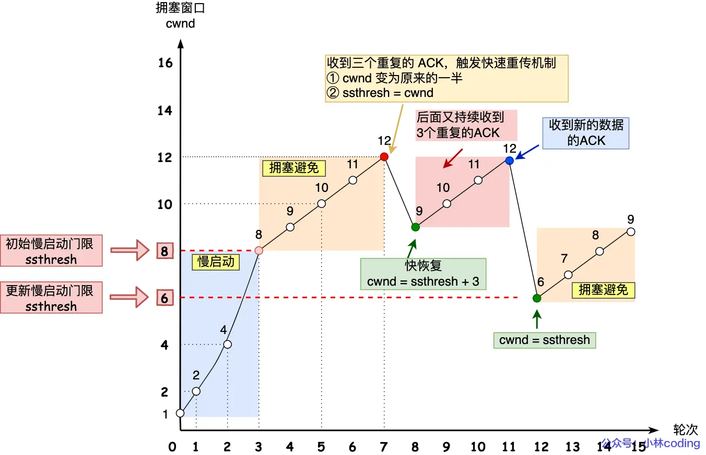
