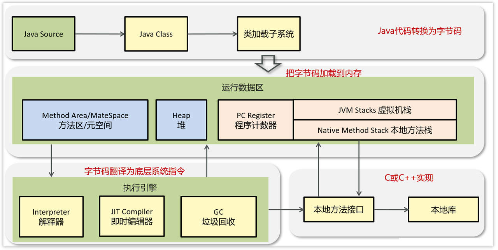
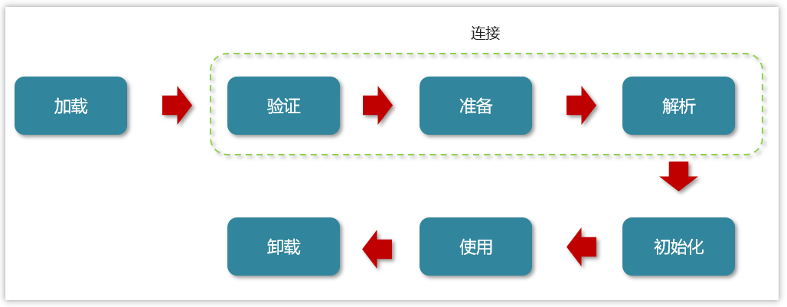
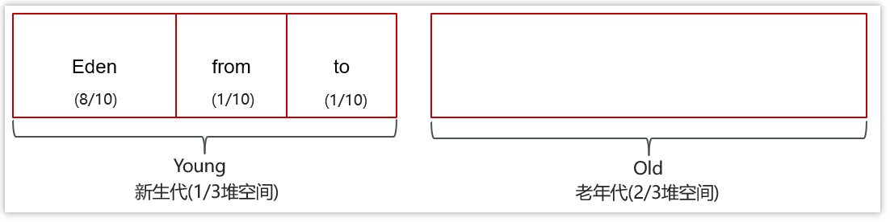
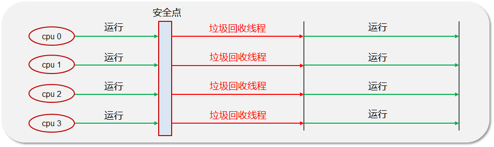
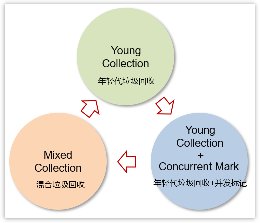

# JVM Part

## JVM组成

JVM：Java Virtual Machine
也就是Java程序的运行环境（准确的说，是Java二进制字节码的运行环境）

- 一次编写，到处运行
- 自动内存管理，垃圾回收机制

### JVM的具体组成部分

- ClassLoader（类加载器）
- Runtime Data Area（运行时数据区，内存分区）
- Execution Engine（执行引擎）
- Native Method Library（本地库接口）

运行流程如下：

1. 类加载器（ClassLoader）将Java代码转换为字节码
2. 运行时数据区（Runtime Data Area）将字节码加载到内存中，而字节码文件只是JVM的一套指令集规范，并不能直接交给底层系统去执行，而是由**执行引擎**运行
3. **执行引擎**（Execution Engine）将字节码翻译为底层系统指令，再交给CPU执行。此时，需要调用其他语言的本地库接口（Native Method Library），来实现整个程序的功能

#### 什么是程序计数器？

程序计数器：线程私有的，内部保存的字节码的行号。
**用于记录正在执行的字节码指令的地址**

Java虚拟机对于**多线程**是通过线程**轮流切换**并且分配线程执行时间，在任何一个时间点，处理器只会处理执行一个线程。如果当前被执行的线程所分配的时间片执行完毕（挂起），处理器会切换到另一个线程去执行。

那么问题来了，当前处理器怎么知道，这个被挂起的线程，上一次执行到了哪里？此时，**程序计数器**便发挥了作用，其会记录线程执行到的行号

程序计数器**是JVM规范中，唯一一个没有规定出现OOM的区域**，所以这个空间也不会进行**GC**

#### 关于元空间（MetaSpace）

运行时数据区中还有一块，**元空间**，这部分存储的是原本在堆上的方法区“永久代”
这样的话就避免了OOM的出现

自Java8之后，**PermGen**被移除出**HotSpot JVM**

注意到：元空间并不在虚拟机中，而是使用本地内存。因此，于默认情况下，元空间大小仅受本地内存限制

#### 关于虚拟机栈

虚拟机栈（Java Virtual Machine Stacks）属于**运行时数据区**的一部分

- 每个线程运行时需要的内存，称为虚拟机栈，先进后出
- 每个栈由多个栈帧（frame）组成，对应着每个方法调用时，所占用的内存
- 每个线程只有一个活动栈帧，对应现在正在执行的那个方法

注意如下这几个要点：

question A：**垃圾回收**是否涉及到栈内存？

> 垃圾回收主要指的是**堆内存**，当栈帧弹栈之后，内存就会释放

Question B：栈内存分配越大越好吗？

> 并不是这样，栈内存默认大小为1024K。栈帧过大会导致线程数量变少，那么能活动的栈帧就会变少。

Question C：方法内的局部变量是否安全？

> - 如果方法内局部变量**没有逃离方法的作用范围**，其就是线程安全的
> - 如果是局部变量引用了对象，并且**逃离方法的作用范围**，就需要考虑线程安全！

#### 栈内存溢出的具体情况？

- 栈帧过多，会导致栈内存溢出，典型的问题是：递归调用导致 java.lang.StackOverflowError
- 栈帧过大，导致栈内存溢出

#### 关于JVM运行时数据区

组成部分：堆、方法区、栈、本地方法栈、程序计数器

- 关于**堆**：堆解决的是**对象实例**存储的问题，**垃圾回收器**管理的主要区域
- 方法区/元空间：其可以被认为是堆的一部分，用于存储已经被虚拟机加载的信息、常量、静态变量、编译器编译后的代码
- 栈解决的是程序运行的问题，栈内部存储的是**栈帧**。栈帧内部，存储的是局部变量表、操作数栈、动态链接、方法出口等信息
- 程序计数器（PC寄存器）：其存放的是当前线程所执行的字节码的行数。JVM工作时，就是通过改变这个计数器的值，去选取下一个要执行的字节码指令

#### 关于方法区

方法区（Method Area）：其是各个线程共享的内存区域

- 存储类的信息、运行时常量池
- 虚拟机启动时创建，关闭虚拟机时释放
- 如果方法区域中的内存无法满足分配需求，会报错OOM

实际上，方法区的来由是，自Java8之后，将永久代从原本的堆区域中移出，改成了一个存储在本地内存中的固定区域——方法区/元空间

#### 关于直接内存

**直接内存**是什么东西？

回答：**直接内促**是不受JVM内存回收管理，而是**虚拟机的系统内存**，常用于NIO操作时，用作数据缓冲区，分配回收成本高，但是读写性能也很高

注意到，其不受**JVM内存回收管理**

**NIO**传输数据的流程重点，在于直接使用到了**直接内存**，而不是在堆中开辟空间进行数据的拷贝。JVM可以直接进操作直接内存，从而使得数据读写传输更快

#### 关于堆/栈的区别？

- 栈内存用于存储局部变量和方法调用，而堆内存一般用于存储Java对象和数组；对于**堆**，会自动执行GC垃圾回收，但是对于栈不会
- 栈内存是线程私有的，而堆内存是线程共有的；
- 两者异常错误是不同的：
  - 栈空间不足：Java.lang.StackOverFlowError
  - 堆空间不足：java.lang.OutOfMemoryError

## 类加载器详谈

在学习这部分内容之前，先搞清楚一个问题：

一个Java文件，其从编译到执行的整个过程？

> - 类加载器：用于装载字节码文件（.class文件）
> - 运行时数据区：用于分配存储空间
> - 执行引擎：执行字节码文件或者本地方法
> - 垃圾回收器：用于对JVM中的垃圾内容进行回收

### 关于类加载器

JVM运行的是**二进制文件**，而类加载器的主要作用，是**将字节码文件加载到JVM中**，从而启动Java程序

**类加载器**的种类：

- 启动类加载器
- 扩展类加载器
- 应用类加载器
- 自定义类加载器

实际上，类加载器的体系并不是“继承”体系，而是**委派体系**。类加载器会先到自己的parent中，去查找类或者资源；如果找不到才去本地找。

为什么要这么做呢？

动机是**为了避免相同的类被加载多次**

#### JVM采用双亲委派机制的原因

- 通过**双亲委派机制**，可以避免一个类被重复加载；当父类已经加载后，无需重复加载，保证唯一性
- 为了安全考虑，保证类库API不会被修改

#### 类装载的执行过程

类从**加载到虚拟机**中开始，直到**卸载**为止，其生命周期经过**7个**阶段，如下：

- 加载
- 验证
- 准备
- 解析
- 初始化
- 使用
- 卸载

以上步骤较多，注意到其中**验证、准备、解析**三部分统称为**连接**

##### 关于加载

1. 根据类的全名，获取类的二进制数据流
2. 解析类的二进制数据流为方法内的数据结构（Java类模型）
3. 创建java.lang.Class类的实例，表示该类型。作为方法区这个类的各种数据的访问入口

##### 关于验证

1. 文件格式验证：是否符合Class文件的规范
2. 元数据验证
3. 字节码验证
4. 符号引用验证

##### 关于准备

为类变量分配内存，并且设置类变量的初始值

##### 关于解析

将类中的**符号引用**转换为**直接引用**

##### 关于初始化

对类的**静态变量、静态代码**执行初始化操作

##### 关于使用

JVM开始从入口方法执行用户的程序代码：

- 调用静态类成员信息
- 使用new 关键字 为其创建对象实例

##### 关于卸载

用户程序代码执行完毕后，JVM便开始销毁创建的 Class 对象，最后负责运行的 JVM 也退出内存

## 垃圾回收

自动的垃圾回收机制，也就是**GC**
即 Garbage Collection

### 对象什么时候会被垃圾器回收？

如果一个对象或者多个对象，没有任何的引用指向它。那么这个对象现在就是垃圾，如果定位了垃圾，就有可能会被垃圾回收器回收

定位垃圾的两种方式：

- 引用计数法
- 可达性分析算法

#### 引用计数法

计算对象被引用的次数，如果次数为0，那么代表这个对象会被回收

但是这实际上存在一个问题，如果对象之间存在**循环引用**，就会使得**引用计数法**失效

优点：

- 实时性比较高
- 在垃圾回收过程中，应用无需挂起
- 区域性，更新对象的计数器时，只是影响到该对象，而不会扫描全部对象

缺点：

- 每次对象被引用时，都会去更新**计数器**，这样会带来极大的时间开销
- 浪费CPU资源
- 无法解决**循环引用**问题，会引发**内存泄漏**

#### 可达性分析算法

现代的虚拟机采用的都是通过**可行性分析算法**来确定哪些内容是**垃圾**

存在一个根节点：GC Roots

对象中存在一个方法，叫做**finalize**，当发生**GC**的时候，首先会判断这个对象是否执行了**finalize**方法。发生GC时，如果没执行这个方法，先去执行，并和GC ROOTS产生关联；如果执行过，而且不可达，就对此对象进行回收。

> 注意到，根对象是那些肯定不能作为垃圾回收的对象

### 关于JVM的垃圾回收算法

- 标记清除算法
- 复制算法
- 标记整理算法
- 分代收集算法

#### 标记清除算法

其解决了引用计数算法中的循环引用问题，没有从root节点中引用的对象都会被回收

当然，也存在缺点：

- 效率低，**标记和清除**两个动作都需要遍历**所有的对象**，并且在**GC**时，需要停止应用程序！
- 通过标记清除算法整理出的内存，**碎片化非常严重**！！！

#### 复制算法

复制算法的核心：**将原有的内存空间一分为二，每次只使用其中的一块**

1. 将内存分成两部分，每次操作其中的一个
2. 垃圾回收时，将正在使用的内存区域的存活对象移动到没有哦使用的内存区域。移动完毕后，对这部分内存区域做**一次性清除**

优点：

1. 在垃圾对象较多的情况下，效率比较高
2. 清理后，内存没有碎片

缺点：

- 内存利用率比较低，同一时刻只能利用其中的一半

#### 标记整理算法

这个算法是在**标记清除算法**的基础上优化而来，存活对象会向内存一段移动，解决了**清理所得内存碎片化**的问题

但是其多了一步，对对象移动内存位置的步骤，会影响效率

#### 分代收集算法

这个算法比较复杂，而且很重要

在Java8时，堆被分为了两部分：**新生代**和**老年代**

对于新生代，其中被分为了三部分：Eden区+S0区+S1区

对新生代进行GC：Minor GC（也就是 young GC）
对于老年代产生GC：Major GC
而对新生代+老年代产生FullGC时：新生代+老年代被完整垃圾回收，暂停时间较长，需要尽量避免

##### 关于MinorGC、Mixed GC、FullGC 之间的区别

- Minor GC：发生在新生代的垃圾回收，暂停时间短
- Mixed GC：新生代+老年代部分区域的垃圾回收，G1收集器特有
- FullGC：新生代+老年代 完整垃圾回收，暂停时间长，这个应当极力避免！

> STW：Stop the World；也及时暂停所有的应用程序线程，等待垃圾回收的完成

### JVM中的垃圾回收器

- 串行垃圾收集器
- 并行垃圾收集器
- CMS（并发）垃圾收集器
- **G1**垃圾收集器

#### 串行垃圾收集器

Serial 和 Serial Old 串行垃圾收集器，使用**单线程**进行垃圾回收

- Serial 作用域新生代，采用复制算法
- Serial Old 作用于老年代，采用**标记-整理**算法

垃圾回收时，只有一个线程在工作，并且Java应用中，所有线程都要暂停，等待垃圾回收的完成

#### 并行垃圾收集器

JDK8默认使用此**垃圾回收器**

- Parallel New 作用于新生代，采用复制算法
- Parallel Old 作用于老年代，采用**标记-整理**算法

#### CMS（并发）垃圾收集器

CMS全程：Concurrent Mark Sweep

所使用的，是**标记-清除 算法**
针对老年代垃圾进行回收，以获取最短回收停顿时间作为目标

最大的特点：**在进行垃圾回收时，应用仍然能正常运行**

#### G1垃圾回收器

在JDK9之后使用的是**G1**

- 作用于新生代和老年代
- 划分为多个区域，每个区域都可以充当eden、survivor、old、humongous；其中，humongous针对**大对象**而准备
- 采用复制算法
- 响应时间和吞吐量兼顾
- 分为三个阶段：新生代回收、并发标记、混合收集
- 如果并发失败（即回收速度赶不上创建新对象速度），会触发**Full GC**

G1垃圾回收器的三个阶段

- Young Collection 年轻代垃圾回收
- Young Collection + Concurrent Mark 年轻代垃圾回收 + 并发标记
- Mixed Collection 混合垃圾回收

##### 关于 Young Collection

- 初始时刻，所有区域都在空闲状态
- 创建了一部分对象，挑出一些空闲区域，作为伊甸园区（Eden）去存储这些对象
- 当Eden区需要垃圾回收时，挑出一个空闲区域作为幸存区，用**复制算法**复制存活对象，需要暂停用户线程
- 随着时间流逝，伊甸园内存产生不足
- 此时采用复制算法，将Eden区+之前幸存区的存活对象，复制到新的幸存区。并且，其中较老对象晋升至老年代。

##### 关于 Young Collection + Concurrent Mark （年轻代垃圾回收+并发标记）

当老年代占用内存超过阈值（45%），触发**并发标记**；注意！此时**无需暂停用户线程**

- 并发标记之后，会有**重新标记阶段**解决漏标问题，这时候**需要暂停用户线程**
- 此时，知道了老年代中有哪些存活对象，并进入了**混合收集阶段**；此时，是根据**暂停时间目标有限回收价值高（存活对象少）**的区域，这也是G1（Garbage First）名称的由来

##### 关于 Mixed Collection (混合垃圾回收)

- 复制完成，内存得到释放。进入下一轮的新生代回收、并发标记、混合收集
- H称为巨型对象，如果对象非常大，会开辟一块连续的空间存储**巨型对象**

#### 各种引用

包括**强引用、软引用、弱引用、虚引用**

- 强引用：只有所有的 GC Roots 对象都不通过**强引用**引用该对象，该对象才能被垃圾回收
- 软引用：仅有**软引用**引用该对象后，在垃圾回收后，内存仍不足时，会再次发出垃圾回收
- 弱引用：仅有弱引用引用该对象时，在垃圾回收时，无论内存是否充足，都会回收弱引用对象

> 由此，引申到了 **ThreadLocal**内存泄漏问题

- 虚引用：（这个好像没什么软用）

## JVM 调优

1. 设置堆的初始大小和最大大小
2. 设置**年轻代**中Eden区和两个Survivor区的大小比例
3. 设置年轻代和老年代的比例
4. 设定线程堆栈的大小

### JVM的调优工具

采用命令**jps**查看**JVM中运行的进程状态信息**

采用命令**jstack**查看**Java进程内线程的堆栈等信息**

### Java内存泄漏的排查思路

1. 当线程请求分配的栈容量超过Java虚拟机栈允许的最大容量时，Java虚拟机会抛出一个**StackOverFlowError**异常
2. 当Java虚拟机栈可以动态拓展，但是无法申请到足够的内存去完成拓展，或者在建立新线程的时候没有足够的内存去创建对应的虚拟机栈，那么Java虚拟机会抛出一个**OOM：OutOfMemoryError: java heap space**
3. 如果一次性加载的类太多，**元空间**内存不足，会报错**OutOfMemoryError：MetaSpace**
