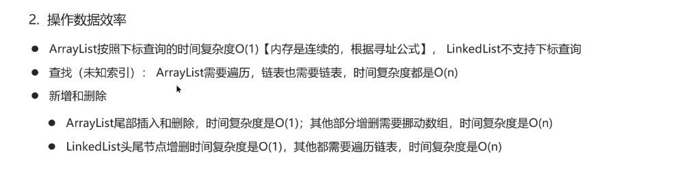
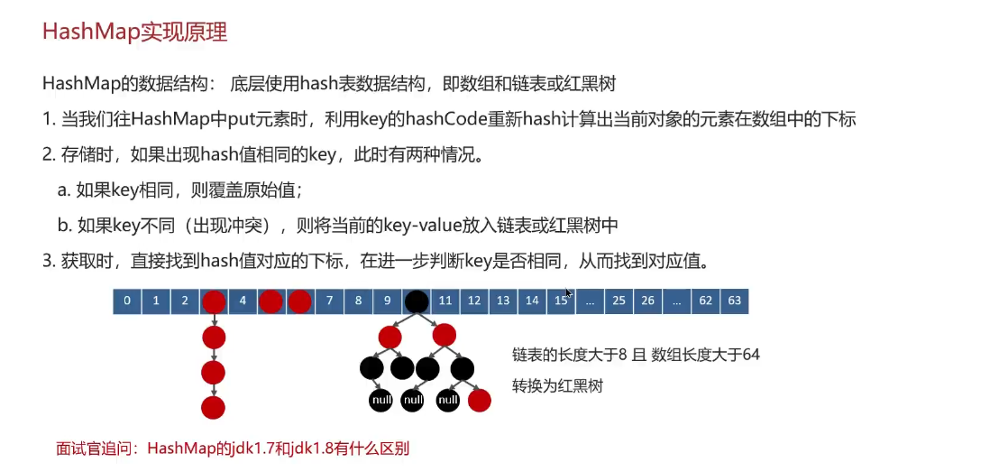
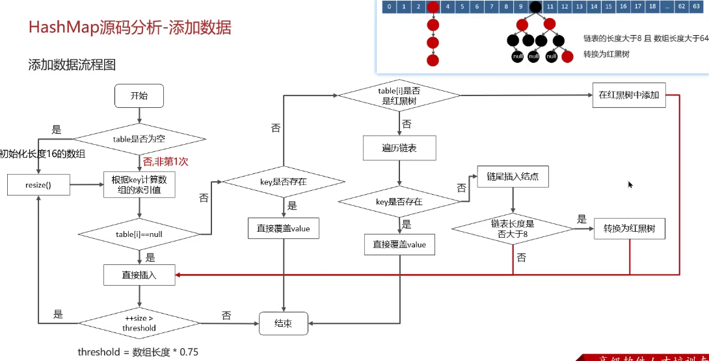
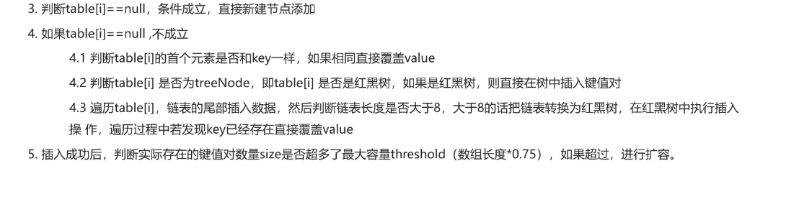
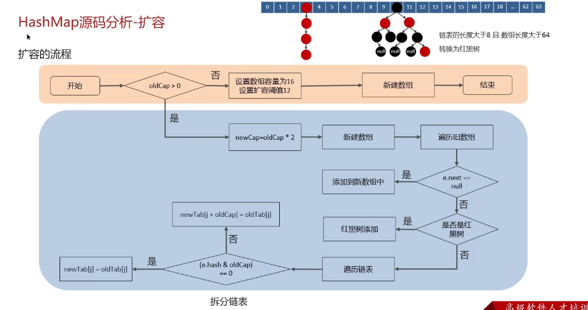
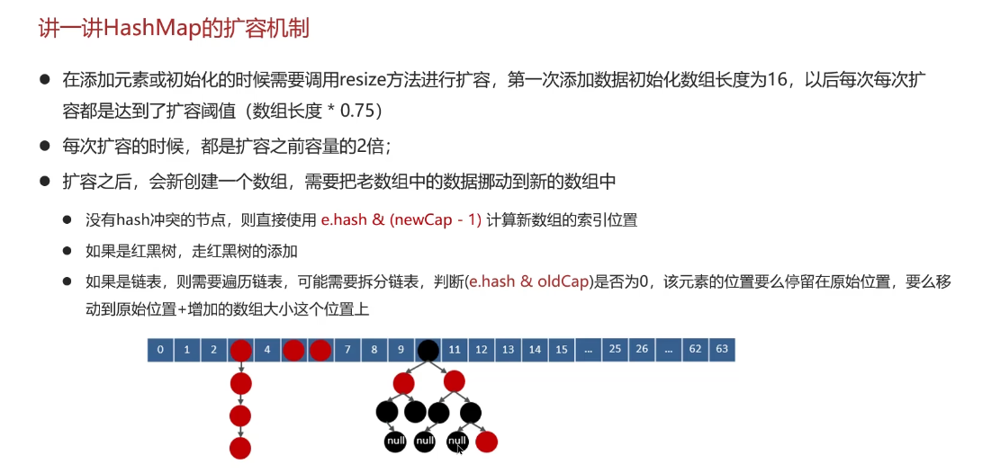

# Java集合

Java集合框架体系


Hash - 哈希表
Linked 链表
Tree 红黑树

md，我觉得这部分应该直接看八股文，听视频实在是太慢了

## List相关

**数组**这部分内容可以快速带过，如下：


### 关于ArrayList

ArrayList底层是使用**动态数组**实现的

ArrayList进行扩容时，每次是原先容量的1.5倍，每次扩容都需要拷贝数组

经典问题：

```java
ArrayList list = new ArrayList(10);
```

其中的list扩容了几次？

答案：这个只是声明和实例化了一个ArrayList，指定了容量为10，**并没有进行扩容！**

#### List和数组之间的转换

List转换到数组：转换完成之后，如果修改List，数组也会变，因为实际上两者地址是一模一样的

数组转换到List：这边转换完成后，数组改变，但是List不会改变，因为复制的过程是进行了新的拷贝！

直接看文档吧，来不及了

> 还是的细致的听一下课，不然很多细节会漏掉，答不上来

### ArrayList和LinkedList的区别

ArrayList是基于动态数组的数据结构实现

LinkedList是双向链表的数据结构实现



注意LinkedList**不支持**根据下标查询

ArrayList和LinkedList都不是线程安全的！

## HashMap相关

- 二叉树
- 红黑树
- 散列表

### 红黑树-细节

1. 节点红色或者黑色
2. 根节点必须是**黑色**的
3. 叶子结点都是**黑色**的空节点
4. 红黑树中，红色节点的子节点都是黑色
5. 从任一节点到叶子结点的所有路径，都包含相同数目的**黑色节点**

红黑树增删改查的时间复杂度都是O(log n)

### 散列表HashTable

散列法-链表法（拉链）：
插入时间复杂度 O(1)
查找时间 平均时间复杂度是 O(1)，最坏时间复杂度是O（n）

所以，需要将链表法中的链表改造为**红黑树**，从而将时间复杂度优化为 O(log n)

修改为红黑树还有一个好处，可以预防**DDos攻击**

注意，**DDos攻击**指的是**分布式拒绝服务攻击**

### 关于HashMap的实现原理



问题：**jdk1.7和jdk1.8**中，HashMap的区别？

回答：红黑树是在jdk1.8之后才有的，之前没有。

### HashMap的put方法的具体流程

扩容阈值 = 数组容量 $\times$ 加载因子



上图是HashMap添加数据的全流程，很复杂

具体流程回答如下：

1. 判断键值对数组Table是否为空或者null，否则执行resize()进行扩容
2. 根据键值 key 计算 Hash 值得到数组索引



### 关于HashMap的扩容机制



这边为什么要计算 e.hash & oldCap 呢 ？
因为e.hash实际上是通过新的NewCap运算到的Index，然后判断这个index在OldCap中，还是在NewCap中

如下图，HashMap的**详细扩容机制**



### 关于HashMap的寻址算法

h = key.hashCode() ^ (h >>> 16)

这种 HashValue 算法能够将不随机的原始数据经过处理后，变得更随机（即**扰动算法**）

(n - 1) & hash 即 hash % n
但是前者性能更好！

#### HashMap的数组长度一定是2的n次幂

- 计算索引时，效率更高：如果是2的n次幂，可以使用位运算代替取模
- 扩容时，重新计算索引效率更高：hash & oldCap。如果 = 0，就在原位置；否则，newIndex = oldIndex + oldCap

### HashMap在jdk1.7情况下的死循环问题

>我终于整明白这边所谓的**头插法**是什么意思了，在HashMap扩容的过程中，旧的数组中的数据要拷贝到新的数组中去。但是这会同时带来对链表的操作，而所谓的头插法，就是比如 1 -> A -> B -> null，但是对链表处理的过程中，链表中的节点以头插法的形式插入到新的链表中去，也就变成了 1 -> B -> A -> null

但是在**多线程**环境下，可能线程A在执行的过程中，突然时间片被抢了。然后线程B执行了头插法扩容，结果此时节点指向易位，最终导致了死循环（e -> next -> e -> next）

由此，jdk1.8将扩容机制改成了尾插法，从而解决了这个问题
