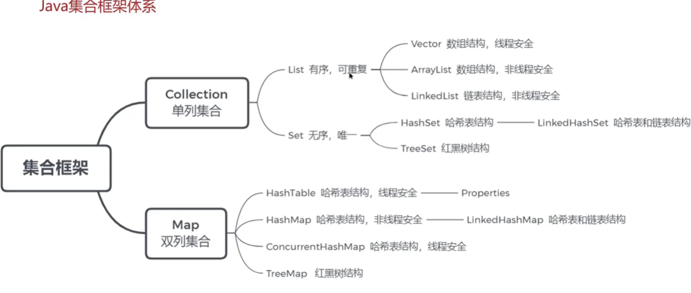
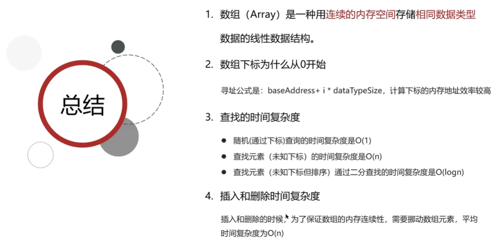

# Java集合

Java集合框架体系



Hash - 哈希表
Linked 链表
Tree 红黑树

md，我觉得这部分应该直接看八股文，听视频实在是太慢了

## List相关

**数组**这部分内容可以快速带过，如下：



### 关于ArrayList

ArrayList底层是使用**动态数组**实现的

ArrayList进行扩容时，每次是原先容量的1.5倍，每次扩容都需要拷贝数组

经典问题：

```java
ArrayList list = new ArrayList(10);
```

其中的list扩容了几次？

答案：这个只是声明和实例化了一个ArrayList，指定了容量为10，**并没有进行扩容！**

#### List和数组之间的转换

List转换到数组：转换完成之后，如果修改List，数组也会变，因为实际上两者地址是一模一样的

数组转换到List：这边转换完成后，数组改变，但是List不会改变，因为复制的过程是进行了新的拷贝！

直接看文档吧，来不及了
