# 消息队列

## 消息队列是什么？

消息队列是一个**使用队列通信**的组件，其本质是**转发器**，包含**发消息、存消息、消费消息**的过程。下图是一个最简单的消息队列模型：

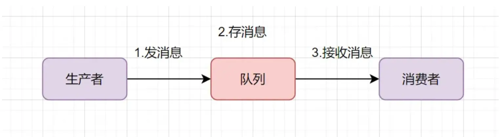

我们通常提到的消息队列，简称**MQ**（Message Queue），其实就是**消息中间件**，当前业界比较流行的开源消息中间件：RabbitMQ、RocketMQ、Kafka

### 消息队列的使用场景

- **解耦**：在多个系统之间解耦合，将原本通过网络之间的调用方式修改为**使用MQ进行消息的异步通讯**
- **异步**：举个例子，客户创建订单时，MQ将后续的轨迹、库存、状态等信息的更新，全部放到MQ里面然后去异步操作。这样可以加快系统的访问速度，提供更好的客户体验
- **削峰**：**高并发**请求下，如果流量过大，系统、数据库会发生崩溃。如果使用MQ进行**流量削峰**，将用户的大量消息放到MQ中。后续系统去按照自己的最大消费能力去消费这些消息，就可以保证**系统的稳定**。

### RabbitMQ & Kafka

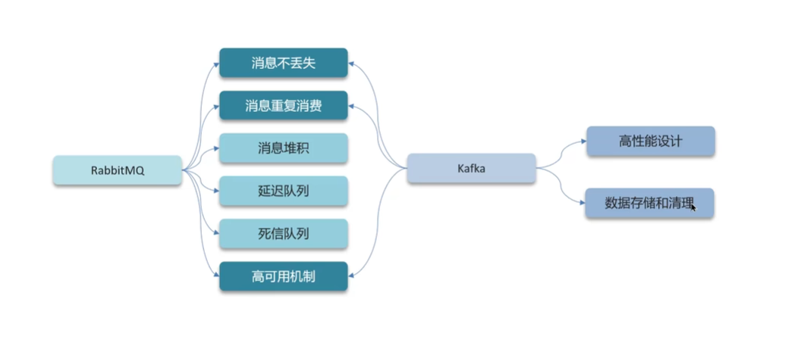

## 关于RabbitMQ

### RabbitMQ之如何保证消息不丢失

- 异步发送
- MySQL和Redis之间的数据同步
- 分布式事务

消息在发送的过程中，在各个环节都有可能会丢失消息

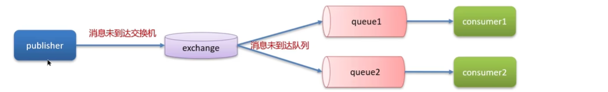

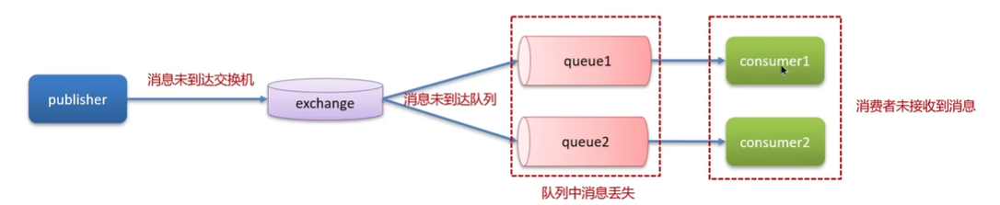

生产者确认机制：ack publish-confirm

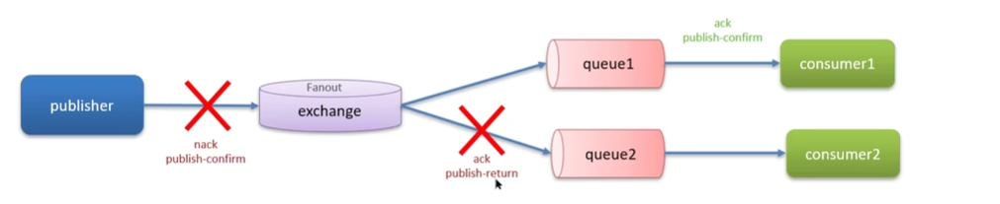

#### 有关消息持久化

MQ默认是内存存储信息，开启持久化功能，可以确保缓存在MQ中的消息不丢失

1. 交换机持久化
2. 队列持久化
3. 消息持久化，SpringAMQP中的消息默认是持久的

#### 消费者确认

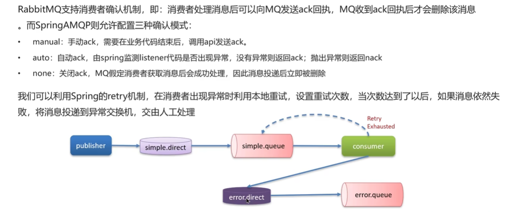

问题：**RabbitMQ如何保证消息不丢失？**

回答如下：

> - 开启生产者确认机制，确保生产者的消息能到达队列
> - 开启持久化功能，确保消息未消费之前在队列中不会丢失
> - 开启消费者确认机制为Auto，由Spring确认消息处理成功后，完成ack
> - 开启消费者失败重试机制，多次重试失败后，将消息投递到**异常交换机**，交由人工处理

### RabbitMQ之如何解决重复消费问题

这边讲的很匆忙，回答大概如下：

> 1. 可以对每条消息设置一个唯一的标识（业务|订单唯一标识）
> 2. 幂等方案：分布式锁、数据库中的乐观锁、悲观锁

### RabbitMQ之延迟队列&死信交换机

延迟队列：进入队列的消息会被**延迟消费**的队列
场景：超时订单、限时优惠、定时发布

注意！**延迟队列 = 死信交换机 + TTL（生存时间）**

当一个队列中的消息满足下列情况之一时，即会成为**死信**（dead letter）

- 消费者使用basic.reject 或者 basic.nack 声明消费失败，并且消息的requeue参数设置为false
- 消息是一个过期消息，超时无人消费
- 要投递的队列消息堆积满了，最早的消息可能成为死信

如果该队列设置了dead-letter-exchange 属性，指定了一个交换机，那么队列中死信就会投递到这个交换机中去，而这个交换机被称为**死信交换机**

问题：**RabbitMQ中死信交换机？（RabbitMQ延迟队列有了解过吗？）**

回答如下：

> 我们当时下单功能使用了延时队列
> 其中延时队列就采用了死信交换机和TTL（消息存活时间）所实现
> 消息超时未消费就会变成死信

可以使用**延时队列插件实现延时队列DelayExchange**

> - 声明一个交换机，添加Delayed属性为true
> - 发送消息时，添加 x-delay 头，值为超时时间

### RabbitMQ之消息堆积

这边引出**惰性队列**的概念

#### 惰性队列

特征如下：

- 接收到消息后，直接存到磁盘里去
- 消费者要消费消息时，才会从磁盘中读取并且加载到内存
- 支持数百万条的消息存储

问题：**RabbitMQ中如果有数百万条消息堆积在MQ中，如何解决？**

> - 添加更多消费者，提高消费速度
> - 在消费者内开启线程池，增加消息处理速度
> - 扩大队列容积，提高堆积上限，采用惰性队列

### RabbitMQ之高可用机制

普通集群、镜像集群、仲裁队列

#### 普通集群

也叫做标准集群

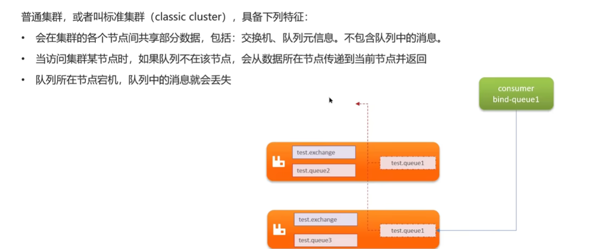

#### 镜像集群

其本质是**主从模式**

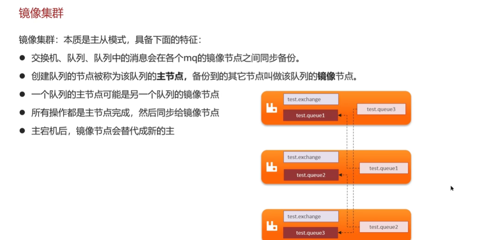

#### 仲裁队列

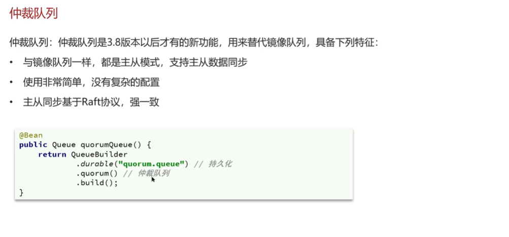

问题：**RabbitMQ的高可用机制有了解过吗？**

回答如下：

> 采用镜像集群，其结构是一主多从，所有操作都是主节点完成，然后同步给镜像节点。
> 主节点如果宕机，镜像节点会成为新的主节点（注意！**如果在主从同步完成之前，主节点已经宕机，那么可能会出现数据丢失！**）

新的问题：那么出现丢失数据了怎么搞？

>我们可以采用**仲裁队列**
其和镜像队列一致，都是主从模式，支持主从数据同步
> 而且，主从同步基于Raft协议，强一致！
> 使用起来只需要在声明队列的时候，指定这个是**仲裁队列**即可！

## 关于Kafka

### Kafka如何保证消息不丢失？

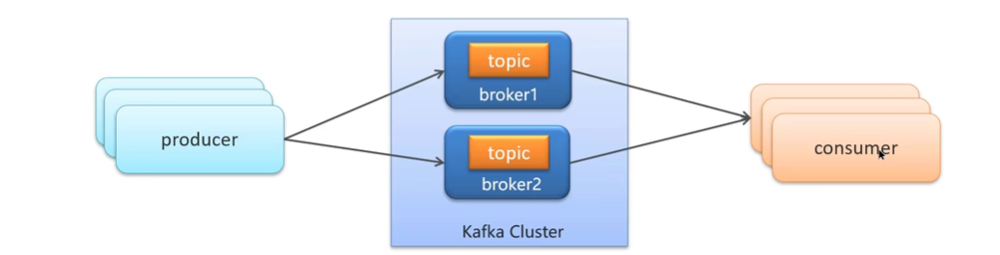

三大解决方案：

- 生产者发送消息到Brocker丢失
- 消息在Brocker中存储丢失
- 消费者从Brocker中接受消息丢失

第一遍根本没听懂，再听一次

#### 生产者发送消息到Brocker丢失

设置**异步发送**

如果消息发送失败了，可以设置几次消息重试

#### 消息在Brocker中存储丢失

涉及到**发送确认机制acks**

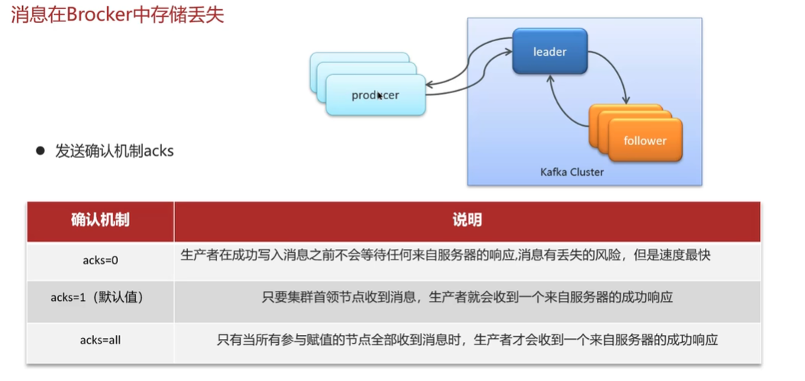

实际生产环境下，一般设置acks = 1

#### 消费者从Brocker中接受消息丢失

消费者默认是自动按期提交已经消费的偏移量，默认是每隔5s提交一次。如果出现重平衡的情况，有可能会重复消费或者丢失数据！

对于这种问题，把自动改成**手动**

- 同步提交
- 异步提交
- 同步+异步组合提交

问题：**Kafka如何保证消息不丢失？**

回答：

> 需要从三个层面去解决这个问题
>
> 1. 生产者发送消息到Brocker丢失
> 对应解决方案：设置异步发送，发送失败后，使用回调来记录或者重发；失败重试，参数配置，可以设置重试次数
> 2. 消息在Brocker中存储丢失
> 发送确认acks，选择all，让所有的副本都参与保存数据后进行确认
> 3. 消费者从Brocker接受消息丢失
> 把自动提交偏移量关掉，并且开启手动提交偏移量
> 提交方式最好是同步加异步提交

### Kafka之保证消息的顺序性

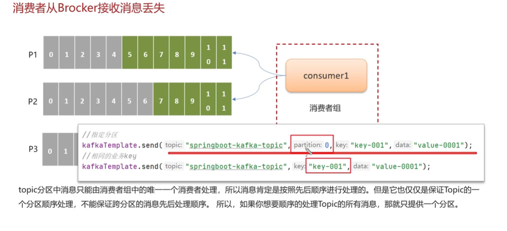

问题：**Kafka是如何保证消费的顺序性的？**

一个topic的数据可能存储在不同的分区中，每个分区都有一个按照顺序的存储的偏移量，如果消费者关联了多个分区，则不能保证顺序性

解决方案：

- 发送消息时，指定分区号
- 发送消息时，按照相同的业务设置相同的key

### Kafka的高可用机制

- 集群
- 分区备份机制

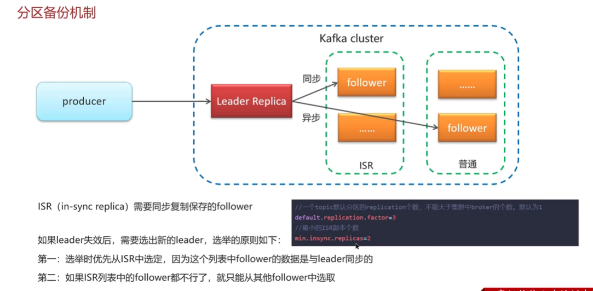

如上图，**分区备份机制**要求ISR的存在

问题：Kafka的高可用机制有了解过吗？

回答如下：

> 可以从两个层面进行回答：
> 分别是**集群**和**复制机制**
>
> 对于**集群**：
> 一个Kafka集群由多个Broker实例组成，即使其中一台宕机，也不耽误其他Broker继续对外提供服务
>
> 对于**复制机制**：
>
> - 一个topic有多个分区，每个分区有多个副本，其中有个是leader，剩下的是follower，副本存储在不同的Broker中
> - 所有的分区副本的内容都是相同的，如果leader发生故障，会自动将其中一个follower提升为leader，保证了系统的容错性和高可用性

问题：解释一下复制机制中的**ISR**

回答如下：

> **ISR**（in-sync replica）需要同步复制保存的follower
> 分区副本分为两类，一类是**ISR**，另外的是普通的副本。ISR和leader副本**同步**保存数据，而普通的副本是**异步**保存数据。当leader挂掉之后，会优先从ISR副本中选取一个作为leader

### Kafka之数据清理机制

- Kafka之文件存储机制
- 数据清理机制

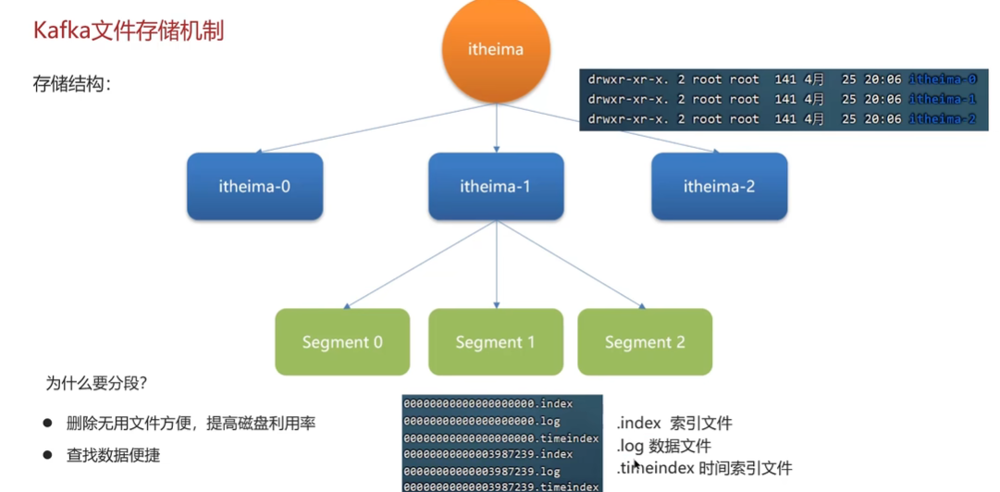

分段存储，便于删除无效/过期文件

#### 数据清理机制

1. 根据消息的保留时间
2. 根据topic存储的数据大小，当topic所占的日志文件大小大于一定的阈值，就会删除最久的消息

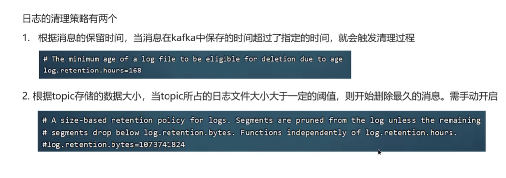

问题：**Kafka的数据清理机制了解过吗？**

Kafka的存储结构：

- Kafka中，topic的数据存储在分区上，分区如果文件过大，会分段存储segment
- 每个分段都在磁盘上，以索引（XXX.index）和日志文件（xxxx.log）的形式进行存储
- 分段的好处是，第一能减少单个文件内容的大小，查找数据方便；第二是**方便Kafka进行数据清理**

日志的清理策略有两个：

- 根据消息的保留时间进行清理，超时了就触发清理
- 根绝topic存储的数据大小，当topic所占的日志文件大小大于一定的阈值，就会开始删除最久的消息（这个默认是关闭的）

### Kafka之实现高性能的设计

- 消息分区：不受单台服务器的限制，可以不受限制的处理更多的数据
- 顺序读写：磁盘顺序读写，提高读写效率
- 页缓存：将磁盘中的数据缓存到内存中，将对磁盘的访问变成对内存的访问
- 零拷贝：减少上下文切换，以及数据拷贝
- 消息压缩：减少磁盘IO和网络IO
- 分批发送：将消息打包后批量发送，减少网络开销

#### 关于零拷贝

在Linux系统中，划分为两块空间
用户空间+内核空间

如果不涉及到零拷贝，对内存的操作是这样

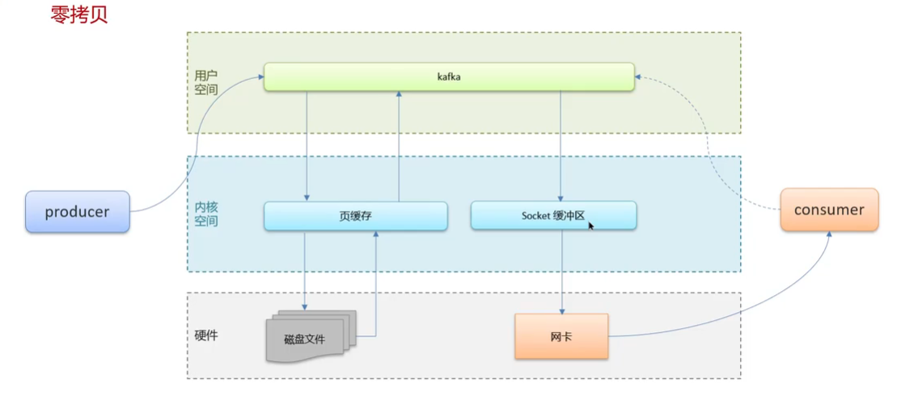

但是，这样要对存储数据拷贝三次，效率很低

由此，引出零拷贝，交由系统操作，从内核空间中，操作数据拷贝到网卡中去，再传递给consumer

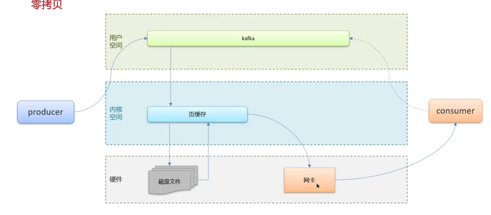

问题：Kafka中**实现高性能的设计**有了解过吗？

重点是回答这四个

- 消息分区
- 顺序读写
- 页缓存
- 零拷贝：减少上下文切换和数据拷贝

## 关于 RocketMQ

RocketMQ 是一种功能强大的**分布式消息系统**

### 什么时候用RocketMQ？

这个问题也可以描述为：**什么时候用MQ？**

- 异步解耦：对无关紧要的执行流程，去放到MQ中进行异步执行
- 削峰填谷：起到流量削峰的目的
- 顺序消息：这个分为**分区顺序消息**和**全局顺序消息**

其他的几个应用点，比如**分布式模式缓存同步**，**分布式定时/延时调度**。暂时不列了，因为目前也看不懂

### RocketMQ 基础概念

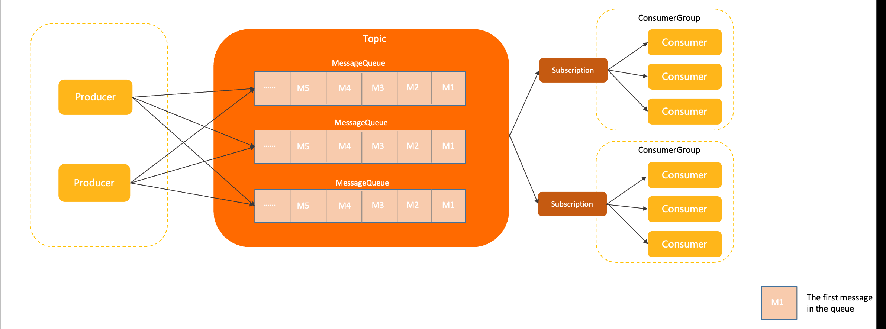

#### 主题topic

主题是 Apache RocketMQ 中消息传输和存储的顶层容器，用于标识同一类业务逻辑的消息。

- 定义数据的**分类隔离**：建议将不同类型的数据拆分到不同的主题中管理，通过主题曲实现**存储的隔离性和订阅的隔离性**
- 定义数据的**身份和权限**：Apache RocketMQ 的消息本身是**匿名无身份**的，同一分类的消息使用相同的主题，去做身份识别和权限管理

#### 队列Queue

队列是 Apache RocketMQ 中**消息存储和传输**的实际容器，也是 Apache RocketMQ 消息的最小存储单元。

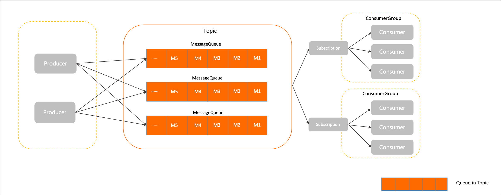

Apache RocketMQ 中的**所有主题**都是由多个队列组成，从而实现队列数量的水平拆分和队列内部的流式存储

#### 消息 Message

消息是 Apache RocketMQ 中的最小数据传输单元，生产者将业务数据的负载和拓展属性包装成消息发送到 Apache RocketMQ 服务端，服务端按照相关语义，去将消息投递到消费端进行消费

#### 生产者 Producer

发布消息的角色。Producer 通过 MQ 的**负载均衡**模块选择相应的 Broker 集群队列进行消息投递，投递的过程支持快速失败和重试。

#### 消费者 Consumer

消息消费的角色。

- 支持以推（push），拉（pull）两种模式对消息进行消费。
- 同时也支持集群方式和广播方式的消费。
- 提供实时消息订阅机制，可以满足大多数用户的需求。
