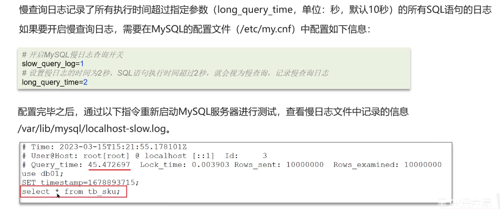

# MySQL Part

- 关于MySQL的优化

  - 定位慢查询
  - SQL执行计划
  - 索引
  - SQL优化经验

- 其他面试题
  - 事务相关
  - 主从同步原理
  - 分库分表

## 优化-如何定位慢查询？

问题：在MySQL中，如何定位**慢查询**？

什么是慢查询？

- 聚合查询
- 多表查询
- 表数据量过大查询
- 深度分页查询

表象：页面加载过慢，接口压测响应时间过长

怎么**定位**慢查询？

方案一：开源工具

- 调试工具：Arthas
- 运维工具：（这什么乱七八糟的）Prometheus、Skywalking

方案二：MySQL自带**慢日志**

怎么回答呢？

> 先编一个遇到的场景，使用运维工具（Skywalking），可以监测是哪个接口导致的问题。在MySQL中开启了慢日志查询，一旦SQL执行超过2s，就会记录到日志中去。

问题：**如果这个SQL查询执行很慢，该如何分析呢？**

在MySQL中，可以使用**Explain**或者**Desc**命令来获取MySQL如何执行**Select**语句的信息

怎么回答？如下：

>可以采用MySQL自带的分析工具 **EXPLAIN**
>
> - 通过key和key_len检查是否命中了索引（索引本身存在是否有失效的情况）
> 通过**type**字段查看**SQL**是否有进一步的空间，是否存在全索引扫描或者全盘扫描
> 通过extra建议判断，是否出现了**回表**的情况。如果出现了，可以通过添加索引或者修改返回字段来修复

## 优化-索引

问题：索引（index）是什么？

回答如下：

> 索引（index）是帮助MySQL高效获取数据的数据结构（有序）
> 提高数据检索的效率，降低数据库的IO成本（不需要全表扫描）
> 通过索引列对数据进行排序，降低数据排序的成本，降低了CPU的消耗

**索引**是帮助MySQL高效获取数据的数据结构（有序）。在数据之外，数据库系统还维护着满足特定查找算法的数据结构（**B+树**），这些数据结构以某种方式引用（指向）数据

这种数据结构就是**索引**

问题：索引的底层数据结构了解过吗？

回答：

> MySQL的InnoDB引擎采用了B+树的数据结构来存储索引
>
> - 阶数更多，路径更短
> - 磁盘读写代价B+树更低，非叶子结点只能存储指针，叶子结点存储数据
> - B+树便于扫库和区间查询，叶子结点是一个**双向链表**

B+树

为什么不用红黑树？

因为红黑树是二叉树，如果数据量太大的话，就会导致树很高，查询效率非常差劲

B+树比BTree更优秀，使得其更适合实现**外存储索引结构**
InnoDB存储引擎就是采用B+ Tree实现其索引结构

B+树非叶子结点不存储数据，只存储指针。而叶子结点才存储数据

B+树相较于B树的优势

- 磁盘读写代价B+树更低
- 查询效率B+树更加稳定
- B+树便于扫库和区间查询

问题：**什么是聚簇索引，什么是非聚簇索引？**

回答：

> - 聚簇索引（聚集索引）：数据和索引一定要放到一块，B+树的叶子结点保存了整行数据，有且仅有一个
> - 非聚簇索引（二级索引）：数据和索引分开存储，B+树的叶子结点保存对应的主键，可以有多个

首先要理解透彻MySQL中的索引这个概念，**索引就是B+树**，不要把它理解为index下标，不然会出事的

二级索引是什么东西？**二级索引就是非聚簇索引**

问题：**知道什么是回表查询吗？**

回答：

> 通过二级索引找到对应的主键值，到聚集索引中去查找整行数据，这个过程就是**回表**
