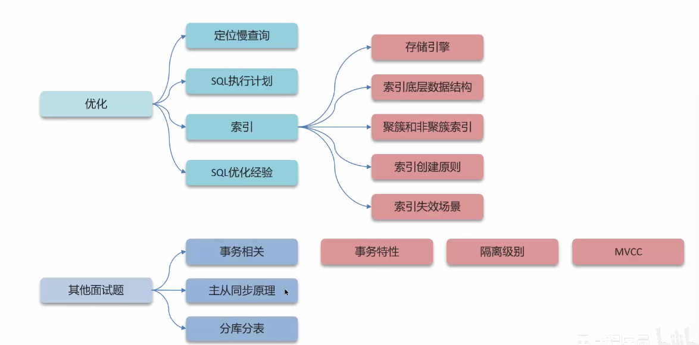
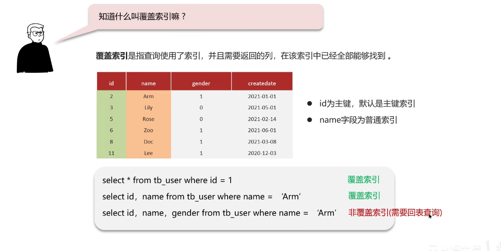
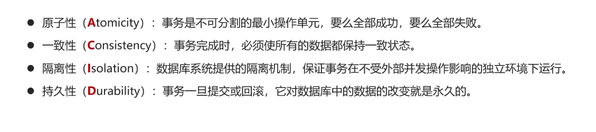
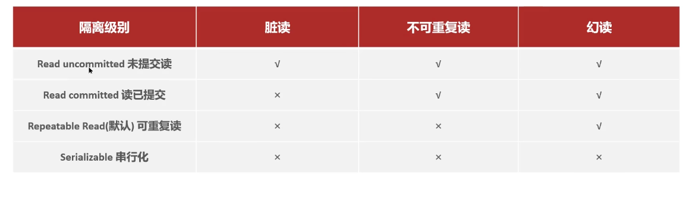
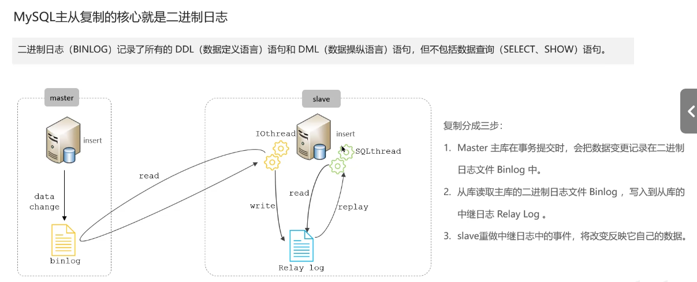
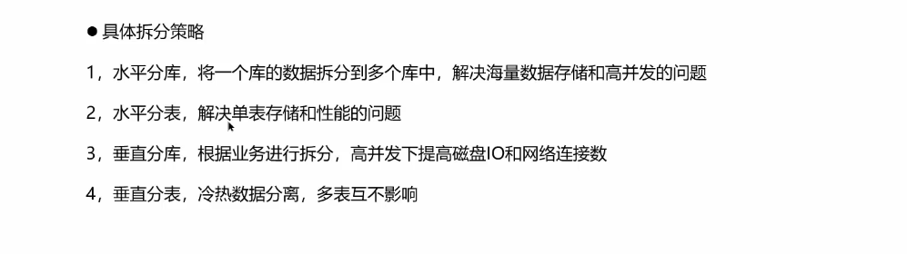

# MySQL Part

- 关于MySQL的优化

  - 定位慢查询
  - SQL执行计划
  - 索引
  - SQL优化经验

- 其他面试题
  - 事务相关
  - 主从同步原理
  - 分库分表

## 优化-如何定位慢查询？

问题：在MySQL中，如何定位**慢查询**？

什么是慢查询？

- 聚合查询
- 多表查询
- 表数据量过大查询
- 深度分页查询

表象：页面加载过慢，接口压测响应时间过长

怎么**定位**慢查询？

方案一：开源工具

- 调试工具：Arthas
- 运维工具：（这什么乱七八糟的）Prometheus、Skywalking

方案二：MySQL自带**慢日志**

怎么回答呢？

> 先编一个遇到的场景，使用运维工具（Skywalking），可以监测是哪个接口导致的问题。在MySQL中开启了慢日志查询，一旦SQL执行超过2s，就会记录到日志中去。

问题：**如果这个SQL查询执行很慢，该如何分析呢？**

在MySQL中，可以使用**Explain**或者**Desc**命令来获取MySQL如何执行**Select**语句的信息

怎么回答？如下：

>可以采用MySQL自带的分析工具 **EXPLAIN**
>
> - 通过key和key_len检查是否命中了索引（索引本身存在是否有失效的情况）
> 通过**type**字段查看**SQL**是否有进一步的空间，是否存在全索引扫描或者全盘扫描
> 通过extra建议判断，是否出现了**回表**的情况。如果出现了，可以通过添加索引或者修改返回字段来修复

## 优化-索引

问题：索引（index）是什么？

回答如下：

> 索引（index）是帮助MySQL高效获取数据的数据结构（有序）
> 提高数据检索的效率，降低数据库的IO成本（不需要全表扫描）
> 通过索引列对数据进行排序，降低数据排序的成本，降低了CPU的消耗

**索引**是帮助MySQL高效获取数据的数据结构（有序）。在数据之外，数据库系统还维护着满足特定查找算法的数据结构（**B+树**），这些数据结构以某种方式引用（指向）数据

这种数据结构就是**索引**

问题：索引的底层数据结构了解过吗？

回答：

> MySQL的InnoDB引擎采用了B+树的数据结构来存储索引
>
> - 阶数更多，路径更短
> - 磁盘读写代价B+树更低，非叶子结点只能存储指针，叶子结点存储数据
> - B+树便于扫库和区间查询，叶子结点是一个**双向链表**

B+树

为什么不用红黑树？

因为红黑树是二叉树，如果数据量太大的话，就会导致树很高，查询效率非常差劲

B+树比BTree更优秀，使得其更适合实现**外存储索引结构**
InnoDB存储引擎就是采用B+ Tree实现其索引结构

B+树非叶子结点不存储数据，只存储指针。而叶子结点才存储数据

B+树相较于B树的优势

- 磁盘读写代价B+树更低
- 查询效率B+树更加稳定
- B+树便于扫库和区间查询

问题：**什么是聚簇索引，什么是非聚簇索引？**

回答：

> - 聚簇索引（聚集索引/主键索引）：数据和索引一定要放到一块，B+树的叶子结点保存了整行数据，有且仅有一个
> - 非聚簇索引（二级索引）：数据和索引分开存储，B+树的叶子结点保存对应的主键，可以有多个

首先要理解透彻MySQL中的索引这个概念，**索引就是B+树**，不要把它理解为index下标，不然会出事的

二级索引是什么东西？**二级索引就是非聚簇索引**

问题：**知道什么是回表查询吗？**

回答：

> 通过二级索引找到对应的主键值，到聚集索引中去查找整行数据，这个过程就是**回表**

问题：知道什么叫**覆盖索引**吗？

需要**回表查询**的，**不是覆盖索引**

怎么回答呢？如下：

> 覆盖索引指的是查询使用了索引，返回的列，必须在索引中能全部被找到
>
> - 使用id查询，直接走聚集索引查询，一次索引扫描，直接返回数据，性能很高
> - 如果返回的列中没有创建索引，有可能会触发**回表查询**，尽量避免使用select *

问题：**MySQL超大分页怎么处理？**

注意到，在数据量很大时，如果进行**limit**分页查询。在查询时，越往后，分页查询效率越低

回答：

> 这个问题是，在数据量很大的时候，limit分页查询，需要对数据进行排序，效率非常低
> 解决方案是：覆盖索引+子查询

问题：**索引创建**的原则有哪些？

>- 数据量较大，且查询比较频繁的表
>- 常作为查询条件、排序、分组的字段
>- 尽量联合索引
>- 要控制索引的数量

问题：**什么情况下索引会失效？**

我搞懂这个什么意思了，它就是说什么情况下，那个检索树（索引）会查找失效

怎么回答呢？如下：

> - 违反最左前缀法则
> - 范围查询右边的列，不能使用索引
> - 不要在索引列上进行运算操作，不然索引会失效
> - 字符串不加单引号，造成索引失效
> - 以%开头的Like模糊查询，索引失效

## SQL优化经验泛谈

问题：**谈一谈你对SQL优化的经验**

这个回答的方向其实是多样化的

- 表的设计优化
- 索引优化
- SQL语句优化
- 主从复制、读写分离
- 分库分表

回答如下：

> - 定义字段的时候，要结合字段的内容来选择合适的类型，如果是字符串类型，也是结合存储的内容来选择char和varchar或者text类型
> - select语句务必指定字段名称，而不是直接使用select *
> 要注意SQL语句避免造成索引失效的写法，如果是聚合查询，尽量使用union all代替union，union会多一次过滤，效率很低
> - 如果是表关联的话，尽量使用inner join，不要使用left join或者right join，如果必须要使用，需要用小表进行驱动

## 其他面试题

- 事务相关
- 主从同步原理
- 分库分表

## 事务相关

问题：**事务的特性是什么？**

简单的说，可以用**ACID**进行概括

事务是什么？

> 事务是一组操作的集合，其是一个不可分割的工作单位，事务会把所有的操作作为一个整体一起向系统提交或者撤销操作请求。也就是说，这些操作要么同时成功，要么同时失败

ACID是什么？可以详细说一下吗？

四大特性：**原子性、一致性、隔离性、持久性**

问题：**并发事务带来哪些问题？怎么解决这些问题呢？MySQL的默认隔离级别是？**

**并发事务**问题：

- 脏读
- 不可重复读
- 幻读

怎么解决这些问题呢？

采用**对事务进行隔离**

注意！MySQL的默认隔离级别是**可重复读**

实际的开发中不会使用**串行化**，因为性能实在是太差劲了，几经放弃了**并发实现**

注意：事务隔离级别越高，数据越安全，但是性能越差劲

问题：**undo log和redo log的区别？**

redo log：重做日志，记录的是**事务提交时数据页的物理修改**，是**用来实现事务的持久性**

undo log：**回滚**日志，用来记录数据被修改前的信息。作用包括两个：**提供回滚**和**MVCC**（多版本并发控制）

注意！undo log和redo log记录物理日志不一样，它是**逻辑日志**

**undo log**可以实现事务的**一致性和原子性**
**redo log**保证了事务的持久性

怎么回答呢？
如下：

> redo log日志记录的是数据页的物理变化，服务宕机可以用来同步数据。而undo log不同，其记录的主要是**逻辑日志**，当事务回滚时，通过逆操作来回复原先的数据。
> redo log保证了事务的持久性，而undo log保证了事务的原子性和一致性

## MVCC

锁：排他锁（一个数据行的排他锁只能被一个事务独占）
**mvcc**：多版本并发控制

MVCC的具体实现，主要依赖于数据库记录中的**隐式字段**、**undo log日志**、**readView**

注意到undo log 版本链

关于**readView**

草了根本没听懂，再听一次

ReadView（读视图）是**快照读**SQL执行时，MVCC提取数据的依据，用来记录并且维护系统当前活跃的事务（未提交的）id

- 当前读

读取的是记录的最新版本，读取时还要保证其他并发事务不能修改当前记录，**会对读取的记录进行加锁**

- 快照读

简单的select（不加锁）就是快照读，快照读，读取的记录数据的可见版本，有可能是历史数据。不加锁，是非阻塞读

问题：好的，**事务中的隔离性是如何保证的呢？（你介绍一下MVCC）**

怎么回答？如下：

> MySQL中的多版本并发控制，指的是维护一个数据的多个版本，使得读写操作没有冲突
>
> - **隐藏字段**
>   - trx_id（事务id），记录每一次操作的事务id，是自增的
>   - roll_pointer（回滚指针），指向上一个版本的事务版本记录地址
>
> - **undo log**
>   - 回滚日志，存储老版本数据
>   - 版本链：多个事务并行操作某一行记录，记录不同事务修改数据的版本，通过roll_pointer指针形成一个链表
>
> - **readView**：解决的是一个事务查询选择版本的问题
>   - 根据readView的匹配规则和当前事务的id判断应当访问哪个版本的数据
>   - 不同的隔离级别快照读是不一样的，最终的访问结果也不一样
>     - RC：每一次执行快照时生成readView
>     - RR：仅在事务中第一次执行快照时，生成ReadView，后续复用

## MySQL主从同步原理

MySQL**主从复制**的核心就是**二进制日志**

master中的binlog日志，写到从库里面的中继日志Relay Log中去，从库然后重做中继日志中的事件，将改变反映它自己的数据

## 分库分表

当数据量到达一个阈值之后，得进行**分库分表**

这个八股简直就是扯淡，谁他妈的数据存储量有百千万级啊，wdnmd

听个乐子得了
