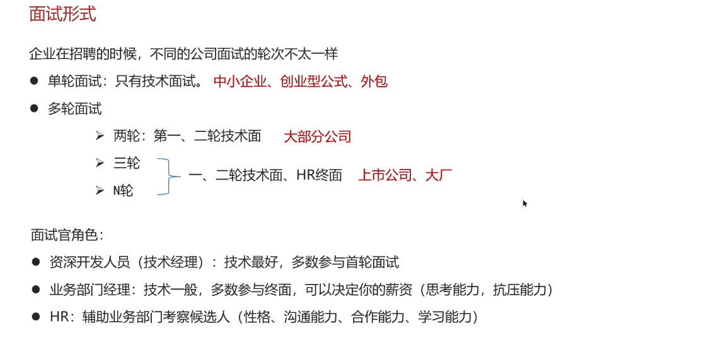
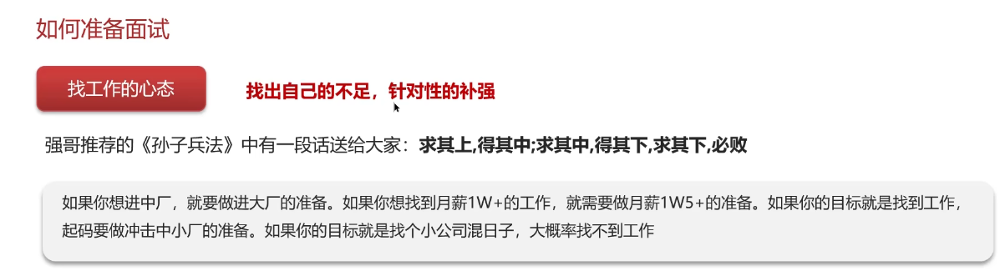

# 关于简历

## 平台

Boss直聘
智联招聘

## 项目相关细节

### 模块怎么吃透？

1. 功能怎么实现的？
2. 常见的问题
3. 权限系统设计：可扩展性、高可用性、通用性

>之后的新项目应当去github上找，业务项目和轮子项目

## 面试形式

特别注意这个**面试官角色**

## 面试过程

**提前准备**！！！

### 如何准备面试？

参考：<https://juejin.cn/post/7206116224840138810>
