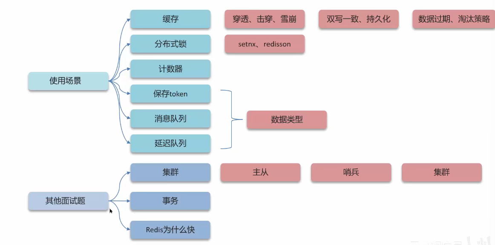
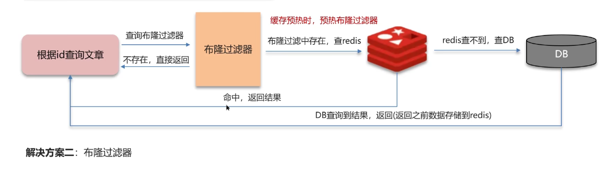

# Redis篇

**Redis**是面试中的**重中之重**

总体分布如下：

## 缓存

### 缓存穿透

缓存穿透：查询一个**不存在**的数据，MySQL查询不到数据也不会直接写入缓存，就会导致每次请求都查询数据库

解决方案一：缓存空数据，查询返回的数据为空，仍然把这个空结果缓存

- 缺点：消耗内存；可能会发生不一致的问题

解决方案二：采用**布隆过滤器**（缓存预热时，需要预热布隆过滤器）

>**布隆过滤器**怎么实现的？作用是什么？

bitmap (位图)：相当于是一个以**bit**为单位的数组

布隆过滤器作用：其可以用于检索一个元素是否在一个集合中

实际上是采用Hash函数计算

注意！布隆过滤器会产生**误判**！
