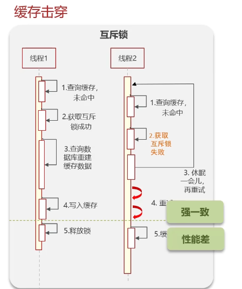
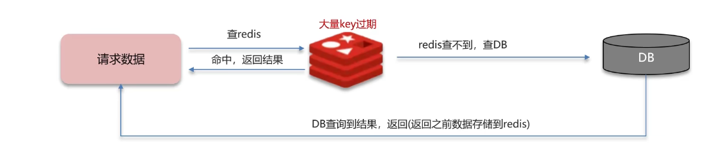

# Redis篇

**Redis**是面试中的**重中之重**

总体分布如下：

## 缓存

### 缓存穿透

缓存穿透：查询一个**不存在**的数据，MySQL查询不到数据也不会直接写入缓存，就会导致每次请求都查询数据库

解决方案一：缓存空数据，查询返回的数据为空，仍然把这个空结果缓存

- 缺点：消耗内存；可能会发生不一致的问题

解决方案二：采用**布隆过滤器**（缓存预热时，需要预热布隆过滤器）

>**布隆过滤器**怎么实现的？作用是什么？

bitmap (位图)：相当于是一个以**bit**为单位的数组

布隆过滤器作用：其可以用于检索一个元素是否在一个集合中

实际上是采用Hash函数计算

注意！布隆过滤器会产生**误判**！

### 缓存击穿

缓存击穿：给某一个key设置了过期时间，当key过期的时候，恰好这个时间点对这个key有大量的并发需求，导致数据库被击垮

解决方案一：**互斥锁**

**强一致**，但是**性能很差**

解决方案二：**逻辑过期**

**高可用**、**性能优**，但是不保证数据绝对一致

这个处理逻辑很微妙，会返回过期数据，同时设定逻辑时间

### 缓存雪崩

缓存雪崩：在同一个时间段内，大量的缓存key同时失效，或者Redis服务发生了宕机。导致大量请求到达数据库，带来巨大压力

解决方案：

- 给不同的key的TTL添加随机值
- 利用Redis集群提高服务的可用性（哨兵模式、集群模式）
- 给缓存业务添加降级限流策略
- 可以给业务添加多级缓存（Guava、Caffeine）
