# Redis篇

**Redis**是面试中的**重中之重**

总体分布如下：


## 缓存

### 缓存穿透

缓存穿透：查询一个**不存在**的数据，MySQL查询不到数据也不会直接写入缓存，就会导致每次请求都查询数据库

解决方案一：缓存空数据，查询返回的数据为空，仍然把这个空结果缓存

- 缺点：消耗内存；可能会发生不一致的问题

解决方案二：采用**布隆过滤器**（缓存预热时，需要预热布隆过滤器）


>**布隆过滤器**怎么实现的？作用是什么？

bitmap (位图)：相当于是一个以**bit**为单位的数组

布隆过滤器作用：其可以用于检索一个元素是否在一个集合中

实际上是采用Hash函数计算

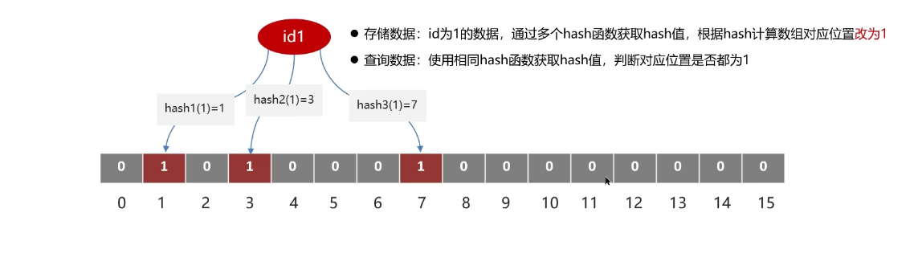

注意！布隆过滤器会产生**误判**！

### 缓存击穿

缓存击穿：给某一个key设置了过期时间，当key过期的时候，恰好这个时间点对这个key有大量的并发需求，导致数据库被击垮

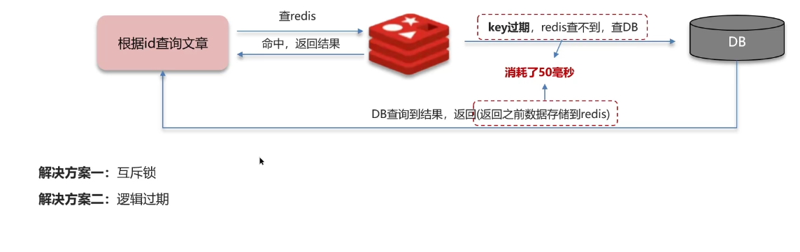

解决方案一：**互斥锁**

**强一致**，但是**性能很差**


解决方案二：**逻辑过期**

**高可用**、**性能优**，但是不保证数据绝对一致

这个处理逻辑很微妙，会返回过期数据，同时设定逻辑时间

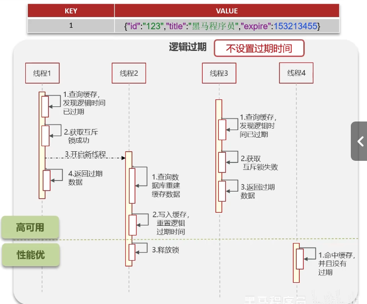

### 缓存雪崩

缓存雪崩：在同一个时间段内，大量的缓存key同时失效，或者Redis服务发生了宕机。导致大量请求到达数据库，带来巨大压力


解决方案：

- 给不同的key的TTL添加随机值
- 利用Redis集群提高服务的可用性（哨兵模式、集群模式）
- 给缓存业务添加降级限流策略
- 可以给业务添加多级缓存（Guava、Caffeine）

### 双写一致性

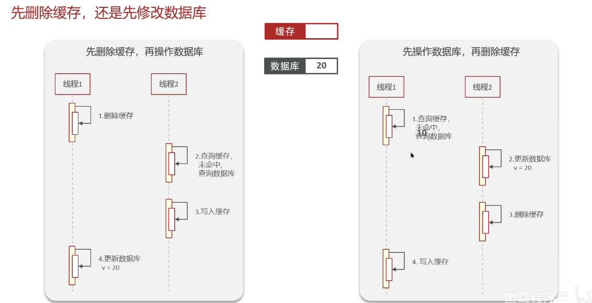

**延迟双删**：先删除缓存，再修改数据库，最后**延时**删除缓存

要想保证**强一致性**，需要使用**分布式锁**

需要注意到一个事，一般放到缓存中的数据，都是**读多写少**。如果是写多读少，那还要Redis缓存搞什么，直接操作数据库写入不就完事了

由此，我们引申出**共享锁**和**排他锁**

在**强一致**要求状况下，势必会带来性能低的问题

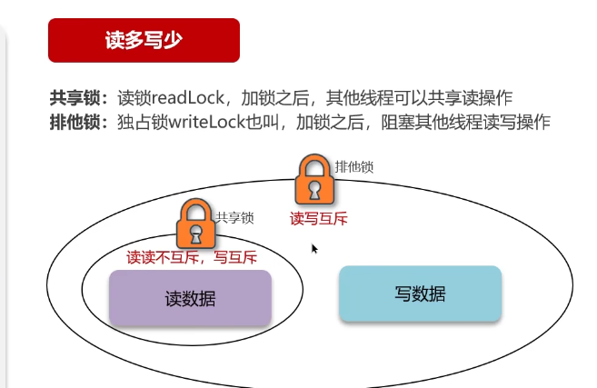

而如果要追求性能，我们需要进行**异步通知**

使用MQ或者canal

>问题：redis作为缓存，MySQL的数据怎么和Redis保持同步呢？（这个是双写一致性）

需要分两种情况进行回答

- 追求性能高，则采用**异步**的方案去同步数据
也就是说，允许**延时一致**，采用异步通知。

1. 采用MQ中间件，更新数据之后，通知缓存删除
2. 或者利用阿里的canal中间件，不需要修改业务代码。而是伪装成MySQL的一个从节点，canal通过读取binlog数据更新缓存

- 追求**强一致性**，那么可以采用Redisson提供的**读写锁**

1. 共享锁：读锁readLock，加锁之后，其他线程可以共享读操作
2. 排他锁：独占锁writeLock，加锁之后，阻塞其他线程读写操作

### Redis数据持久化

分为RDB和AOF

### RDB

RDB 全称 Redis Database Backup file （Redis 数据备份文件），也被称为Redis数据快照。

Redis的快照是**全量快照**，也就是说，每次执行快照，会将内存中的**所有数据**都记录到磁盘中去。

简单地说，就是把内存中的所有数据都记录到磁盘里面去。当Redis实例故障重启后，从磁盘读取快照文件，恢复数据。

#### RDB的执行原理？

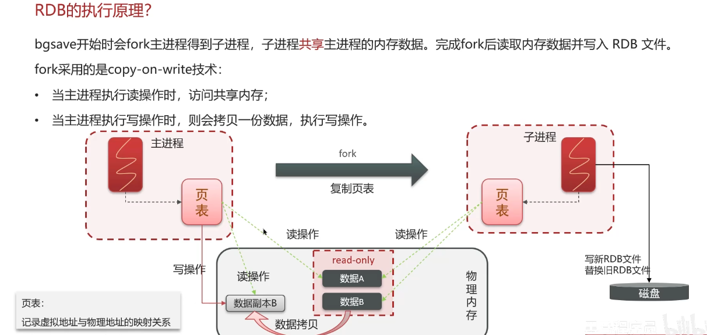

这个东西讲了和没讲一样……子进程通过bgsave命令，开始fork主进程。
子进程共享主进程的内存数据，完成fork之后读取内存数据，并且写入RDB文件

### AOF

AOF：Append Only File (追加文件)

命令记录的频率和性能影响关系：

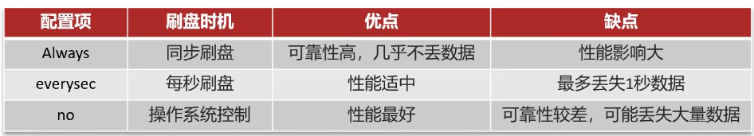

由于是记录命令，AOF文件会远大于RDB文件。

AOF会记录对同一个key的多次**写操作**，但是只有最后一次写操作才有意义。通过执行**bgrewriteaof**命令，可以让AOF文件执行重写功能，用最少得命令达到同样效果

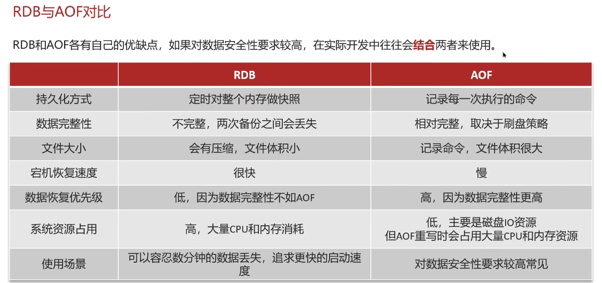

### 数据过期策略

>问题：假如Redis的key过期之后，会立即删除吗？

两种删除策略：惰性删除和定期删除

惰性删除：访问key的时候，判断是否过期；如果过期，则删除

定期删除：定期检查一定量的key是否过期（SLOW模式+FAST模式）

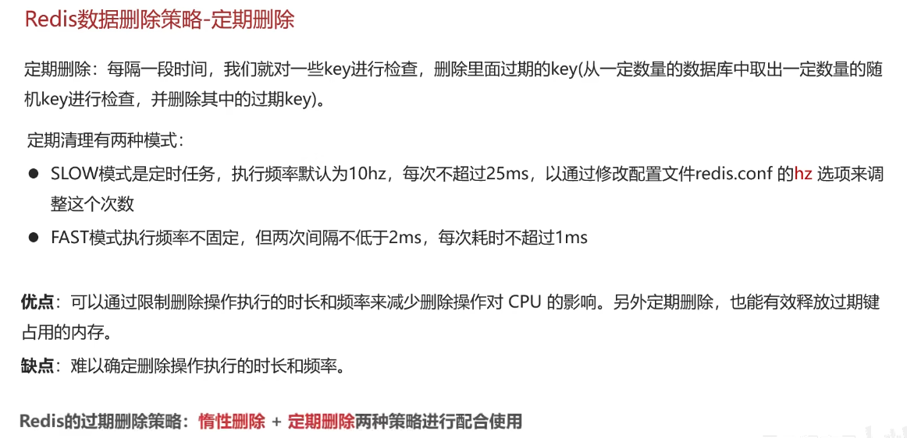

**Redis的过期删除策略：惰性删除+定期删除**两种策略进行配合使用

### 数据淘汰策略

>问题：假如缓存过多，内存是有限的，内存被占满了怎么办？

数据的淘汰策略：当Redis中的内存不够用时，此时在向Redis中添加新的key，那么Redis就会按照某种规则将内存中的数据删除掉，这种数据的删除规则被称为**内存的淘汰策略**

Redis提供了8种不同策略来选择要删除的key：

>这边提到了两种算法：**LRU**和**LFU**
>LRU (Least Recently Used) 最近最少使用
>LFU (Least Frequently Used) 最少频率使用。会统计每个key的访问频率，然后把值最小的优先级更高地去淘汰掉

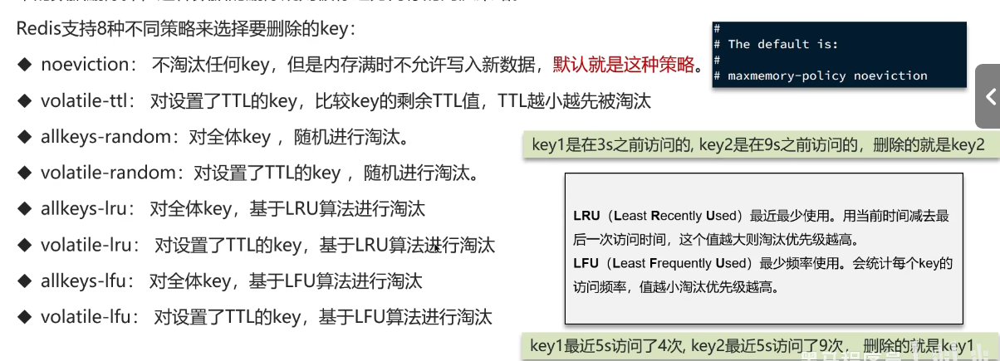

就是上述八种，注意这个命名：**allkeys**对应的全体key，而**volatile**对应的设置了TTL的key

对于数据淘汰策略的使用，一般情况下就用**LRU**相关的策略，如果碰上特殊需求的，比如说带**置顶**业务的或者有**短时高频访问**的业务，可以对症下药

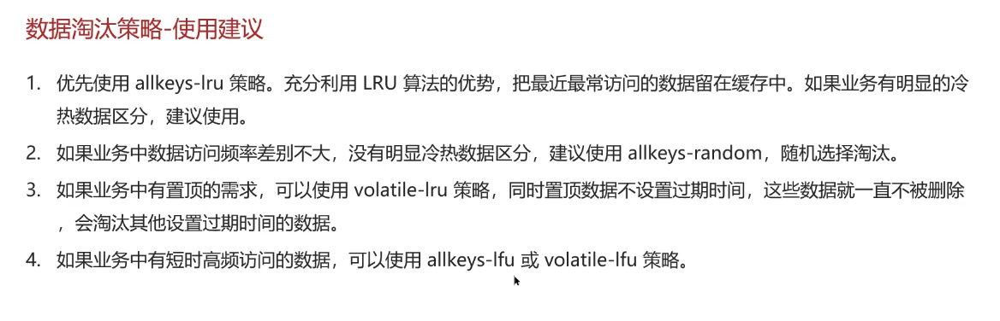

#### 关于数据淘汰策略的其他面试问题

数据库中1000万条数据，而Redis中只能缓存20w条数据，如何保证Redis中的数据都是热点数据？

>回答：使用allkeys-lru淘汰策略，这样子留下来的都是热点数据

Redis内存用完了会发生什么？

>回答：主要看数据淘汰策略是什么，如果是默认的配置（noeviction），就会直接报错！

## 分布式锁在Redis中的实现

方案一：使用synchronized锁，这个锁是悲观锁来着好像？

但是呢，这个实现是有点问题的。当存在**服务集群部署**时，nginx会通过**反向代理、负载均衡**。但是，每个服务都有各自的JVM。每个锁只能解决同一个JVM下的线程互斥，而无法解决多个JVM下的线程互斥。

所以，我们应当使用**分布式锁**！

### Redis分布式锁实现原理

Redis实现分布式锁主要利用Redis的**setnx**命令

```redis
SET lock value NX EX 10
```

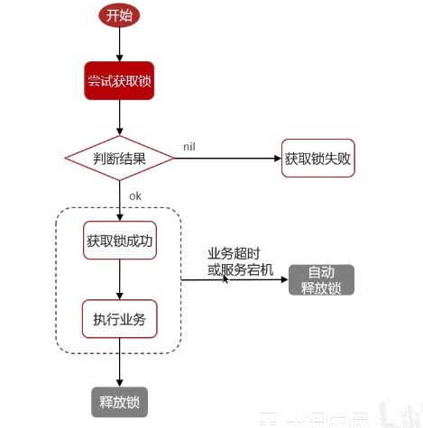

设置过期时间是为了防止**宕机的情况**

问题：**Redis实现分布式锁如何合理的控制锁的有效时长？**

>给锁续期

### Redisson实现的分布式锁-执行流程

redisson实现的分布式锁是**可以重入**的

原理是利用Hash结构记录线程id，以及重入次数

#### Redisson实现的分布式锁-主从一致性

实现机制：**RedLock(红锁)**

不能只在一个redis实例上创建锁，而是应当在多个redis实例上创建锁（$n / 2 + 1$），避免在一个redis实例上加锁

但是实际生产中很少使用红锁，因为使用起来实在是太麻烦了

回到问题：
**redis分布式锁，是如何实现的？**

> 我们当时使用的Redisson实现的分布式锁，底层是setnx和lua脚本（保证原子性）

**Redisson实现分布式锁**，如何合理的控制锁的**有效时长**？

> 在Redisson的分布式锁中，提供了一个**Watch Dog**（看门狗机制）。一个线程获取锁成功以后，WatchDog会给持有锁的线程续期（默认是每隔10s续期一次）

**Redisson这个锁**，可以**重入**吗？

> 可以重入，多个锁重入需要判断是否是当前线程，在redis进行存储的时候用到的Hash结构，来存储**线程信息和重入的次数**

**Redisson锁能解决主从数据一致的问题吗？**

> 不能解决，但是可以使用Redisson提供的红锁来解决。但是其效率非常低，如果业务非要保证数据的强一致性，建议使用zookeeper实现的分布式锁

## 其他面试问题

可能会和业务没什么关系，但是仍然是高频问题

**Redis集群**有哪些方案，知道吗？

> 在redis中提供的集群方案总共有三种
>
> - 主从复制
> - 哨兵模式
> - 分片集群

### 主从复制

主从数据同步的原理：

主从**全量同步**

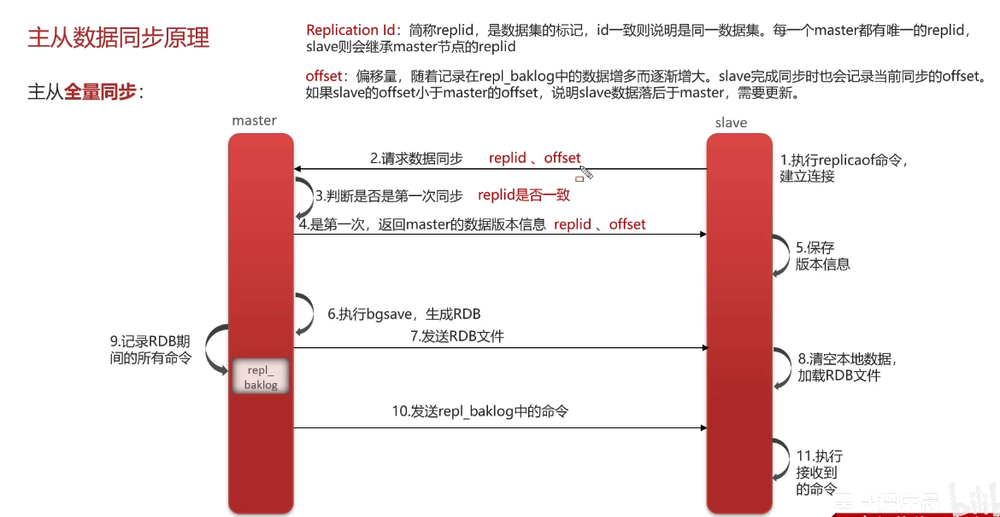

这部分内容听了和没听一样，md

简单总结，有三个大步骤：

1. 从节点发请求给主节点master，想要获取数据。主节点master判断从节点是不是第一次请求，如果不是，则全量同步。
2. 主节点master执行bgsave操作，生成RDB文件。然后把这个发给从节点Slave
3. 主节点会记录RDB期间的所有命令到repl_baklog中去，然后发送给从节点让其去执行

主从**增量同步**

两大步骤：

1. 从节点发出请求，把offset发给主节点，主节点判断是不是首次请求。
2. 主节点从repl_baklog中获取offset后的数据，然后把offset后的命令发到从节点去

问题：介绍一下redis的**主从同步**

> 单节点Redis的并发能力是有上限的，需要进一步提高Redis的并发能力，这就需要搭建主从集群，实现读写分离。
> 一般来说，都是一主多从，主节点负责写数据，从节点负责读数据

问题：说一下**主从同步数据**的流程

> 分为全量同步和增量同步
>
> **全量同步**：
>
> 1. 从节点请求主节点同步数据
> 2. 主节点判断是否是第一次请求，是第一次的话，就与从节点同步版本信息（replication id 和 offset）
> 3. 主节点执行bgsave，生成RDB文件后，发送给从节点执行
> 4. 在RDB生成执行期间，主节点会以命令的方式，记录到缓冲区（一个日志文件）
> 5. 把生成之后的命令日志文件发送给从节点进行同步
>
> **增量同步**：
>
> 1. 从节点请求主节点同步数据，主节点判断是不是第一次请求。如果不是第一次，就获取从节点的offset值
> 2. 主节点从命令日志中获取offset值之后的数据，发送给从节点进行数据同步

### 哨兵模式

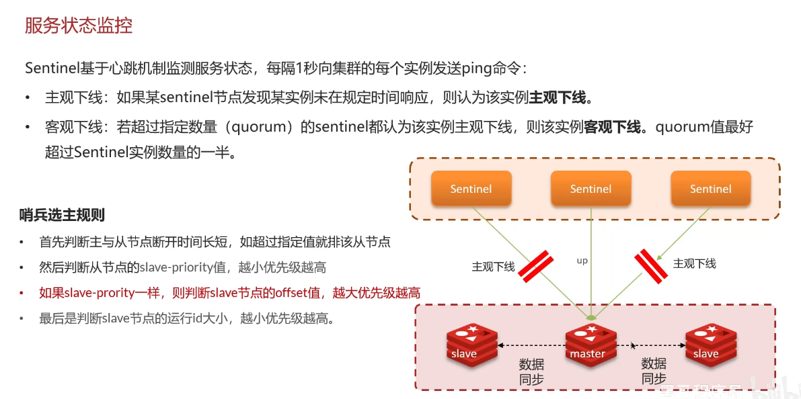

#### Redis集群（哨兵模式）脑裂

现在的问题是，主从节点位于不同的ip分区

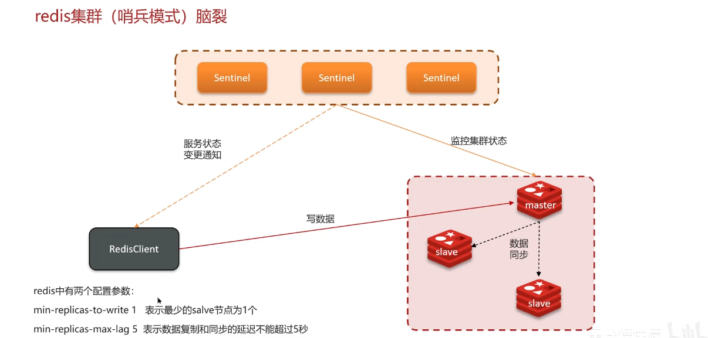

针对这个网络隔断问题的解决方案：

1. 限制主节点附属的Slave数量的最低值
2. 限制延时阈值

否则拒绝客户端请求，避免大量数据丢失

问题：怎么保证Redis的**高并发高可用**？

> 使用了哨兵模式，实现主从集群的自动故障恢复（监控、自动故障恢复、通知）

问题：你们使用Redis是单点还是集群，哪种集群？

> 主从（1主1从）+哨兵即可行，单节点不超过10G内存。如果Redis内存不足，则可以给不同服务分配独立的Redis主从节点

问题：Redis集群脑裂，该怎么解决？

> 集群脑裂是由于主节点和从节点和sentinel处于不同的网络分区，导致多个主节点的产生，数据从而不同步，导致大量数据的丢失

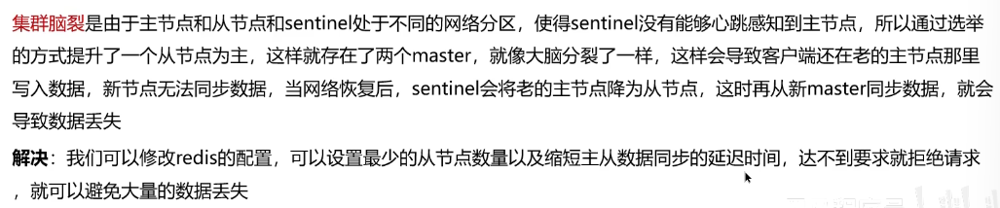

### 分片集群

分片集群特征：

- 集群都有多个master，每个master保存不同数据
- 每个master都可以有多个Slave节点
- master之间通过ping监测彼此的健康状态
- 客户端请求可以访问集群任意节点，最终都会被转发到正确节点

Redis分片集群引入**哈希槽**的概念，集群的每个节点负责一部分**Hash**槽

问题1：Redis的**分片集群**有什么作用？

- 集群中有多个master，每个master保存不同的数据
- 每个master都可以有多个Slave节点
- master之间通过ping监测彼此的健康状态
- 客户端请求可以访问集群的任意节点，最终都会被转发到正确的节点（这涉及到**路由规则**）

问题2：Redis**分片集群**中数据是怎么存储和读取的？

- Redis分片集群引入了哈希槽的概念
- 将16384个插槽分配到不同的实例
- 读写数据：根据key的有小部分计算Hash值

## Redis之单线程的细节

**问题**：Redis是单线程的，为什么这么快？

普通的回答：

>- Redis是纯内存操作，执行速度非常快
>- 采用单线程，避免不必要的上下文切换可竞争条件，多线程还要考虑线程安全问题
>- 使用 **I/O** 多路复用模型，非阻塞**IO**

**问题**：能解释一下 **I/O** 多路复用模型？

>Redis是纯内存操作，执行速度非常快。其性能瓶颈是**网络延迟**而不是执行速度，**I/O** 多路复用模型主要就是实现了**高效的网络请求**
>
>- 用户空间和内核空间
>- 常见的IO模型：阻塞IO（Blocking IO）、非阻塞IO（Nonblocking IO）、IO多路复用（IO Multiplexing）
>- Redis网络模型

### 用户空间和内核空间

- Linux系统中一个进程使用的内存情况分为两个部分：**内核空间**和**用户空间**
- **用户空间**只能执行受限的命令，而且不能直接调用系统资源，必须通过内核提供的接口来访问
- **内核空间**可以执行**特权命令**，调用一切系统资源

**Linux**系统为了提高**IO**效率，会在用户空间和内核空间都加入缓冲区

- **写数据**时，要把用户缓冲数据拷贝到内核缓冲区，然后写入设备
- **读数据**时，要从设备读取数据到内核缓冲区，然后拷贝到用户缓冲区

**影响I/O的效率**的两个主要原因：

1. 在用户空间需要数据时，需要从内核中获取。但是内核如果没有数据，就会一直搁那等，造成时间的浪费
2. 读取和写入数据时，在内核空间和用户空间来回拷贝数据，造成了性能的极大浪费

**阻塞I/O**：

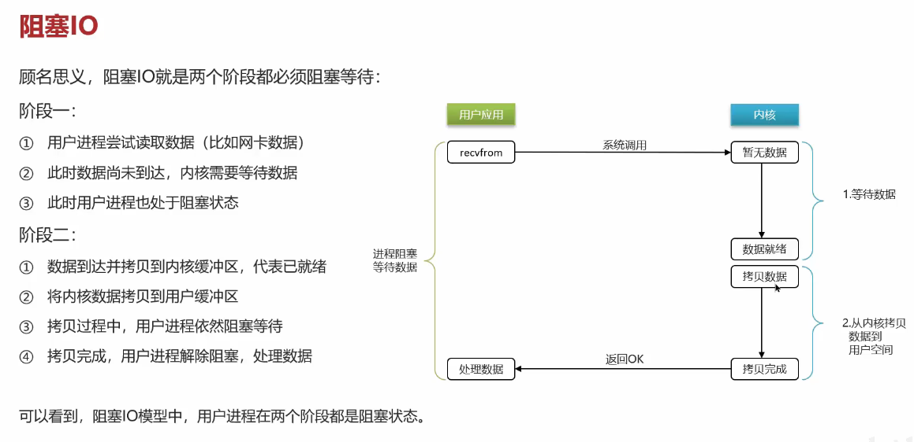

**非阻塞I/O**：

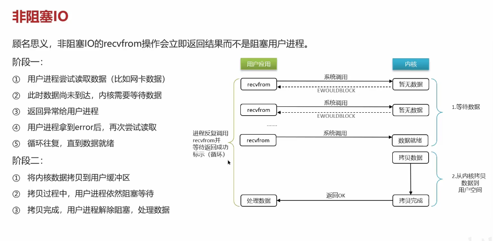

**I/O多路复用**：

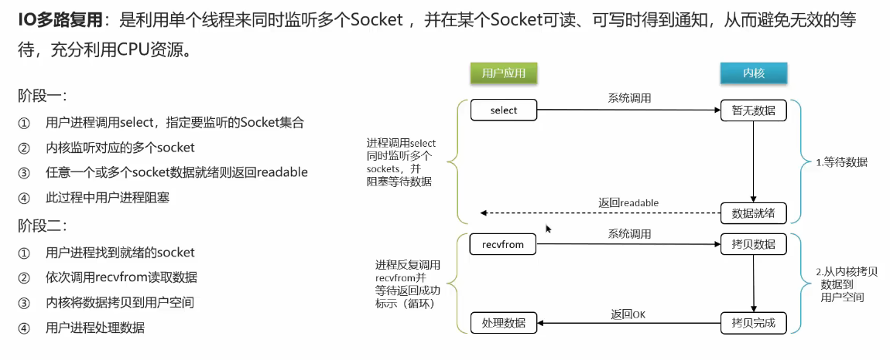

注意这句话：**利用单个线程来同时监听多个Socket**，这是和阻塞I/O、非阻塞I/O最大的差异之处，那两个本质上**用户进程**一直在那忙等

通知实现方式：

- select
- poll
- epoll

差异之处：

- select和poll只会通知用户进程有Socket就绪，但是不确定具体是哪个Socket，需要用户进程逐个遍历Socket来确认
- **epoll**则会通知用户进程Socket就绪的同时，把已经就绪的Socket写入用户空间

### Redis网络模型

Redis底层的网络模型包括：**IO多路复用** + **事件派发**

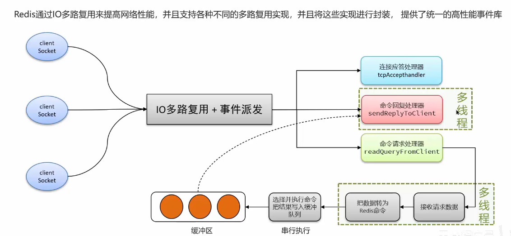

**问题**：能解释一下I/O多路复用吗？

> I/O多路复用是指利用单个线程来同时监听多个Socket，并在某个Socket可读、可写时得到通知，从而避免无效的等待，充分利用CPU资源。
> 目前的I/O多路复用都是采用**epoll**模式实现，它会在通知用户进程Socket就绪的同时，将已就绪的Socket写入用户空间，不需要挨个遍历Socket来判断是否就绪，提升了性能
>
> 关于**Redis网络模型**：
> 其采用I/O多路复用结合事件的处理器，来应对多个Socket请求
>
> - 连接应答处理器
> - 命令回复处理器（采用多线程来处理回复事件）
> - 命令请求处理器（命令的转换使用了多线程，增加命令转换速度）。但是在命令执行的时候，仍然是单线程
