# 并发编程

## 多线程

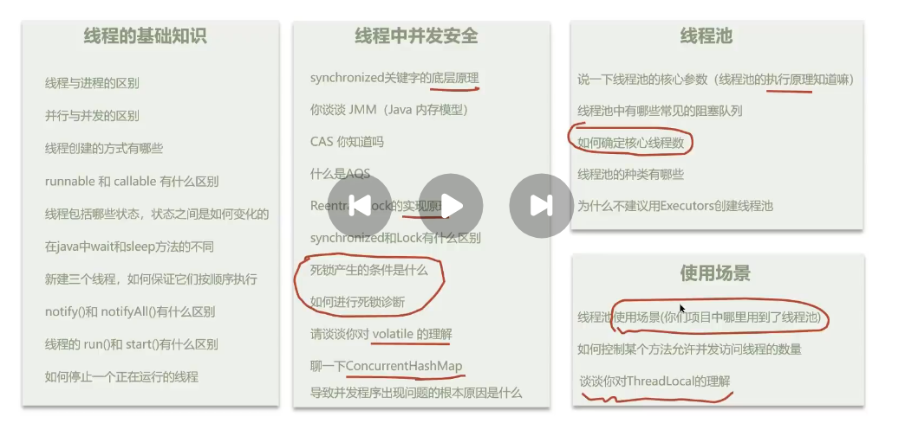

- 线程基础
- 并发安全
- 线程池
- 使用场景题

## 线程基础知识部分

问题：线程和进程的区别？

程序：指令+数据
进程的作用：加载指令、管理内存、管理IO

**当一个程序被运行，从磁盘加载这个程序的代码至内存**，这时候就开启了一个进程

而对于**线程**：

一个线程就是一个指令流，将指令流中的一条条指令按照一定的顺序给CPU执行
**一个进程**之内可以分为**一个到多个线程**


注意这几个关键词：**内存空间**、**切换成本**

问题：**并行和并发的区别？**

单核CPU下，**线程实际上还是串行化执行的**
也就是说：微观上串行，宏观上并行
一般来说，**这种线程轮流使用CPU的方式称为并发**

而对于**多核CPU**而言：

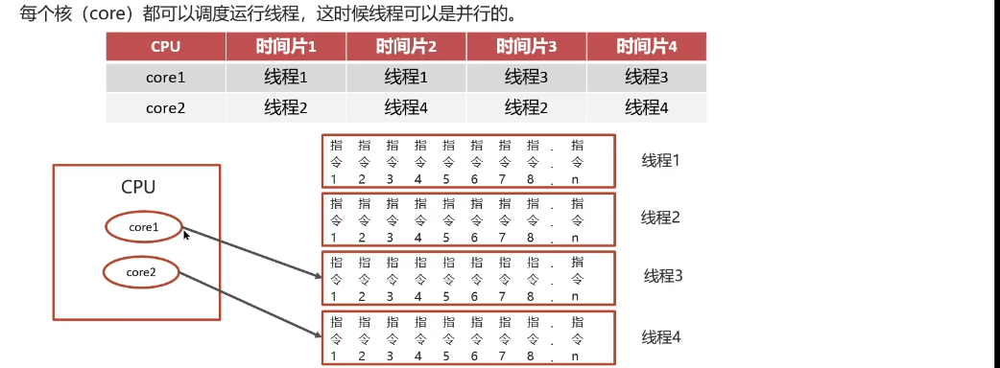

于是：

> 并发是同一时间应对多件事情的能力（前后依次做）
> 并行是同一时间动手做多件事情的能力（同一时刻展开，多线作战）

### 创建线程的方式有哪些？

- 继承Thread类
- 实现runnable接口
- 实现Callable接口
- **线程池**创建线程

#### 继承Thread类

```java
public class MyThread extends Thread {
    @Override
    public void run() {

    }
    public static void main(String[] args) {
        t1.start();
    }
}
```

#### 继承runnable接口

这边是把Runnable接口进行implements实现

#### 实现Callbale接口

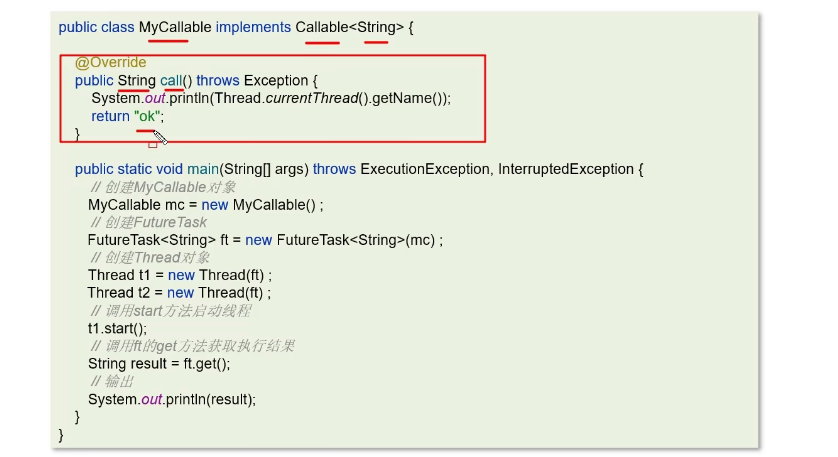

#### 线程池创建线程

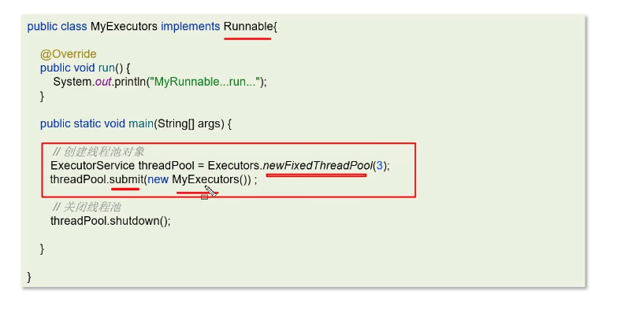

问题：**Runnable和callable有什么区别？**

回答如下：

> 1. Runnable 接口 run 方法没有返回值
> 2. Callable 接口 call 方法有返回值，是个泛型；
> 3. Callable 接口的call() 方法允许抛出异常，而 Runnable 接口的 run() 方法的异常只能在内部消化，不能继续向上抛出

问题：run()和start()的区别？

回答如下：

> run()可以开启多次，而start()只能被调用一次，因为其是用来启动一次的，并且调用了run方法执行封装了的功能

### 线程包含的状态以及转换方式

```java
public enum State {
    New,
    RUNNABLE,
    BLOCKED,
    WAITING,
    TIMED_WAITING,
    TERMINATED
}
```

这边线程的状态中，**就绪**+**运行**组成了**可执行**（RUNNABLE）状态

如下这张状态转换图很清晰：

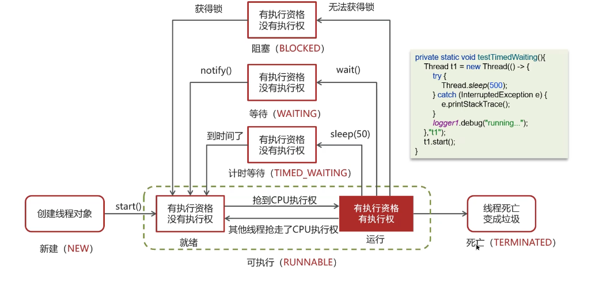

问题一：线程包含哪些状态？

> 回答如下：
> New 新建
> RUNNABLE 可运行
> BLOCKED 阻塞
> WAITING 等待
> TIMED_WAITING 时间等待（出现这种状态一般是线程调了个sleep(50)之类的方法）
> TERMINATED 终止（执行完了线程，over！！！）

问题二：线程状态之间是如何变化的？

tips：重点结合上面那张图进行理解。

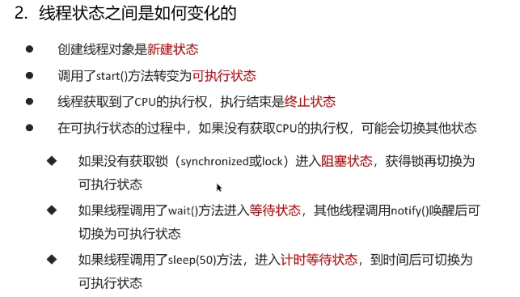

### 线程按顺序执行

可以使用线程中的join方法解决

join() 等待线程运行结束

> 但这边其实还有很多别的办法，详见leetcode 1115

对于 t.join()， 其实是阻塞调用此方法的线程进入time_waiting，直到线程t执行完毕后，再运行当前线程

### notify() & notifyAll()

- notifyAll： 唤醒所有wait的线程
- notify：只随机唤醒一个wait线程

### wait & sleep

共同点：

wait(), wait(long), sleep(long) 的效果都是让当前线程暂时放弃CPU的使用权，进入阻塞状态

不同点：

方法归属不同

- sleep(long) 是 Thread 的静态方法
- wait(), wait(long) 是Object的成员方法，每个对象都有

醒来时机不同

- wait(long)和wait()会被notify唤醒，wait()如果不唤醒就一直等待

锁特性不同

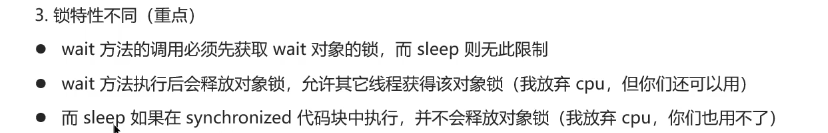

### 如何停止一个正在运行的线程？

- 使用退出标志，使得线程正常退出，也就是run方法完成后，线程终止（比如加个volatile）
- 使用stop方法强行终止（但这个办法已经作废了）
- 调用interrupt方法中断线程
  - 打断阻塞的线程（sleep， wait， join），线程会抛出InterruptedException的异常
  - 打断正常的线程，可以根据打断状态来标记是否退出线程

## 线程中并发安全

### 关于synchronized关键字的底层原理

底层是**Monitor**

#### 关于Monitor

Monitor，即**监视器**，由JVM提供，c++实现

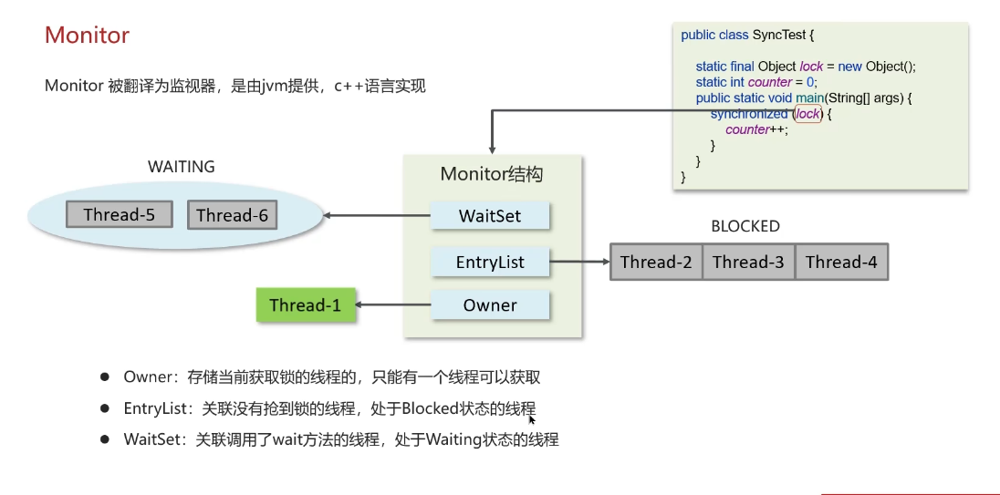

问题：**synchronized**关键字的底层原理？

回答如下：

> - Synchronized（对象锁）采用互斥的方式，让同一时刻最多只有一个线程能持有**对象锁**
> - 其底层由Monitor实现，Monitor是JVM级别的对象（C++）实现，线程获得锁需要使用对象（锁）关联Monitor
> - 在Monitor内部有三个属性：owner、entryList、waitSet
> - 其中：owner是关联的获得锁的线程，并且只能关联一个线程；entryList关联的是出于阻塞状态的线程；waitSet关联的是出于Waiting状态的线程

### synchronized底层进阶

Monitor实现的锁是重量级锁，而这带来了一个话题，也就是**锁升级**

- Monitor实现的锁属于**重量级锁**，其中涉及到了用户态和内核态的切换，进程上下文的切换。成本高、性价比低
- 在jdk1.6引入了两种新型锁机制：**偏向锁**和**轻量级锁**，其引入是为了解决在没有多线程竞争或者基本没有竞争的场景下，使用传统锁机制带来的性能开销问题

#### 对象的内存结构

采用了MarkWord的内存结构

由于每个**java对象**都可以关联一个**Monitor对象**，如果使用synchronized把对象上锁（重量级）之后，该对象头的mark word中，就设定了指向 Monitor 对象的指针

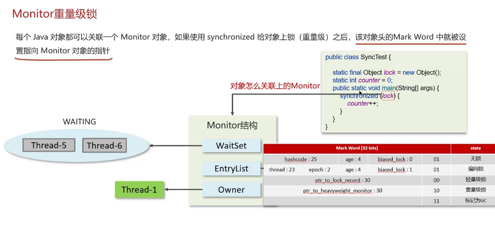

关于**Monitor重量级锁**：

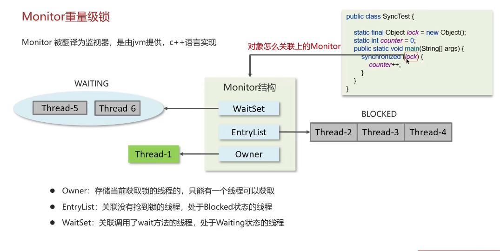

关于**轻量级锁**：

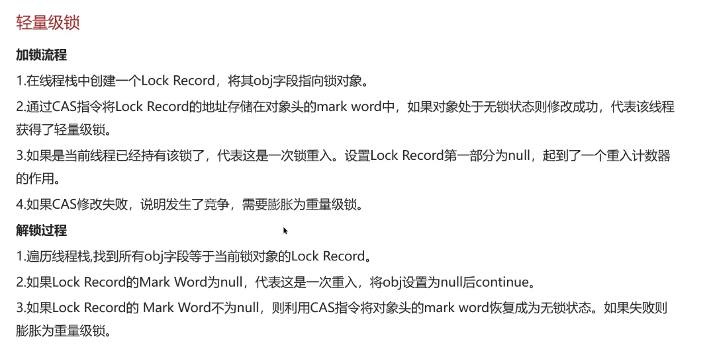

关于**偏向锁**：

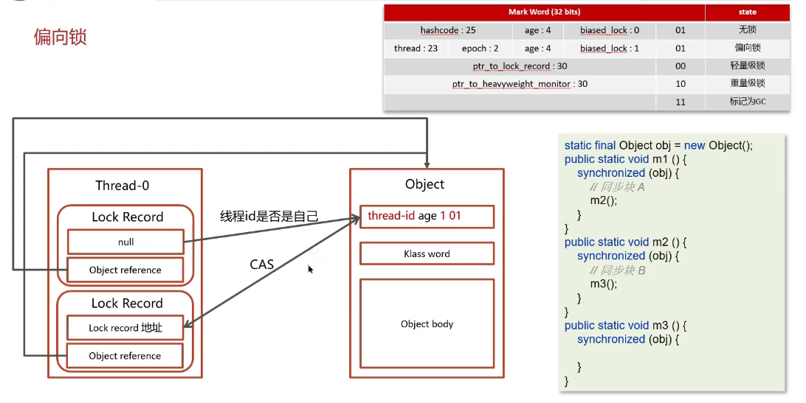

问题：Monitor实现的锁是重量级锁，你了解锁升级吗？

回答如下：

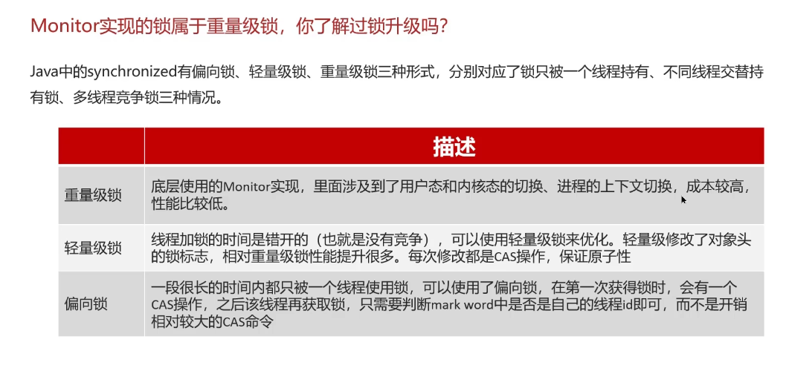

### 关于Java内存模型（JMM）

- JMM(Java Memory Model) Java内存模型，定义了**共享内存**中**多线程程序读写操作**的行为规范，通过这些规则来规范对内存的读写操作，从而保证指令的正确性
- JMM将内存分为两块，一块是**私有线程**的工作区域（**工作内存**），另一块是所有线程的共享区域（**主内存**）
- 线程和线程之间是相互隔离，线程跟线程交互需要通过主内存

### CAS

这个还是非常重要的

全称：Compare And Swap（比较再交换）

体现的是**乐观锁**的思想，在**无锁**情况下，保证线程操作**共享数据的原子性**

提到了**自旋锁**

问题：CAS相关？

- CAS全称是 Compare And Swap；其体现了一种**乐观锁**的思想，在无锁状态下，保证**线程操作数据**的原子性
- CAS使用的地方很多，比如AQS框架，再比如AtomicXX类
- 在操作共享变量时采用的自旋锁，效率很高
- CAS底层调用的是Unsafe类中的方法，都是操作系统提供的，由其他语言实现

问题：**关于乐观锁和悲观锁的区别？**

回答如下：

- CAS 是基于**乐观锁**的实现：不断重试，不怕别的线程来修改共享变量
- synchronized 是基于**悲观锁**的思想：最悲观的估计，得防备其他线程来修改共享变量

### volatile

- 保证了线程间的可见性
- 禁止指令进行重排序
  - 底层实现原理：添加了一个**内存屏障**，通过插入内存屏障禁止在内存屏障的**前后指令**执行重排序优化

### AQS

AQS全称：AbstractQueuedSynchronizer

这个是阻塞式锁和相关的同步器工具的框架

AQS是**悲观锁**，手动开启和关闭

AQS 常见的实现类：

- ReentrantLock 阻塞式锁
- Semaphore 信号量
- CountDownLatch 倒计时锁

#### AQS的工作机制

- AQS中维护的一个使用volatile修饰的State属性，来表示资源的状态
- 提供基于FIFO的等待队列，类似**Monitor**的**EntryList**
- 条件变量来实现**等待、唤醒**机制，支持多个条件变量，类似Monitor中的WaitSet

多个线程进行争抢资源时，为了保证原子性，需要使用**CAS**提供的自旋锁。确保只有一个线程修改成功，而修改失败的线程会进入FIFO队列中进行等待

#### AQS锁的公平性？

- 如果新来的线程与队列中的线程共同争抢资源，那么就是非公平锁
- 如果新来的线程在队列中等待，而只让队头的head线程获取锁，那么就是公平锁

典型的AQS实现类，ReentrantLock，就是非公平锁

### ReentrantLock

ReentrantLock，意思即是**可重入锁**

相较于Synchronized，其具有以下特点：

- 可中断
- 可以设置超时时间
- 可以设置公平锁
- 支持多个条件变量
- 与Synchronized一样，都支持重入

#### 实现原理

ReentrantLock主要利用**CAS+AQS**队列实现，支持**公平锁+非公平锁**

工作流程是：
线程抢锁+判断State状态+判断exclusiveOwnerThread是否为null+公平/非公平锁

### Synchronized和Lock的区别

- 语法层面：  
  - Synchronized是关键词
  - Lock是接口，用Java实现，需要手动调用unlock方法释放锁

- 功能层面
  - 两者均是悲观锁，都具备最基本的互斥、同步、锁重入等功能
  - Lock提供了许多Synchronized无法实现的功能

- 性能层面
  - 没有竞争时，Synchronized性能不错，其优化包括偏向锁、轻量级锁
  - 竞争激烈时，Lock的实现会提供更好的性能

### 死锁产生的条件

死锁：一个线程同时需要获取多把锁，此时就非常容易产生死锁

比如x, y线程互相需要获取A、B对象的锁，但是其各自占据B、A对象

### 怎么诊断死锁？

可以使用jps查看当前java程序运行的进程id

然后通过jstack查看当前这个进程id，即可发现死锁的问题

### ConcurrentHashMap

这是一种**线程安全**的高效Map集合

底层的数据结构

- jdk1.7：底层是分段的数组+链表
- jdk1.8 采用的数据结构和HashMap1.8的结构一致，数组+链表/红黑树

在jdk1.8中，采用了 CAS + Synchronized 来保证并发安全的实现

- CAS 控制数组节点的添加
- Synchronized 只锁定当前链表或者红黑树的首节点，只要Hash不冲突，就不会产生并发的问题

### 导致并发程序出现问题的根本原因

java并发编程的三大特性：

- 原子性
- 可见性
- 有序性

#### 原子性

一个线程在CPU中的执行，是不可暂停或者中断的；所以这就带来了原子性问题

#### 可见性

所谓的**内存可见性**：让一个线程对共享变量的修改对另一个线程可见

#### 有序性

处理器为了提高程序的运行效率，会对输入代码进行优化，导致执行语句不一致。
但是某些情况下，我们需要使得指令按照特定的顺序执行，由此，我们可以使用volatile关键字来禁止指令重排

## 线程池

### 线程池的核心参数 | 线程池的执行原理

```java
public ThreadPoolExecutor(
    int corePoolSize,
    int maximumPoolSize,
    long keepAliveTime,
    TimeUnit unit, 
    BlockingQueue<Runnable> workQueue, 
    ThraedFactory threadFactory, 
    REjectedExecutionHandler handler
)
```

> md这个东西必须记住，之前第一次面一上来就是这个问题，答的一塌糊涂

这几个参数一一分析过去：

- **corePoolSize** 核心线程数量
- **maximumPoolSize** 最大线程数目 = （核心线程+救急线程的最大数目）
- keepAliveTime 生存时间 - 救急线程的生存时间，生存时间内没有新任务，此线程资源会释放
- unit 时间单位
- **workQueue**：当没有空闲核心线程时，新来任务会加入到此队列进行排队，队列满时，会创建救急线程执行任务
- ThreadFactory：线程工厂。 可以定制线程对象的创建
- handler：拒绝策略，当所有的线程都在繁忙，workQueue也放满时，会触发拒绝策略

注意，如果阻塞队列没满，就会先把因为核心进程满了而多余出来的任务放到阻塞队列里去；如果阻塞队列已满，需要判断线程数（临时线程+核心线程）是否小于最大线程数

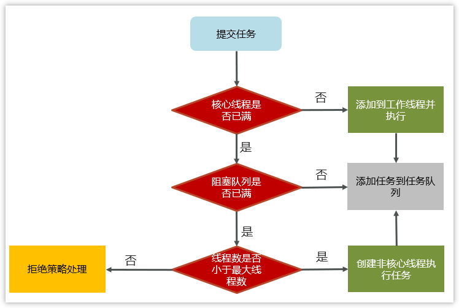

拒绝策略：

- AbortPolicy：直接抛出异常，这是**默认策略**
- CallerRunsPolicy：用调用者所在的线程来执行任务
- DiscardOldestPolicy：丢弃阻塞队列中最靠前的任务，并执行当前任务；
- DiscardPolicy：直接丢弃任务

### 线程池中的常见阻塞队列

workQueue：当没有空闲核心进程时，新来的任务会加入到该队列排队。队列满时，会创建救急线程来执行任务。

- ArrayBlockingQueue 基于数组结构的有界阻塞队列
- LinkedBlockingQueue 基于链表结构的有界阻塞队列
- DelayedWorkQueue 优先级队列
- SynchronousQueue：不存储元素的阻塞队列

**ArrayBlockingQueue**使用一把锁来控制对**队列**的访问，意味着读写操作是互斥的；
**LinkedBlockingQueue**使用两把锁，一把控制度，另一把控制写，这样可以提高并发性能

### 关于核心线程数的确定

令$N = $计算机CPU的核数

- IO密集型任务：核心线程数 = $2 \times N + 1$
- CPU密集型任务：核心线程数 = $N + 1$

### 关于线程池的种类

在JUC中提供了大量创建**线程池**的静态方法，常见的如下：

- 创建使用固定线程数的线程池：也就是说 corePoolSize = maximunPoolSize
  - 没有救急线程
  - 阻塞队列是LinkedBlockingQueue，最大容量是Integer.MAX_VALUE
- 单线程化的线程池
  - 也就是说，它只会用唯一的工作线程来执行任务，保证所有任务都按照指定顺序（**FIFO**）执行
  - corePoolSize = maximunPoolSize = 1
  - 阻塞队列是LinkedBlockingQueue
  - 适用于按顺序执行的任务
- 可缓存线程池
  - 核心线程数 = 0
  - 最大线程数是INT_MAX
  - 阻塞队列为SynchronousQueue：这个阻塞队列不存储元素，而是每个插入操作都必须等待一个移除操作
  - 适用于任务数量很密集，但是每个人物执行时间很短的情形
- 提供“延迟”和“周期执行”功能的ThreadPoolExecutor
  - 适用于有**定时**和**延迟执行**的任务

### 为什么不采用Executors去创建线程池？

这是因为其请求队列workQueue的最大长度是INT_MAX，这会导致堆积大量的请求，最终导致OOM（内存溢出）

所以一般用ThreadPoolExecutor去创建线程池，从而指定线程池的参数，避免资源被耗尽

### 如何控制某个方法允许并发访问线程的数量？

jdk中提供了一个Semaphore类，其提供了两个方法。
semaphore.acquire()表示请求信号量，可以限制线程的个数。
semaphore.release()代表释放一个信号量

## ThreadLocal

ThreadLocal是多线程中，为了解决线程安全的一个操作类，其为每个线程都分配了一个独立的线程副本，从而解决了变量并发访问冲突的问题。

**ThreadLocal**同时实现了**线程内**的资源共享
（此处的资源共享指的是同一个线程内，多个方法或者组件可以共享同一个变量副本）

ThreadLocal本质上说，是一个线程内部存储类，从而让多个线程只操作自己内部的值，从而实现自身线程数据隔离

ThreadLocal有一个内部类叫做ThreadLocalMap，类似于HashMap

ThreadLocalMap中有一个属性Table数组，这个才是真正存储数据的位置

### ThreadLocal之内存泄漏问题

java对象中，四种引用类型：
强引用、软引用、弱引用
、虚引用

## 关于分布式锁

Java中的**分布式锁**（Distributed Lock）主要是为了解决在分布式系统下，多个独立的**Java虚拟机**（JVM）进程或者多个服务器节点之间，对**共享资源**进行访问控制和同步的问题

使用 **Redis** 实现分布式锁，是当前最常见而且高性能的方案之一。

### 基于 Redis 的分布式锁

在分布式系统中，多个服务实例（比如说部署在不同服务器上面的多个订单服务），可能会同时尝试修改同一个共享资源（比如说数据库里面的一条库存记录）。这个时候，为了保证数据的**一致性和正确性**，我们需要一种机制来确保**在任意时刻**，**只有一个进程**可以操作这个共享资源。

而分布式锁，就是实现这种**跨JVM**互斥访问的机制

### Redis实现的核心思想

Redis具有天然的**原子性操作**，使得其非常适合作为**锁**服务，最基础的实现思路是利用 **Redis** 的 **SET** 命令，以及其参数，去实现 **互斥** 和 **超时释放**

一个**严谨的**基于Redis的分布式锁的**加锁和解锁**的流程，通常包括以下这三个步骤：

1. **加锁**（Acquire Lock）：使用一个**原子命令**（比如 **SET KEY unique_value EX expire_time NX**）
2. **操作共享资源**：只有加锁成功的进程才能执行业务逻辑
3. **释放锁**（Release Lock）：为了保证**释放锁**的**安全性和原子性**，必须使用**Lua脚本**。关于Lua脚本的逻辑：先检查存储在KEY中的**unique_value**是否与当前客户端持有的值相同（以证明锁是自己加的），再删除KEY

- 为什么必须要用 **Lua** 脚本？

> 如果不用lua脚本，而是先GET检查，再DEL删除，这两个步骤之间如果发生网络延迟或者线程切换，锁可能过期并且被其他线程持有，导致当前进程误删了**别人的锁**，造成并发问题。**Lua**脚本保证了**检查和删除**的原子执行！

### 关于Redisson框架

一般来说，我们不会自己去写那些Redis命令和Lua脚本，而是使用成熟的**客户端框架**，最常用的是**Redisson**

关于Redisson的底层实现机制，其采用了**看门狗**机制去解决**锁提前过期**问题

- **看门狗机制**：如果进程成功加锁，但是没有设置一个**特定的锁释放时间**（LeaseTime），Redisson会启动一个**守护线程**。这个线程会每隔一段时间默认是过期时间的1/3），去**自动检查锁是否还被持有**。如果是，那么自动续期（去延长过期时间），直到锁被正式释放，这大大提高了锁的可靠性。

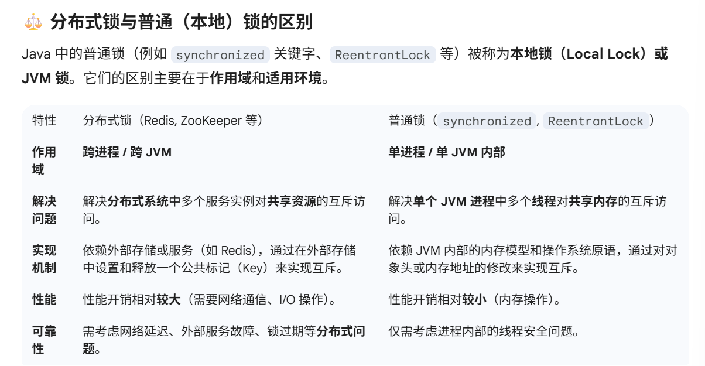
