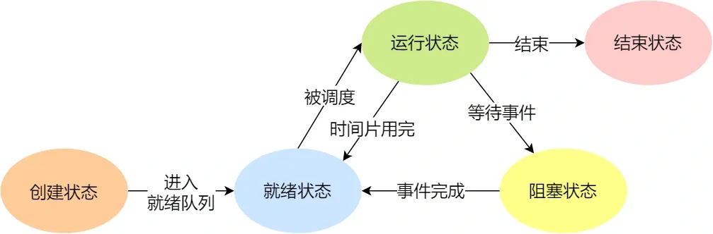
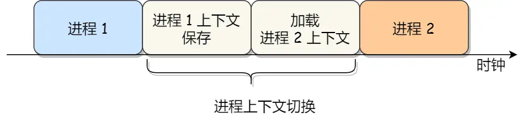
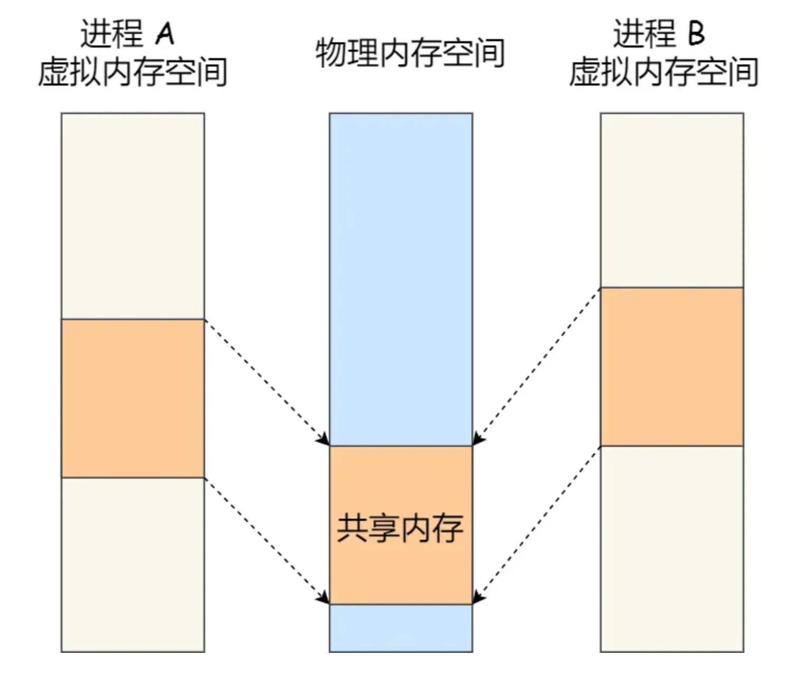
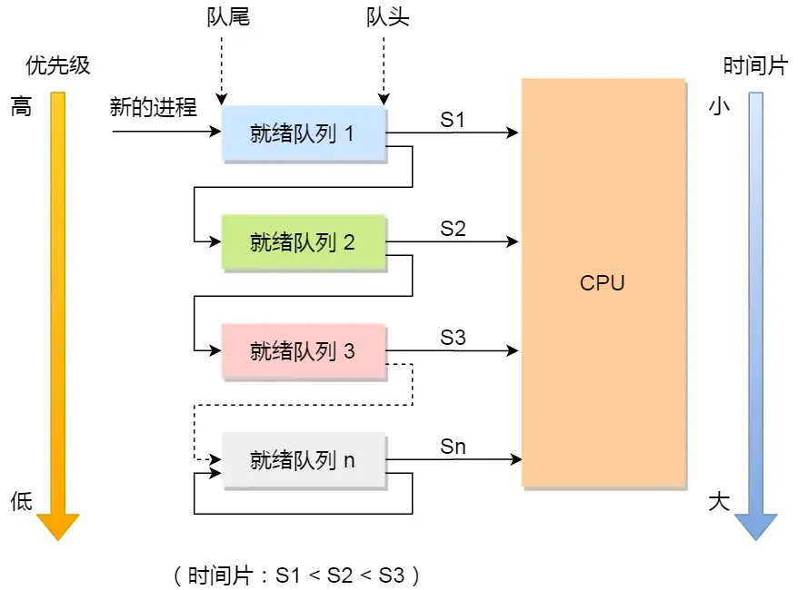

# OperatingSystem Learning Notes

## 用户态和内核态

### 两者区别

**内核态**和**用户态**是操作系统中的两种运行模式，其主要区别在于**权限**和**可以执行的操作**

- 内核态（Kernel Mode）：在内核态下，CPU可以访问**所有的指令**和**所有的硬件资源**
- 用户态（User Mode）：在用户态下，CPU只能执行部分指令集，无法直接访问硬件资源。

内核态的**底层操作**主要包括：**内存管理**、**进程管理**、**设备驱动程序控制**、**系统调用**等等

分为内核态和用户态，是出于安全性、稳定性、隔离性而考虑的

## 进程管理

### 线程和进程的区别

- 本质区别：进程是操作系统资源分配的最小单位，而线程是任务调度和执行的最小单位

一个进程通常包括如下几个内存区域：

- 代码段：存储进程执行的机器指令
- 数据段：存储全局变量和静态变量
- 堆空间：用于动态内存分配（例如 C/C++ 中的 malloc/new）
- 栈空间：用于存储局部变量、函数参数和函数调用返回地址

共享部分：

- 代码段、数据段和堆空间是同一个进程内所有线程**共享**的
  - 这意味着一个**线程**可以访问和修改**另一个线程**创建的全局变量或者在堆上分配的内存。这也是在多线程编程中，要使用**同步机制**（比如互斥锁/信号量）去防止数据竞争的原因

非共享/私有部分：

- 栈空间：每个线程都有自己**独立且私有**的栈空间（也叫做**调用栈**）
  - 这是为了保证每个**线程**的函数调用、局部变量和返回地址不会相互干扰

### 关于协程

协程是一种**用户态的轻量级线程**，其调度完全由**用户程序**控制，而不需要内核的参与。

**协程**拥有自己的寄存器上下文和栈，但是和其他协程共享堆内存。协程的切换开销非常小，因此只需要保存和回复协程的上下文，而不需要进行内核级的上下文切换。

由此，协程在大量处理并发任务时，具有非常高的效率。

### 为什么进程的崩溃不会对其他进程产生很大影响

- 进程隔离性：每个进程都有自己独立的内存空间，一个进程崩溃后，其内存空间会被OS回收，不会影响其他进程的内存空间。
- 进程独立性：每个进程都是独立运行的，其之间不会共享资源，比如说文件、网络连接等。

### 进程五种状态的切换

### 进程上下文

各个进程之间是**共享CPU资源**的，在不同的时候，进程之间需要进行切换。让不同的进程可以在CPU上执行，这个**一个进程切换到另一个进程运行，称为进程的上下文切换**

操作系统需要先帮CPU设置好**CPU寄存器和程序计数器**

CPU寄存器和程序计数器是CPU在运行任何任务之前，必须依赖的环境。这些环境，就叫做**CPU上下文**

**CPU上下文切换**就是将前一个任务的CPU上下文（CPU寄存器和程序计数器）保存起来，然后加载新任务的上下文到这些寄存器和程序计数器。最后跳转到程序计数器所指向的新的位置，运行新的任务。

上面提到的**任务**，主要包含**进程、线程和中断**。

由此，可以根据任务的不同，将CPU上下文分为：

- **进程**上下文切换
- **线程**上下文切换
- **中断**上下文切换

### 进程上下文切换

进程是由**内核管理和调度**的，所以进程的切换只能发生在内核态。

进程的**上下文切换**，不仅包括了虚拟内存、栈、全局变量等用户空间的资源，还包括了**内核堆栈、寄存器**等内核空间的资源

### 进程间通讯方式

**Linux内核**提供了不少进程间通信的方式：

- **管道**
- 消息队列
- 共享内存
- 信号
- 信号量
- socket

#### 管道

Linux内核对于进程间通信，最简单的方式是**管道**

**匿名**管道：通信的数据是**无格式的流并且大小受限**，通信方式**单向**。如果要双向通信，需要创建**两个管道**。同时，匿名管道式只能用于存在父子关系的进程间通信。

**命名**管道：其可以在毫无关系的进程间通信，通过一个类型为p的设备文件。同时，通信数据遵循**先进先出**原则，不支持 **lseek** 之类的文件定位操作。

#### 消息队列

**消息队列**克服了管道通信的数据是无格式的字节流的问题，消息队列实际上是保存在**内核**的**消息链表**。同时，消息队列的速度不是及时的，因为**每次数据的写入和读取都需要进过用户态和内核态之间的拷贝过程**

#### 共享内存

**共享内存**可以解决消息队列通信中用户态和内核态之间数据拷贝带来的开销，其**直接分配一个共享空间，每个进程都可以访问**

共享内存有**最快**的进程间通信方式之名，**但是带来了新的问题，多线程竞争同个共享资源会造成数据的错乱。**

#### 信号量

通过信号量来保护**共享资源**，确保共同时刻，**只有一个进程**能访问共享资源，其就是**互斥访问**

信号量不仅可以实现访问的互斥性，还可以实现进程间的同步。信号量实际上是计数器，表示的是资源个数。可以通过 P 操作和 V 操作这两个原子操作解决。

#### 信号

注意：**信号和信号量不是同一个东西！！！**

信号是**异步通信机制**，信号可以在应用进程和内核之间直接交互，内核也可以利用信号来通知**用户空间**的进程发生了哪些**系统事件**。

一般来讲，信号事件的来源主要有**硬件来源**和**软件来源**，一旦有信号发生，进程有三种方式响应信号：

1. 执行默认操作
2. 捕捉信号
3. 忽略信号

#### Socket

之前上面所说的通信机制，都是工作于同一台主机。如果说要与不同主机之间的进程通信，那么就需要 **Socket** 通信。

Socket 实际上不仅用于不同的主机进程间通信，还可以用于本地主机进程间通信。

可以根据 **Socket** 类型的不同，分为三种常见的通信方式：

- 基于 **TCP** 协议的通信方式
- 基于 **UDP** 协议的通信方式
- 本地进程间通信方式

### 共享内存的实现方式

共享内存的机制：拿出一块虚拟地址空间来，然后**映射到相同的物理内存中去**

### 线程间通讯方式

- 互斥锁
- 读写锁
- 条件变量
- 自旋锁
- 信号量

注意此处是针对**线程**间

### 进程调度算法

- **先来先服务**调度算法
- **最短作业优先**调度算法
- **高响应比优先**调度算法

> 响应比优先级 = $\frac{等待时间 + 要求服务时间}{要求服务时间}$

- **时间片轮转**调度算法

> 这是**最古老、最公平、最简单并且使用最广**的算法
> 每个进程会被分配一个时间段，称为时间片，允许该进程在该时间段中运行
>
> 时间片的长度是关键之处
>
> - 时间片设的果断，会导致过多的**进程上下文切换**
> - 时间片设置的过长，会导致对短作业进程的响应时间边长

- **最高优先级**调度算法

- **多级反馈队列**调度算法

> - 多级：表示有多个队列，每个队列优先级从高到低，同时优先级越高，时间片越短
> - 反馈：如果有新的进程加入到优先级高的队列时，立即停止当前正在运行的进程，转而去运行优先级更高的队列

