# 框架篇

这部分内容主要围绕**Spring**和**MyBatis**展开


## 关于Spring

问题：**Spring框架中的单例bean是线程安全的吗？**

首先要明确，Spring框架中的bean是默认单例的

- singleton：bean在每个Spring IOC容器中，只有一个实例
- prototype：一个bean的定义可以有多个实例

注意！这个单例bean**不是线程安全的**！！！

回答如下：

> 不是线程安全的，Spring框架中有个@Scope注解，默认值是singleton，即单例
> 由于**一般情况下，在Spring的bean中注入的都是无状态的对象**，所以**没有线程安全问题**；但是！如果在bean中定义了**可修改的成员变量**，就需要考虑线程安全问题，可以用多例或者加锁解决该问题

### 关于AOP

AOP：即**面向切面编程**

常见的AOP使用场景：

- 记录操作日志
- 缓存处理
- Spring中内置的事务处理

问题：**什么是AOP？**

回答：

> AOP是面向切面编程，用于将那些与业务无关，但是对多个对象产生影响的公共行为和逻辑进行抽取公共模块，从而复用并且降低耦合

问题：**项目中使用到AOP的地方？**

回答：

> 记录操作日志、缓存、Spring实现的事务
>
> 核心：使用AOP中的**环绕通知**和**切点表达式**（找到那个要记录日志的方法），通过环绕通知的参数来获取请求方法的参数。获取到参数之后，保存到数据库

问题：**Spring的事务是如何实现的？**

回答：

> 其本质是通过AOP功能，对方法前后进行拦截。在执行方法之前开启事务，在执行完目标方法之后，根据执行情况**提交或者回滚事务**

### Spring之事务失效

问题：**Spring中事务失效的场景有哪些？**

回答如下：

> 1. 对于异常捕获处理，自己处理了异常，没有抛出；解决：把异常手动抛出
> 2. 抛出检查异常，配置**rollbackFor**的属性为Exception
> 3. 非public方法导致的**事务失效**，这个把它改成public就行了

- 异常捕获处理
- 抛出检查异常
- 非public方法

情况一：异常捕获处理：

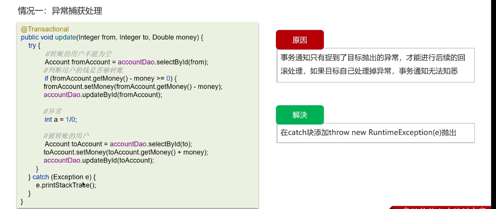

情况二：抛出检查异常

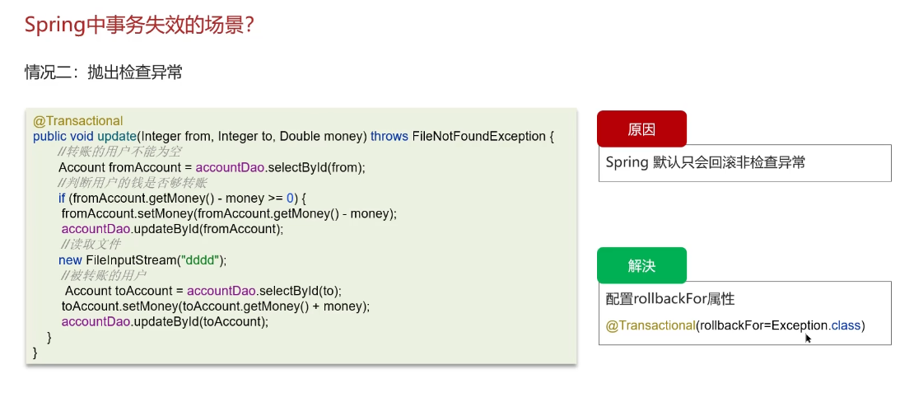

```java
@Transactional(rollbackFor = Exception.class)
```

情况三：非**public**方法导致的事务失效

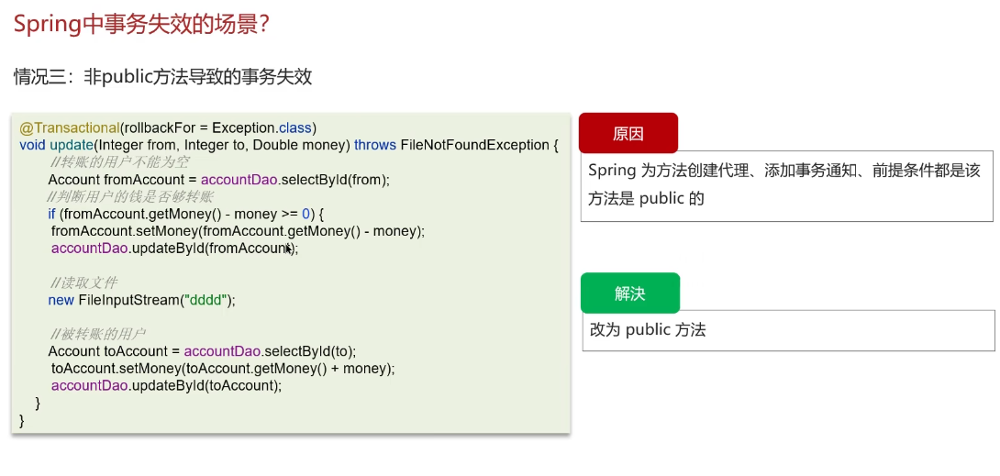

### Spring之bean的生命周期

问题：**Spring的bean的生命周期？**

回答如下：

> 1. 通过BeanDefinition获取Bean的定义信息
> 2. 调用构造函数实例化Bean
> 3. Bean的依赖注入
> 4. 处理Aware接口（这仨接口：BeanNameAware、BeanFactoryAware、ApplicationContextAware）
> 5. Bean的后置处理器BeanPostProcessor-前置
> 6. 初始化方法（InitializingBean、init-method）
> 7. Bean的后置处理器BeanPostProcessor-后置
> 8. 销毁Bean

**BeanDefinition**：

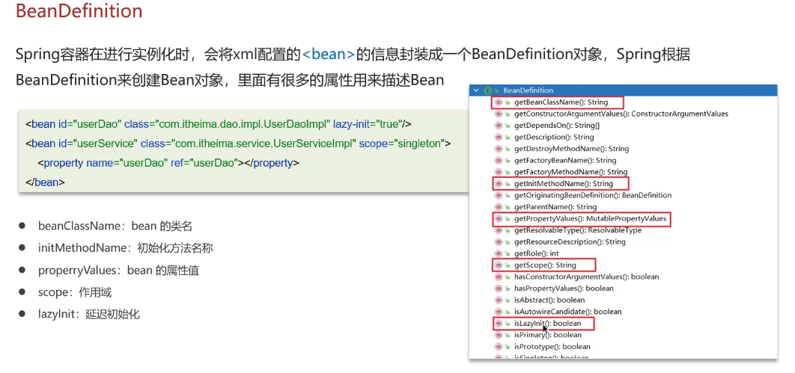

注意，**Bean的创建和初始化赋值是分开的**

Bean的**生命周期**如下！

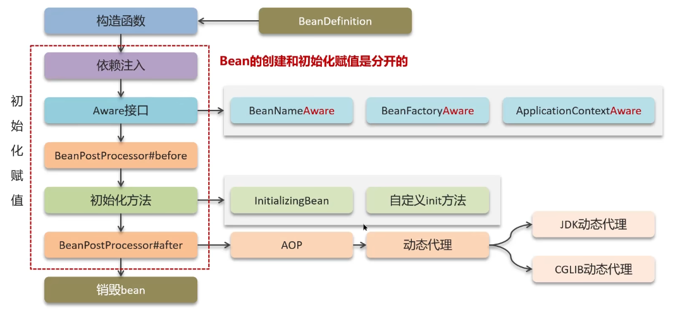

如果要对Bean进行增强，需要使用**BeanPostProcessor**

### Spring中的循环引用

简单的举例，就是两个Bean对象实例化和初始化的过程中，属性值互相依赖到对方的存在，但是这个时候对方还不存在，所以得创建对方，结果就产生了死循环。

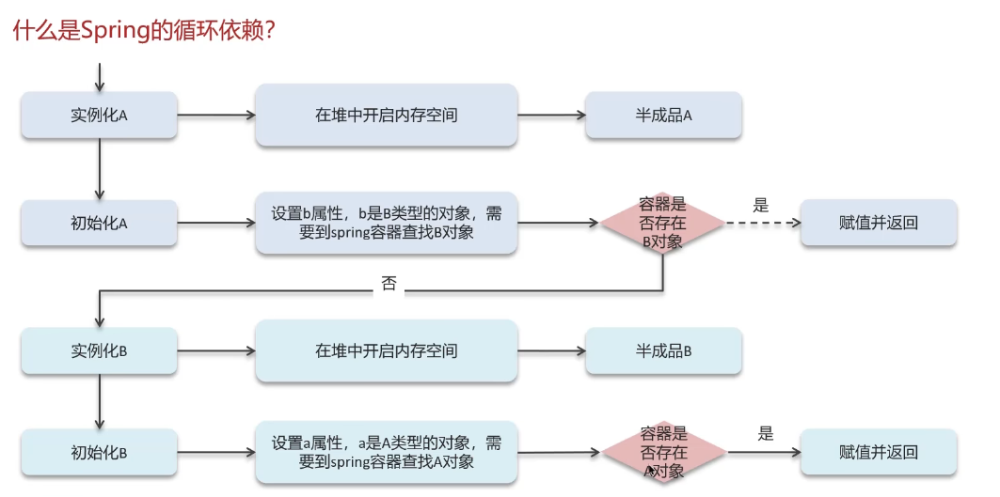

怎么解决这个问题呢？应当采用**三级缓存解决循环依赖**

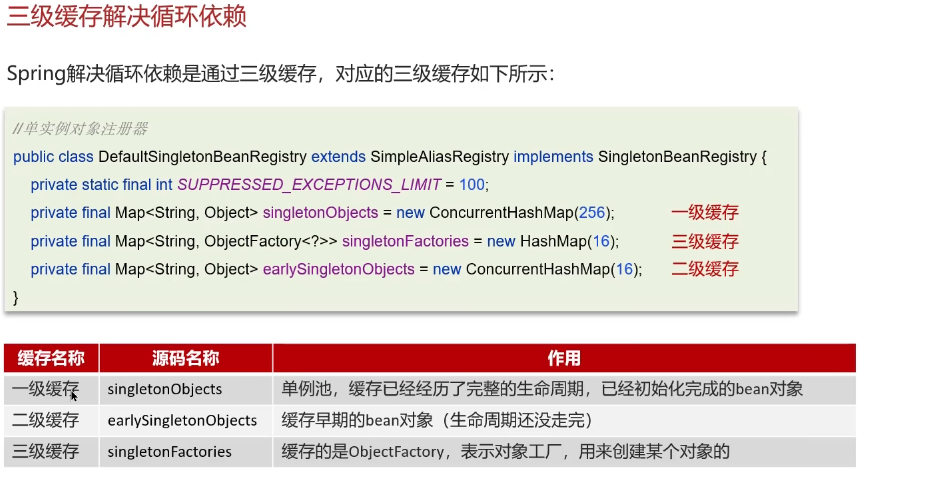

一级缓存作用：限制Bean在BeanFactory中只存一份，即实现**singleton Scope**，解决不了**循环依赖**

二级缓存可以解决循环依赖问题，但是！当A对象是一个代理对象时，不能解决！因为存入单例池的不是A对象，而是代理对象！

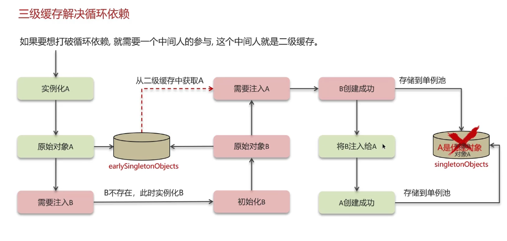

这个时候怎么办呢？就需要**SingletonFactory**！也就是说，需要**三级缓存**！

通过**SingletonFactory**生成代理对象，将代理对象注入B，使得B创建成功

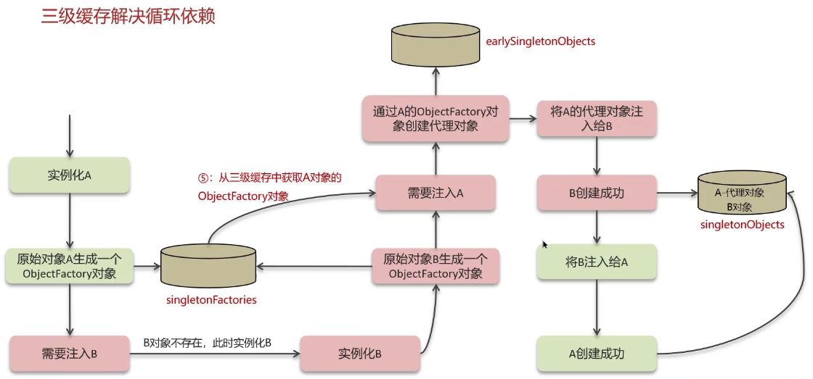

如果**构造方法**出现了循环依赖怎么办呢？

采用@Lazy注解，如下：

```java
public class A(@Lazy B b) {
    // ……
    this.b = b;
}
```

好困，困得一批，以后晚上不要熬夜了……

问题：**讲一下Spring中的循环引用？**

回答如下：

> - 循环依赖：循环依赖其实就是循环引用，也就是两个或者两个以上的Bean互相持有对方，最终形成闭环。比如说A依赖于B，B依赖于A
> - 循环依赖在Spring中允许存在，Spring框架依据三级缓存已经解决了大部分的循环依赖
>   - 一级缓存：单例池，缓存已经经历了完整的生命周期，已经初始化完成的Bean对象
>   - 二级缓存：缓存早期的Bean对象（生命周期还没有走完）
>   - 三级缓存：缓存的是ObjectFactory，表示对象工厂，用来创建某个对象的

问题：**构造方法出现了循环依赖怎么解决？**

这个问题指的是什么呢？

A依赖于B，B依赖于A，而且**注入的方式是构造函数**

这个**注入构造函数**指的就是通过传递参数的方式给构造函数

原因：由于Bean的生命周期中构造函数是第一个执行的，Spring框架并不能解决构造函数的**依赖注入**

> 解决方案：使用@Lazy进行懒加载，什么时候需要对象，再去创建Bean对象

## 关于SpringMVC

这部分学了个寂寞，后面得补一下

### SpringMVC的执行流程

这部分业务很复杂

视图阶段（**JSP**）

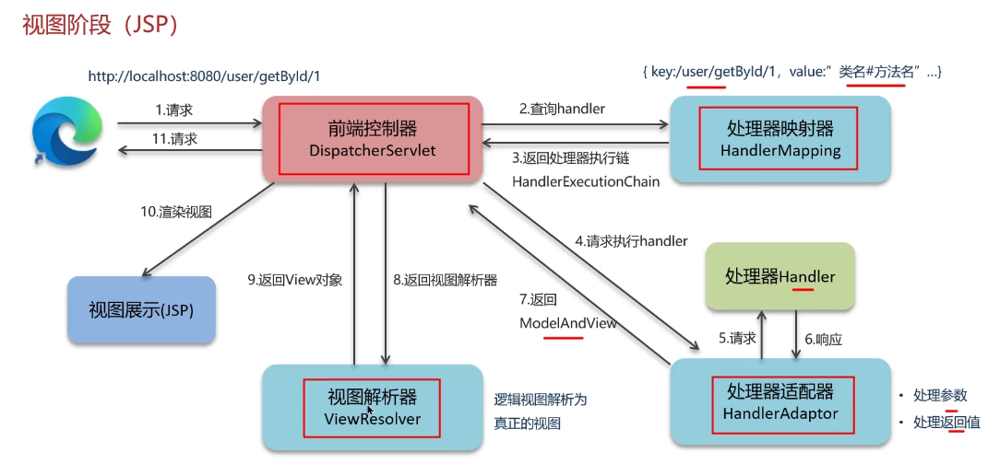

JSP实际上是过时的技术，可以跳过

这边有四个比较重要的组件：

- 前端控制器
- 处理器映射器
- 处理器适配器
- 视图解析器

但是，目前企业中很多都是接口开发，不怎么使用model and view

前后端分离阶段（接口开发、异步请求）

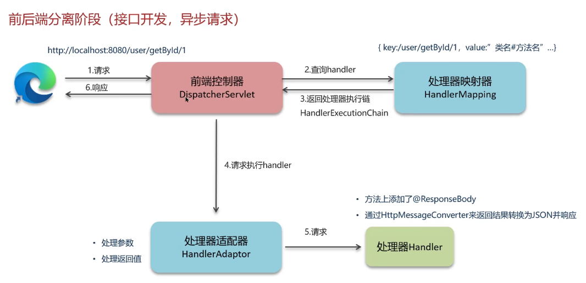

问题：**SpringMVC**的执行流程知道吗？

回答如下：

> jsp版本的那个不背了，tmd真逆天
>
> 回答时采用现代企业的开发流程
>
> 也就是前后端开发&接口开发
>
> 1. 用户发出请求到**前端控制器**DispatcherServlet
> 2. DispatcherServlet收到请求调用**处理器映射器**HandlerMapping
> 3. HandlerMapping找到对应的处理器，生成处理器对象以及处理器拦截器，再一起返回给DispathcherServlet
> 4. DispathcherServlet调用**处理器适配器**HandlerAdapter
> 5. HandlerAdapter经过适配，调用合适的处理器（Handler/Controller）
> 6. 方法上添加@ResponseBody
> 7. 通过HttpMessageConverter来返回结果为Json并且响应

## 关于SpringBoot

### SpringBoot自动配置原理

这个非常重要！框架中最核心的思想

@SpringBootApplication注解中包含了如下三个注解

- @SpringBootConfiguration 这个注解和@Configuration注解作用是相同的，用来声明当前也是一个配置类
- @ComponentScan 组件扫描，默认扫描当前引导类所在包及其子包
- @EnableAutoConfiguration ：**SpringBoot实现自动化配置的核心注解**

其中和**自动化配置**关系最密切的是@EnableAutoConfiguration

问题：**SpringBoot的配置原理？**

回答：

> 在Spring Boot项目中，其**引导类**上有一个注解@**SpringBootApplication**，这个注解是对三个注解进行了封装，分别是
>
> - @SpringBootConfiguration
> - @EnableAutoConfiguration
> - @CompentScan
>
> 其中，@**EnableAutoConfiguration**是实现***自动化配置**的核心注解，其注解通过@Import注解导入对应的配置选择器
>
> 注意！其内部就是读取该项目和该项目引用的jar包的classpath路径下的**META-INF/spring.factories**文件中所配置的类的全类名。在这些配置类中，所定义的Bean会根据条件注解**所指定的条件来决定**是否需要将其导入到Spring容器中去
>
> 注意！条件判断中会有类似@**ConditionalOnClass**这样的注解，判断是否有对应的class文件。如果有，就加载这个类，然后把这个配置类所有的Bean导入到Spring容器中去使用

### Spring框架常见的注解

这么多注解记个鸟

下面是SpringBoot的常见**注解**

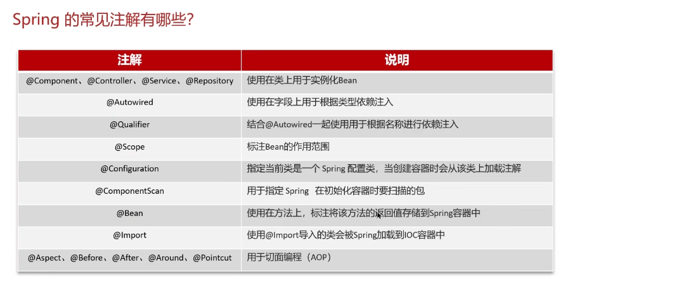

SpringMVC的常见**注解**如下：

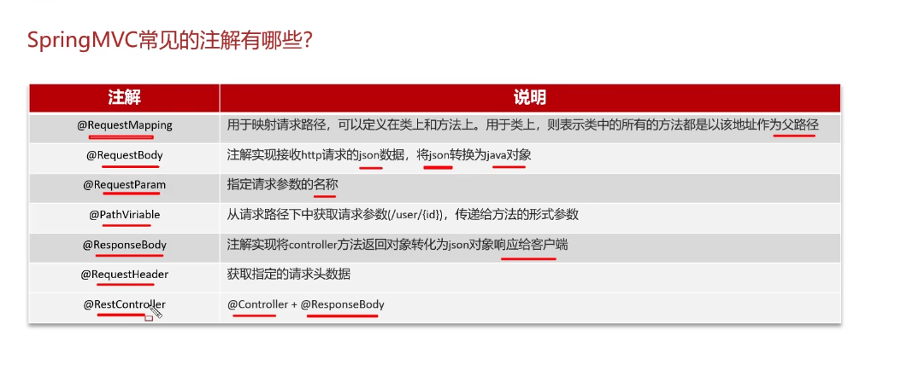

下面是SpringBoot的相关常见**注解**

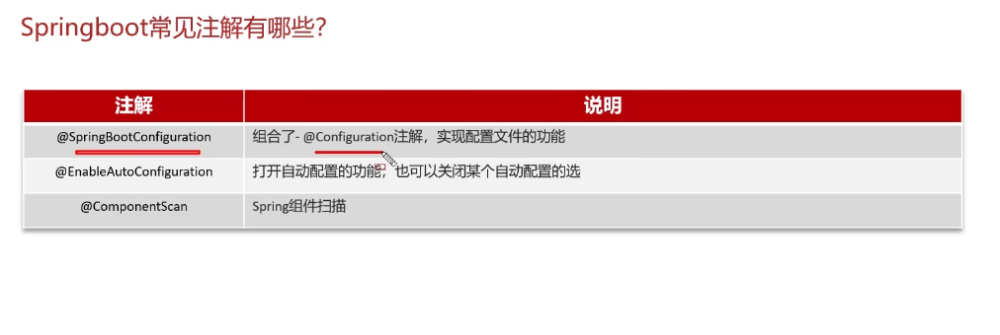

## 关于MyBatis

这部分**流程**需要再听一遍

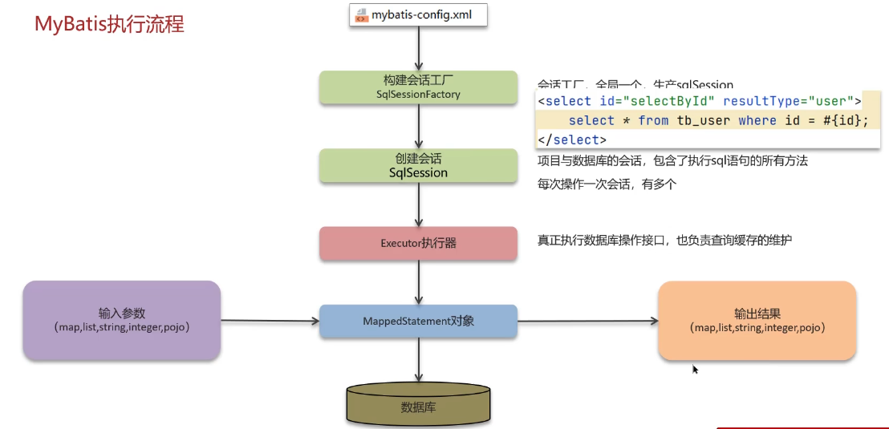

先通过xml文件加载是哪个数据库，加载哪些Mapper文件
构建会话工厂SqlSessionFactory
创建会话SqlSession
Executor执行器：去操作数据库接口，并且负责缓存维护
对于**MappedStatement**对象，输入进去参数，返回结果

问题：**MyBatis的执行流程是什么？**

回答如下：

> 1. 读取MyBatis配置文件：MyBatis-config.xml加载运行环境和映射文件
> 2. 构造**会话工厂**SqlSessionFactory
> 3. 会话工厂创建SqlSession对象（包括了执行SQL语句的所有方法）
> 4. 操作数据库的接口，Executor执行器，同时负责查询缓存的维护
> 5. Executor接口的执行方法中，有一个MappedStatement类型的参数，封装了映射信息
> 6. 输入参数映射
> 7. 输出参数映射

### MyBatis之延迟加载

这玩意的大意就是，不用就不查，用了后再查

与之相对应的，是**立即加载**

问题一：**MyBatis**是否支持延迟加载？

回答如下：

> - 延迟加载的意思是：就是在需要数据的时候才进行加载，不需要用到数据的时候就不加载数据
> - MyBatis支持一对一关联对象和一对多关联集合对象的**延迟加载**
> - 在MyBatis配置文件中，可以配置是否启用延迟加载**lazyLoadingEnabled = true | flase**，默认的话，是关闭的！

问题二：**延迟加载的底层原理**知道吗？

回答如下：

> 1. 使用**CGLB**创建目标对象的代理对象
> 2. 当调用目标方法时，进入拦截器invoke方法。发现目标方法是null值，执行SQL查询
> 3. 获取到数据之后，调用set方法设置属性值。再继续查询目标方法，就有了值

### MyBatis之多级缓存

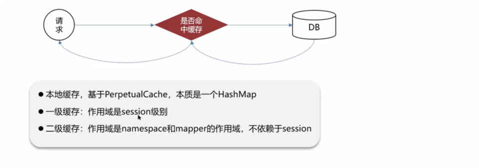

那个session是会话的意思

问题：**MyBatis的一级、二级缓存用过吗？**

回答如下：

> - 一级缓存：基于PerpetualCache 的本地 HashMap 缓存，其存储作用域为**Session**，当Session进行flush或者close之后，该session中的所有Cache就会清空。默认情况下，一级缓存是开启的！
> - 二级缓存：其基于namespace和Mapper的作用域而起作用，不是依赖于 SQL Session。同样的，默认也是采用PerpetualCache，HashMap存储。默认情况下关闭，需要单独开启。一个是核心配置，还一个是Mapper映射文件

问题二：MyBatis的二级缓存什么时候会清理缓存中的数据？

回答如下：

> 当一个**作用域**（一级缓存Session / 二级缓存 Namespaces）进行了**增、删、改**操作后，默认该作用域下所有 select 中的缓存就会被Clear！
