# Linux&Docker

Linux系统之前在VM workstation装过，这个好说

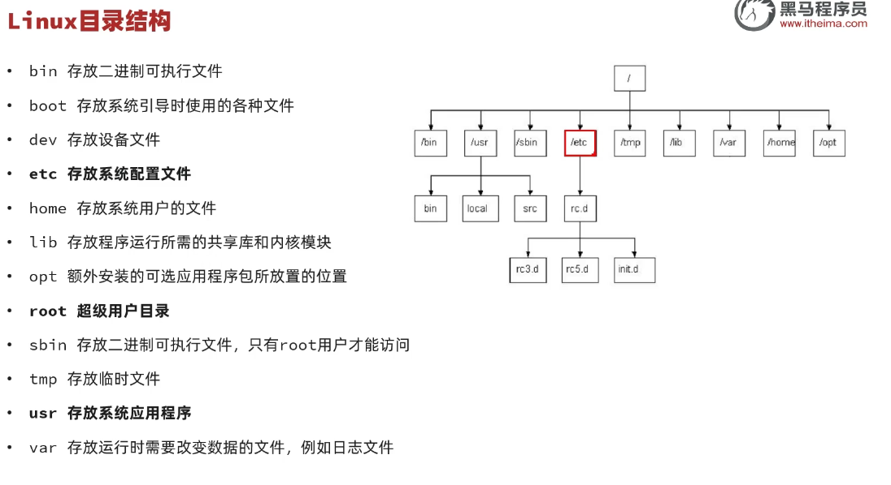

Linux系统下，"/"代表**根目录**

## 关于Linux的常用命令

权当复习

### 目录相关命令

这部分内容没啥好听的，具体的命令用到的时候去查

## 对防火墙的操作

```shell
systemctl stop firewalld
```

这是关闭防火墙的操作

但是注意这是CentOS系列Linux系统对防火墙的操作

## 关于Docker

**Docker**是一款快速构建、运行、管理应用的工具

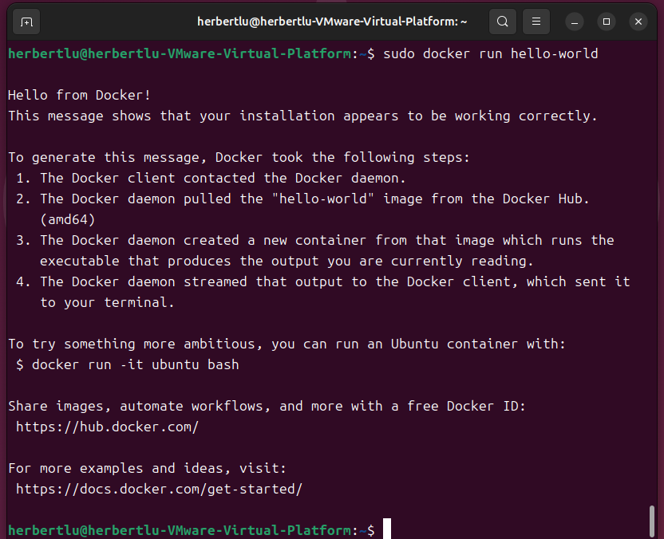

注意**image**的意思是**镜像**

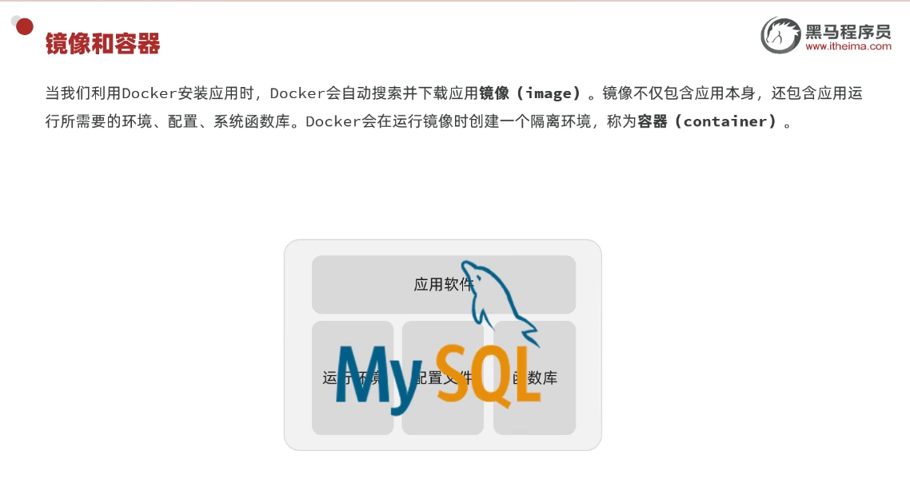

注意**容器**container的含义！

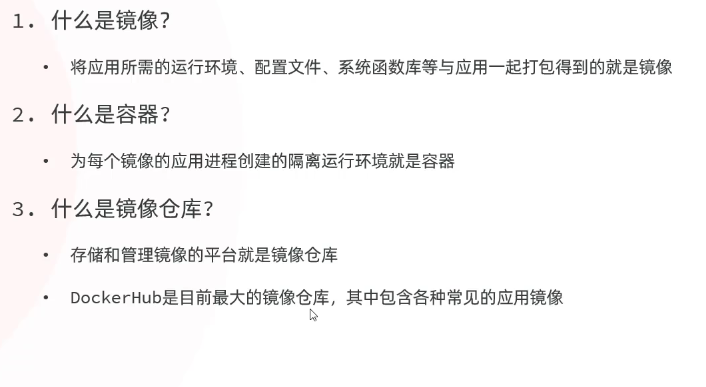

境内无法连接DockerHub，只能连接国内镜像源

## 关于Docker的命令解读

```shell
docker run -d \
  --name mysql2 \
  -p 3308:3306 \
  -e TZ=Asia/Shanghai \
  -e MYSQL_ROOT_PASSWORD=123 \
  mysql:8
```

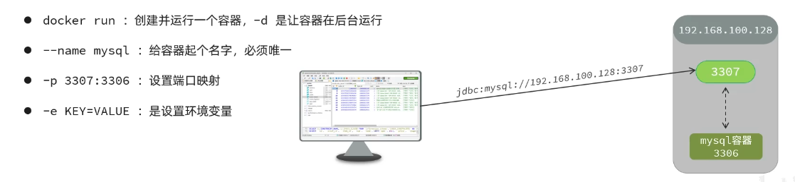

### 镜像命名规范

\[respository]:[tag]

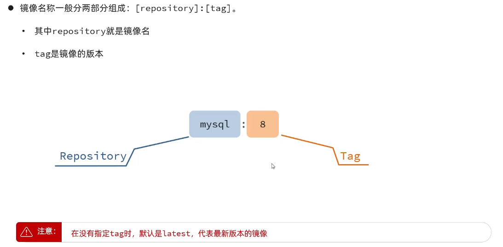

那个tag就是版本号

## Docker核心

一些常见命令的汇总（见下图）：

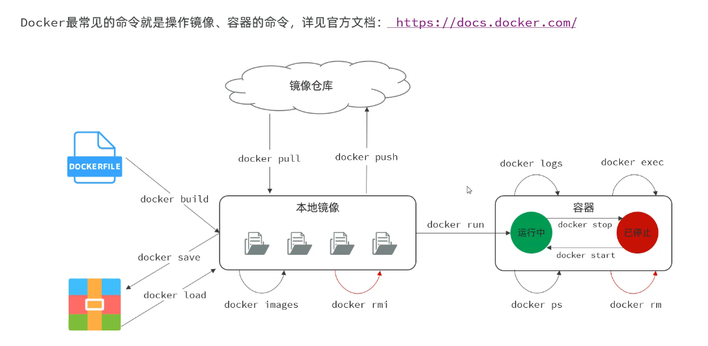

关于**数据卷**

利用Nginx容器部署静态资源

遇到的第一个问题，无法使用vim和vi

由此引申出**数据卷**的功能

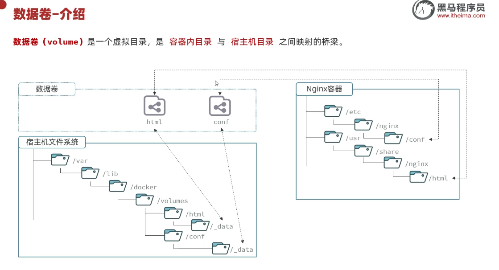

关于**本地目录挂载**

……

### 自定义镜像

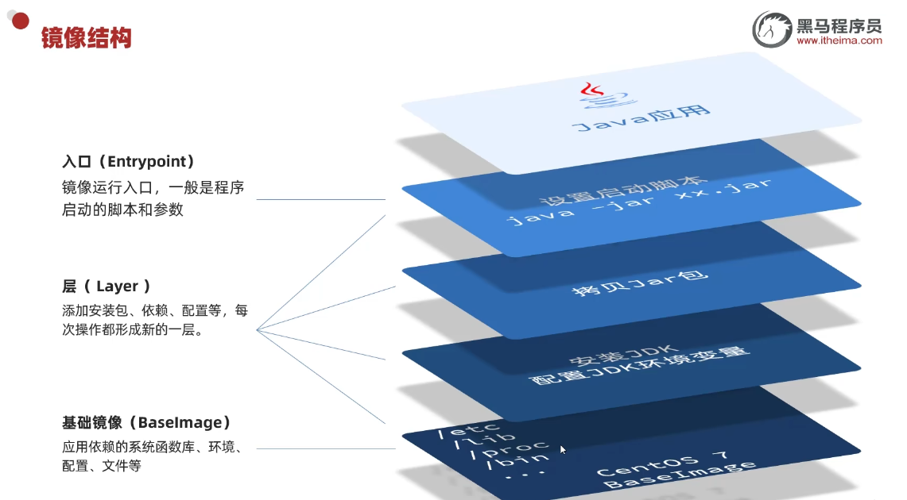

关于DockerFile

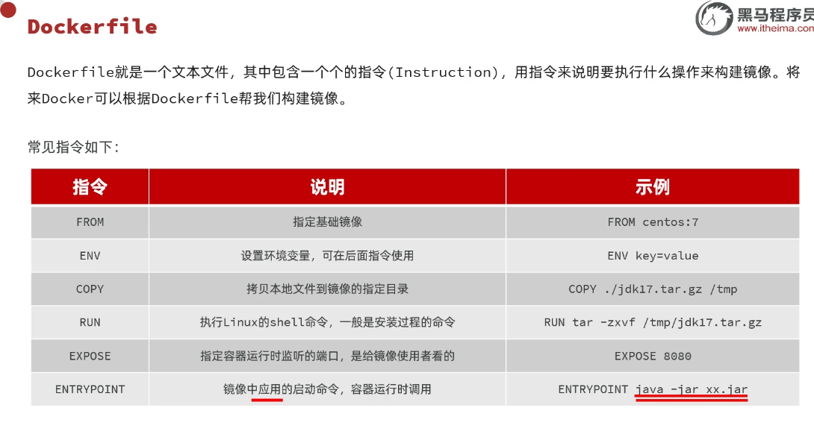

### 网络

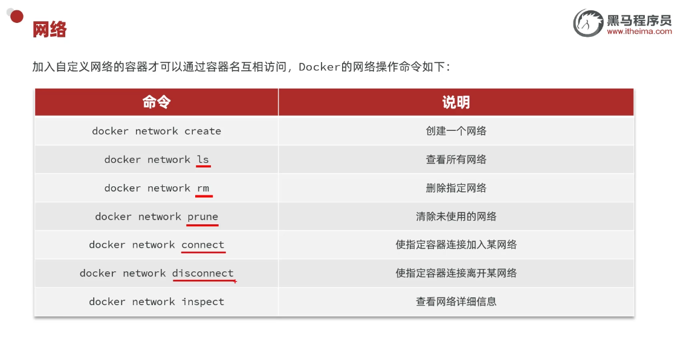

这部分内容听着格外抽象，不知道有什么鸟用

## 关于DockerCompose

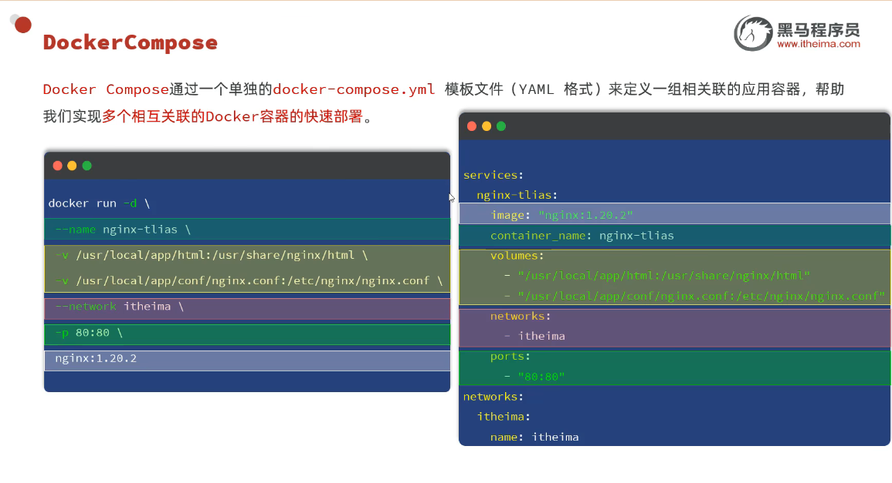

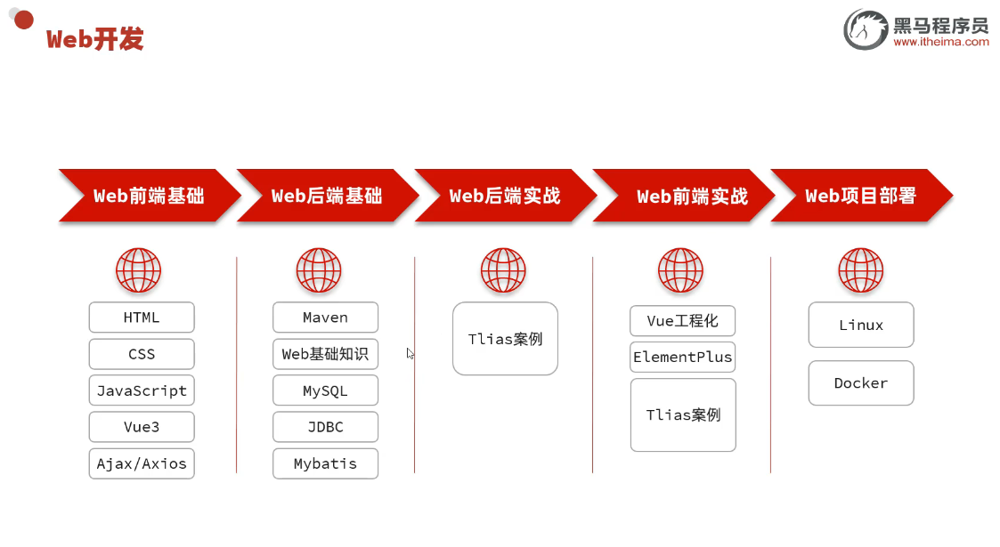

自此，JavaWeb课程基础学习完结！

总体学习下来的感受是，对企业开发常用的工具和技术有所初步的了解，向下一阶段进军！
