# The Note Of JavaWeb

## Some thoughts

我发现一件非常麻烦的事，这个 $JavaWeb$ 还是得学过去，这玩意是 $Spring$ 技术的前置。

这部分内容浏览了一下目录，很杂。HTML+CSS+JS此前学过，直接跳过

## Vue

Vue是一款用于**构建用户界面**的**渐进式**JavaScript**框架**

### Vue常用指令

v-前缀的指令


这部分内容直接跳过，属于前端的内容

## Ajax

即：Asynchronous JavaScript And XML
异步的JavaScript和XML

这部分内容也跳过，属于前端


注意这张框架图

## Maven

一个工具
apache旗下的一个开源项目


Maven中的仓库是用来存储和管理jar包的
Maven中有三类仓库，查找依赖（jar）的顺序：

1. 本地仓库
2. 远程仓库
3. 中央仓库

把Maven装一下...
已搞定

### Maven坐标

Maven中的坐标是资源（jar）的唯一标识

Maven坐标主要组成：
groupId, artifactId, version


### 依赖管理

关于依赖配置和排除依赖

```xml
<dependencies>
        <dependency>
            <groupId>commons-io</groupId>
            <artifactId>commons-io</artifactId>
            <version>2.14.0</version>
        </dependency>
        <dependency>
            <groupId>org.springframework</groupId>
            <artifactId>spring-context</artifactId>
            <version>6.2.10</version>
            <exclusions>
                <exclusion>
                    <groupId>io.micrometer</groupId>
                    <artifactId>micrometer-commons</artifactId>
                </exclusion>
            </exclusions>
        </dependency>
</dependencies>
```

### 生命周期

Maven的生命周期是为了对所有的Maven项目构建过程进行抽象和统一

clean, default, site

### 单元测试

测试：用于鉴定软件
白盒测试、黑盒测试和灰盒测试


在项目开发中，多使用JUnit单元测试，而不是main方法测试

单元测试运行不报错，仅仅代表运行没问题，并不代表业务逻辑没问题

#### Junit-断言


注意这些杂七杂八的断言方法

通过Assertions进行调用

#### Junit常见注解


#### 单元测试-企业开发规范

原则：编写测试方法时，要尽可能的覆盖业务方法中的所有可能情况（特别的，注意边界值！）

注意**测试代码**覆盖率

#### 单元测试-Maven依赖范围

在Maven项目中，test目录存放单元测试的代码，虽然可以放在main目录中编写，但是**不规范！**

关于依赖范围，依赖的jar包，默认情况下，可以在任意地方使用。可以使用

```xml
<scope>...</scope>
```

来设置其作用范围
默认的compile在主程序、测试、打包阶段都能使用

## Web基础

此部分是后端真正的入门，很重要！

关于**静态资源**和**动态资源**


B/S架构：Browser/Server， 浏览器/服务器架构模式。客户端只需要浏览器，应用程序的逻辑和数据都存在服务器端（维护方便 体验一般）

C/S架构：Client/Server， 客户端/服务器架构模式。需要单独开发维护客户端

### SpringBoot Web 入门

实际上是基于SpringBoot开发一个web入门程序

此时这个小项目仅仅是了解

### HTTP协议

注意区分"http://"和"https://"

所谓的HTTP协议，指的是**超文本传输协议**，规定了**浏览器**和**服务器**之间数据传输的规则


特点：

1. 基于**TCP**协议：面向连接，安全
2. 基于请求-响应模型的：一次请求对应一次响应
3. HTTP协议是无状态的协议：面对事务处理**没有记忆能力**，每次请求-响应都是独立的。也就是说，速度很快，但是多次请求之间不能共享数据

#### HTTP-请求协议

请求数据格式：
第一行：请求行（请求方式、资源路径、协议）
第二部分：请求头（格式：key:value）
第三部分：请求体（POST请求，存放请求参数）

#### HTTP协议-请求数据获取

Web服务器（Tomcat）对HTTP协议的请求数据进行解析，并进行了封装（HttpServletRequest），在调用Controller方法的时候传递给了该方法

HTTP请求数据不需要程序员自己解析，web服务器负责对HTTP请求数据进行解析，并封装为了请求对象

#### HTTP协议-响应数据协议

响应行、响应头、响应体


200表示成功响应，**客户端请求成功**

4开头的状态码最典型的是404

500表示**服务器发生不可预期的错误**

关于封装好的HttpServletResponse类与对象

注意：**HTTP响应数据不需要程序员手动设置**

而对于响应状态码、响应头，通常情况下，我们无需手动制定，服务器会根据请求逻辑自动设置

### Springboot入门案例

关于注解@RestController
其底层封装了@ResponseBody

要把静态资源存放在resource/static文件夹下

@ResponseBody注解的作用

1. 将Controller方法的返回值直接写入HTTP响应体
2. 如果是对象或者集合，会先转为json，再响应
3. @RestController = @Controller + @ResponseBody

### 分层解耦-三层架构

数据访问->逻辑处理->接受请求、响应数据

三层架构：**Controller+Service+Dao**


拆分代码是为了遵循单一职责原则，便于复用和后期维护

#### 分层解耦

目标：**高内聚低耦合**

控制反转：IOC(Inversion Of Control)，简称**IOC**，对象的创建控制权由程序本身转移到外部（容器），涉及到**IOC容器**
依赖注入：DI(Dependency Injection)，简称**DI**，容器在为应用程序提供运行时，所依赖的资源，称为**依赖注入**
Bean对象：IOC容器中创建、管理的对象，称之为**Bean**

#### IOC&DI入门

如何将一个类交给IOC容器管理？
@Compent（加在实现类上，而不是接口上）

从IOC容器中找到该类型的bean，然后完成依赖注入的方法：@Autowired

#### IOC详解

声明bean的注解：
@Compent
@Controller
@Service
@Repository

注意事项：
在Springboot集成web开发中，声明控制器bean只能用@Controller

声明bean的注解想生效，需要被扫描到，启动类默认扫描当前包及其子包

#### DI详解

关于**依赖注入**

基于@Autowired进行依赖注入的常见方式有三种


一般来说用第一种或者第二种

@Autowired注解，默认按照**类型**进行注入

**如果存在多个相同类型的bean，会报错！**

解决方案：

1. @Primary
2. @Qualifier + @Autowired
3. @Resource

@Autowired是Spring框架提供的注解，而@Resource是JavaEE规范提供的

## SQL & DB

SQL用于操作关系型数据库
这部分内容权当复习了……不过好多东西也都忘完了

### 数据模型

对于关系型数据库：在关系模型基础上，由多张相互连接的二维表组成的数据库

这种概念没什么好记的

### SQL语句

**核心**内容
重点关注：DDL、DML和DQL

#### DDL 表结构之创建

约束条件字段：
not null 非空约束
unique 唯一约束
primary key 主键约束
default 默认约束
foreign key 外键约束

创建表的样例

```sql
create table user(
    id int primary key comment 'ID，唯一标识',
    username varchar(50) not null unique comment '用户名',
    name varchar(10) not null comment '姓名',
    age int comment '年龄',
    gender char(1) default '男' comment '性别'
) comment '用户信息表';
```

可以在主键primary key后面加一个auto_increment，使得主键自动增长（从0开始）

日期类型主要使用date(YYYY-MM-DD)
和datetime(YYYY-MM-DD HH:MM:SS)

#### DDL 表结构之查询、修改、删除

修改字段类型使用**modify**，修改字段名使用**change**

#### DML 增删改

包含Insert, Update, Delete

关于insert：

语法格式

```sql
insert into emp(id, username, password, name, gender, phone, job, salary, entry_date, image, create_time, update_time)
            values(null, 'lin_c', '123456', '林冲', 1, '13451881283', 1, 6000, '2123-09-12', '1.jpg', now(), now());

```

关于update：

```sql
update emp set username = 'zhangsan', name = '张三' where id = 1;

update emp set entry_date = '2010-01-01';
```

**特别注意**：如果不加where条件的话，会直接更新掉整张表，是**危险操作**！

关于delete：

```sql

delete from emp where id = 1;

delete from emp;
```

**特别注意**：不加where删表内容是**非常危险**的操作！会删掉整张表

#### DQL 查询语句

DQL语句**非常重要**，是写的最多的一种！

查询时去重的方法：distinct

关于**DQL条件查询**：

```sql
select 字段列表 from 表名 where 条件列表;
```

```sql
select * from emp where name like '__';
```

注意'_'是用来模糊匹配的，表示单个字符；'%'表示任意多个（0个也行）字符！

例子：

```sql
select * from emp where name like '__';

select * from emp where name like '李%';

select * from emp where name like '%二%'; // 姓名中包含‘二’
```

关于**DQL分组查询**：

分组+聚合

```sql
select count(*) from emp; # 优先使用，底层有优化

select count(1) from emp;
```

分组查询案例：

```sql
-- 一旦进行分组之后，select后的字段列表不能随意书写，能写的一般是分组字段+聚合函数
select gender, count(*) from emp group by gender ;

-- 注意在where之后不能使用聚合函数！
-- 因此聚合函数count(*)要写在having后面！
select job , count(*) from emp where entry_date <= '2015-01-01' group by job having count(*) >= 2;
```

where和having的区别：

1. 执行时机不同：(where -> group by -> having)
2. 判断条件不同：(having后面可以使用聚合函数，比如count(*)，但是where不可以)

关于**DQL排序查询**：

order by xxx asc, xxx desc

案例：

```sql
select * from emp order by entry_date desc;

select * from emp order by entry_date, update_time desc;
```

关于**DQL分页查询**：

这玩意的作用是在那种表格下方产生分页条，以便翻阅

limit start_index, query_number

几点说明：

1. 起始索引从0开始
2. 分页查询是数据库的方言，不同数据库实现方式不尽相同，MySQL中是LIMIT

注意这个**起始索引**的含义是表中id的序号！

案例：

```sql
select * from emp limit 0, 5;

select * from emp  limit 5, 5;

select * from emp limit 10, 5;
```

同时注意，在MySQL中，索引从0开始，但是id一般从1开始

对于第p页，每页n条记录，$$start\_index = (p - 1) \times n$$

## JDBC

要坚持下去呀

Java DataBase Connectivity
使用Java语言操作关系型数据库的一套API

JDBC程序执行DML语句和DQL语句方法

```java
// DML
int rowsAffected = statement.executeUpdate();
// DQL
ResultSet rs = statement.executeQuery();
```

DQL语句执行完毕结果集ResultSet解析：

```java
// 光标向下移动一行
resultSet.next();
// 获取字段数据
resultSet.getXxx();
```

关于使用JDBC**预编译SQL**

作用：

1. 预防被**SQL注入攻击**的风险
2. 性能更高

## MyBatis

持久层框架，用于简化JDBC的开发

Controller(控制层)->Service(业务层)->Dao(持久层)

MyBatis是一款**持久层**框架，用于**简化JDBC**的开发

这玩意底层就是JDBC，于其基础上进行了简化和开发

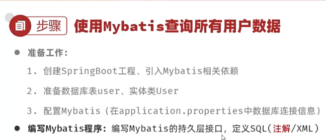

Springboot的单元测试类要在顶上加上@SpringBootTest

### 数据库连接池

容器，负责分配、管理数据库连接

标准接口：DataSource

```java
Connection getConnection() throws SQLException;
```

### 增删改查操作

**删除**：
\#{...} 占位符，执行时会替换为？，生成预编译SQL

也可以使用\${…}，但是这样的话非常不安全

**增加**：

```java
@Insert("insert into user (id, username, password, name, age) values (#{id}, #{username}, #{password}, #{name}, #{age})")
    public void insertUser(User user);
```

**修改**：

即update

这个和上面那个差不多，就是在注解中加入占位符，然后调用的接口中传入一个对象参数

**查询**：

@Param注解的作用：为接口的方法形参起名字

### XML映射配置

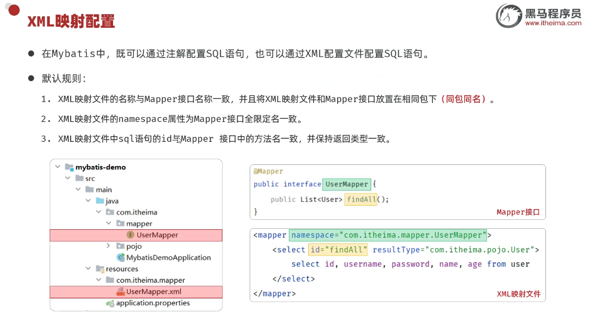

在Mybatis的开发中，如果是使用简单的增删改查操作，使用注解；如果要实现复杂的SQL功能，建议使用XML映射配置

## Springboot项目配置文件

这个小项目的主要操作为：
增删改查、日志技术

### 准备工作

#### 开发规范--开发模式

前后端分离！

前后端搞一坨的话很难维护，所以一定要分离开来！

关于前后端的交互，**接口文档**很重要

这个**接口**不是那个interface，而是**功能接口**

#### 开发规范-Restful风格

表述性状态转换，是一种软件架构风格

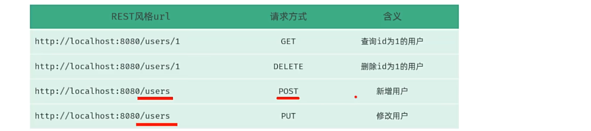

Restful风格的URL，根据请求方式判定含义

GET：查询
POST：新增
PUT：修改
DELETE：删除

这边提到了Apifox这个工具，是因为由浏览器地址栏发起的请求，都是**GET**方式的请求。如果我们需要发起**POST**、**PUT**、**DELETE**方式的请求，就需要借助这款工具

实体类**Dept**和统一的响应结果封装类**Result**

出于时间影响问题，这个Tlias开发项目不搞了。一是根本看不懂里面Springboot技术的一些细节（还没学习），二是这个项目没什么价值，纯粹的crud，仅学习一下日志技术即可。

### 日志技术

基于System.out的日志，只能输出到控制台，不便于扩展和维护

常用Log4j，是一个流行的日志框架

**Logback**，基于Log4j升级而来，性能更强

## SQL 进阶

### 多表关系

**一对多** 多表关系

协同多张表之间的一致性和完整性，采用的解决方案是**外键约束**

**foreign key**是物理外键，容易引发数据库的死锁问题，消耗性能！
同时，仅适用于单节点的数据库，不适用分布式、集群场景

相对应的，我们应当使用逻辑外键

**一对一**多表关系

实现：在任意一方加入外键，关联另外一方的主键，并且设置外键为唯一的（UNIQUE）

**多表查询**：

连接查询和子查询

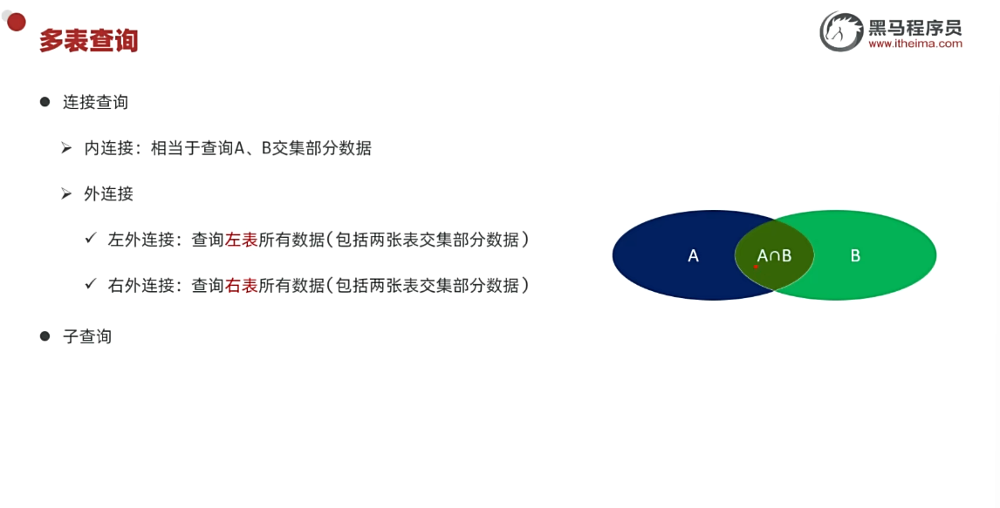

那个子查询实际上是“**嵌套查询**”

#### 内连接

关于内连接

内连接查询的是两张表交集部分的数据

**隐式内连接**和**显式内连接**：

```sql
-- 隐式
select emp.id, emp.name, dept.name from emp, dept where emp.dept_id = dept.id;

-- 显式
select emp.id, emp.name, dept.name from emp inner join dept on emp.dept_id = dept.id;
```

实际上可以给表起个别名，但是起了别名就得用别名，不能用原先的表名

#### 左外连接

比如说 A left join B，那么A即是左表，左查询会查询到左表中的所有数据（于右表中NULL的数据都会被统计进去）

案例：

```sql
select e.name, d.name from emp e left join dept d on e.dept_id = d.id;

select d.name, e.name from emp e right join dept d on e.dept_id = d.id;

select e.name, d.name, e.salary from emp e left join dept d on e.dept_id = d.id where e.salary > 8000;
```

#### 子查询

SQL语句中嵌套select语句，称为嵌套查询，又叫**子查询**

这种子查询问题，要化繁为简，将问题需求进行拆分。分布实现后，合并SQL语句

案例：

```sql
select name, e.salary, s.av
from emp e,
     (select dept_id, avg(salary) av from emp group by dept_id) s
where e.dept_id = s.dept_id
  and e.salary < s.av;
```

## Spring AOP

AOP：面向切面编程、面向方面编程

注意这些杂七杂八的注解

### AOP核心概念

连接点：JoinPoint，可以被AOP控制的方法
通知：Advice，指那些重复的逻辑
PointCut，切入点
Aspect，切面
目标对象，Target

byd为什么这个我听不懂

关于AOP程序的**执行流程**

AOP的底层是**动态代理**技术

### AOP进阶

#### 关于通知类型

根据通知方法执行时机的不同，将通知类型分为以下五类：
@Around
@Before
@After
@AfterReturning （返回后通知）
@AfterThrowing （异常后通知）

@Around环绕通知需要自己调用 ProceedingJoinPoint.proceed() 来让原始方法执行，其他通知不需要考虑目标方法执行

@Around环绕通知方法的返回值，必须指定为Object，来接收原始方法的返回值

关于@PointCut

抽取公共的切点表达式，提高代码复用性

#### 通知顺序

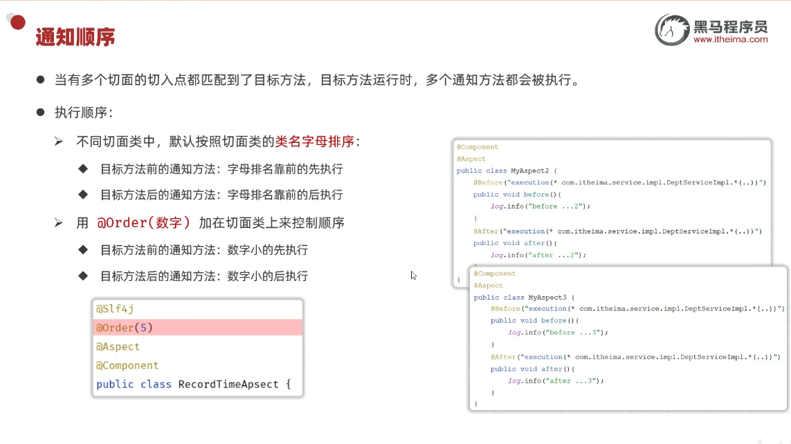

也就是说，可以使用
@Order(int num)
加在切面类上，来控制执行顺序

#### 切入点表达式

作用：用来决定项目中的哪些方法需要加入通知

常见形式：

1. execution(……)：根据方法的签名来匹配
2. @annotation(……)：根据注解匹配

execution(访问修饰符? 返回值 包名.类名.?方法名(方法参数) throws 异常?)

关于**通配符**：

*表示单个任意，..表示任意多个包或者任意多个参数（也可以没有）

```java
@Before("execution(public void com.itheima.service.impl.DeptServiceImpl.delete(java.lang.Integer))");
```

对于Execution方式，如果要匹配多个方法，可以在多个execution表达式之间加入逻辑运算符

#### 连接点

在Spring中用JoinPoint抽象了**连接点**，使用其可以获得方法执行时的相关信息，比如目标类名、方法名、方法参数等

对于@Around通知，获取连接点信息只能使用 ProceedingJoinPoint
而对于其他四种通知，获取连接点信息只能使用 JoinPoint，其是 ProceedingJoinPoint 的父类型

## SpringBoot原理篇

Java系统属性
-Dserver.port = 9000
命令行参数：
--server.port = 10010

配置文件是有优先级的

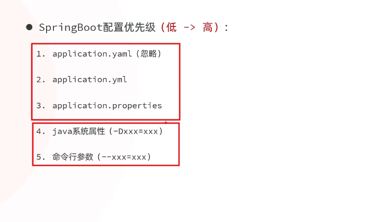

多个配置文件同时存在时，按照配置文件的优先级进行执行

### Bean作用域

这个不知道什么东西
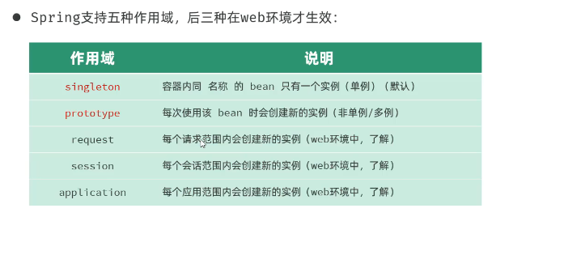

默认单例的bean是在项目启动时创建的，创建完毕之后，会将该bean存入IOC容器

实际开发中，绝大部分的Bean是单例的。也就是说，绝大部分Bean不需要配置scope属性

此处容易考察的面试题：

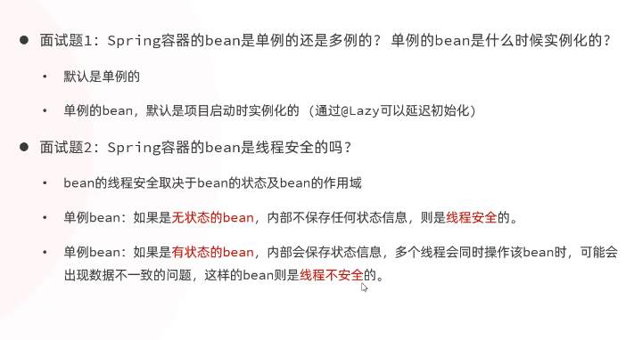

### Springboot核心

Spring Framework很繁琐，所以推出了Spring Boot框架

关于**起步依赖**和**自动配置**

### 起步依赖

什么玩意这……

### 自动配置

关于自动配置的原理

使用@ComponentScan，很繁琐，而且性能很差

组件扫描应当使用别的方式

这个什么导入不导入的听的乱七八糟的
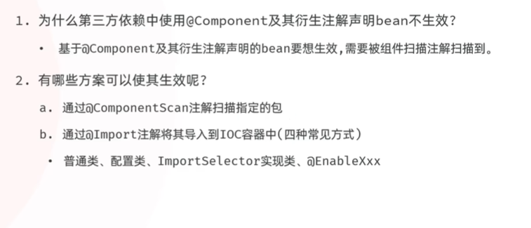

注意到此处提及到的**源码跟踪**技术

提及的**配置类**究竟指的是什么？

几个很晕的概念：
IOC容器、Bean类、启动类、配置类

#### 自动配置-@Conditional

作用：根据一定的条件进行判断，在满足给定条件之后，才会注册相应的Bean对象到Spring IOC容器中去

@Conditional 本身是一个**父注解**，派生出大量的**子注解**

常见的：

@ConditionalOnClass
@ConditionalOnMissingBean
@ConditionalOnProperty

后续在深入学习SpringBoot时，要搞懂**IOC 容器**和**bean对象**！

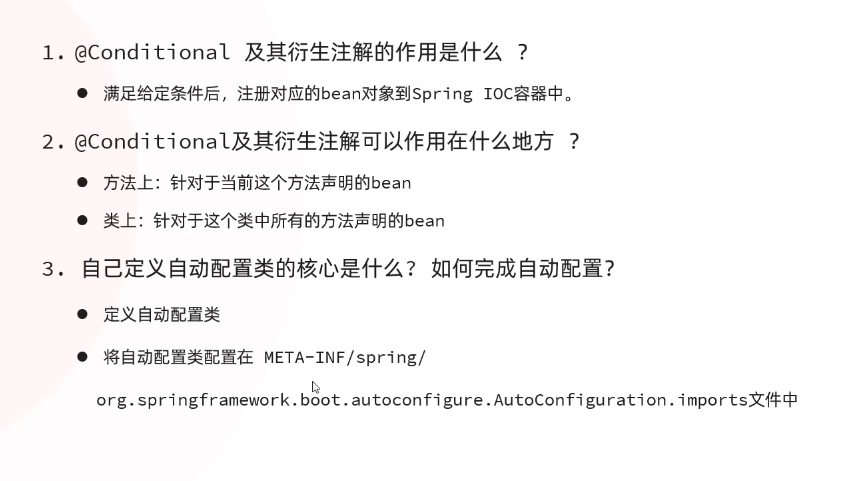

#### 自定义starter

公共组件封装为Sringboot 的 starter（包含了起步依赖和自动配置的功能）

这一坨内容根本听不懂

## Maven高级

### 分模块设计与开发

这个是把各个功能块拆分成模块

### 继承与聚合

**继承**：指两个工程之间的关系，子工程可以继承父工程中的配置信息，常见于依赖关系的继承

在Maven中，打包方式有三种：

**jar**：普通模块打包，Springboot项目基本都是jar包
war：普通web程序打包，需要部署在外部的Tomcat服务器中运行（这玩意用的不多，在现代企业开发中基本不用）
**pom**：父工程或聚合工程，该模块不写代码，仅进行依赖管理

关于**版本锁定**

对于版本号，我们可以定义到

```xml
<properties>
<!-- 然后把各个版本号都放到这个里面 -->
<\properties>
```

注意：<depnedencyMangement\>和<dependencies\>的区别：
前者是**统一管理依赖版本**，不会直接依赖，还需要在子工程中引入所需依赖
而后者（<dependencies\>）是**直接依赖**，在父工程中配置了依赖，子工程会直接继承下来

如果要进行打包，首先得下载那些依赖模块（**安装到本地仓库**），不然会打包失败

但是这个很麻烦，在一个大型项目中，由于依赖关系，模块的安装还有顺序要求

由此，我们引申出Maven项目中的**聚合**关系

父工程也可以作为聚合工程

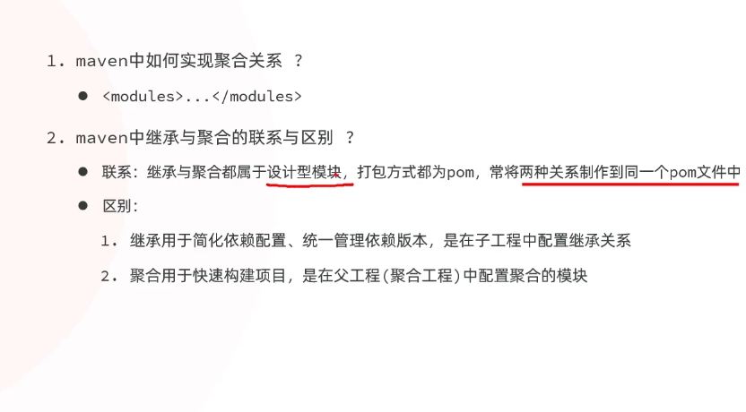

**继承**用于将子工程的依赖放到父工程中去
**聚合**用于快速构建项目，不用处理那些复杂的依赖关系

### 私服

在同一个公司中，对于同一套工具包的协同使用

如果在本地仓库中找不到，需要去中央仓库中去寻找。但是中央仓库里一般也没有，需要团队成员进行上传

问题来了，普通用户**没有权限**上传到中央仓库中去，由此，我们引申出**私服**

由此，我们解决了团队中的资源共享问题

**私服是一种特殊的远程仓库**，用来代理位于外部的中央仓库，用于解决团队内部的资源共享和资源同步问题

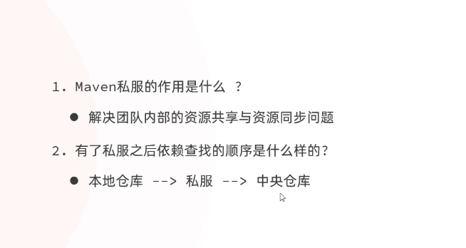

#### 资源上传-下载

对于远程的公司自搭建服务器，
RELEASE：发行版本
SNAPSHOT：快照版本

install -> Maven 本地仓库

deploy -> 私服

这个东西不配置了，没啥用

## Web后端开发总结

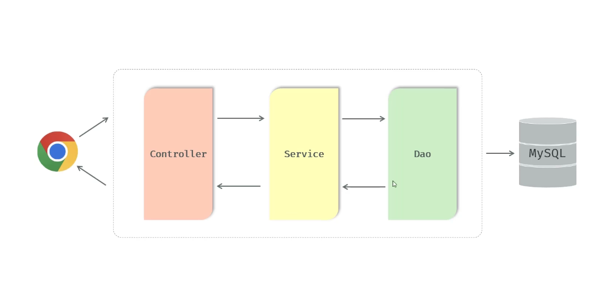

如上图，请求执行流程

同时，还有如下的执行步骤

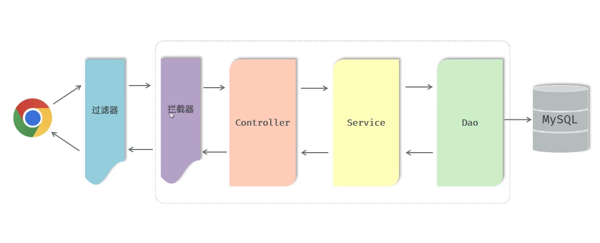

与此同时引申了其他技术
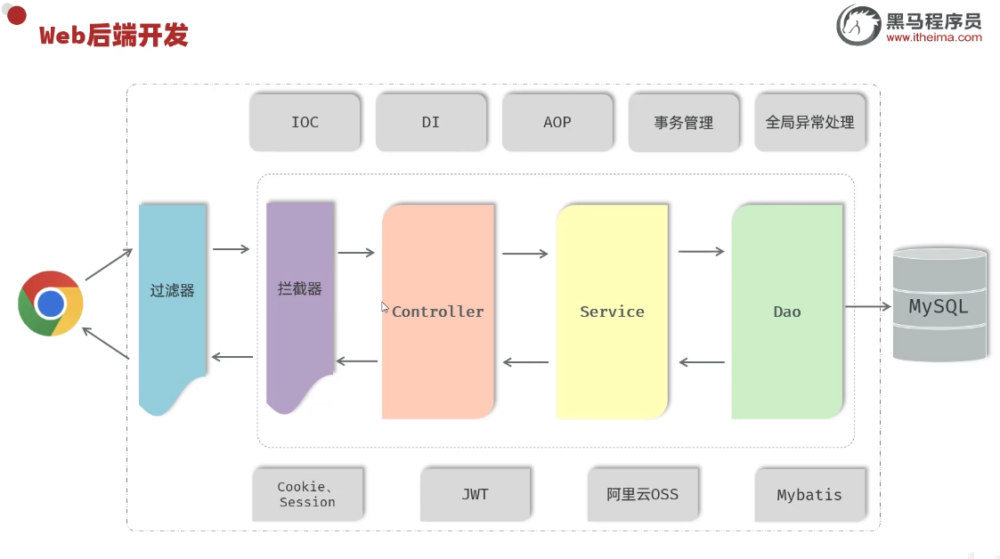

**Formed a preliminary understanding of JavaWeb backend development.**
