# The Note Of JavaWeb

## Some thoughts

我发现一件非常麻烦的事，这个 $JavaWeb$ 还是得学过去，这玩意是 $Spring$ 技术的前置。

这部分内容浏览了一下目录，很杂。HTML+CSS+JS此前学过，直接跳过

## Vue

Vue是一款用于**构建用户界面**的**渐进式**JavaScript**框架**

### Vue常用指令

v-前缀的指令

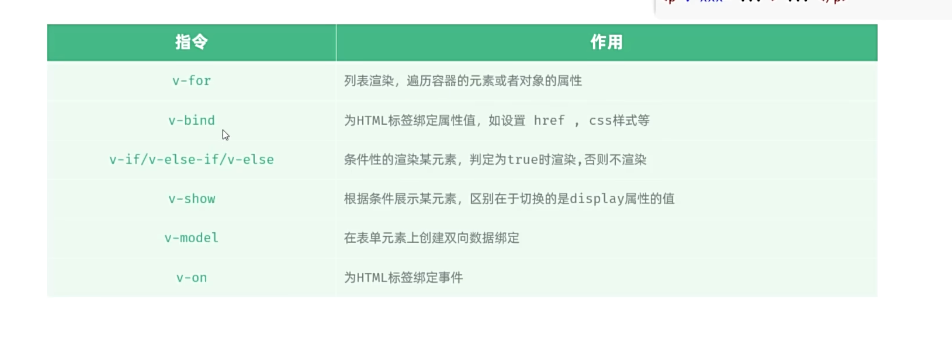

这部分内容直接跳过，属于前端的内容

## Ajax

即：Asynchronous JavaScript And XML
异步的JavaScript和XML

这部分内容也跳过，属于前端

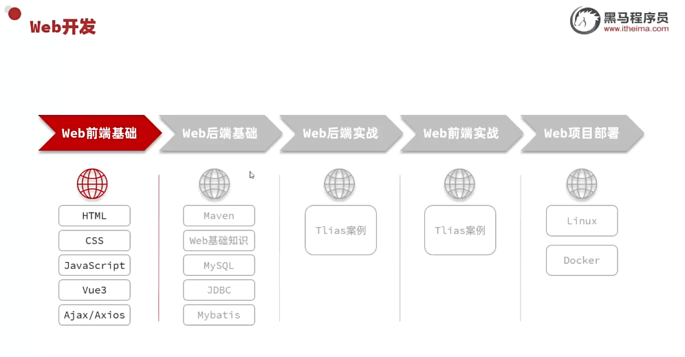
注意这张框架图

## Maven

一个工具
apache旗下的一个开源项目

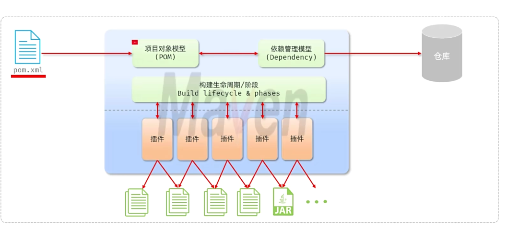

Maven中的仓库是用来存储和管理jar包的
Maven中有三类仓库，查找依赖（jar）的顺序：

1. 本地仓库
2. 远程仓库
3. 中央仓库

把Maven装一下...
已搞定

### Maven坐标

Maven中的坐标是资源（jar）的唯一标识

Maven坐标主要组成：
groupId, artifactId, version

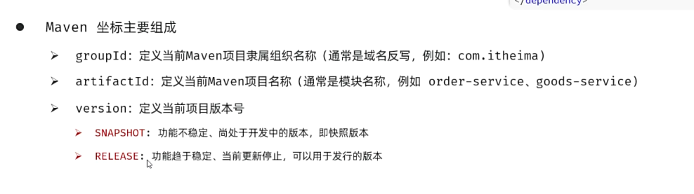

### 依赖管理

关于依赖配置和排除依赖

```xml
<dependencies>
        <dependency>
            <groupId>commons-io</groupId>
            <artifactId>commons-io</artifactId>
            <version>2.14.0</version>
        </dependency>
        <dependency>
            <groupId>org.springframework</groupId>
            <artifactId>spring-context</artifactId>
            <version>6.2.10</version>
            <exclusions>
                <exclusion>
                    <groupId>io.micrometer</groupId>
                    <artifactId>micrometer-commons</artifactId>
                </exclusion>
            </exclusions>
        </dependency>
</dependencies>
```

### 生命周期

Maven的生命周期是为了对所有的Maven项目构建过程进行抽象和统一

clean, default, site

### 单元测试

测试：用于鉴定软件
白盒测试、黑盒测试和灰盒测试

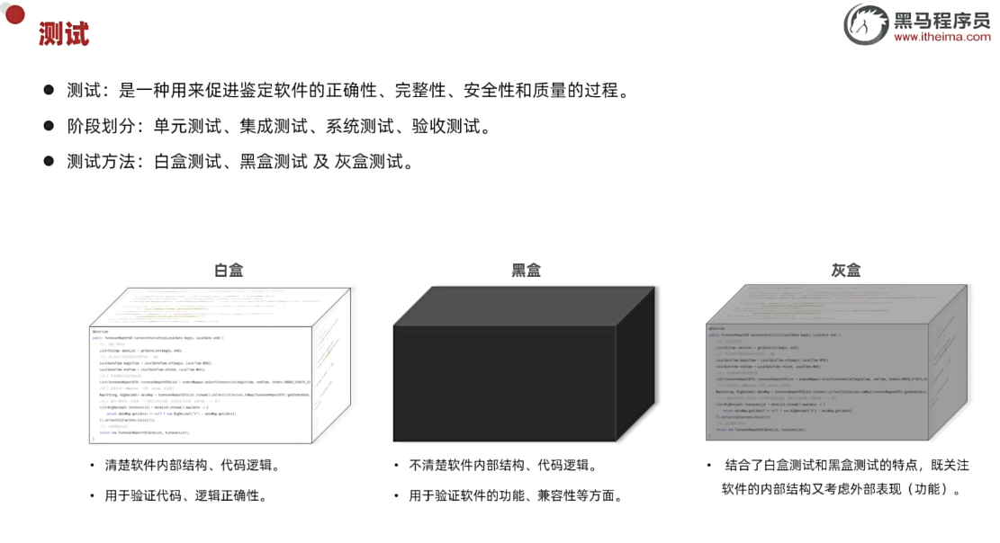

在项目开发中，多使用JUnit单元测试，而不是main方法测试

单元测试运行不报错，仅仅代表运行没问题，并不代表业务逻辑没问题

#### Junit-断言

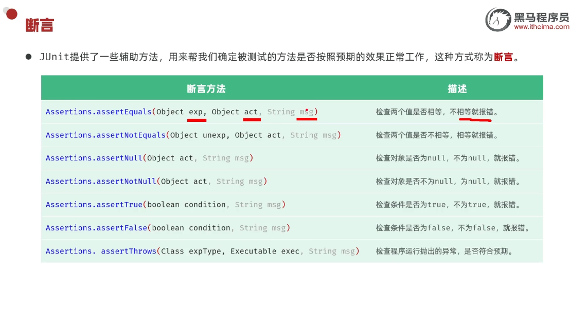
注意这些杂七杂八的断言方法

通过Assertions进行调用

#### Junit常见注解

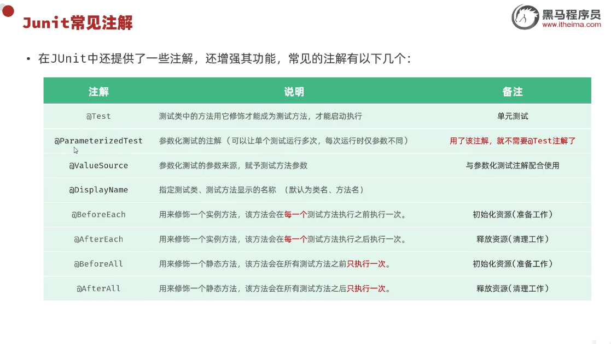

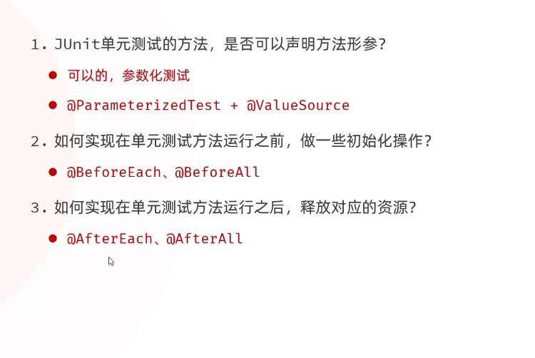

#### 单元测试-企业开发规范

原则：编写测试方法时，要尽可能的覆盖业务方法中的所有可能情况（特别的，注意边界值！）

注意**测试代码**覆盖率

#### 单元测试-Maven依赖范围

在Maven项目中，test目录存放单元测试的代码，虽然可以放在main目录中编写，但是**不规范！**

关于依赖范围，依赖的jar包，默认情况下，可以在任意地方使用。可以使用

```xml
<scope>...</scope>
```

来设置其作用范围
默认的compile在主程序、测试、打包阶段都能使用

## Web基础

此部分是后端真正的入门，很重要！

关于**静态资源**和**动态资源**

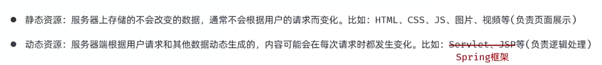

B/S架构：Browser/Server， 浏览器/服务器架构模式。客户端只需要浏览器，应用程序的逻辑和数据都存在服务器端（维护方便 体验一般）

C/S架构：Client/Server， 客户端/服务器架构模式。需要单独开发维护客户端

### SpringBoot Web 入门

实际上是基于SpringBoot开发一个web入门程序

此时这个小项目仅仅是了解

### HTTP协议

注意区分"http://"和"https://"

所谓的HTTP协议，指的是**超文本传输协议**，规定了**浏览器**和**服务器**之间数据传输的规则


特点：

1. 基于**TCP**协议：面向连接，安全
2. 基于请求-响应模型的：一次请求对应一次响应
3. HTTP协议是无状态的协议：面对事务处理**没有记忆能力**，每次请求-响应都是独立的。也就是说，速度很快，但是多次请求之间不能共享数据

#### HTTP-请求协议

请求数据格式：
第一行：请求行（请求方式、资源路径、协议）
第二部分：请求头（格式：key:value）
第三部分：请求体（POST请求，存放请求参数）

#### HTTP协议-请求数据获取

Web服务器（Tomcat）对HTTP协议的请求数据进行解析，并进行了封装（HttpServletRequest），在调用Controller方法的时候传递给了该方法

HTTP请求数据不需要程序员自己解析，web服务器负责对HTTP请求数据进行解析，并封装为了请求对象

#### HTTP协议-响应数据协议

响应行、响应头、响应体

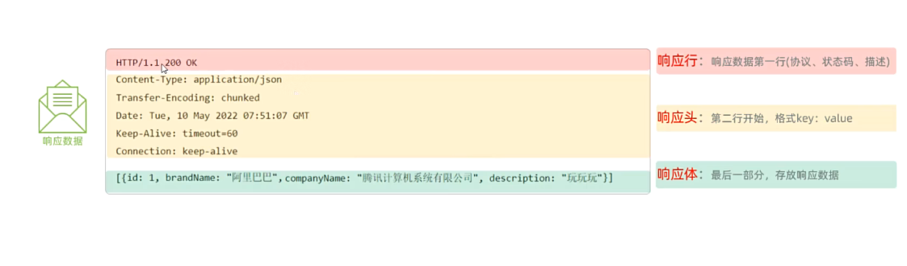

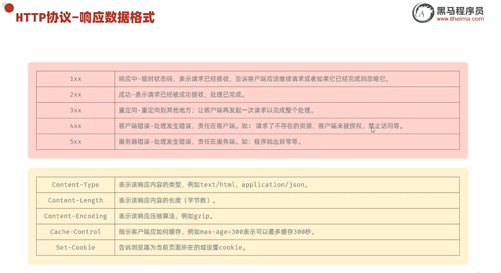

200表示成功响应，**客户端请求成功**

4开头的状态码最典型的是404

500表示**服务器发生不可预期的错误**

关于封装好的HttpServletResponse类与对象

注意：**HTTP响应数据不需要程序员手动设置**

而对于响应状态码、响应头，通常情况下，我们无需手动制定，服务器会根据请求逻辑自动设置

### Springboot入门案例

关于注解@RestController
其底层封装了@ResponseBody

要把静态资源存放在resource/static文件夹下

@ResponseBody注解的作用

1. 将Controller方法的返回值直接写入HTTP响应体
2. 如果是对象或者集合，会先转为json，再响应
3. @RestController = @Controller + @ResponseBody

### 分层解耦-三层架构

数据访问->逻辑处理->接受请求、响应数据

三层架构：**Controller+Service+Dao**

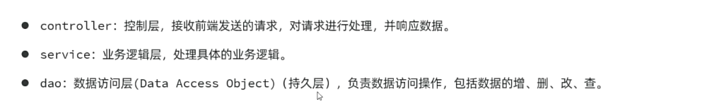

拆分代码是为了遵循单一职责原则，便于复用和后期维护

#### 分层解耦

目标：**高内聚低耦合**

控制反转：IOC(Inversion Of Control)，简称**IOC**，对象的创建控制权由程序本身转移到外部（容器），涉及到**IOC容器**
依赖注入：DI(Dependency Injection)，简称**DI**，容器在为应用程序提供运行时，所依赖的资源，称为**依赖注入**
Bean对象：IOC容器中创建、管理的对象，称之为**Bean**

#### IOC&DI入门

如何将一个类交给IOC容器管理？
@Compent（加在实现类上，而不是接口上）

从IOC容器中找到该类型的bean，然后完成依赖注入的方法：@Autowired

#### IOC详解

声明bean的注解：
@Compent
@Controller
@Service
@Repository

注意事项：
在Springboot集成web开发中，声明控制器bean只能用@Controller

声明bean的注解想生效，需要被扫描到，启动类默认扫描当前包及其子包

#### DI详解

关于**依赖注入**

基于@Autowired进行依赖注入的常见方式有三种

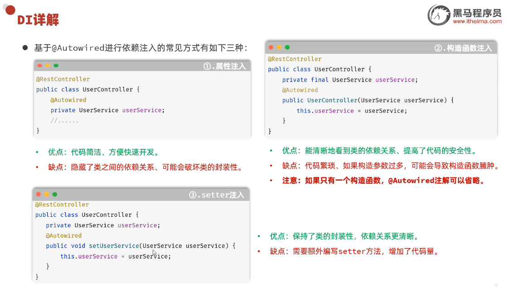

一般来说用第一种或者第二种

@Autowired注解，默认按照**类型**进行注入

**如果存在多个相同类型的bean，会报错！**

解决方案：

1. @Primary
2. @Qualifier + @Autowired
3. @Resource

@Autowired是Spring框架提供的注解，而@Resource是JavaEE规范提供的
