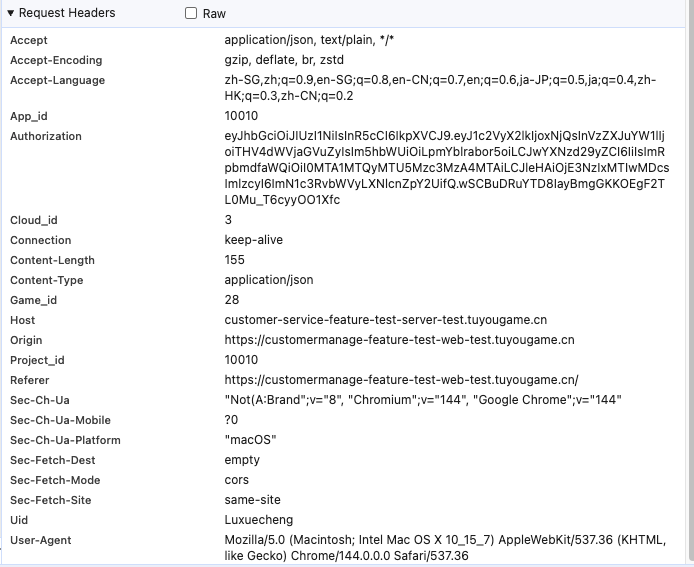

# Log Recording of 202602

Written on 0201

- [x] the monthly report
- [x] the requirement of Wechat interface research
- [ ] if have spare time, build the website

Gradually, I discovered something: instead of scheduling many things every day, it's better to prioritize tasks. This way, I actually have more time left for myself.

---

Written on 2026.02.02

- [x] write the daily report of 20260202
- [x] remember to write the monthly report of January
- [ ] exercise three algorithm problems
- [ ] read the code of the relization of Wechat User message sending
- [ ] learn the kafka
- [x] leran the Apollo

I find a very fucking problem, if you use the command "/clear", then the fucking claude code will close the latest context of session before, **then, it is essential ! You should use the command "/resume" to find the fucking history session**, the folish Gemini don't provide for me the correct command, fuck it.

对了，还有一个事，需要补题：上周和上上周的三场周赛，不过这个优先级可以往后放一下。

---

Written on 2026.02.04

记得明天早上写日报

回去写几道算法题，然后看一下mysql的八股。

今天主要是开发对黑白名单crud，以及记录操作日志的需求。对“配置”这个东西有了初步的认识，本周末要好好理一下上个月的产出。

之后可以考虑投一下momenta，因为前两天他们来要简历了

---

Written on 02.05

还有一个很抽象的事，以后要学会看日志，那个日志不知道在哪个平台上面，一会先查一下。

- [x] 对于激励服黑白名单需求开发的一部分

这个需求基本搞完了，但是感觉service层的代码很多不靠谱。还有，后面要好好看一下啊这部分的代码，以及师兄在上面修改过的部分。因为这算是我独立开发的一个功能模块，挺重要的。

- [ ] 重新和产品对齐调研企业微信用户标签与详细信息的需求
- [ ] 周五之前要给出一个客服系统的春节期间保障方案，关于服务稳定性和节假日服务保障

---

Written on 2026.02.06

- [x] 记得回复牛客那哥们的消息
- [x] 回复leetcode的同学们

字节 byteintern 已经约面，好好准备吧！

---

Written on 2026.02.07-08

- [ ] 对于此次“提现风控”模块出现所有问题的整理
- [ ] 准备一下另一个需求的文档：crm的优化开发。把代码看一下，理清里面的是啥玩意，然后准备一个技术方案。这个明天必须弄完，不拖。
- [ ] leetcode照常推进，打一下周赛，刷3道dp
- [x] 看mysql的文章
- [x] 记得写周报（**高优先级**）
- [x] 还有一个很重要的事，明天更新一下简历，然后投递腾讯暑期提前批！（**高优先级！**）

---

这周要搞完的事情：（02.09-02.15）

有些事情这周**必须弄完**，已经拖了很久很久了。

- [ ] 整理京东一面（并且整理分析怎么回答）
- [ ] 本地部署一下那个推送各家大厂技术团队推文的项目；
- [ ] 搭建个人的博客（博客园 + .github.io）（话说这两个是能同步的么，到时候研究一下）
- [x] 看一下蒋师兄文章中，关于实习过程学习的方法

**Essential:**

刚刚阅读了一下师兄的暑期实习转正心得，完成接到的需求和开发是基本的。更重要的，是提升自己对系统和业务的理解。平时需要多输出文档，梳理业务和系统。**服务提供了什么功能？和上下游如何交互？主要处理哪些业务？相关的技术要点如何实现？**这些都是需要思考和学习的，然后要进行总结，写成文档，发到博客上去，对外输出自己的思考和想法。

关于几个常见面试考察算法的复习：

- [ ] LRU Algorithm Exercise
- [ ] 接雨水
- [ ] 快速排序复习
- [ ] 归并排序复习
- [ ] 平方根 算法
- [ ] 立方根算法
- [ ] 看项目代码：付费管理 part
- [ ] **internal/dao/dao_content_audit/audit_punishment_dao**.go，需要仔细看一下这个dao的实现机制；service层的代码其实没那么重要，但是DAO层的很重要！
- [ ] 阅读 internal/conf/目录下的代码，思考关于 Apollo 配置中心的调优
- [ ] 阅读 internal/service/notify 目录下的代码，了解客服系统的通知机制是如何实现的。

---

Written on 2026.02.09-02.12

- [x] 明天记得问一下扣税的事情

扣税实际上就扣了几十块钱，还有一百多是因为01-03没有入职，少的房补。这个房补政策也是抽象，不应该出勤满了就给满么，怎么按这个比例算的。

- [x] 记得写日报

写个蛋，不写。

- [x] CRM需求开发技术文档写完

这个写的依托勾式，被打回了，**后面重新写**。

- [ ] 阅读MySQL 和 JVM 的八股
- [ ] 阅读MySQL 45讲之第二讲
- [x] Algorithm exercise 3 problems
- [x] 听Kafka的课程
- [ ] 整理对于此次“提现风控”模块出现所有问题的整理，注意还有一个事别忘了，就是那个前端URL中的内容分别代表了什么？比如?和?那些东西是什么意思
- [ ] 整理京东的一面，然后再看一篇面经

后续暑期实习的投递简历实际上可以不断优化一下，不过这个事暂时不着急，等寒假里好好整一下，然后字节 byteintern 面试之前把简历换掉。

好累啊，事情真多

我说实话，我现在只想赶紧睡觉，好累啊。后天去医院把这个火疖子看一下病，不知道为什么这么痛。

Written on 0213 of the following content

终于放假了诶，开心，哈哈哈

假期好好准备一下算法、八股、还有项目的事。同时把从1月初到现在的产出理一下，准备3月头上的面试。

明天上午去航空总医院看一下病，下午去理个头发。

一会晚上别的事暂时先不干了，先搭建一个博客。然后春节期间一边复习八股和项目，一边写文章。

---

Written on 2026.02.14 - 02.16

今天凌晨又失眠了，四点钟才睡着。整个一月份到现在的作息实在是太逆天了，必须利用假期时间好好调整一下。

今天安排的学习和工作计划（不必安排很多，但是安排的必须做完）：

- [x] 搭建完毕网站

拖了很久，终于把博客园前端网页给搞好了，哈哈哈！以后写的文章也可以同步发到博客园上去了，学习动力进一步提升！

不过之后还有一个事，我那个 GitHub.io 也需要搭建一下，以便收录的文章实时同步。

- [x] 剪头发
- [x] 去医院看病

byd北京看个病怎么都这么贵，甚至挂个号都要50，服了。以后晚上早点睡，避免再生奇奇怪怪的病了。钱宁可都吃到肚子里，也不要送给医院，不然实在是太糟心了。今晚要早点睡觉，明天早点起来。调整作息，形成一个健康的生活状态。

- [ ] 3 algorithm exercise learning
- [ ] Kafka learning
- [ ] Agent Project Learning
- [ ] MySQL Articles learning.

---

Written on 2026.02.18

从2.15-2.18这四天在北京市旅行了几处景点，分别去了居庸关长城、天安门和人民英雄纪念碑。2.15本来打算去地坛公园的，结果因为准备庙会闭园了。遂步行经建国门和长安街去天安门广场，结果到了之后才知道得预约才能进去，哈哈哈。

遂2.16前往的居庸关成为了到北京旅行之后的第一站，长城要塞的风景真是好啊。年初一终于去成了天安门和纪念碑，虽然排队排了很久，但是进入广场后还是非常值得的。

这两天玩够了，后面几天好好静下心来。一是收拾一下公司的Project，理一下接到的几个需求，然后形成文档，包括返工的那个技术文档；二是准备八股+项目拷打，迎接下个月的面试；三是好好刷算法，同样为面试准备；四是准备今年的开源计划（OSPP + GSoC）

---

Written on 2026.02.19

我发现一个事，以后学习的时候，要专注于一个目标不要分心。听课or在coding的时候直接把手机关机，别的什么破事全部不管。如果要查一个资料，跳转网页的时候不要东一榔头西一棒，要快刀斩乱麻！

同时，以后不要每天盲目的制定很多计划，而是有步骤的执行。先干，再写总结。

今天干的活：（实际上下午三点才开始学习，因为早上起的太晚了，而且午饭出去吃的）

- [x] learn the general knowledge of AI & LLM
- [x] learn the project of rag basic
- [x] learn the go routine and lc 1114
- [ ] after come back, read the underlying principles of go routine
- [ ] read several articles of MySQL
- [ ] read the info of JVM

---

Written on 2026.02.20
cur day work:

- [ ] learn the project RAG day-02;
- [ ] algorithm exercise, dp + listnode + concurrent.
- [x] learn the difference of concurrent programming between process, thread and coroutine.
- [ ] read the tech articles of mysql.

remember to wake up early tomorrow, so I need to sleep early today.

---

Written on 2026.02.21

给我记住，在MAC上的截屏键是command + shift + 4，别再忘记了

今天继续学习RAG Project，练习算法。然后看mysql的文章，去看两篇面经。

今天晚上净搁这配这个sb环境了，现在在本地能成功调用deepseek-r1:1.5b的模型，要是我有卡就好了，就不用调用这么弱智的小模型。

晚上回去之后看两篇技术文章，明天去整一下客服系统的那个CRM需求，然后继续弄Agent Project。

---

还有九天，字节跳动后端开发一面

这段时间的重心，主要集中于整理实习经历（整理产出）+搞定Agent项目（前置：RAG+MCP）+刷熟练算法，八股是真来不及背那么多了，重点围绕发出来的面经+小林coding（mysql+redis+kafka+jvm+go底层+JavaSE+os+ComputerNet）

- [x] 今晚重新修改一下那个需求文档，仔细看一下代码
- [ ] 继续整那个RAG项目
- [ ] 练算法

Functional Options Pattern **函数式**选项模式，一种设计模式

在一定意义上，属于**函数式编程**的范畴。接收多个函数，函数内部可以传入一个结构体指针作为参数。多个函数对同一个struct* 进行操作，最终在DAO层进行赋值。减少冗余代码，同时起到**配置**的效果。

这个点可以去写到简历上，作为一个优化点。

```go
func (d *churnDao) QueryChurnRecords(ctx context.Context, opts ...QueryOption) ([]*model_vip_scrm.ChurnRecord, int64, error);
```

今天在读代码的时候读到一个很奇葩的地方，后来查了一下发现，这是对可变参数opts的接收，也就是一次可以传入一至多个opts类型的参数，在此处是**函数类型**

Written on 2026.02.23

---

Written on 2026.02.24

## 0224 Target

困成啥比了，真的困。昨晚只睡了五个小时不到，byd不知道为什么总是失眠。

以后养成一个习惯，每天晚上11点半吃一下安眠药

关于今天要做的（work and preparation for interview）

- [x] 继续弄完CRM需求的技术文档

还有，今晚要早点睡觉。

## Code Findings of 0224

**问题A**：

今天在阅读工程代码的时候发现了一个很奇怪，也是很有意思的现象：

对于数据库字段的更新，其实有两种方式：GORM中的**updates**方法支持两种类型的参数：**Struct**和**Map**

比如下面这段代码：

如果我先创建了一个VipInfo结构体

```go
// 假设这样写
info := model_vip.VipInfo{
    IsDisturbFree: false, // 设为 false
    DisturbFreeReason: "", // 设为空
}
db.Model(&model_vip.VipInfo{}).Where(...).Updates(info)
```

注意，在GORM框架中，有这样一个现象：**默认情况下忽略零值**。那么就意味着，DisturbFreeReason根本不会被更新，还是原来的旧值。此时，就产生了诡异的业务逻辑错误。

为了**显式处理nil和空值**，我们需要使用Map。使用Map[string]interface{}可以强制更新字段，即使那个value是零值。

还是上面那个例子：

```go
updates := map[string]interface{}{
    "is_disturb_free": false, // GORM 会强制将数据库字段更新为 false
    "disturb_free_reason": "", // GORM 会强制将数据库字段更新为空字符串
}
```

其实这边核心目标还是为了保证最终业务逻辑和数据的一致性

**问题B**：

```go
// @gotags: form:"id";validate:"required,gt=0"
```

这是什么玩意，之后看一下啥情况。

## Experience Learning of 0224

我在接这第三个需求的过程中，发现了一个很好的经验。面对臭狗屎一样的需求列表，该怎么做去开发才是最高效的呢？

1. 通读一遍这个需求文档，弄懂它要我干什么；
2. 去系统的前端页面上看看需要在哪些地方进行修改，然后用开发者工具去查看到对应的URL接口，阅读后端对应的源码；
3. 源码阅读的体验非常恶心，很多地方根本看不懂。这个时候，可以先把对应部分的service层和DAO层的代码喂给Claude或者Gemini，让他画出流程图，这样能很大程度的帮助理解源码。
4. 还有一点是要注意的，源码阅读的过程要留意**设计模式** 、**数据库查询**、**系统架构组成**的设计，这一点很重要；
5. 然后直接让AI对新的需求进行开发，当然自己先要想个思路。然后开始写沟槽的技术文档，因为要和前端还有产品对齐需求的看法；
6. 阅读修改后的代码，检查bug在哪，然后前端后端联调，测试，返工修改bug，周而复始这个过程；
7. 交付上线，同时写好上线文档；

后续可以对上面的这一套方法论不断优化总结，形成自己的业务流程开发体系。

---

Written on 2026.02.25

- [x] 企业微信那个调研，做个API调用

这个东西暂时先不管它，后面再说。而且肯定得调用官方的API，不然获取不到数据。

- [ ] RAG Project Finished
- [x] Algorithm Practice
- [ ] 看Kafka的课
- [ ] MySQL Learning
- [ ] 找三篇字节面试的面经看一下，针对性的进行回答，并且整理不会的问题
- [ ] 此外，需要整理一下上次黑白名单需求开发时，出现的一系列问题。进行code review，然后整理出一个复盘文档出来。
- [ ] 看一下codex的效果如何，会不会比Claude code好一点
- [x] 直接进行 CRM 召回流失需求的开发，先和前端沟通一下字段的事情，然后我这边后端代码进行开发

心态要平衡，不要着急，好好准备面试

3.4 字节生活服务部门后端开发一面
3.5 腾讯HR与管理线后端开发一面

## Code Findings of 0225

通过开发者工具，我们可以注意到一个事：



就比如这边这个信息，注意：Content-Type: application/json

也就是说，发过来的数据是json，那么我们的框架需要用json解析器去处理这段数据。

---

Written on 2026.02.26

- [x] 记得给华为官方发个邮件，申请退出原先投递的日常实习流程
- [x] CRM流失召回需求的开发
- [ ] algorithm exercise
- [ ] Kafka Learning
- [x] Agent Learning
- [ ] 看面经

---

Written on 2026.02.27

下周记得投一下**腾讯音乐**的面试

继续弄CRM流失召回需求的开发

米哈游27届暑期实习已经开放

---

Written on 02.28

我是真的麻了，工作+准备暑期两线作战不堪疲扰。

今天晚上回去，我要看一下mysql+redis的小林coding图解，复习一下

然后今天白天光搁这对这个需求了，真累啊

京东那个，下周找个时间点投一下

---

Written on 2026.03.01

- [x] Agent Learning
- [ ] Algorithm Learning
- [ ] MySQL Review
- [ ] Redis Review
- [ ] 腾讯S3部门的两篇面经

---

pdd好像开暑期了，看看最近啥情况

今晚主要突击一下 Agent 项目，以及马丁12306项目中的问题
然后复习MySQL

今天看到这个Agent应用，感觉挺好的，这个是针对哔哩哔哩舆情分析系统的Agent：<https://github.com/fufankeji/BiliAgent>

之后我想做一个针对知乎的，以及微信公众号文章的Agent分析系统，一个原创的Agent System。

Function:

- 首先当然是我自己用，因为知乎上的帖子实在是太杂了，而且它的搜索机制和狗屎一样；
- 同时作为秋招简历的一个原创Project；

---

Written on 2026.03.03

百度的面试推掉了，md实在是没空。字节下周一，腾讯这周四面试。都是放到的晚上面，抓紧复习吧！

少水群，多学习

已经开的几个暑期提前批和正式批，等这个月中旬，集中投递。然后面试全部排到下个月月初。

今天主要看一下Agent Project，再复习一下 OS + 计网。腾讯面试很喜欢问这个。

然后再把实习的产出仔细整理一下

还有，算法也要抓紧复习！

同时，我正式决定，面向暑期实习的八股，需要近期立刻开始复习。时间真的不多了！

月中的时候还有两个厂也投一下：ViVO + 网易

## My Thought On 2026.03.03

我现在发现，做一件事需要考虑的重心是：对于自己能带来什么收益和风险？值不值得去做这件事？

收益：近期/远期

风险：潜在/显然

所以像群内聊天这种事，如果能从中学习到一些内容，带来一些新的学习方向和策略的提升。那么，是值得做的。否则，如果花了过多的时间，那么是浪费了自己的时间，没有必要。

## InterShip Summary of 0303

想到了两个新的点可以放到实习经历中去：

- 利用Casbin进行user鉴权，采用了RBAC模型（这个要复习一下这是什么东西）（于此同时的，这边还涉及到一个有点像的概念：JWT Token 权限验证，不过这个是 HTTP 服务那边的好像。具体是啥我有点忘了，可以再去看看）
- 采用Apollo配置中心管理一堆乱七八糟的的配置，说实话这部分内容近期我还是很晕，携程技术团队的Apollo配置中心中间件的底层原理我也不是很熟悉。这玩意需要研究一下，看看面试如何进行回答。
- 第三点，是关于 DAO 层的设计方式，我记得那个好像用了一个设计模式，这个明天抽空看一下。在字节一面之前，把这个东西加进去。

---
