# Basic Info

## JRE & JDK

$JDK$：$Java$开发工具包，包含$JVM$，核心类库，开发工具。
$JRE$：$Java$的运行环境。包含：$JVM$，核心类库，运行工具。

### JDK，JRE，JVM包含关系

JDK包含JRE，JRE包含JVM

## Java基础语法

字面量：整数、小数类型之类的

制表符\t

变量：

这部分内容和C++几乎一模一样。

注意数据类型中的$boolean$

标识符：这玩意就是变量的名字

**键盘录入**：

$Scanner$类，读取到键盘输入的数据。
导包，创建对象，接受数据。

```java
import java.util.Scanner;

Scanner sc = new Scnaner(System.in);

int i = sc.nextInt();
```

关于IDEA，这个已经装了。

IEDA项目结构
Project->module(模块)->package(包)->class

运算符

这部分内容也和c++几乎差不多
数据类型最终往最大的那个类型转换。

原码、补码

原码：最左边是符号位，0正1负

原码的弊端在于负数计算就会出错

反码：正数的反码不变，负数的反码在原码的基础上，**符号位不变**，数值位取反。

补码：正数的补码不变，负数的补码在反码的基础上+1

注意到：计算机中的存储和计算都是以**补码**形式进行。

### $Java$的内存分配

包含栈、堆、方法区、本地方法栈、寄存器。


关于栈内存和堆内存：
$new$出来的东西在堆上

如果$new$了多次，在堆里面有多个小空间。

这部分和$c++$差不多

### 方法

方法是程序中**最小**的执行单元

便于调用方法，提高代码复用性，提高可维护性。

#### 方法的格式

这个“方法”有点像那个“函数”
形参：方法定义中的参数
实参：方法调用中的参数

#### 重载

同名方法，参数类型或个数不同

$Java$虚拟机会通过不同的参数来区分同名的方法

注意所谓的重载是针对**同一个类**中而言的

#### 方法调用的基本内存原理

对于栈内存而言，方法先进后出。

关于**基本数据类型**和**引用数据类型**

基本数据类型：在栈内存上……
引用数据类型：只要是$new$出来的，就是该类型。在堆内存上分配。

注意到，引用数据类型变量中存储的是地址值，所谓的引用，也就是使用了其他空间中的数据。

#### 方法的值传递

这个和c++差不多，传递引用数据类型时，会改变实际的值。

### 面向对象

……

#### 设计对象

类->对象

用来描述一类事物的类，称为$Javabean$类，此类中**不写main方法**

编写main方法的类称为**测试类**

成员变量中一般无需赋初始化值

#### 封装

对于每一个私有化的成员变量，都需要提供get和set方法

#### this 关键字

复习：关于成员变量和局部变量

定义在**类**中的变量称为成员变量

#### 构造方法

也叫作**构造函数**

创建对象的时候由虚拟机调用，不能手动调用构造方法

如果没有定义构造方法，系统将给出一个默认的无参构造方法
如果定义了构造方法，系统将**不再提供**默认的构造方法

Note：**无论是否使用，最好都手动写上无参构造方法和带全部参数的构造方法**

#### 标准JavaBean类

1. 类名直观
2. 成员变量使用private修饰
3. 提供至少两个构造方法
   1. 无参构造方法
   2. 带全部参数的构造方法
4. 成员函数

#### 对象内存图

字节码文件加载时进入的内存称为**方法区**
方法运行时进入的内存，为**栈内存**
new出来的东西会在**堆内存**开辟空间并且产生地址

##### 一个对象的内存图


##### 两个对象的内存图

调用两个对象时，两个对象在堆内存上占用的空间是各自独立的。

##### 两个引用指向同一个对象

注意这段代码

```java
Student stu1 = new Student();
Student stu2 = stu1;
// 特别注意！此时stu1和stu2指向的是同一片空间！
```

##### 基本数据类型和引用数据类型

基本数据类型：数据值存储在自己的空间中
引用数据类型：数据值存储在其他空间中，自己空间中存储的是**地址值**

##### this的内存原理

this的本质：代表方法调用者的地址值

##### 成员变量和局部变量区别

成员变量是类中方法外的变量（在堆中，随着对象的创建）
局部变量是方法中的变量

### 字符串&API

所谓的$API$就是应用程序**接口**

#### String概述

```java
import java.lang.String
```

String在使用的时候无需导包

创建String对象后，内容不能发生改变。

可以使用字符数组传递创建字符串对象

可以直接赋值，也可以new

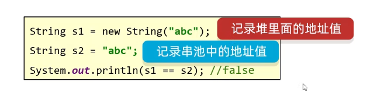

注意朴素的$==$比较方式仅仅是比较字符串存储的地址值 !

#### 字符串比较

boolean equals方法(要比较的字符串) 完全一致为true，否则为false

也就是比较内容

#### StringBuilder

可以看作是容器，创建后其中内容可变

StringBuilder是Java已经写好的类，Java在底层对起进行了特殊处理，打印对象不是地址值而是属性值。

注意善用**链式编程**

#### StringJoiner

可以看做**容器**

提高字符串操作的效率

在$JDK$ $8$出现
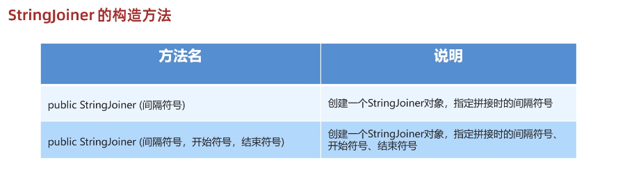

#### 总结

1. String
表示字符串的类
2. StringBuilder
一个可变的操作字符串的容器，可以高效的拼接字符串
3. StringJoiner
JDK8出现，可变的操作字符串的容器。

#### 字符串原理

1. 字符串存储的内存原理
直接赋值会服用字符串常量池中的东西
new出来不会复用，而是开辟一个新的空间

2. ==号比较的东西
基本数据类型比较数据值
引用数据类型比较地址值

3. 字符串拼接的底层原理
拼接的时候如果没有变量，都是字符串，那么会触发字符串的优化机制，在编译的时候即为最终结果
如果有变量，实际上利用的是StringBuilder创建字符串对象
JDK8字符串拼接的底层原理：如果使用"+"拼接字符串，会“预估”去创建StringBuilder对象，然
后进行拼接。
    1. **如果没有变量参与，都是字符串直接相加，编译之后就是拼接之后的结果，会复用串池中的字符串**
    2. **如果有变量参与，每一行拼接的代码，都会在内存中参与创建新的字符串，浪费内存**

4. StringBuilder提高效率原理
所有要拼接的内容都会往StringBuilder中放，不会创建很多无用的空间，节约内存。

5. StringBuilder源码分析
如果预设的容量不够，会**扩容**。
添加的内容大于16会扩容（原先容量 * 2 + 2）

### 集合

```java
ArrayList
```

注意集合中存的类型**不能**是基本数据类型！！！

```java
example.remove("");
example.add("");
example.set(index, "");
example.get(index);
```

#### 基本数据类型对应的包装类

byte -> Byte
short -> Short
char -> Character
int -> Integer
long -> Long
boolean -> Boolean

### 面向对象进阶

#### static

static表示静态，是Java中的一个修饰符，可以修饰成员方法，成员变量。

被static修饰的成员变量，称为静态变量；
被static修饰的成员方法，称为静态方法；

**静态存储位置**（静态区）在堆内存中

静态变量优先于对象而实现，随着类的加载而加载。

实际上，static可以理解为”共享“使用的成员变量，不属于对象，属于类

被static修饰的成员方法，称为**静态方法**

多用于**测试类**和**工具类**

#### 关于$Javabean$类、测试类和工具类

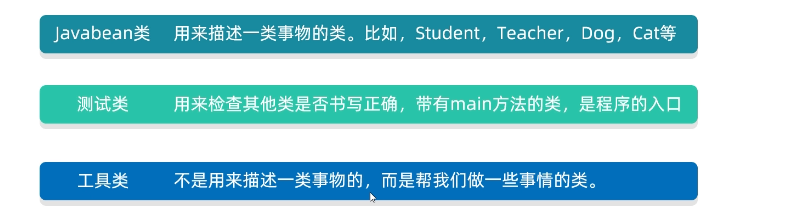

对于工具类，其他类可以直接调用类名去使用其中的方法。

由此，应当**私有化**工具类的构造方法！防止别人创建工具类的对象从而浪费内存。

#### 静态方法、实例方法相关的几点注意事项

1. 静态方法中可以直接访问静态成员，**不可以直接**访问实例成员（可以调用对象访问）
2. 实例方法可以直接访问静态成员，也可以直接访问实例成员
3. 实例方法中可以出现this关键字，静态方法中不能出现this关键字

#### 继承

private: 只能本类
缺省: 本类、同一个包中的类
protected: 本类、同一个包的类、**子孙类**中
**private < 缺省 < protected < public**

##### 继承的特点

1. 单继承：Java为单继承模式，一个类只能继承一个直接父亲
2. Java不支持多继承，但是支持多层继承
3. 祖宗类：Java中所有的类都是Object泪的子类
4. 就近原则：优先访问自己类中，自己类中没有的才会访问父类的。如果一定要使用父类的，则使用super.obj;

#### 方法重写

1. 子类重写父类方法时，访问权限必须大于或者等于父类该方法的权限
2. 重写的方法返回值类型，必须小于等于被重写方法的返回值类型
3. 私有方法、静态方法不能被重写！

#### 子类构造器特点

子类全部的构造器，都会先调用父类的构造器，然后再执行自己。

this(……)的作用是在构造器中调用本类的其他构造器

注意到，**super(……)和this(……)** 必须写在构造器第一行，而且两者不能同时出现。

#### 多态

比如

```java
Animal x = new Wolf();
```

方法：编译看左边，运行看右边
成员变量：编译、运行均看左边

##### 多态的好处

1. 在多态形式下，右边的对象是**解耦合**的，更便于扩展和维护。
2. 定义方法时，使用父类类型的形参，可以接收一切子类对象。扩展性更强、更便利。

多态下产生的一个问题：**多态下不能使用子类的独有功能**

##### 多态下的类型转换

强制类型转换：**子类 变量名 = (子类) 父类变量**

强制类型转换的一个注意事项：
存在继承/实现关系时，可以在编译阶段进行强制类型转换，编译阶段不会报错。
运行时，如果如果发现对象的真实类型与强转后的类型不同，就会报**类型转换异常**（ClassCastException）的错误出来。

可以使用**instanceof**关键字，判断当前对象的真实类型，再进行转换。

### 面向对象高级部分

final、单例类、枚举类、抽象类、接口

#### final

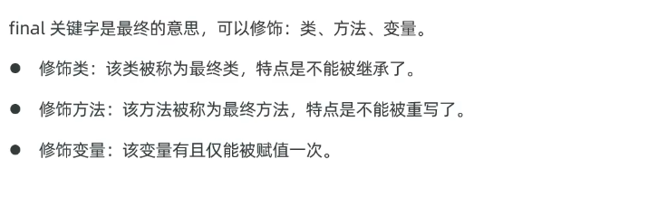

final修饰实例变量一般是没有意义的！

#### 设计模式 之 单例模式

关于设计模式，主要学什么？

1. **解决什么问题？**
2. **怎么写？**

##### 单例设计模式

作用：确保某个类**只能**创建**一个**对象

方法：将类的构造器私有，定义一个静态变量存储类的一个对象，提供一个静态方法返回对象。

对于**饿汉式单例**，即在获取类的对象时，对象已经创建完毕。

对于**懒汉式单例**，即使用对象时，才开始创建对象。

#### 枚举类

枚举都是最终类，不可以被继承，枚举类都是继承java.lang.Enum类的。

枚举类的构造器都是私有的，因此，枚举类对外**不能创建对象**。

##### 枚举类应用场景

适合做信息分类和标志

#### 抽象类

使用**abstract**修饰类，此类即为抽象类；修饰方法，即为抽象方法。

注意点：

1. 抽象类中不一定要有抽象方法，但是用抽象方法的类必须是抽象类。
2. 类有的成员，抽象类都可以有。
3. **最重要的特点**：抽象类不能创建对象，仅仅作为一种特殊的父类，让子类继承并且实现。
4. 一个类继承抽象类，必须重写完抽象类的所有抽象方法。

##### 抽象类的作用

设计抽象类，是为了更好地支持**多态**

##### 模版方法设计模式

提供一个方法作为完成某类功能的模板，模板封装了每个实现步骤，但是允许子类提供特定步骤的实现。

#### 接口

关键字**interface**

传统接口

```java
public interface name {
    // 成员变量（常量）
    // 成员方法（抽象方法）
}
```

特别注意，接口**不能**创建对象！！！

接口是用来被类实现(implements)的，实现接口的类被称为**实现类**，**一个类可以同时实现多个接口**

##### 接口的作用

1. 弥补类单继承的不足，一个类可以同时实现多个接口，使得类的角色更多，功能更强大。
2. 让程序可以面向接口编程，有利于程序的解耦合。

##### JDK8开始，接口新增的三种方法

```java
package com.itheima.interfacenew;

public interface A {
    // 1. 默认方法(普通实例方法)，但是务必加上 default
    // 默认public
    default void go(){

    }

    // 2. 私有方法
    // 即私有的示例方法
    private void run() {

    }

    // 3. 静态方法
    // 特别注意：其只能使用当前接口名来调用！
    static void show() {

    }
}

```

##### 接口的注意事项

1. 接口与接口可以多继承
2. 一个接口可以继承多个接口，如果多个接口存在方法签名冲突，则此时不支持多继承，也不支持多实现。
3. 一个类中继承了父类，又同时实现了接口。如果父类中有和接口中同名的方法，实现类会优先使用父类的。
4. 一个类实现了多个接口，如果多个接口中存在同名的**默认方法**，可以不冲突，这个类重写该方法即可。

这部分内容不是很重要，了解即可。

#### 区分抽象类和接口

相同点：

1. 都是抽象形式，都可以有抽象方法，都不能创建对象
2. 都是派生子类形式，抽象类被子类继承使用，接口是被实现类实现。
3. 一个类继承自抽象类，或者实现接口，都必须重写完他们的抽象方法，否则自己要成为抽象类。不然会报错！
4. 都支持多态，都能实现解耦合。

不同点：

1. 抽象类可以定义类的全部普通成员，而接口只能定义常量、抽象方法。
2. 抽象类只能被类单继承，而接口可以被类多实现。
3. 抽象类体现模板思想，更利于作为父类实现代码的复用性；接口更适合作为功能的解耦合。

### 面向对象高级

代码块、内部类、函数式编程、常用API、GUI编程

GUI编程没什么用，了解即可

#### 代码块

类的五大成分：成员变量、构造器、方法、代码块、内部类

##### 静态代码块

格式：**static{}**
类加载时自动执行，静态代码块只会执行一次，完成对类的初始化

##### 实例代码块

格式：**{}**
每次创建对象时，执行实例代码块，并在构造器之前执行。

#### 内部类

如果一个类定义在另一个类的内部，则称该类为**内部类**

##### 静态内部类

有static修饰的内部类，属于外部类自己持有。

##### 局部内部类

比如说在一个方法中定义一个内部类

这玩意是鸡肋语法，屁用没有

##### 匿名内部类

是一种特殊的局部内部类
所谓匿名：指的是程序员不需要为这个类声明名字，默认有个隐藏的名字

特点：匿名内部类本质上是一个子类，并且立即会创建出一个子类对象

与此同时，它还起到**简化代码**的作用！

#### 函数式编程

Lambda， 方法引用

##### Lambda

可以用于替代某些匿名内部类对象，让程序更加简洁

注意：**Lambda表达式只能替代函数式接口的匿名内部类！！！**

函数式接口：**有且仅有一个**抽象方法的接口。

原理：上下文推断

Java中的函数更有**对象**的意味

进一步简化Lambda表达式

1. 参数类型可以全部省略不写
2. 如果只有一个参数，参数类型省略的同时也可以省略"()"

##### 方法引用

###### 静态方法引用

类名::静态方法

###### 实例方法引用

对象名::实例方法

###### 特定类型方法的引用

特定类的名称::方法

###### 构造器引用

类名::new

比如

```java
CarFactory cf = Car::new;
```

这种东西非常鸡肋，在特地的场景下才会发挥作用，了解即可。

#### 常用API

##### ArrayList

调用API

#### GUI编程

这个东西现在企业不怎么用，了解即可。

这玩意就是那个**图形化界面**

## Java加强

### 异常、泛型、集合框架

Java.lang.Throwable

Exception分为运行时异常（RuntimeException）和编译时异常

#### 异常的基本处理

抛出异常(throws)

捕获异常(try...catch)

#### 异常的作用

1. 异常用于定位程序bug的关键信息
2. 作为方法内部的一种特殊返回值，以便通知上层调用者，方法的执行问题。

#### 自定义异常

自定义**运行时**异常和自定义**编译时**异常

自定义运行时异常：继承RuntimeException
自定义编译时异常：继承Exception

#### 异常的处理方案

1. 底层异常层层向上抛出，最外层捕获异常，记录下异常信息，并响应适合用户观看的信息进行提示
2. 最外层捕获异常后，尝试重新修复

### 泛型

提供了在编译阶段约束所能操作的数据类型，并且有自我检查的能力。这样可以避免强制类型转换，以及可能出现的异常。

同时声明了一个或者多个类型变量
比如：\<E\>

本质：将具体的数据类型作为参数返回给类型变量

### 泛型类

类型变量：常用的有E，T，K，V等

### 泛型接口

……示例代码

```java
package com.itheima.demo3genericity;

public interface Data<T>{
    void Add(T s);
    void delete(T s);
    void update(T s);
}
```

### 泛型方法、通配符、上下限

```java
public static <T>void test(T t) {

}
```

**通配符**就是"?"，可以在"使用泛型"的时候代表一切类型，E T K V 是在定义泛型的时候使用

```java
public static void go(ArrayList<?> cars) {

}
```

泛型的上下限：
泛型上限：? extends Car: ?能接收的必须是Car或者其子类
泛型下限：?super Car: ? 能接收的必须是Car或者其父类

### 泛型支持的类型

泛型不支持基本数据类型，只能支持引用数据类型（对象类型）

注意其中两个
int -> Integer
char -> Charatcer

**自动装箱**和**自动拆箱**

自动装箱：比如

```java
Integer it = 100;
// 等价于
Integer it = Integer.valueOf(100);
```

自动拆箱：比如

```java
int i = it;
System.out.println(i);
```

#### 包装类具备的其他功能

可以把基本类型的数据转换成字符串类型

```java
public static String toString(double d);
public String toString();
```

但这个东西很鸡肋，数据转换成字符串后面加个""就行了

可以把字符串类型的数值转换成数值本省对应的真实值

```java
public static int parseInt(String s);
public static Integer valueOf(String s);
```

### 集合框架

两类，一类Collection，另一类Map

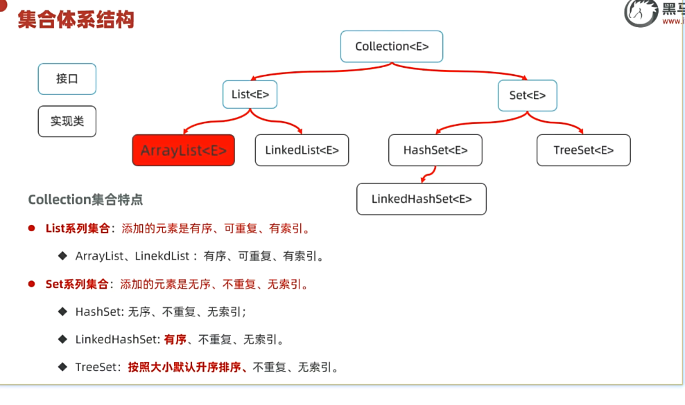

单列集合的代表是Collection，双列集合的代表是Map

#### Collection的三种遍历方式

a. **迭代器遍历**
b. for循环
c. Lambda表达式（注意其中的简化）

#### 三种遍历方式的区别

遍历集合的同时又存在增删集合元素的行为时可能出现业务异常，这种现象被称为**并发修改异常问题**

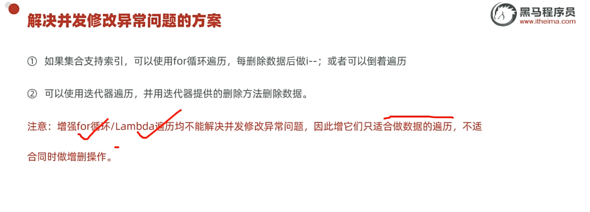

### List集合

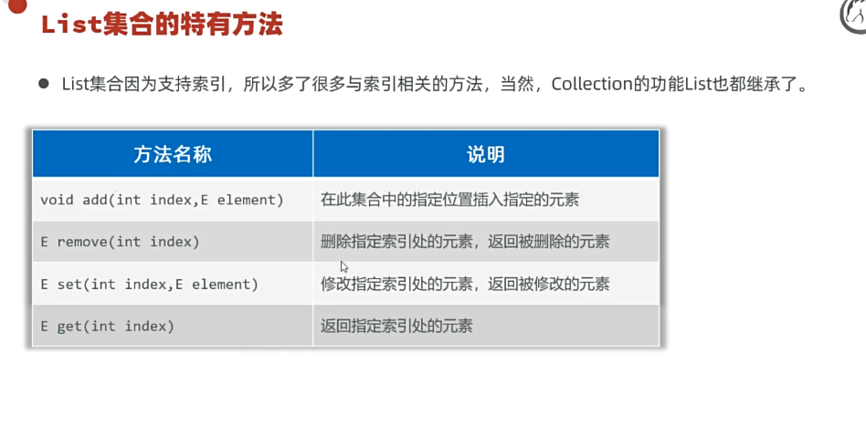

#### ArrayList和LinkedList底层原理

ArrayList底层基于**数组**存储数据
ArrayList查询速度快（根据索引查询数据快），增删数据效率很低。

LinkedList底层基于**链表**存储数据
LinkedList基于双链表实现，增删相对快，查询慢，首尾操作很快

### Set集合

HashSet：无序、不重复、无索引
LinkedHashSet：有序、不重复、无索引
TreeSet：排序、不重复、无索引

#### HashSet集合的底层原理

哈希值是一个int类型的**随机值**，Java中每个对象都有一个哈希值
Java中所有对象，都可以调用Object类提供的hashCode方法，返回该对象自己的哈希值

基于**哈希表**存储数据

哈希表 = 数组+链表+红黑树

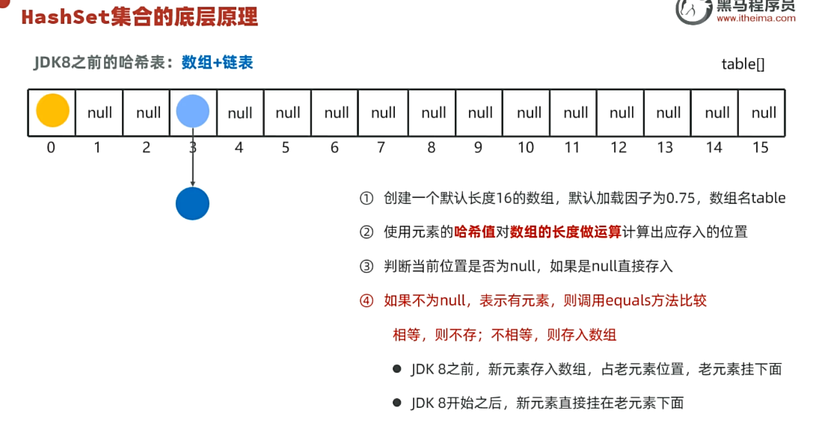

自JDK8开始，当链表程度超过8，且数组长度超过64，自动将链表转为红黑树

如果希望Set集合认为两个内容一样的对象是重复的，**必须重写对象的hashCode()和equals()方法**

例子

```java
@Override
    public boolean equals(Object o) {
        if (o == null || getClass() != o.getClass()) return false;
        Student student = (Student) o;
        return age == student.age && Objects.equals(name, student.name) && Objects.equals(gender, student.gender);
    }

@Override
    public int hashCode() {
        return Objects.hash(name, age, gender);
    }
```

#### LinkedHashSet的底层原理

依然基于哈希表（数组、链表、红黑树）实现
每个元素额外多了一个双链表的机制记录它前后元素的位置

#### TreeSet集合

不重复、无索引、可排序
底层基于**红黑树**实现的排序

对于自定义类型比如Student对象，TreeSet默认无法直接排序

### Map集合

键值对集合
Map<K, V>

#### 遍历方式

1. 键找值
public Set\<K> keySet(); 获取所有键的集合
public V get(Object key); 根据键获取其对应的值

2. 键值对
需要将Map集合转换成Set集合，然后根据键值对去遍历

```java
Set<Map.Entry<K, V>> entries = map.entrySet();
```

然后分别去取Key和Value

（这个遍历方式真的抽象）

#### Lambda表达式法遍历

```java
map.forEach(k, v)->{
    System.out.println(k + "=" + v);
}
```

#### Map集合的实现类

**HashSet**的底层实现基于**HashMap**

**TreeMap**底层基于红黑树实现排序

### Stream流

```java
java.util.stream.*
```

用于操作集合或者数组的数据

Stream流大量的结合Lambda的语法风格用于编程

对**流**进行操作

#### 收集Stream流

关于Stream流的**终结方法**

Stream流只是方便操作数据的手段，而集合/数组才是开发中的目的。

### File-IO流

File类只能对文件本身进行操作，**不能读写文件里面存储的数据。**

IO流用于读写数据（可以读写文件，或者网络中的数据）

使用**mkdir**创建一级文件夹是可行的，但是无法创建三级文件夹。

创建多级文件夹需要使用**mkdirs**

对于使用delete()删除文件夹，只能删除空文件夹。

获取某个文件夹下所有的一级文件名方法：list()

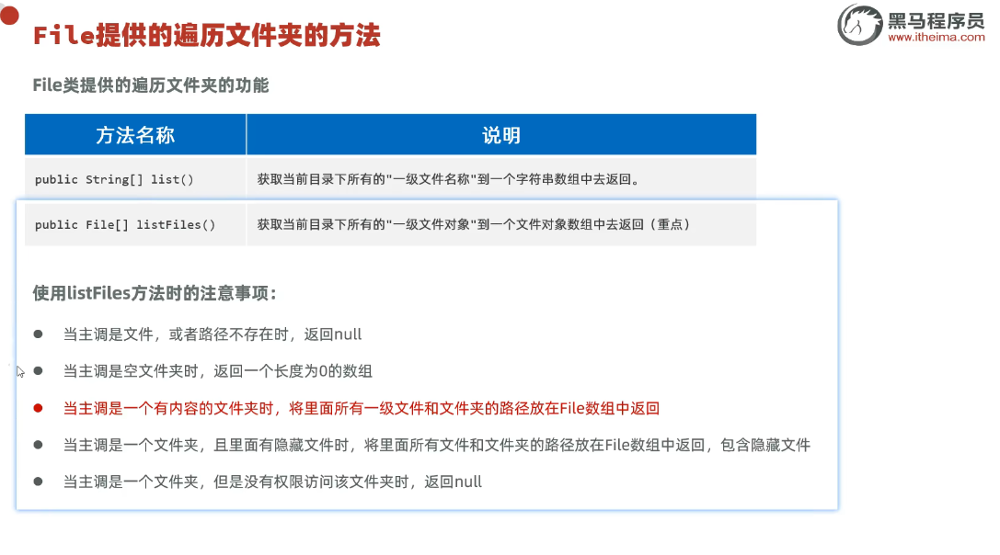

### 方法递归

这个递归算法没什么好细究的，就是dfs

#### 方法递归-文件搜索

...实际上讲了一个例子

### 字符集

标准ASCII字符集 128个字符

GBK 国标

Unicode 万国码

UTF-8 属于**可变长**编码方案

字符编码和解码使用的字符集必须一致！否则会出现乱码

英文和数字一般不会出现乱码（难怪大家都那么喜欢全英文编码，属实好使）

### IO流

流的方向：输入流、输出流
流的内容：字节流、字符流

#### 字节流

InputStream、OutputStream

字节流非常适合做文件的**复制**操作

任何文件的底层都是字节
所以复制文本、图片、视频啥的都行

#### 资源释放问题

资源释放的方案：try-catch-finally

其实从JDK 7开始，提供了更加简单的资源释放方案：try-with-resource

#### 字符流

FileReader文件字符输入流
以内存为基准，把文件中的数据按照字符的形式读入到内存中去

#### 缓冲字节流&缓冲字符流

字节缓冲输入/输出流：BufferedInputStream、BufferedOutputStream
字符缓冲输入/输出流：BufferedReader、BufferedWriter

字节缓冲流能提高字节流读写数据的性能

BufferedWriter自带8K的字符缓冲池，可以提高字符输出写字符数据的性能

其新增的功能：

```java
public void newLine();
```

#### 性能分析

……

#### 其他流

字符输入转换流：InputStreamReader

用于解决不同编码时，字符流读取文本内容乱码的问题

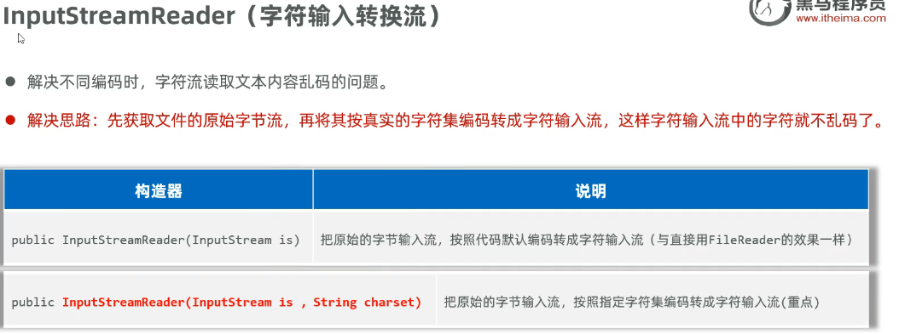

重点是下面那个

```java
InputStreamReader(InputStream is, String charset);
```

关于**打印流**

PrintStream和PrintWriter

无论内容是什么，接受什么就打印什么

#### 特殊数据流

**DataOutputSteram** 数据输出流

允许将数据及其类型一并写出

```java
public DataOutputStream(OutputStream out);
```

#### IO框架

**很重要！**

可以简化大量的字节、字符、缓冲流的处理
调用封装的API

关于**框架**的概念，**Framework**

### 多线程

线程 Thread

注意：**启动线程必须是调用start方法，而不是调用run方法**

原因：

1. 直接调用run方法会当成普通方法执行，此时相当于单线程执行
2. 只有调用start方法才是启动新的一个线程执行

注意：**不要把主线程任务放到启动子线程之前**

方式一：继承Thread
方式二：实现Runnable接口
方式三：实现Callable接口

方式一、二都存在一个问题：线程执行完毕后，不能直接返回结果

为了**返回线程执行完毕后的结果**，JDK5.0提供Callable接口和FutureTask类来实现多线程的另一种创建方式

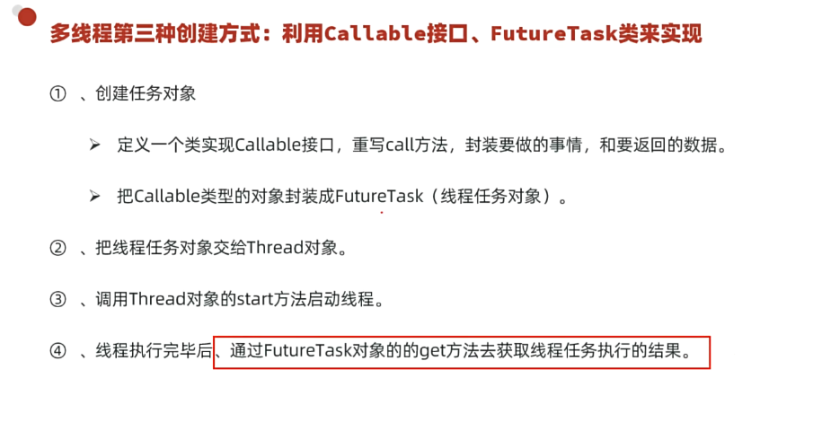

#### 线程安全

多个线程，同时操作一个共享资源的时候，可能会出现**业务安全**问题。

#### 线程同步

1. 同步代码块
2. 同步方法
3. lock锁

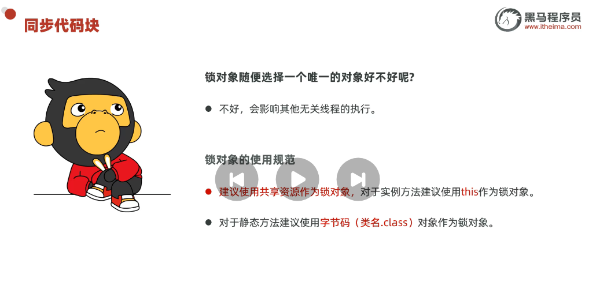

关于**同步方法**：

其实同步代码块的性能要比同步方法好一点

关于**Lock锁**：
Lock是接口，不能直接实例化，可以用其的实现类ReentrantLock来构建Lock锁对象

#### 线程池

线程池是一个可以**复用**线程的技术

不用线程池的问题：比如这个问题：淘宝平台的一亿个用户是否造成一亿个进程？

**工作原理**：
设定 工作线程WorkThread 和 任务队列 WorkQueue

##### 如何创建线程池

代表线程池的接口：ExecutorService

方式一：使用ExecutorService的实现类ThreadPoolExecutor自创建一个线程池对象

方式二：使用Executors（线程池的工具类）调用方法返回不同特点的线程池对象

```java
public ThreadPoolExecutor(int corePoolSize, 
int maximumPoolSize, 
long keepAliveTime, 
TimeUnit unit, 
BlockingQueue<Runnable> workQueue,ThreadFactory threadFactory, 
RejectedExecutionHandler handler
)
```

**什么时候开始创建临时线程？**
新任务提交时发现核心线程均在忙，任务队列也满了，并且此时还可以创建临时线程，此时才会创建临时线程。

**什么时候会拒绝新任务？**
核心线程和临时线程都在忙，任务队列也满了，新的任务过来的时候才会开始拒绝任务

留意一下这几个任务拒绝策略
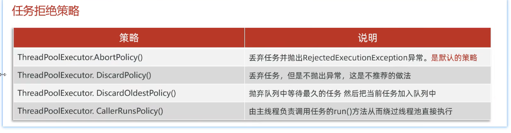

段子：**对方不想理你，并向你抛来一个异常**

##### 处理Callable任务

使用ExecutorService的方法
Future\<T\>submit(Callable\<T\> command)

##### 使用Executors创建线程池

Executors是一个线程池的工具类，提供很多静态方法用于返回不同特点的线程池对象

线程池ExecutorService的实现类：ThreadPoolExecutor

**Executors是否适合做大型互联网场景的线程池方案？**
不合适
建议使用**ThreadPoolExecutor**来指定线程池参数，这样可以明确线程池的运行规则，规避资源耗尽的风险

##### 并发、并行

正在运行的程序（软件）就是一个独立的进程
线程是属于进程的，一个进程中可以同时运行很多个线程
**进程中的多个线程实际上是并发/并行执行的**

对并行的理解：在同一个时刻上，同时有多个线程被CPU调度执行

而多线程是并发/并行同时执行的，两者兼有之

### 网络编程

让设备中的程序与网络上其他设备中的程序进行**数据交互**

基本的通信架构有两种形式：

1. CS架构（Client客户端/Server服务端）
2. BS架构（Browser浏览器/Server服务端）

```java
java.net.*
```

提供了网络编程的解决方案

**网络通信三要素**：IP地址、端口、协议

#### IP地址

IP（Internet Protocol）互联网协议地址

目前广泛使用的IP地址形式：IPv4、IPv6

IP域名（Domain Name）

例如：csdiy.wiki

DNS域名解析：充当互联网的“电话簿”

公网IP、内网IP：

内网IP：又叫局域网IP，是只能在组织机构内部使用的IP地址

本机IP：
127.0.0.1、localhost

IP常用命令：
ipconfig:查看本机IP地址

#### 端口

标记正在计算机设备上运行的应用程序

端口分类：周知端口、注册端口、动态端口（动态分配）

#### 协议

**通信协议**：事先规定的连接规则，以及传输数据的规则

开放式网络互联标准：OSI网络参考模型

但是事实上的国际标准：TCP/IP网络模型

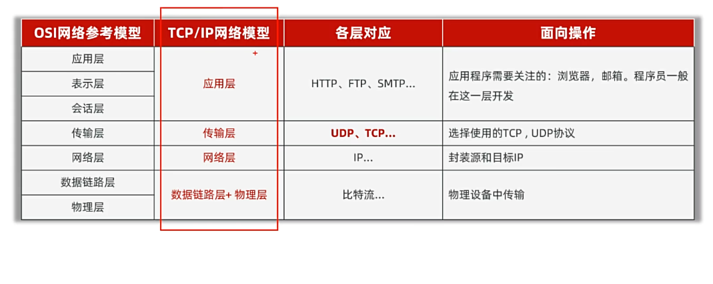

**关于传输层的2个通信协议**：UDP、TCP

UDP协议：无连接、**不可靠**通信
TCP协议：面向连接、可靠通信
最终目的：要保证在不可靠的信道上实现可靠的数据传输
三次握手建立可靠连接，传输数据进行确认，四次挥手断开连接

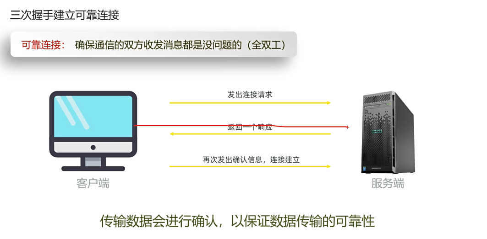

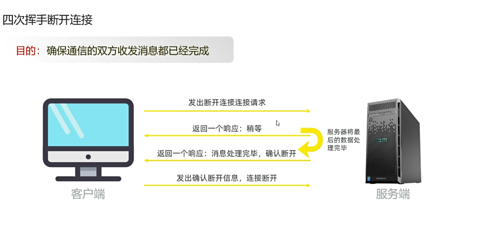

#### UDP通信的实现

```java
java.net.DatagramSocket
public DatagramSocket()
public DatagramSocket(int port)
```

关于UDP通信的**多发多收**

#### TCP通信的实现

特点：面向连接、可靠通信
“三次握手”建立可靠连接，实现端到端通信

```java
java.net.Socket
```

服务端基于java.net包下的ServerSocket类来实现

#### TCP多发多收

开个循环接受消息

#### 同时接受多个客户端消息

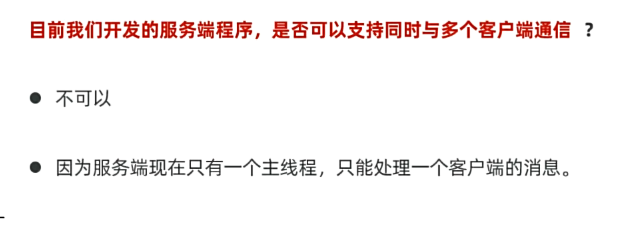

CS架构为客户端-服务端模式

B/S架构为浏览器-服务端模式

对于B/S架构，实际上浏览器代替了原先的客户端

浏览器根据

```css
http://服务器IP:服务器端口
```

HTTP协议规定：响应给浏览器的数据必须满足的格式

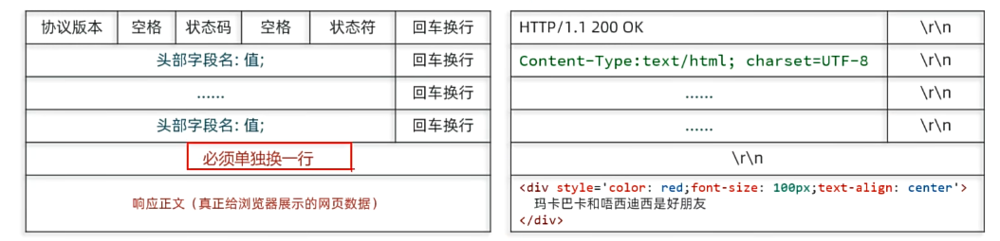

#### B/S架构原理

每次请求都开一个线程，这样合理吗？

显然的，我们可以使用**线程池**进行优化

### Java高级技术

反射、注解、动态代理

#### 单元测试

……
针对最小的功能单元：方法 进行测试

使用**Junit单元测试框架**

#### 反射

**Reflection**：加载类，并且允许以编程的方式解剖类中的各种成分

得到类对象->得到类信息

注意new对象：
利用Reflection可以获取到构造器，然后利用构造器创建对象，哪怕构造器是**私有**的都可以创建出对象

反射的执行代码很奇怪，但是其有特殊的作用

突破访问权限的方法

```java
obj.setAccessible(true);
```

#### 反射的作用

1. 可以得到一个类的全部成分然后执行操作
2. 可以破坏封装性
3. 可以绕过泛型的约束

#### 注解

注解：Java代码中的特殊标记，比如@Override，@Test等

作用：让其他程序根据注解信息来决定怎么执行该程序

自定义注解的特殊属性名：value

注解的本质实际上是**接口**

@注解(……): 其实就是一个实现类对象，实现了该注解以及Annotation接口

#### 元注解

**注解** 注解的注解

@Target 作用：声明被修饰的注解只能在哪些位置使用
@Retention 作用：申明注解的保留周期

注解的解析：判断类上、方法上、成员变量上是否存在注解，有的话就把注解里的内容给解析出来

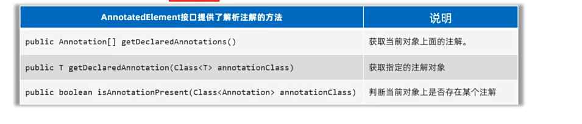

#### 动态代理

是一种**设计模式**

对象如果功能过多，可以通过代理来转移部分职责

**如何为Java对象创建一个代理对象？**

```java
public static Object newProxyInstance(ClassLoader loader, Class<?>[] interfaces, InvocationHandler h);
```

这些东西真乱七八糟的

#### 动态代理的作用

提高代码复用性和业务逻辑架构

关于**AOP**，即切面编程

可以理解为切入业务逻辑

**JavaSE is finished !**
