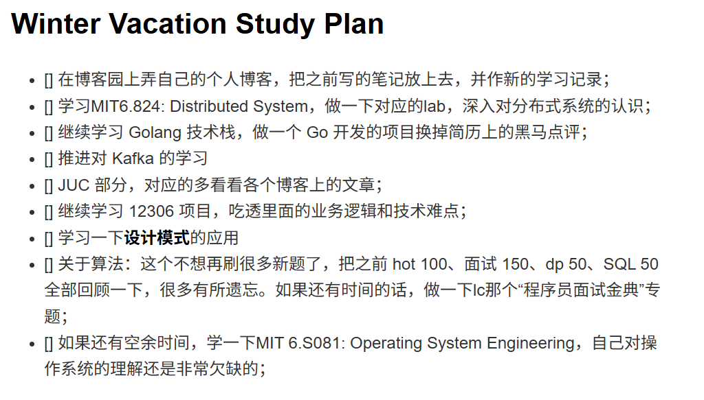

# 杂记近期所面试的三家中小厂

## 个人总结

近几天接连面了好几家中小厂，我整理了一下面试遇到的问题，以及自己下一步的学习计划和对中小厂面试的一些看法。文末我附上了近期调试 Gemini 整理面试内容文字文稿形成问题记录和回答的 propmt，愿能帮助到有需要的同学。

周四面了蔚来软件测试后台开发，有点像KPI面，一上来就陆续给了三道算法题。自己这边也出了点小问题。面试过程中没有注意挑个安静的地方，旁边的教室一直搁那上微积分，非常嘈杂。**面试环境这个问题在后续暑期和秋招中务必要解决之，否则会极大影响问答过程和思考状态**。此外分别面了北京地区的一家研究所旗下挂名公司的后端实习，和上海某小厂的后端实习。经历了多场面试之后，我发现大厂相对更喜欢项目深挖和考察中间件底层原理，会按照简历持续追问；而中小厂问的很杂，有些甚至不考察算法题。

除了上面提到的面试，还有一家北京地区的中厂 HR 面已结束，不知能否拿到offer，还是挺紧张的。总之还是要多投多面，提升自己的应场心态和表达能力。今天整理了一下所学的技术栈，发现还是有很多欠缺之处，对于许多底层细节也不是很熟。故此整理了寒假里需要做的一些计划，不过计划归计划，最后执行了多少方才是真的。

下面是几次面试的内容：

## 蔚来一面凉经

> 时间线：12.15 于 ssob 投递，12.16 电话约面。12.18 一面，已挂。

- 自我介绍

### 算法题

没想到一上来就是三道算法

- lc1114 多线程打印。这边稍微改了一下，改成打印“ABC”三次；
- lc 151 反转字符串中的单词
- Linux shell编程，这个他刚准备给题，我说了一嘴不会 shell，然后直接没给题目。

### 项目询问

- 你的项目有部署到具体的云平台或生产环境吗？
- 你在项目中用了 Redis 分布式锁，如果不考虑 Redis，分布式锁还有哪些实现方式？
- Redisson 的看门狗（Watchdog）机制具体是怎么工作的？
- 你提到的 Redis 主从架构中，如果主节点在同步数据给从节点时挂了，怎么保证数据一致性？
- RocketMQ 和 Redis 实现的队列有什么区别？
- Cache-Aside 模式（旁路缓存）是怎么实现的？为什么要先更新数据库再删缓存？
- 乐观锁和悲观锁在数据库层面是怎么实现的？
- Spring AOP 的底层是怎么实现的？
- 动态代理和反射有什么关系？
- 你听说过字节码编程吗？它和动态代理有什么关联？
- Java 中的垃圾回收（GC）常见的方式有哪些？
- JVM 中为什么会出现内存泄露？能不能举个例子？
- Docker 用过吗？熟悉它的镜像打包流程吗？

### 反问

- 岗位的具体业务

> 面试官提到部门是做支架的一个部门，组里主要做的是版本的发布，中间就会有各种依赖的问题，代码之间有冲突，或者是产生的各种bug。所以需要有一个比较完善的这种流程算法，或者叫CCD的一个流程。可以对这些代码进行一个科学的管理，然后保证所有工程师之间的代码可以互相正常配合。

- 后续面试流程的具体安排

## 北京通用人工智能研究院 一二面

> 时间线：12.15 于 ssob 进行投递，当天约面。12.18 一面，12.19 二面。至今无消息，估计是横向被挂。

### 一面内容

无自我介绍，直接开始提问

- 你有过实习经验吗？
- 如果通过的话，你这边能实习半年以上吗？后面没有课了吗？
- 在你整个学习过程中，Java也好或其他也好，你觉得哪一块技术栈研究得最深？

#### MySQL

- 既然你对 MySQL 比较了解，那你可以说一下 MySQL 索引的结构吗？
- 那它为什么不用其他数据结构呢？比如为什么不用红黑树？
- B+ 树的索引是存在内存中还是磁盘中？
- 如果你说中间层索引也要从磁盘读，那层高影响的是什么？
- 除了索引，MySQL 你还了解哪一块？
- 那你说一下 MVCC 的原理吗？
- 对 MongoDB 这块有了解吗？

#### Redis

- Redis 你了解哪些底层？数据结构还是怎么着？哪一块用得多？
- 为什么 Redis 这里跳表不用红黑树呢？

#### 项目拷打

- 校园生活服务平台有秒杀能力，你这个部署的是单机版吗？
- 如果需求就是单机版，我们要满足秒杀能力，应该怎么设计？
- 单机设计中，Redis 这种缓存、MyBatis Plus、RabbitMQ 都要用吗？
- 如果是单机，你为什么不用本地内存缓存而是非要用 Redis 呢？
- 并发量大必须用 MQ 的话，Java 自身能实现取代 RabbitMQ 的功能吗？
- 如果让你用 Java 实现一个 MQ 的核心接收转发功能（不考虑分区、Group 等），你怎么设计？涉及什么数据结构？

#### JavaSE

- 了解 Java 的 HashMap 吗？多线程读写安全怎么保证？
- ConcurrentHashMap 具体是怎么做的？
- 如果有一个长度为 1000 的数组，它是线程不安全的，你怎么把它变安全？多线程写操作怎么处理？锁加在哪？

#### 算法题 A

- lc 704 二分查找实现
- lc 230 变式，给一棵二叉搜索树（BST）和整数 K，返回第 K 大的值；
- （追问）如果数据量特别大，不希望开太大空间存储数组怎么办？如果只让你维护前 K 大呢？
- 优先队列底层怎么实现？
- 堆排序了解吗？底层原理是怎么样的？

当场约了二面

### 二面内容

- 自我介绍

#### 项目追问

- 你提到的这三个项目（校园生活、外卖、12306）是实习经验还是学习项目？
- 挑一个你比较熟悉的，说一下它的概括功能、业务模块划分以及技术栈
- 你的Redis缓存里主要缓存了什么数据？商户信息的Key是什么？是唯一的吗？

#### 关于 MySQL

- 要在数据库里保证名称唯一性，应该怎么实现？加什么索引？
- MySQL的索引有哪些类型？
- 聚集索引和二级索引有什么区别？
- 二级索引有哪些？
- MySQL的隔离级别分为哪几种？
- 默认是哪种隔离级别？
- B+树中叶子节点和非叶子节点有什么特点和区别？

#### 项目进一步追问

- 你的校园生活服务项目里大概有多少张表？重点有哪些表？
- 秒杀超卖问题是怎么解决的？是一人一单吗？
- 多台服务器负载均衡下怎么保证？
- Redis和MySQL的数据一致性是怎么保证的？

#### 关于 Redis

- Redis有哪些数据类型？
- 什么是缓存穿透？怎么解决？
- 布隆过滤器的原理是什么？

#### Java并发 & JVM

- i++是原子性的吗？怎么实现多个线程循环加100次，结果一定是100？
- 你项目中哪里用到了线程池？线程池有哪些核心参数？
- 工作流程是什么？拒绝策略有哪些？
- AOP的原理是什么？
- JDK动态代理和CGLIB有什么区别？
- ThreadLocal的原理是什么？
- 怎么解决ThreadLocal带来的内存泄漏问题？
- HashMap的底层原理？
- HashMap和ConcurrentHashMap的区别？
- Java有哪些基础的数据类型？
- JVM内存区域划分？
- 大对象什么时候进入老年代？
- 创建一个虚拟机，它的最大堆内存大小是1G。然后我怎么用代码快速的实现堆内存溢出的异常？

#### 算法题考察

- lc19 删除链表的倒数第 N 个节点

#### 反问（二面部分）

- 部门实习生主要负责什么业务？
- 你们单位是北京通用人工智能研究院下属的公司吗？
- 实习薪资有没有房补？

## 艾哲智后端一面

Base上海的一家小厂，感觉有点不靠谱。不得不吐槽一下，这个面试官的表达能力堪忧。说话吞吞吐吐，交流起来非常费劲。

> 时间线：12.19 于 ssob 投递，12.22 约面，12.23 一面，已挂。

### 面试内容

没有自我介绍，一上来就开始嘎嘎问项目中表结构的组成。一直追问表相关的内容，然后让我写SQL，面试体验不太行。

#### 项目考察 & MySQL

- 介绍一下你第二个项目（12306）中主要包含哪些表？
- 介绍一下你这个项目（点评项目）数据库中主要包含哪些表？
- 你现在既然可以连接到数据库，写一个查询吧：查询一下用户A在商户B中，未来三天会过期的优惠券
- 假如现在有了这么一个查询语句，发现查询出来很慢，你应该怎么去分析这个查询语句所存在的问题？
- 假如我现在要给一个表创建索引，我应该从哪些角度去考虑要不要创建？
- 如果要创建索引，创建哪些索引？
- 说一下 MySQL 的 InnoDB 存储引擎中有哪些类型的锁？
- 假如我执行 SELECT ... FROM t WHERE a = B FOR UPDATE，什么情况下会产生行锁，什么情况下会产生表锁？

#### Redis 考察

- Redis 有哪些常用数据结构？
- 你在项目中具体使用了哪些Redis的数据结构？
- 你提到项目中使用乐观锁实现秒杀，请解释一下你的乐观锁是怎么做的？
- 如何解决的超卖问题？
- 乐观锁底层基于 CAS 机制，这会带来什么问题？
- 你知道 ABA 问题吗？
- 说一下 Java 中 synchronized 关键字的使用方式。
- 在项目中你是如何防止缓存失效和击穿数据库的？

无算法题

#### 反问阶段

- 部门业务

> 面试官说做跨境电商的网站开发，主要是一个服装类电商网站，我们这边就主要负责网站的网页开发

- 后续面试流程

> 总共两轮技术面+一轮hr面

## 调试 Gemini 的propmt

Prompt：
请严格依据以下要求，整理提供的面试录屏转写文本：

任务：整理并分析全部面试对话（包括面试官提问、我的回答、反问环节）：

格式要求：

1. 绝对禁止使用表格或任何类表格形式。
2. 对每个问答对，使用以下详细结构进行呈现，而且每个内容块之间必须换行！（留出空白行）：
一、面试官问题： (原样呈现)
二、您的原始回答： (修正错别字、语病，重组语言，使其流畅、专业，但不指出修正点。)
三、改进之处：(指出原始回答的不足、需要优化的点。)
四、更合适的回答： (提供一个详细、深入、结构化、具有说服力的模范回答，绝对不能偷懒或敷衍)
以上者四个内容块之间都要加上换行，不要全部堆在一起回答。我继续强调一下，四个内容块之间各自都要加上空白分隔换行，不要堆在一起！

3. 完整性要求： 必须呈现面试官提出的所有问题，包括技术问题、行为问题、项目细节、以及任何非技术性的对话，不能有任何遗漏。
4. 独立性要求：每个问答对分开整理，不要将多个问题合并成一个问题整理，不要偷懒！
5. 最后，请单独整理并呈现“反问环节”的所有对话内容，格式同上，但不需重复前面的内容。
6. 回答内容中，严禁出现任何表格形式的内容。
7. 最后的反问阶段的总结中，也不要出现任何的表格形式的回答内容！
8. 每个问答对要标注这是第几个问题，标上序号即可。
9. 所有的问答对中，重点内容需要加粗显示。

最后，感谢你对本文的阅读，欢迎在评论区一起交流学习心得 & 技术实践！
