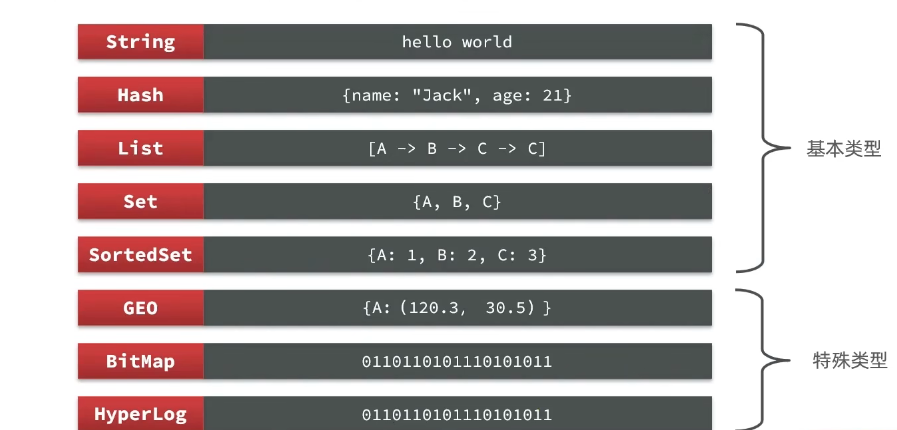
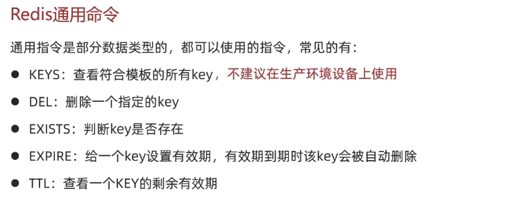
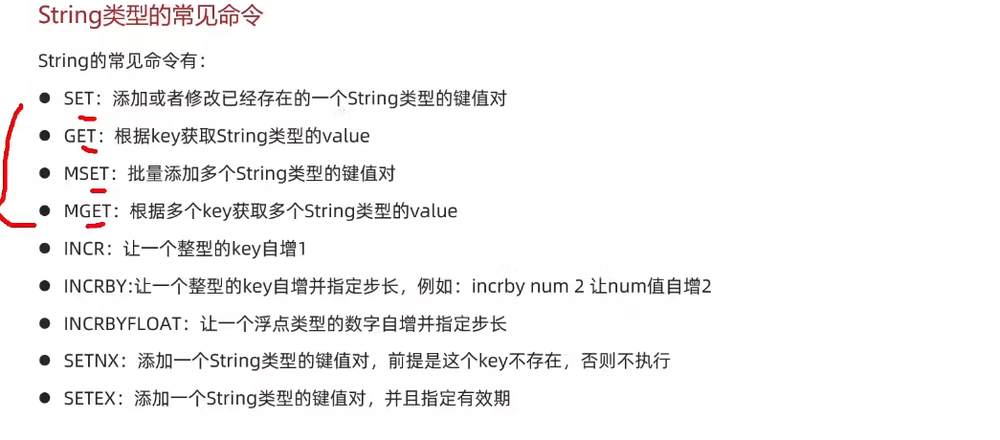
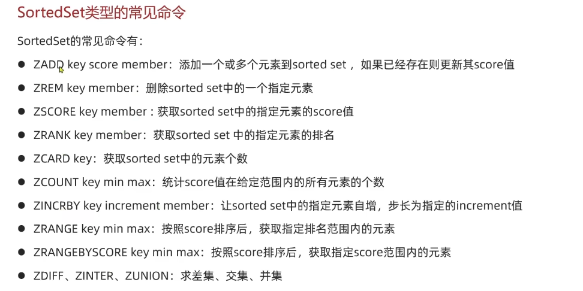
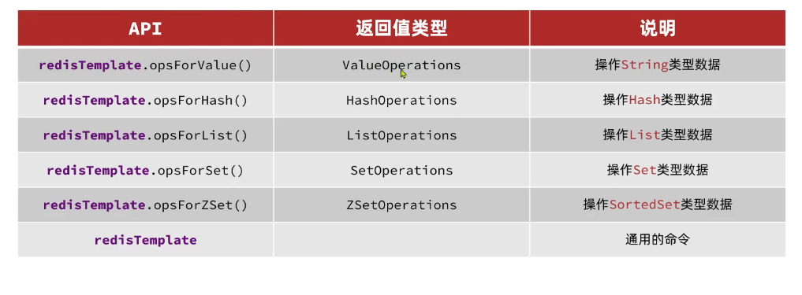

# BasicPart

这部分内容是**Redis**快速入门

键值数据库，也就是**NoSql**

SQL是所谓的**关系型数据库**

SQL：结构化的，关联的

在**事务**上的差异

SQL：ACID
NoSQL：BASE

>这个不知道什么东西，啥是ACID？

## 关于Redis

- key-value型
- 单线程
- 低延迟、速度快（因为1. 基于内存 2. IO多路复用 3. 良好的编码）
- 支持数据持久化（内存存储数据不安全，定期把数据弄到磁盘上去）
- 支持主从集群，分片集群
- 支持多语言客户端

>这边配置安装Redis真的坑完了
>注意在Centos 7上执行系统级安装命令，最好要在命令前面加上sudo

### 关于Redis的数据结构

key-value

**key**一般是String类型，**value**啥类型都有


#### Redis的通用命令



权当复习

#### String 类型



重点是SET、GET、MSET、MGET

String结构是将对象**序列化**为JSON字符串后存储

#### key的结构

For example:

```code
heima:user:1
```

```code
[项目名]:[业务名]:[类型]:[id]
```

#### Hash类型

Hash类型，也叫作**散列**，其value是一个无序字典，类似Java中的**HashMap**结构

#### List类型

有序、元素可重复、插入和删除快、查询速度一般

和Java中的LinkedList类似

> don't be crazy.
>redis中的“null”居然是nil

如何利用List结构模拟一个栈？

ans: 先进后出

如何利用List模拟一个队列？

ans: 先进先出

> 这老师举的例子太搞了

如何使用List结构模拟一个**阻塞队列**？

1. 入口和出口不在同一边
2. 出队时采用BLPOP或者BRPOP

#### Set类型

Redis的Set结构和Java中的HashSet相似，可以看做一个value为null的HashMap

>这部分内容其实在苍穹外卖中已经学过了，所以听着相当无聊

这个数据结构在交友、社交类型的业务中使用较多

```sql
SADD key member
SREM key member
SCARD key
SISMEMBER key member
SMEMBERS
SINTER key1 key2 // 求交集
SDIFF key1 key2 // 求差集（实际上是并集 - 交集）
SUNION key1 key2 // 求并集
```

#### SortedSet/Zset类型

这玩意有点像Java中的**TreeSet**，但是SortedSet的底层实现和TreeSet完全不一样！

SortedSet的底层实现是一个跳表（**SkipList**）+ **Hash**表

而TreeSet的底层实现是红黑树

SortedSet特性

- 可排序
- 元素不重复
- 查询速度快



这个操作命令和以前的那些差不多，就是得记得加上**score**

注意到：所有的排名默认是升序排序，如果要降序的话，在命令的Z后面加上**REV**

>我说这东西怎么这么眼熟，原来这个就是zset

### Redis的Java客户端

常见的三种

- Jedis (Jedis实例是线程不安全的！多线程环境下必须使用连接池进行使用)
- lettuce （基于Netty实现，支持同步、异步、响应式编程。并且，**线程安全！** 支持Redis的哨兵、集群、管道模式）
- Redission （基于Redis实现的分布式、可伸缩的Java数据结构集合）

### Jedis

引入依赖 -> 建立连接 -> 测试 -> 释放资源
>以上是一个最基础的测试Jedis demo
> OK, I am sure the target is located!

### Jedis线程池

>这个东西还挺重要的

准确的说，应该叫做Jedis连接池

注意**连接池**这堆乱七八糟的参数

### SpringDataRedis

官网地址：<https://spring.io/projects/spring-data-redis>

>官网那个页面的说明说了和没说一样

- 这个东西提供了对不同Redis客户端的整合（Lettuce和Jedis）
- 提供RedisTemplate统一API进行操作Redis
- 支持发布订阅模型
- 支持基于JDK、JSON、字符串、Spring对象的数据序列化或者反序列化

还有一堆支持功能……

SpringDataRedis中提供了RedisTemplate工具类，封装了各种关于**Redis**的操作


