# RealCombat Part

主要内容：业务点介绍

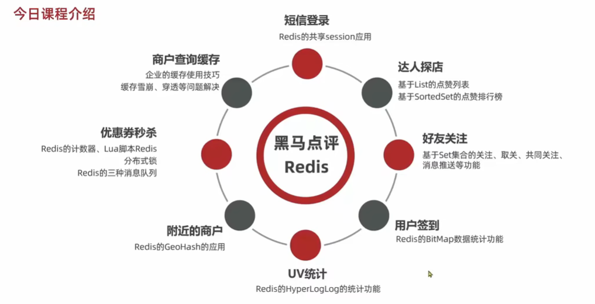

项目架构：

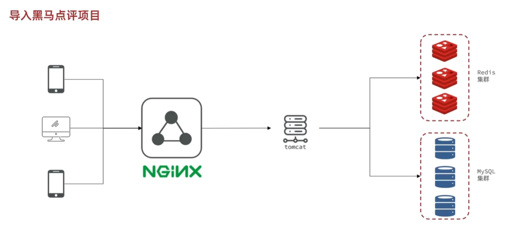

>这个项目启动是真的坑比，非得切换成**jdk17**才行

<http://localhost:8081/shop-type/list>

## 短信登录

- 基于Session的登录
- 集群的session共享问题
- 基于Redis实现共享session登录

### 基于Session的登录

1. 发送短信验证码
2. 短信验证码登录、注册
3. 校验登录状态

>cookie是什么东西

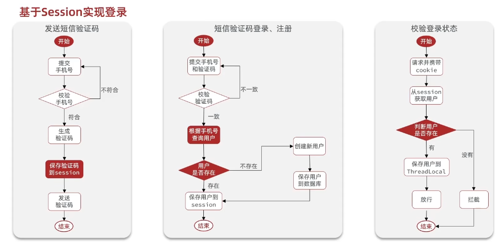

**Session**，即**会话**。这个会话在服务器端是一个存储空间，与浏览器进行绑定，通过**Session ID**区分不同用户

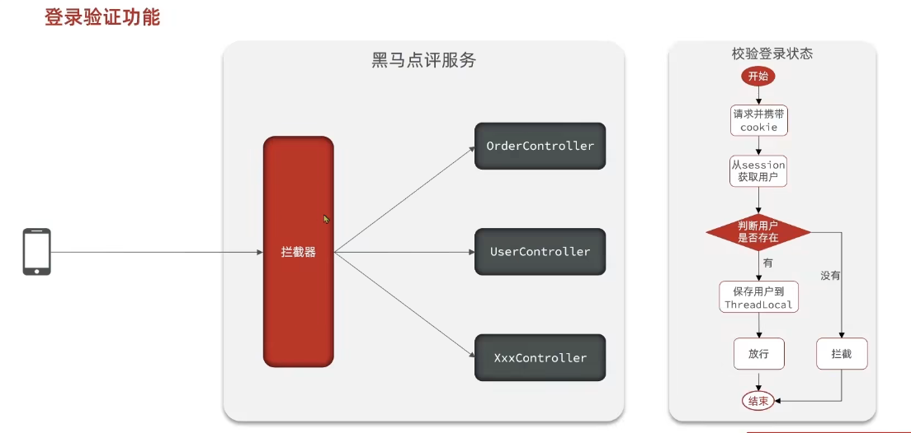

注意这个**拦截器**

### 集群的session共享问题

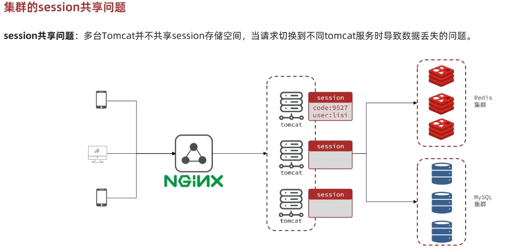

Session的替代方案应当满足：

- 数据共享
- 内存存储
- key、value结构

由此，自然而然的想到使用**Redis**代替Tomcat的Session

### 基于Redis实现共享Session登录

>key一方面要考虑唯一性，另一方面要考虑客户端能之后取到

最好使用Hash结构保存信息，因为这样可以独立存储对象的每个字段，针对单个字段做CRUD，并且内存占用更少

注意下面这张图**存储**的机制

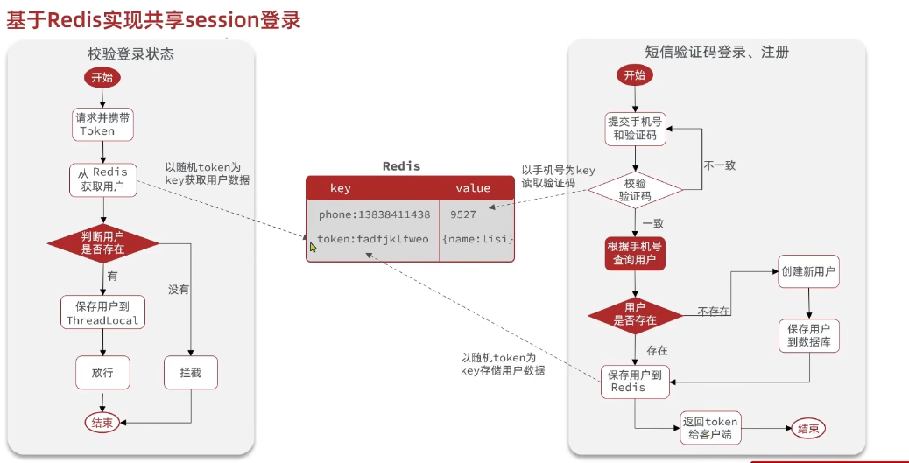

这个**token**，在注册的时候会返回给前端（客户端），然后前端会获取到token在**Redis**中对应存储的信息

这边这个token得用随机字符串，不能用手机号，不然在前端里面会有泄漏的风险

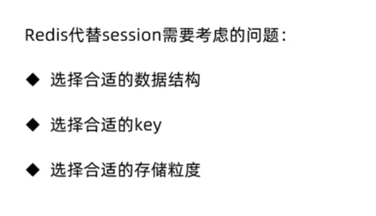

对于**登录拦截器**的优化

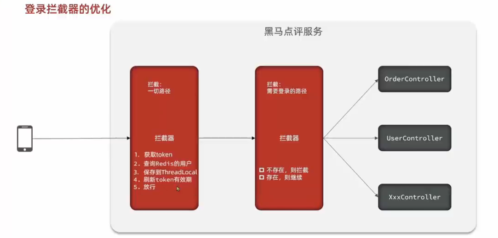

## 商户查询缓存

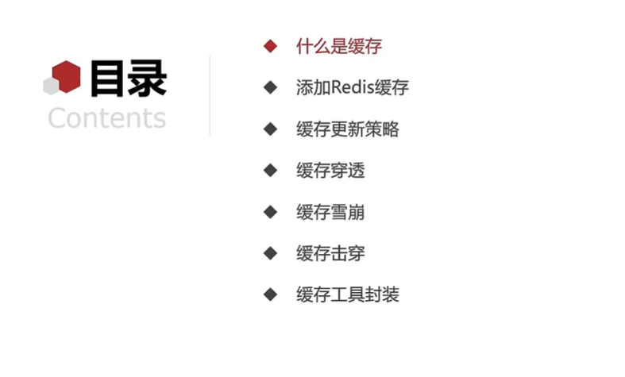

>这部分内容还挺重要的

### 什么是缓存？

**缓存**是**数据交换**的缓冲区（Cache），存储数据的临时区，一般读写性能很高

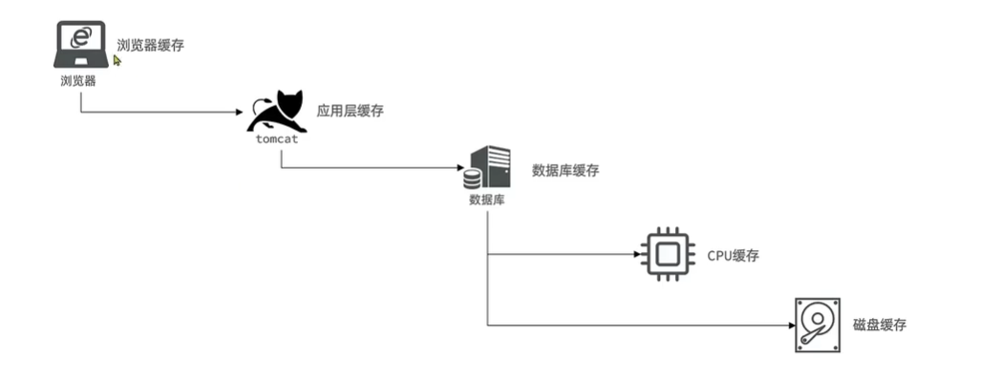

作用：

- 降低后端负载
- 提高读写效率，降低响应时间

成本：

- 数据一致性成本
- 代码维护成本
- 运维成本

### 添加Redis缓存

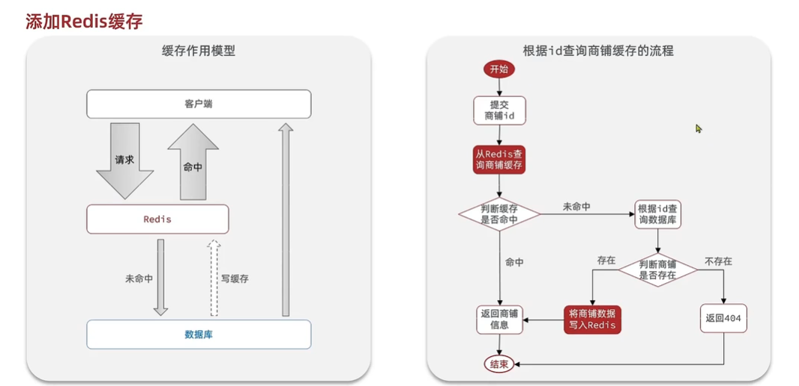

>这部分的逻辑架构非常清晰，和计组也有很强的关联性

md我真想骂人，找了半小时的bug，最后发现问题在于**URL**地址输入错误了，我为什么会碰到这种bug？

>我觉得把Cent OS 7的ip地址固定是非常必要的，这个ip地址一直乱跳真的坑人，导致项目频频掉线
>f**k, ip地址不能写死，不然虚拟机开机又会有新的风险

### 缓存更新策略

- 内存淘汰
- 超时剔除
- 主动更新

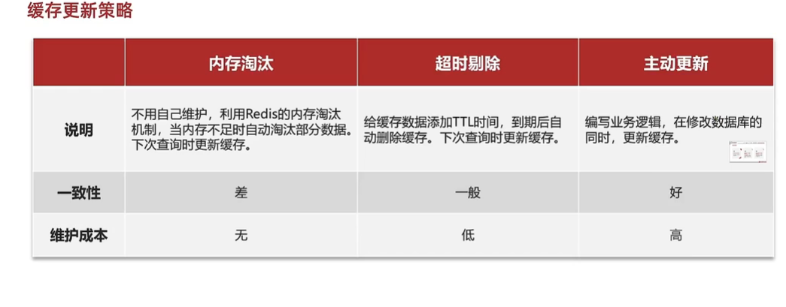

低一致性需求：使用内存淘汰机制，比如店铺类型的查询缓存
高一致性需求：主动更新，并且用超时剔除作为兜底方案，比如店铺详情查询的缓存

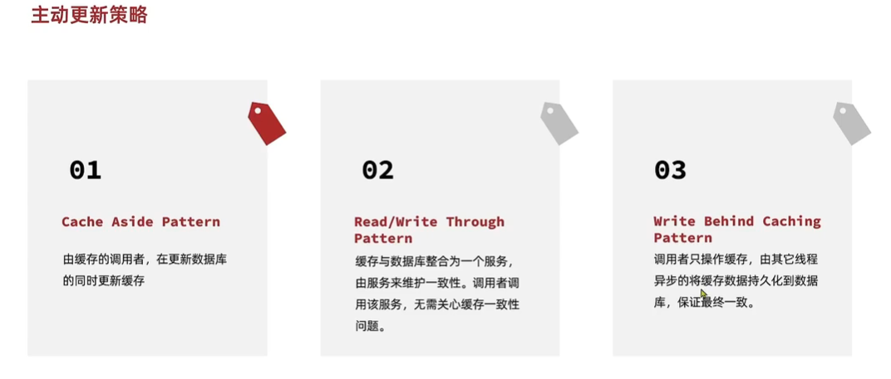

第三个方案是**异步**机制

而方案一是开发者自行编码的，可控性较高

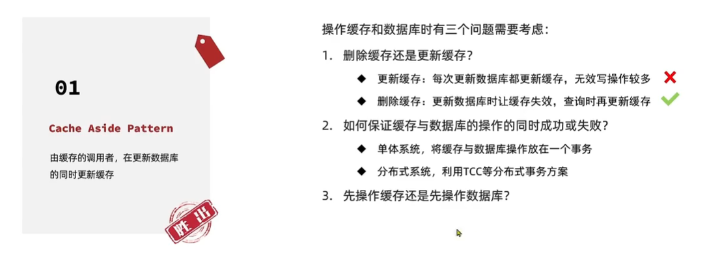

我们应当**删除缓存**，而不是更新缓存

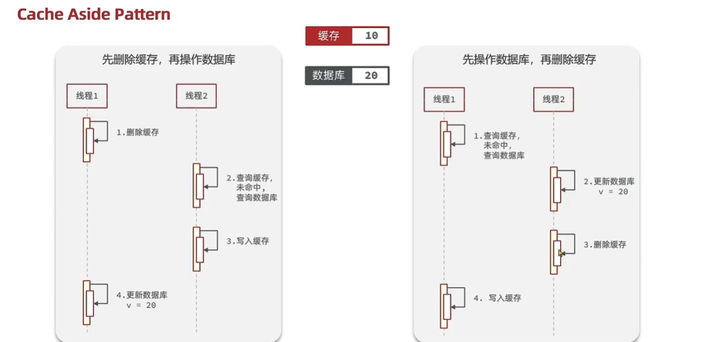

右边那个方案是比较好的，左边那个极有可能产生线程安全的问题

由此：
**先操作写数据库，再操作删除缓存**

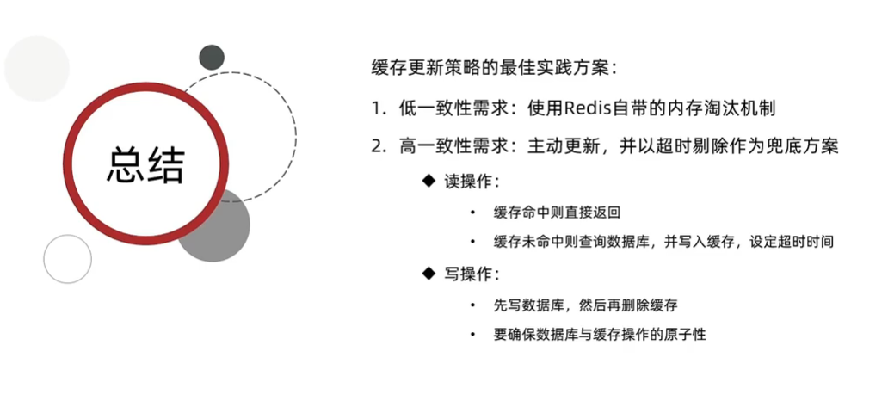

用这个店铺链接去测试一下：
<http://localhost:8080/shop-detail.html?id=1>

### 缓存穿透

>特别注意，以下出现**高频面试题**！！！

这种情况其实挺扯淡和特殊的，就是说，客户端请求的数据**在缓存中和数据库中都不存在**，这样缓存永远都不会生效，这些请求都会打到数据库！

常见的两种解决方案：

1. 缓存空对象

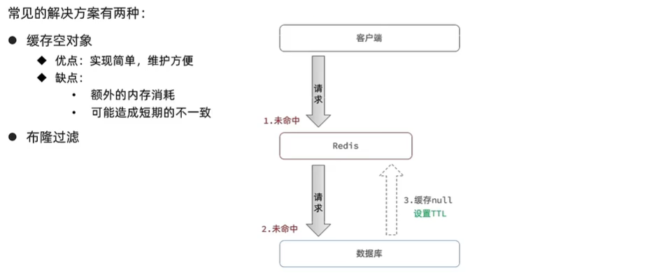
2. 布隆过滤
优点：内存占用较少，没有多余的key（类似bit数组，但是原理不是这个）
缺点：

- 实现非常复杂
- 存在误判可能
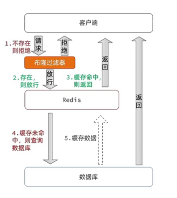

所以开发一般用第一种方案：缓存空对象

### 缓存穿透编码实现

采用**缓存空对象**方案：

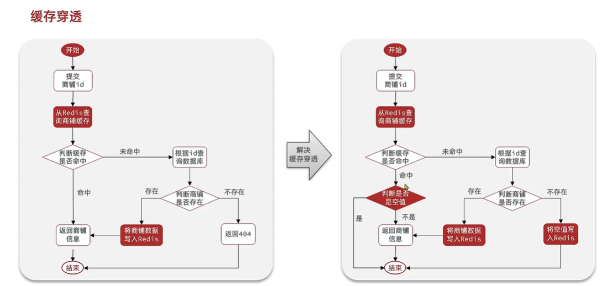

**缓存穿透产生的原因是什么？**

- 用户请求的数据在缓存和数据库中都没有，不断发起这种请求，会对数据库造成极大的压力

**缓存穿透的解决方案有哪些？**

- 缓存null值
- 布隆过滤
- 增强id的复杂度，避免被猜测id规律
- 做好数据的基础格式校验
- 加强用户权限校验
- 做好热点参数的限流

>实际上这边引申出新的一个问题：为什么要防止缓存穿透？是因为要防止被恶意大量利用id访问攻击

### 缓存雪崩

缓存雪崩指的是同一时段大量的缓存**key**同时失效或者**Redis**服务宕机，导致大量请求到达**数据库**，造成巨量压力

解决方案：

- 给不同的key的**TTL**添加**随机值**（之所以同一时段那么多缓存key失效了，是因为TTL都设置的一模一样，而且同一时刻导入）
- 利用Redis**集群**提高服务的可用性（这个是解决Redis宕机）
- 给缓存业务添加降级限流策略（这玩意是**微服务**那块的内容）
- 给业务添加多级缓存

### 缓存击穿

**缓存击穿**问题也叫**热点key**问题，就是一个被高并发访问并且缓存重建业务较为复杂的key突然**失效**了，导致无数的请求访问会在瞬间给数据库造成巨大的冲击

常见的解决方案：

- 互斥锁
- 逻辑过期

逻辑过期一般是给那种做活动的业务

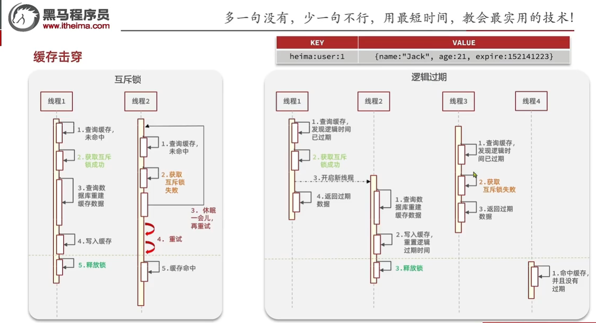

注意：**逻辑过期**不会把数据踢掉

**互斥锁**方案有**死锁**风险

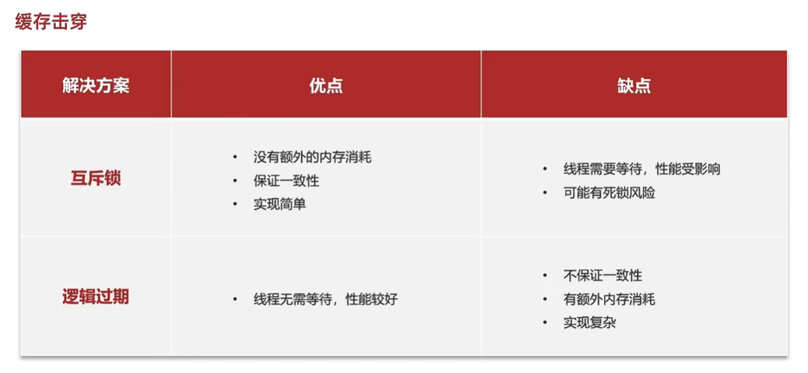

互斥锁追求的是**一致性**，而逻辑过期方案追求的是**可用性**

在一致性和可用性之间，应当做出一个适当的抉择

### 互斥锁的代码实现

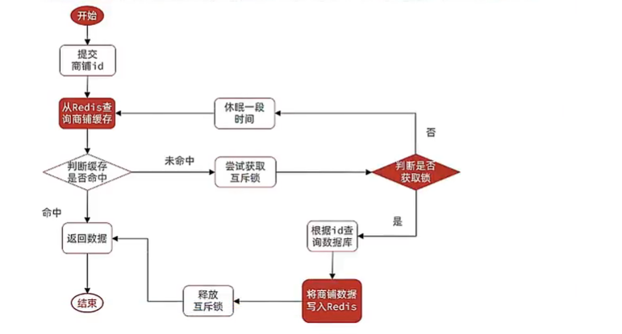

### 基于逻辑过期方式解决缓存击穿问题

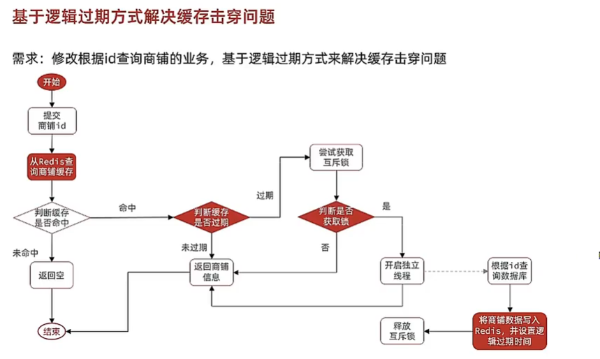

这整个流程还是相当复杂的

>那个jmeter测试工具简直就是答辩

### 缓存工具封装

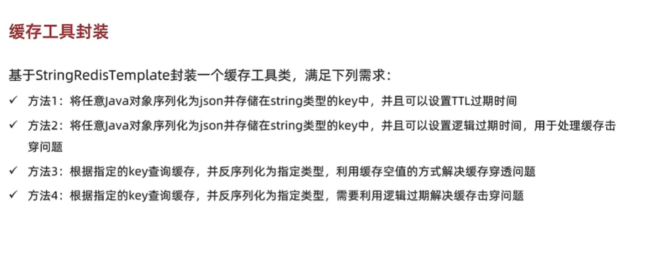

方法一、三：缓存穿透
方法二、四：缓存击穿（热点key）

学习到了**泛型**的使用和**函数式编程**

>这节课满满的干货

### 关于缓存的总结

详见**Redis实战篇**技术文档

## 优惠劵秒杀

不要用数据库自增ID，这样会存在问题

由此，我们引申出**全局ID生成器**

其是一种在**分布式系统**下用来生成全局唯一ID的工具

唯一性、高可用、高性能、递增性、安全性

相关介绍：

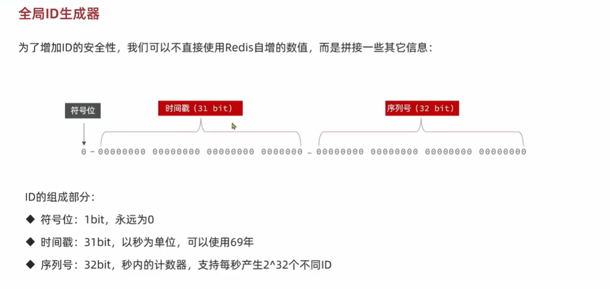

利用**bit**位存储信息

项目中采用了Redis自增ID策略

- 每天一个key，方便统计订单量
- ID构造是 时间戳+计数器

全局唯一ID生成策略：

- UUID
- Redis自增
- snowflake算法（雪花算法）
- 数据库自增

### 超卖问题

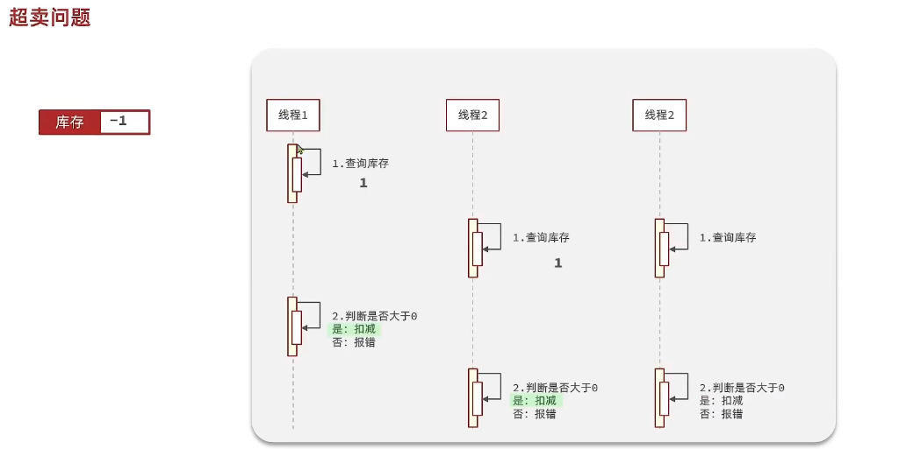

线程并发产生的安全问题

常见解决方案：**加锁！**

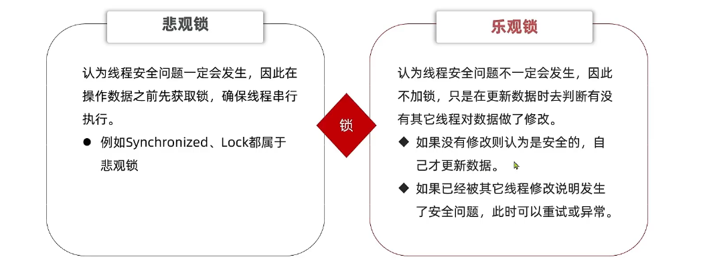

分为

- **乐观**锁
- **悲观**锁

### 关于乐观锁

乐观锁的关键：**判断之前查询到的数据是否被修改过**

1. 版本号法

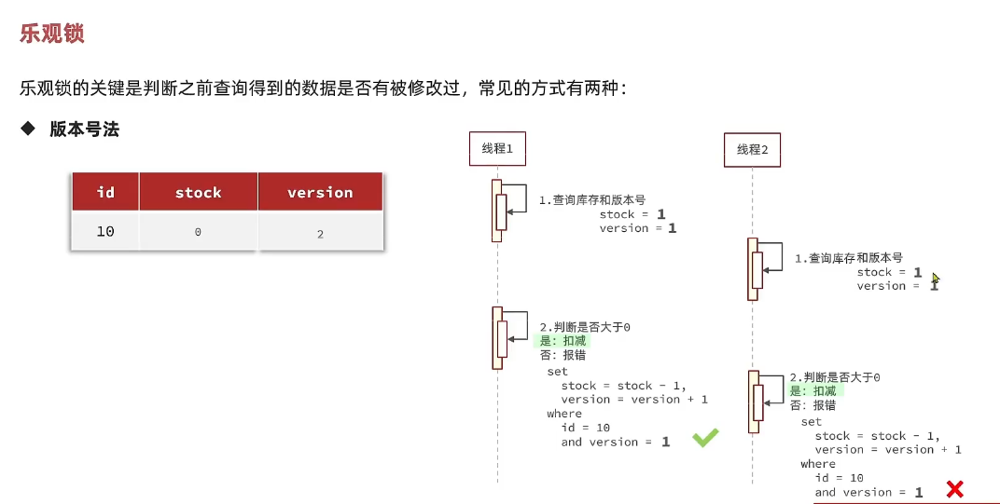
2. CAS法（compare and set）
直接比较原始数据是否发生了变化

#### 对于超卖这样的线程安全问题，解决方案

**悲观锁**：添加同步锁，让线程串行执行

- 优点：简单粗暴
- 缺点：性能一般

**乐观锁**：不加锁，在更新时判断是否有其他线程在进行修改

- 优点：性能好
- 缺点：存在成功率低的问题

### 一人一单

>md我真服了，上午这个项目莫名其妙无法启动，complied ERROR。晚上经过调试分析，果然是Maven中不同版本包之间的协同冲突问题，坑死人。

这一节的内容非常重要

#### 一人一单的并发安全问题

这一节添加集群的方式讲的不清不楚的，新版本的IDEA非常的难用，简直是勾石

总算是调整出来了，访问这个网址
<http://localhost:8080/api/voucher/list/1>

在集群模式下，有多个**JVM**存在，每个JVM内部都有自己的锁，导致出现并行问题，由此带来**安全问题**

怎么解决？
**跨进程**/**跨JVM**的锁

## 分布式锁

这个**锁监视器**应当独立于多个JVM之外

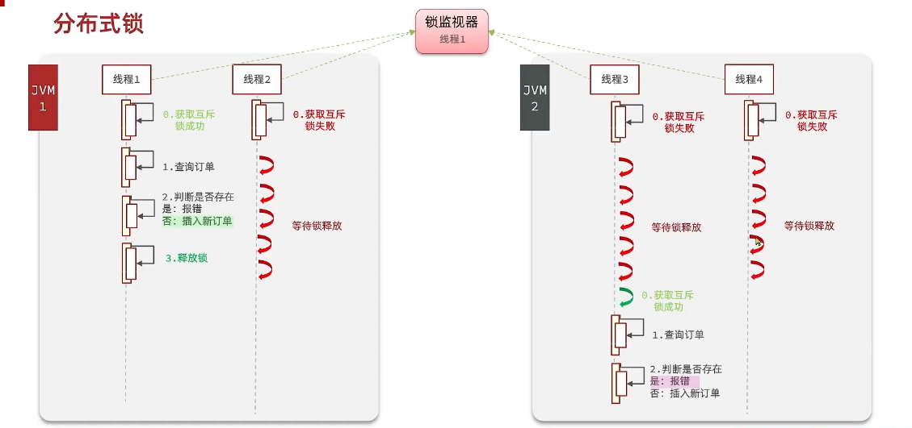

这就是所谓的**分布式锁**

分布式锁：满足分布式系统或者集群模式下**多进程可见**并且**互斥**的锁

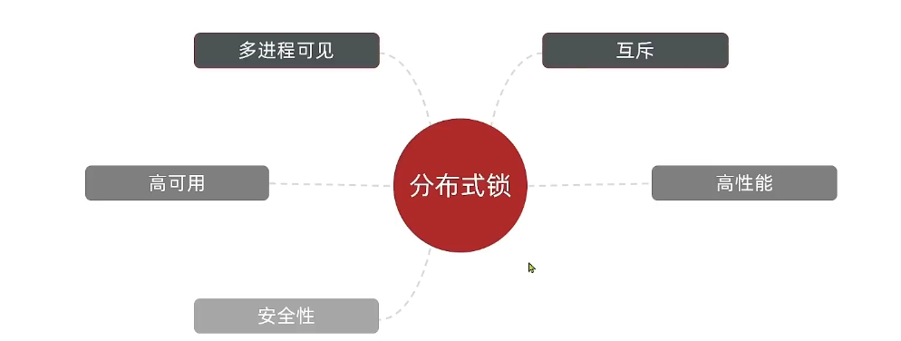

### 分布式锁的实现

>这个**Zookeeper**是什么东西

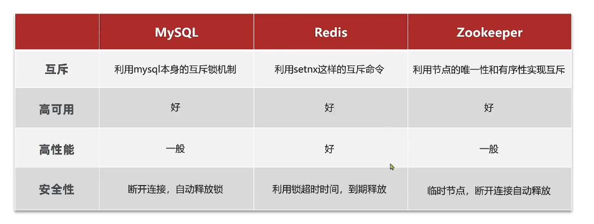

这边我们主要学习**Redis**

#### 如何基于Redis实现分布式锁？

```redis
SET LOCK thread1 EX 10 NX
```

实现分布式锁的两个基本方法：
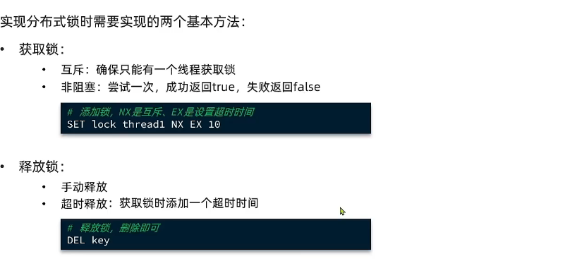

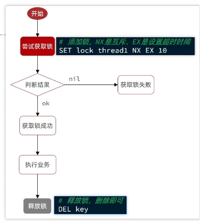

### 基于Redis的分布式锁

这边讲的一个**Redis分布式锁误删**案例非常有意思

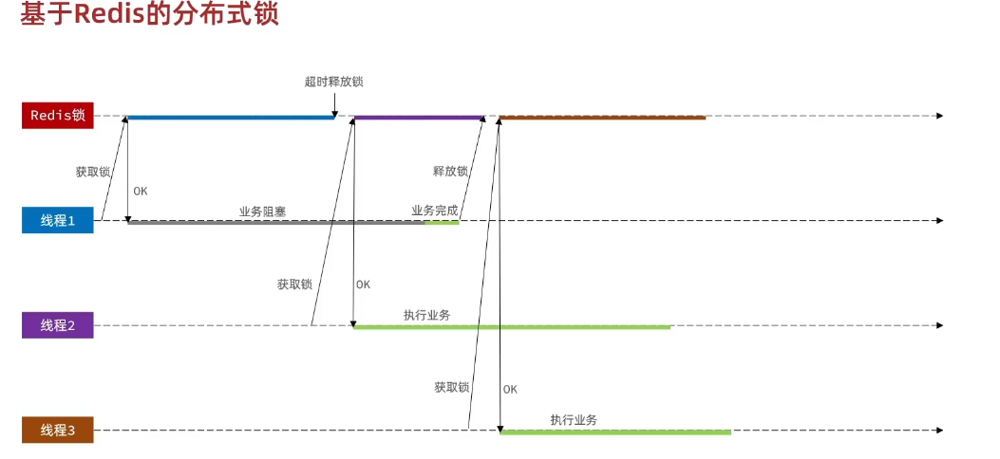

问题出在业务阻塞的线程1上，锁既被提前释放，又被**del**删除

解决方案：

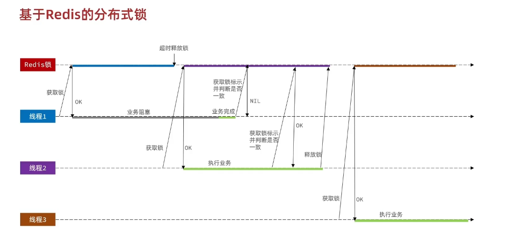

关键是：在**释放锁**的时候，校验线程标识（比如线程ID）

怎么实现呢？
这是实现方案：

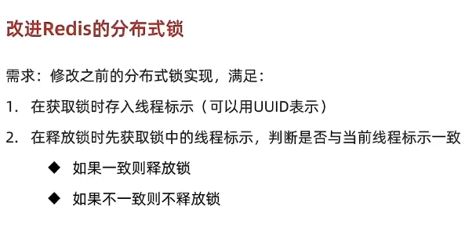

但是现在这个分布式锁的实现还是存在问题的

### 分布式锁的原子性问题

判断锁标识和释放锁是两个动作，如果在这两个动作之间发生了阻塞，就可能会发生并发运行错误！！！

因此，这两个动作需要保证**原子性执行**！！！

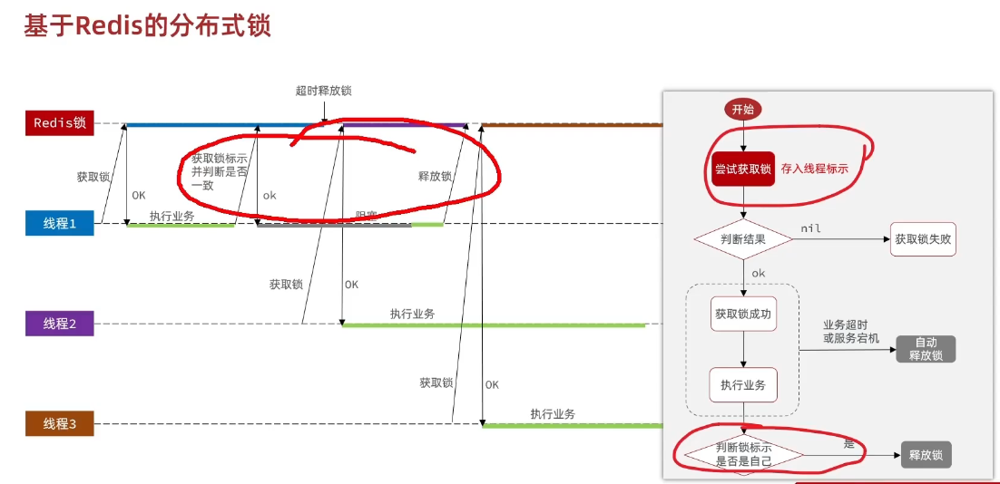

### Lua脚本解决多条命令原子性问题

Redis有事务，但是不是MySQL那个

Redis的事务能保证原子性，但是无法保证一致性

由此，我们引申出**Lua脚本**

其基本语法：<https://www.runoob.com/lua/lua-tutorial.html>

注意，在Lua语言中，数组角标从1开始！

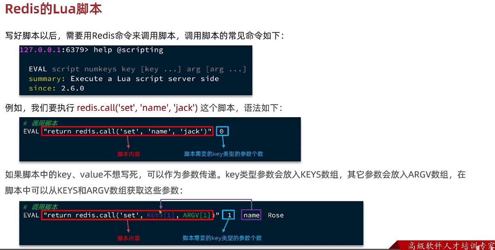

### 关于分布式锁的总结

基于Redis的分布式锁实现思路：

- 利用set nx ex 获取锁，并且设置过期时间，保存线程标识
- 释放锁时先判断线程标识是否与自己一致，一致则删除锁

特性：

- 利用set nx满足互斥性
- 利用set ex保证故障时锁依然能释放，避免死锁，提高安全性
- 利用Redis集群保证高可用和高并发特性

### 基于Redis的分布式锁优化

基于set nx实现的分布式锁存在以下问题：

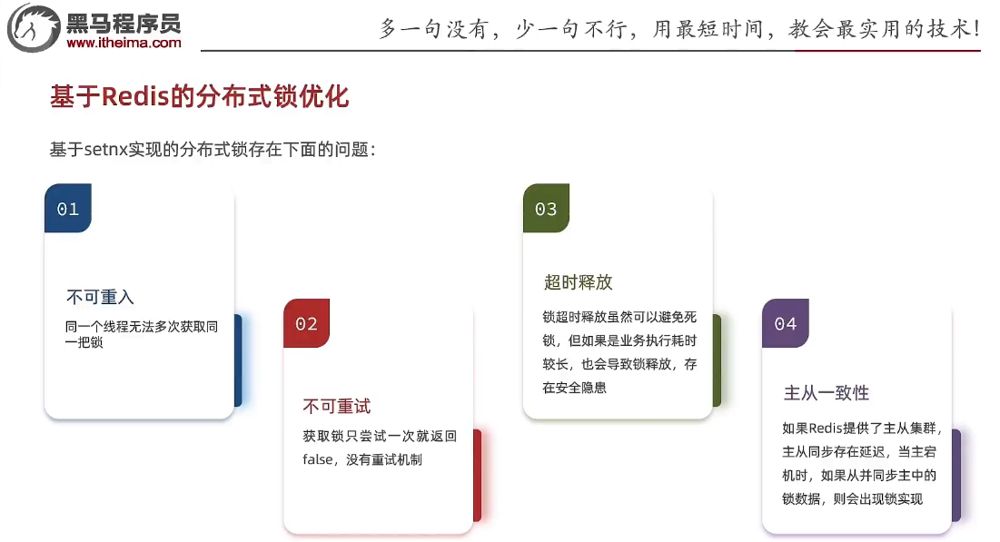

其实这四个问题发生的概率极低，而且有些业务并不做需求

这个实现很麻烦，由此，我们延伸去学习一个框架：**Redisson**

github地址：<https://github.com/redisson/redisson>

### Redisson入门

>这边注意一个事，@Resource是按照名称来注入，而@Autowired是按照类型来注入

怎么使用呢：

1. 引入依赖
2. 配置Redisson客户端
3. 使用Redisson的分布式锁

### Redisson的可重入锁原理

这边实际上是用了一个**Hash**结构存储了重入的次数

注意Hash结构中没有setnx这个命令

>好复杂的业务逻辑

详细流程图：

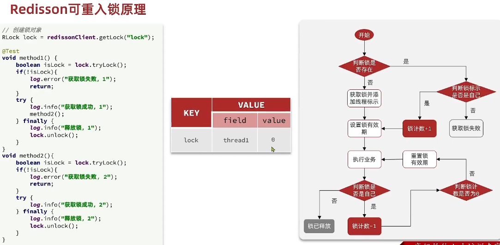

>这边还是得把脚本写一下，有助于理解

源码阅读：

>重点是那两个lua脚本的逻辑

### 基于Redis的分布式锁的优化

注意这边提到了一个**看门狗机制**：如果tryLock的时候leaseTime = -1的时候，才有看门狗；如果自己设置了leaseTime，不会有这个机制（leaseTime是设定的锁的存活时间）

**重试**机制获取锁作用原理：

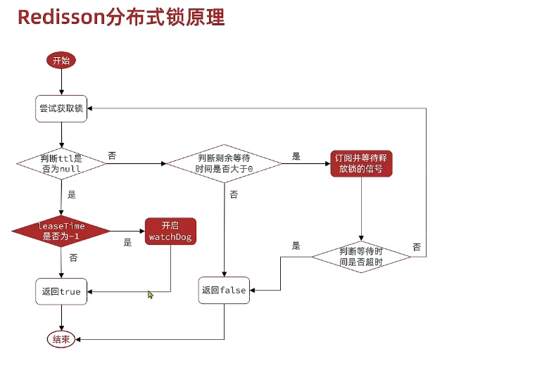

释放锁作用机制：

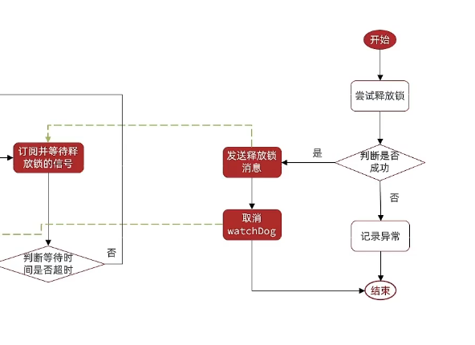

所以，**Redisson**的整个分布式锁的执行流程：

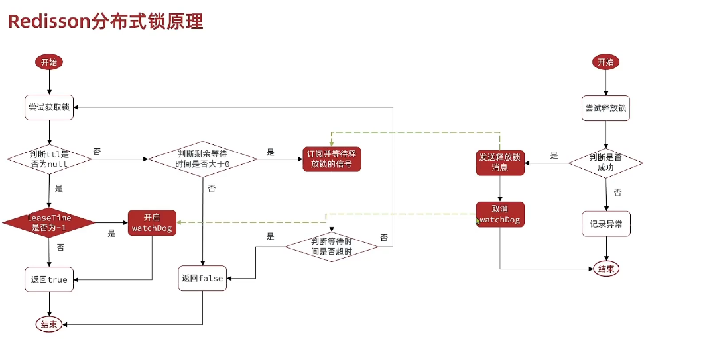

### Redisson总结

Redisson分布式锁原理：

- 可重入：利用**Hash**结构记录线程id和重入次数
- 可重试：利用信号量和PubSub功能实现等待、唤醒，获取锁失败的重试机制
- 超时续约：利用watchDog，每隔一段时间(releaseTime / 3)，重置超时时间

### 关于Redis的分布式锁&主从一致性问题

Redis Master & Redis Slave

**MultiLock**方案

既然主从关系导致了一致性关系问题，那么不要主从！直接**独立节点**！

依次向多个Redis Node都获取锁，都获取到了才算成功

如果有一个节点宕机，Redis仍然可用（只要有一个Node存活即可）

同时，可以对每个RedisNode分别建立主从同步关系

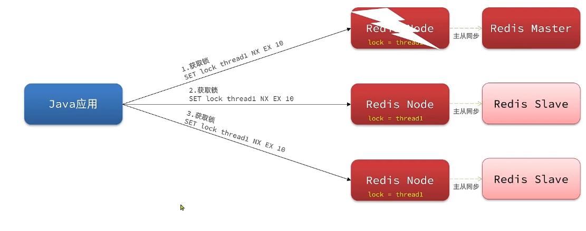

>这边搭建三个节点不管它了，把这部分代码讲解听完听懂就行

接收多个Lock

对于**获取锁**的操作步骤

这部分相应源码非常重要

### 分布式锁总结

**不可重入Redis分布式锁**：

- 原理：利用setnx的互斥行，利用ex避免死锁，释放锁时判断线程标识

- 缺陷：不可重入、无法重试、锁超时失效

**可重入的Redis分布式锁**：

- 原理：利用Hash结构，记录线程标识和重入次数；利用watchDog延续锁时间；利用信号量控制锁重试等待
- 缺陷：Redis宕机引发锁失效问题

**Redisson的multiLock**：

- 原理：多个独立的Redis节点，必须在所有的节点都获取重入锁，才算获取锁成功
- 缺点：运维成本高，实现非常复杂

## 秒杀优化

**改进秒杀业务，提高并发性能**：

采用Set集合记录一人一单的数据结构

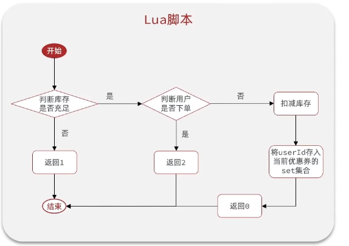

这部分内容是要保证整个流程执行的**原子性**

由此，设计流程如下：

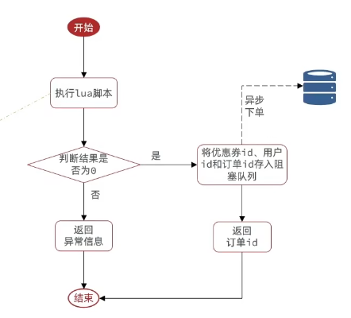

### 异步下单功能

从阻塞队列中得到订单信息，从而异步执行，不影响业务的耗时

### 秒杀优化之总结

- 秒杀业务的优化思路？

1. 先利用**Redis**完成库存余量、一人一单判断，完成抢单业务
2. 再将下单业务放入阻塞队列，利用独立线程异步下单

- 基于阻塞队列的异步秒杀存在哪些问题？

1. 阻塞队列存满了怎么办？**内存限制问题**
2. 数据安全问题 & 数据不一致 & 任务压根没执行，出现异常（这就是没有持久化机制造成的问题）

## Redis消息队列实现异步秒杀

消息队列（**Message Queue**）

最简单的消息队列模型包括三个角色：

- 消息队列：存储和管理消息，也被称为**消息代理**（Message Broker）
- 生产者：发送消息到消息队列
- 消费者：从消息队列获取消息并且处理之

Redis提供了三种方式来实现消息队列

- List结构：基于List结构来模拟消息队列
- PubSub：基本的点对点消息模型
- Stream：比较完善的消息队列模型

### 基于List结构模拟消息队列

Redis的List数据结构是一个双向链表，很容易模拟队列效果

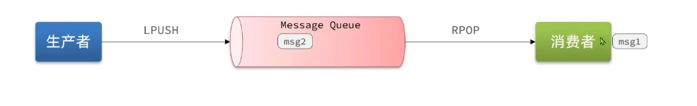

优点：

- 利用Redis存储，不受限于JVM内存上限
- 基于Redis的持久化机制，数据安全性有所保证
- 可以满足消息有序性

缺点：

- 无法避免消息丢失
- 只支持**单消费者**

### 基于PubSub的消息队列

消费者可以订阅一个或者多个channel，生产者向对应的channel发送消息之后，所有订阅者都可以收到相关消息

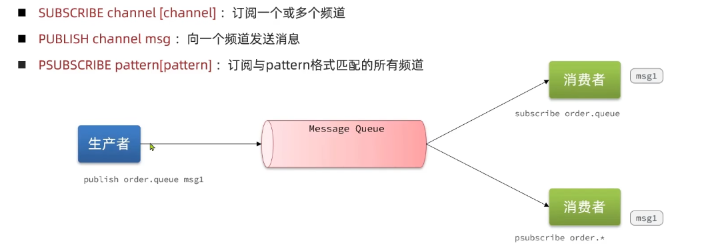

基于**PubSub**的消息队列有哪些优缺点？

优点：

- 采用发布订阅模型，支持多生产、多消费

缺点：

- 不支持数据持久化（注意这个和List那个不一样）
- 无法避免消息丢失（因为不支持持久化，不会保存在Redis中）
- 消息堆积有上限，超出时数据丢失

### 基于Stream的消息队列

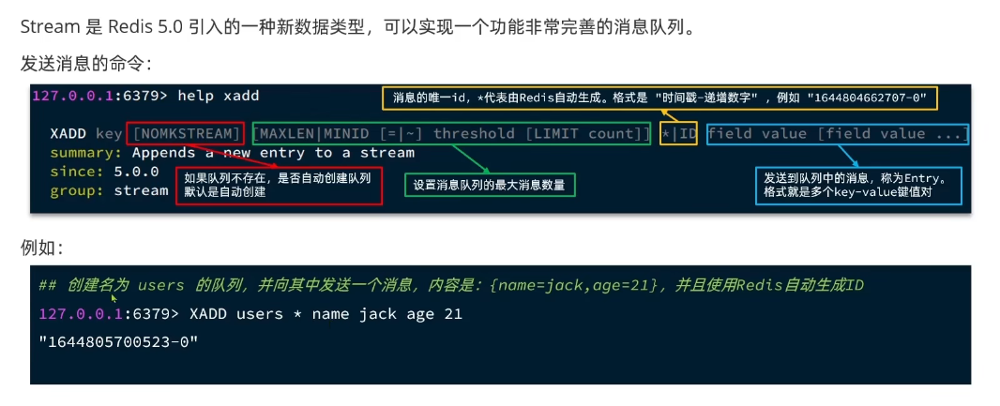

发送消息用XADD

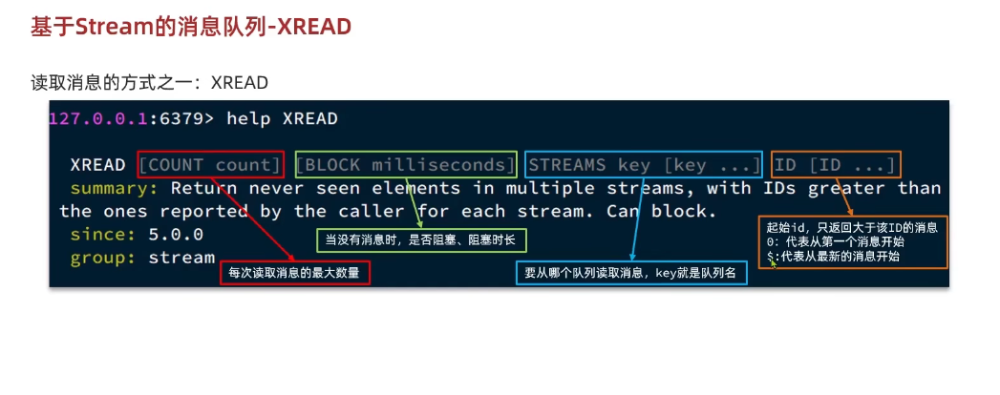
读取消息用XREAD

在业务开发中，我们可以循环的调用XREAD阻塞方式来查询最新消息，从而实现**持续监听队列的效果**

但是这个XREAD有bug，如下图：

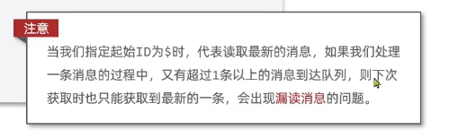

总结：Stream类型消息队列的XREAD命令特点：

- 消息可回溯
- 一个消息可以被多个消费者读取
- 可以**阻塞读取**
- 有**消息漏读**的风险

怎么解决消息漏读呢？

### 基于Stream的消息队列：消费者组

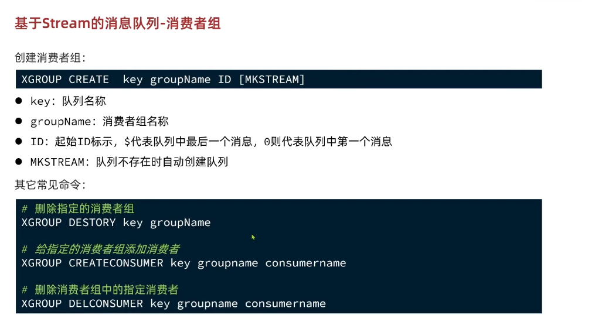

怎么读？如下图：

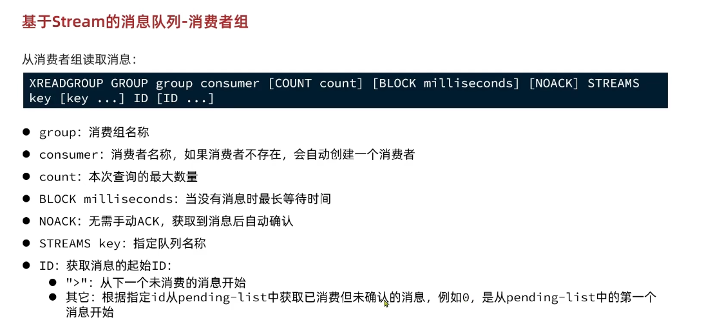

获取了消息之后，还要去确认，在那个pending list里面

**STREAM**类型消息队列中的**XREADGROUP**命令特点

- 消息可回溯
- 可以多消费者争抢信息，加快消费速度
- 可以阻塞读取
- 没有消息漏读的风险
- 有消息确认机制，保证消息至少被消费一次

### 秒杀的总体流程

1. 基于**乐观锁**解决超卖问题
2. 基于**分布式锁**实现一人一单
3. 对Redis秒杀优化，将同步的秒杀变为异步，利用阻塞队列实现异步下单（利用了Redis的lua脚本）
4. 学习了Redis中三种消息队列的实现机制，并使用stream消息队列实现异步秒杀下单

## 达人探店

这边业务都很清晰

**点赞**相关业务

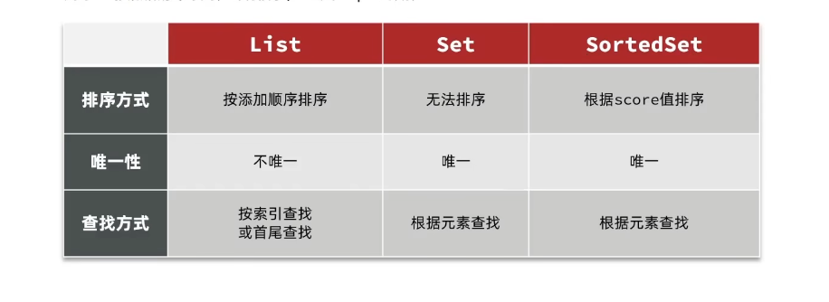

此处很显然要用**SortedSet**

## 好友关注

关于**关注推送**

关注推送也叫做**Feed流**，直译为**投喂**

>直观地说，是抖音那种无限下拉刷新获取新的信息

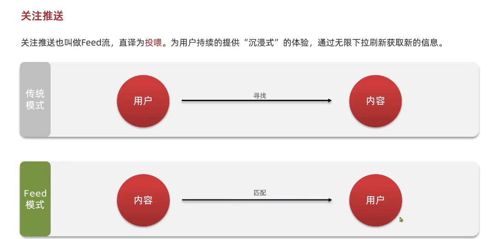

**Feed**流产品有两种模式

- TimeLine
- 智能排序

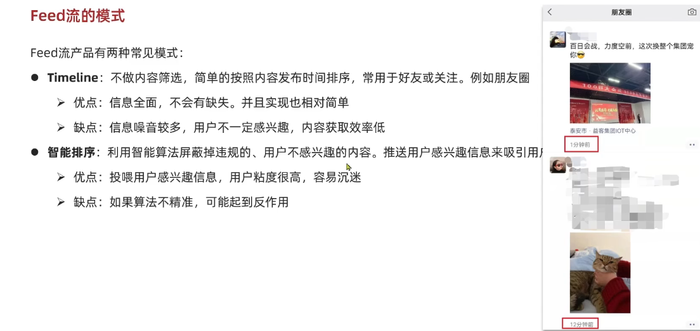

Feed流里面实现方案比较靠谱的是**推拉结合模式**，也叫做**读写混合**

其具备推和拉两种模式的优点

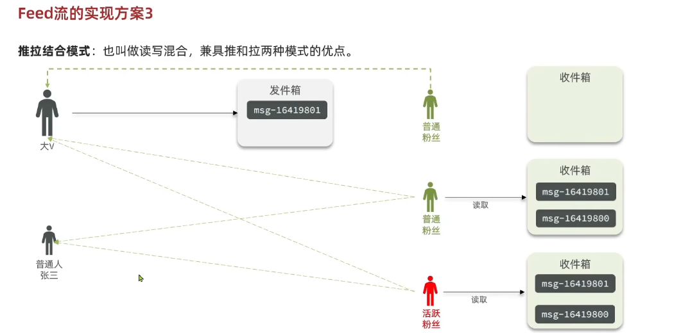

### Feed流中的分页问题

Feed流中的数据会不断更新，所以数据的角标也在变化，所以不能采用传统的分页模式

所以，应当采用**滚动分页**

比如说推送表、排行榜之类的，数据经常发生变化。在这种情况下，应当使用SortedSet，而不是List

### 滚动分页查询

分数的最大值，分数的最小值，偏移量，查询条数
这四个指标是分页查询的要点

> max min offset count

其中min一般设置为0，不用管
而count一般和前端对应好，也是一个常量

max：当前时间戳（第一次来）| 上一次查询的最小时间戳

offset：第一次来 0 | 不是第一次来，取决于上一次查询的结果，在上一次结果中，与最小值一样的元素的个数

这部分业务其实可以写简历上，因为还是比较有意义的
