# 整体架构

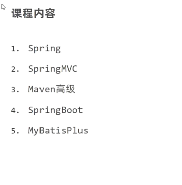

## Spring Framework系统架构

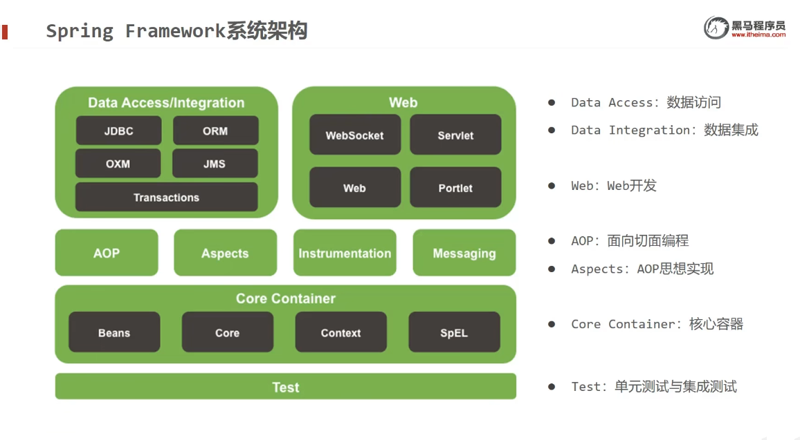

## Spring核心概念

IoC（Inversion of Control）控制反转

使用对象时，由主动new产生对象转换为**由外部提供对象**。此过程中，对象创建控制权由程序转移到外部，此思想被称为**控制反转**

核心思想：**充分解耦**

利用IoC容器管理Bean（IoC）
在IoC容器中，将所有有依赖关系的bean进行关系绑定（**DI**）

这个DI，就是**依赖注入**

### IoC入门案例

IoC是用来管理Bean的，这个Bean，也就是对象

这个入门案例写了个寂寞

### DI入门案例

注意这个细节

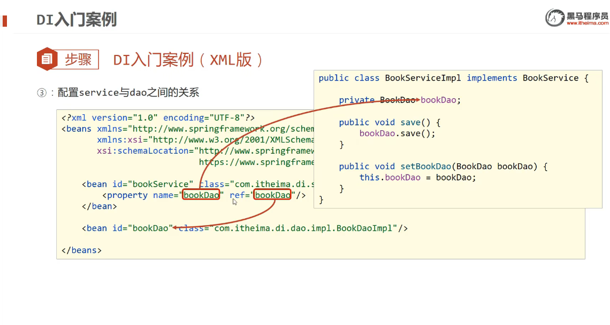

ref指的是当前容器中bean的名字
而name指的是实现类中bean属性的名字（就是对象的名字）

### bean配置

关于bean的基础配置

**为什么bean默认为单例？**

如果说不设置为单例，会造成bean数量很大，而这并不是Spring负责管理的

### bean实例化

bean怎么整出来**单例**的？

bean实际上就是**对象**，创建bean使用**构造方法**完成

还有一种办法，**静态工厂**（这个了解即可）

第三种办法：**实例工厂**

这仨玩意听了和没听一样

### bean生命周期

bean生命周期：从创建到销毁的过程

先提供生命周期控制方法

然后配置生命周期控制方法

>讲真这部分内容我还是没听懂，这玩意有什么用么，一直在改配置文件

### 依赖注入方式

此处涉及到向类中传递数据的方式

**依赖注入**描述的是在容器中建立bean之间**依赖关系**的过程

而bean运行需要的数据分为两种：

1. 引用类型
2. 简单类型（基本数据类型和String）

而依赖注入方式有两种

1. setter注入
2. 构造器注入

由此，使用依赖注入传递数据的方式有四种

#### setter注入-简单类型

要在bean中定义引用类型属性，然后给到set方法（当然是可以访问到的）
案例：

```java
// 例子
public void setNumber(int number) {
    this.Number = number;
}
```

然后从配置中用property标签value属性注入简单类型数据

#### 构造器注入

**耦合度**很高的一种方案

```xml
<bean id = "" class = "">
    <constructor-arg name="" ref = "">
</bean>
```

注意**name**字段对应的是形参，ref对应的bean的名字

这就带来了一个问题，形参和bean配置中的name字段发生了**耦合**！

自己开发的模块大多使用setter注入

#### 依赖自动装配

很便捷的一个办法！！！
给定setter注入，然后在XML配置文件中，加入"autowire = "byType"

#### 集合注入

>这部分内容不知道在搞什么鬼

没啥用，在项目中很少使用

> 听的还是稀里糊涂的，我仍然没搞懂这个框架究竟在做什么，发挥着什么用途

### 加载properties文件

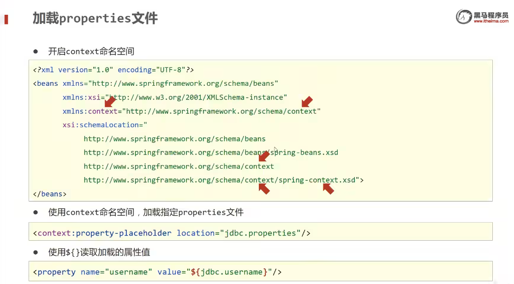

这个不知道什么鬼，根本听不懂

#### 容器

不care那些闹心的事，不care！

BeanFactory创建完毕之后，所有的bean都是延迟加载

### 核心容器总结

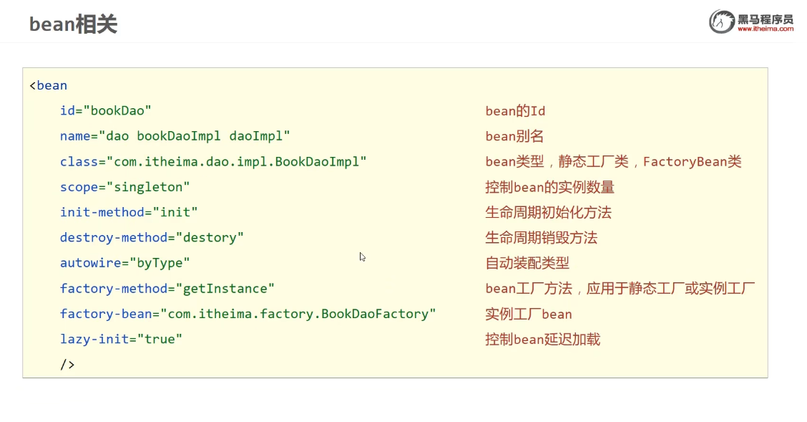

关于**依赖注入**相关

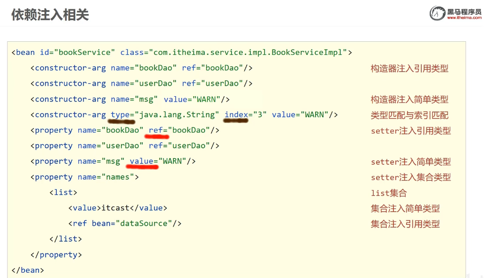

### 注解开发

Spring2.5 注解开发定义bean
Spring3.0 纯注解开发

但是这个注解开发定义还是要写配置文件，非常的麻烦

由此，我们引入**纯注解开发**！！！

### 纯注解开发

Spring3.0引入
用Java类代替配置文件

```java
@Configuration
@ComponentScan("com.itheima")
public class SpringConfig {

}
```

上面这段代码直接代替了Spring的核心配置文件

@Configuration注解用于设定当前类为配置类
@ComponentScan注解用于设定扫描路径，这个注解只能添加一次，多个数据的话，得用数组形式

### bean管理

关于bean作用范围和bean生命周期

### 依赖注入

使用**注解**的形式作**依赖注入**

```java
@Service 
public class BookServiceImpl implements BookService {
    @Autowired
    @Qualifier("bookDao")
    private BookDao bookDao;
}
```

**注意点**：

1. 自动装配基于反射设计，由此创建对象并暴力反射对应属性为私有属性初始化数据，所以没有必要提供**setter**方法

@Qualifier注解无法单独使用，必须配合@Autowired注解使用
@Qualifier注解开启指定名称装配bean

关于加载**properties**文件
利用@PropertySource

```java
@Configuration
@ComponentScan("com.itheima")
//@PropertySource加载properties配置文件
@PropertySource({"jdbc.properties"})
public class SpringConfig {
}
```

### 第三方bean管理

利用@Bean配置第三方bean

最好使用独立的第三方配置类，然后
要么导入式，使用@Import注解手动加入配置类到核心配置

```java
@Configuration
@Import(JdbcConfig.class)
public class SpringConfig {

}
```

要么使用扫描式，但是不推荐

### 关于注解开发的总结

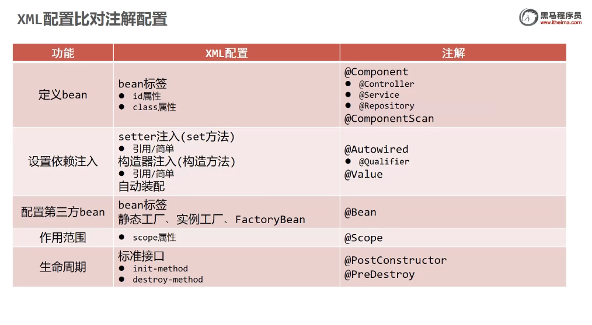

### Spring整合MyBatis

>我现在发现最麻烦的地方是，我根本对这些架构不熟悉，为什么导包，为什么导入这些数据，都是云里雾里的。
>这简直是一种折磨

tmd这个根本听不懂

### 整合JUnit

这部分不知道讲了什么玩意，用于测试类

### AOP

AOP是**面向切面编程**

**无侵入式**编程

在不惊动原始设计的基础上为其进行功能增强

**连接点**指代所有方法
而**切入点**指代要追加功能的方法

共性功能 -> **通知**

**切面**描述的是通知和切入点之间的关系

通知外部包一个类，也就引申出了**通知类**！！！！！

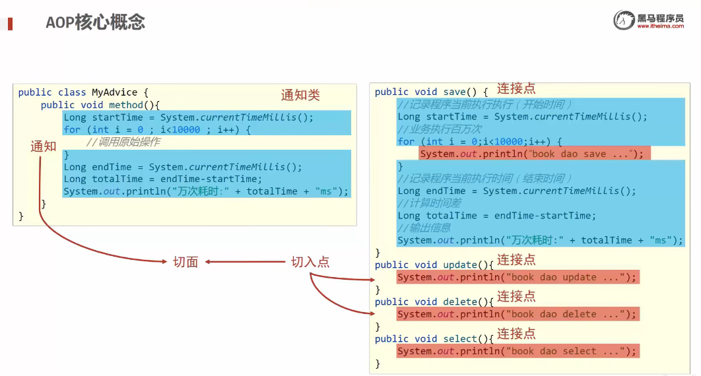

如上是一个比较清晰的AOP框架图

在SpringAOP中，一个切入点可以只描述一个具体方法，也可以匹配多个方法

### AOP工作流程

Spring容器启动

AOP使用的是**代理**模式

目标对象（Target）和代理（Proxy）

匹配上就造代理对象，不然就搞原始对象

关于**AOP切入点表达式**

这玩意就是要进行增强的方法的描述方式

```java
execution(public User com.itheima.service.UserService.findById(int))
```

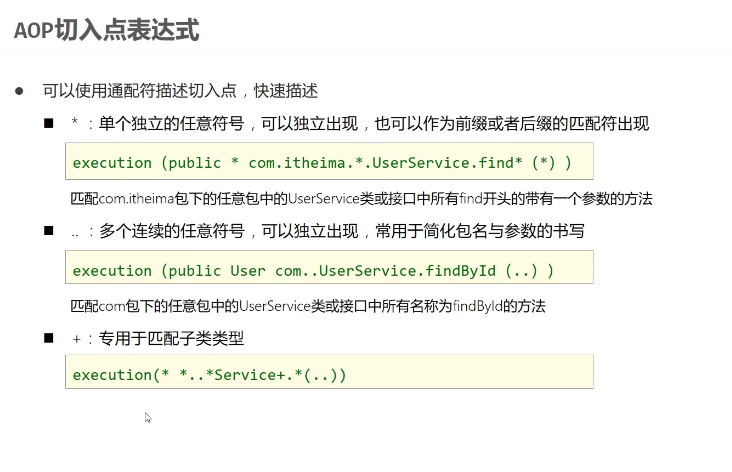

注意一些书写的技巧
>这玩意看看就得了

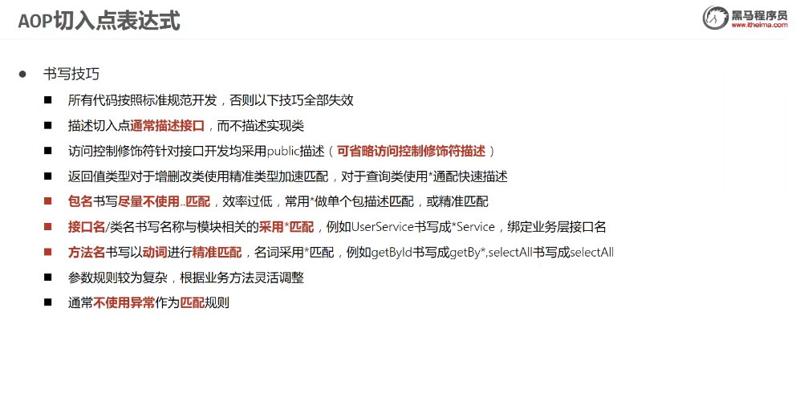

AOP**通知类型**

>为什么我感觉我好像听过这部分内容

**AOP通知**：五种类型

注意这个@Around

```java
@Around("pt2()")
    public Object aroundSelect(ProceedingJoinPoint pjp) throws Throwable {
        System.out.println("around before advice ...");
        //表示对原始操作的调用
        Integer ret = (Integer) pjp.proceed();
        System.out.println("around after advice ...");
        return ret;
    }

```

注意这条

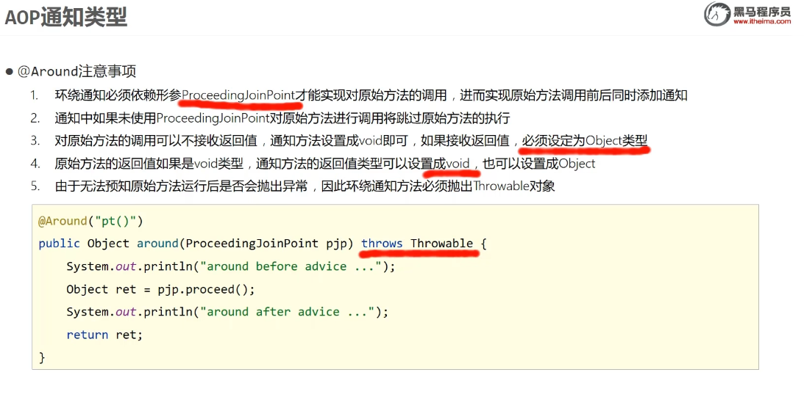

如何从AOP通知中获取数据？

**AOP**总结

>这部分内容我觉得学了个寂寞，也许在项目中会体现其作用

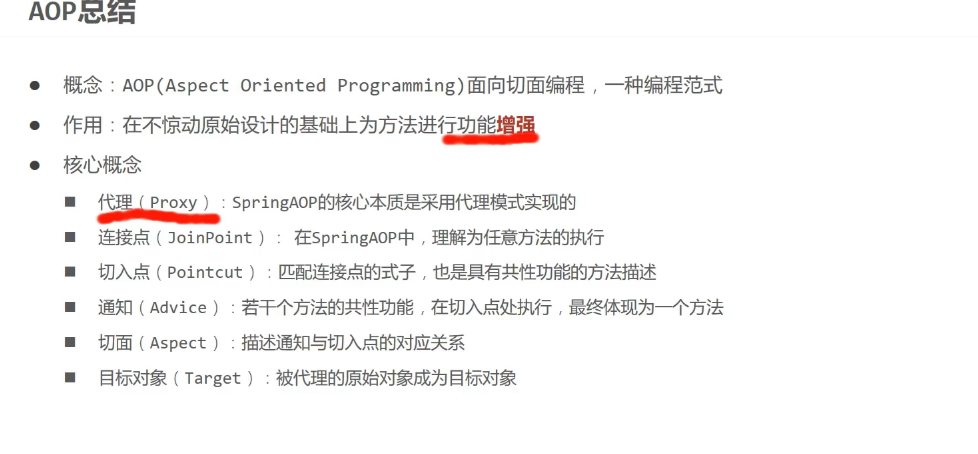

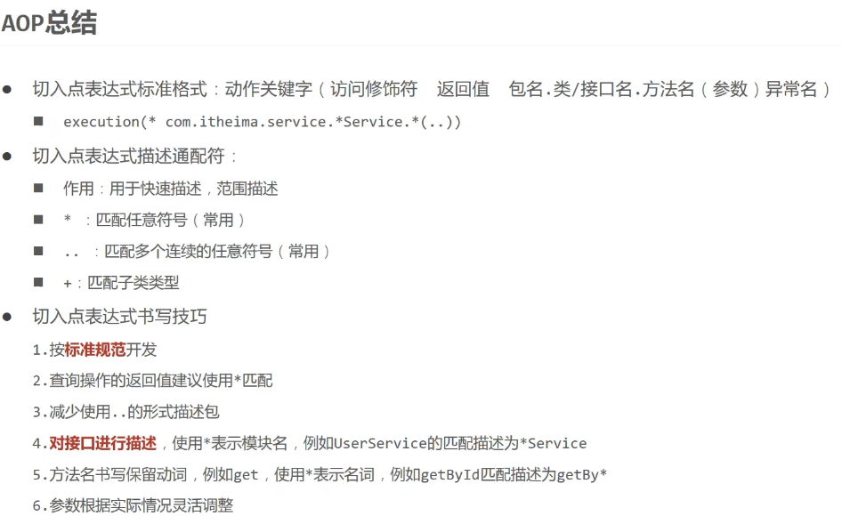

注意这个**切入点表达式**

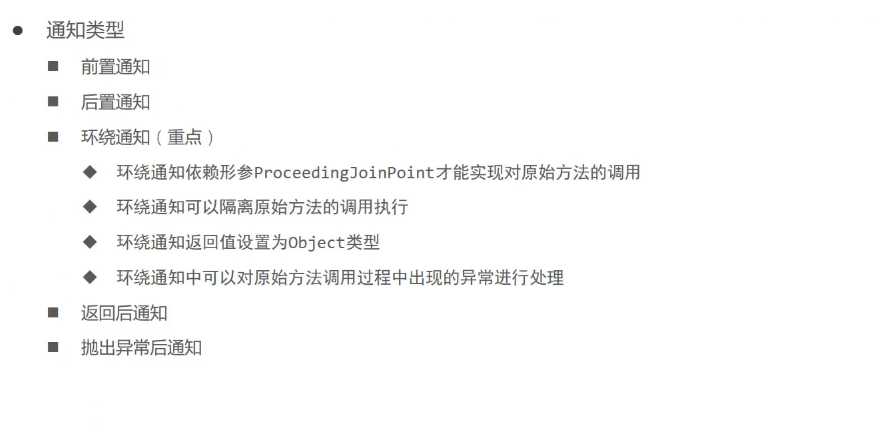

**通知**中，要注意@Around，即**环绕通知**

### Spring事务

事务作用：在数据层保障一系列的数据库操作同时成功或者失败

出现异常可能导致的**业务失败**

先往业务层接口上添加Spring事务管理，比如@Transactional

**注意**：Spring注解式事务通常添加在业务层接口中而不会添加在业务层实现类里面，从而降低耦合

第二步，设定事务管理器

第三步，开启注解式事务驱动

### Spring事务角色

事务管理员和事务协调员

分别作为发起方和加入方

>md这部分讲了个啥

关于**事务的相关配置**

tmd这个我根本听不明白在讲什么

事务传播行为

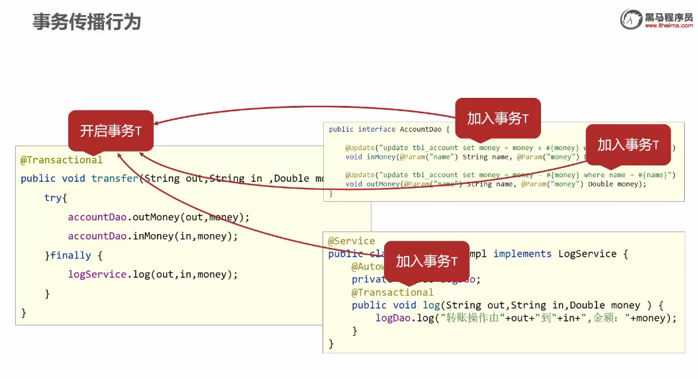

由此引申到事务的**传播**

在业务层接口上添加Spring事务，设置事务传播行为**REQUIRES_NEW**（需要新事务）

## SpringMVC

这个技术实际上隶属于Spring技术
与Servlet技术功能相同，都是web层开发技术，但是开发更加简便！

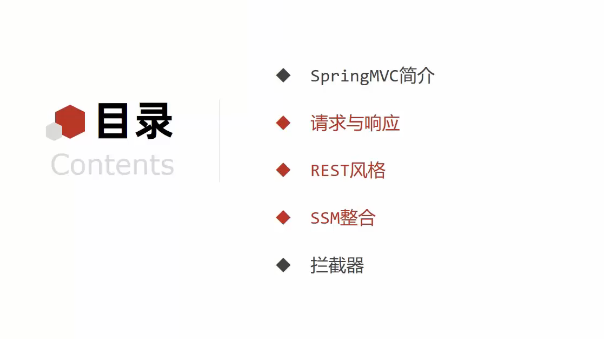

操作流程

1. 先导入SpringMVC坐标
2. 创建SpringMVC控制器类
3. 初始化SpringMVC环境，配置加载对应的Bean
4. 初始化Servlet容器，加载SpringMVC环境

关于**启动服务器**的初始化过程

关于**单次请求**过程

这部分听的还是非常晕

### Bean加载控制

由于功能不同，我们需要避免Spring错误的加载到SpringMvc的bean

也就是说，**在加载Spring控制的bean的时候，需要排除掉SpringMVC控制的Bean**！！！

>通俗的说，就是该加载什么就加载什么

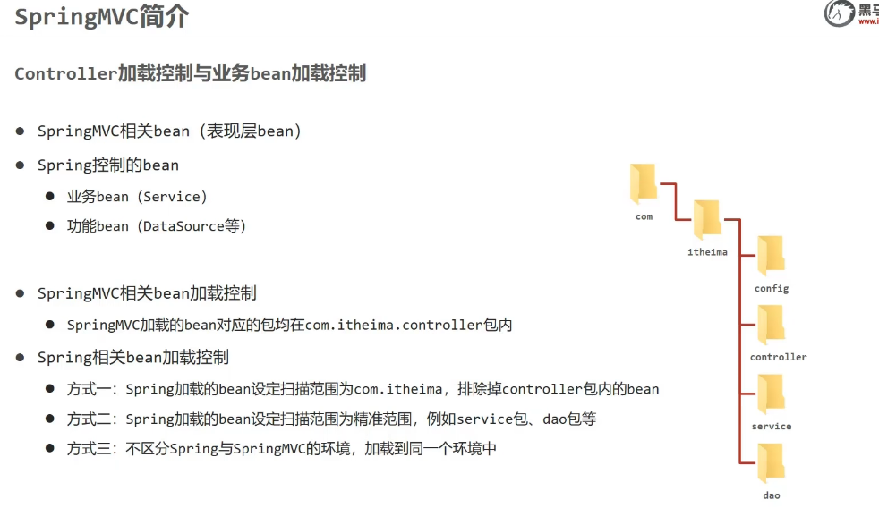

关于@CompentScan的说明

```java
@Configuration
@CompentScan(value = "com.itheima", 
    excludeFilters = @ComponentScan.Filter(
        type = FilterType.ANNOTATION,
        classes = Controller.class
    )
)
```

关于**PostMan**

没什么鸟用的一个工具

### 请求与响应

可以设置**请求映射路径**

Get请求
Post请求

#### 各种请求参数

普通参数：请求参数名和形参变量名**不同**，使用@RequestParam绑定参数关系
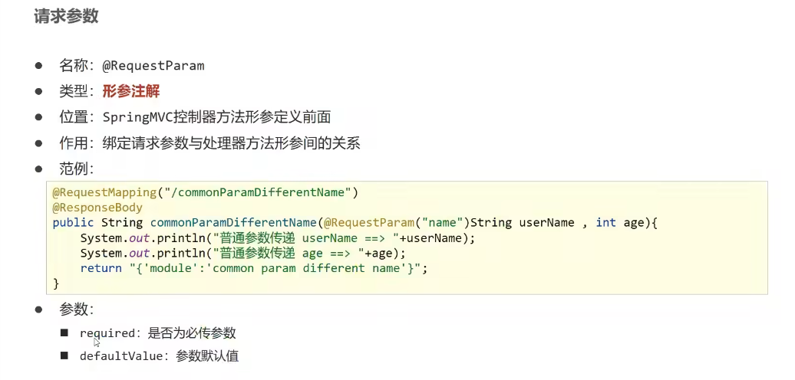

```java
@RequestMapping("/commonParamDifferentName")
@ResponseBody
public String commonParamDifferentName(@RequestParam("name")String userName, int age) {
    System.out.println("normal param send: userName ==>" + userName);
    return "{'module': 'common param different name'}";
}
```

剩下几种都差不多
名称对得上的就行，对不上的用@RequestParam

更为常用的是**json交互**

#### 日期类型参数传递

用@DataTimeFormat设定日期格式

```java
@RequestMapping("/dataParam")
    @ResponseBody
    public String dataParam(Date date,
                            @DateTimeFormat(pattern="yyyy-MM-dd") Date date1,
                            @DateTimeFormat(pattern="yyyy/MM/dd HH:mm:ss") Date date2){
        System.out.println("参数传递 date ==> "+date);
        System.out.println("参数传递 date1(yyyy-MM-dd) ==> "+date1);
        System.out.println("参数传递 date2(yyyy/MM/dd HH:mm:ss) ==> "+date2);
        return "{'module':'data param'}";
    }
```

#### 关于响应
