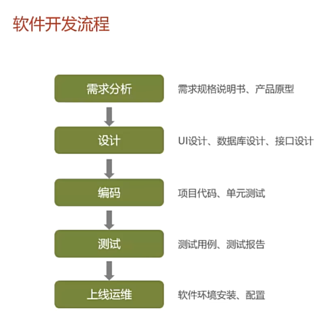
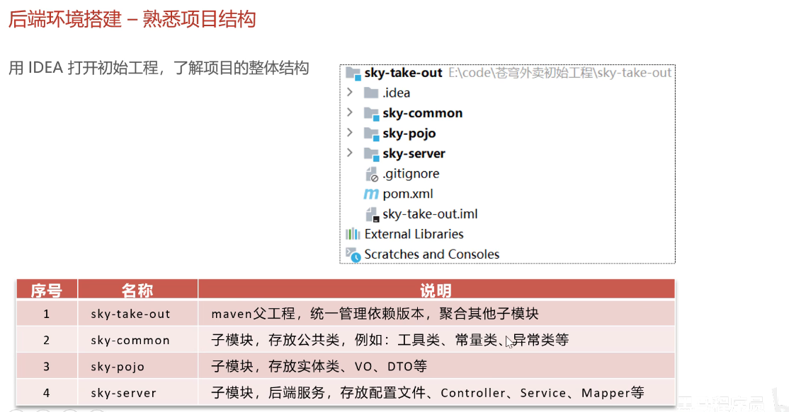
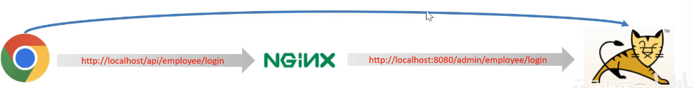
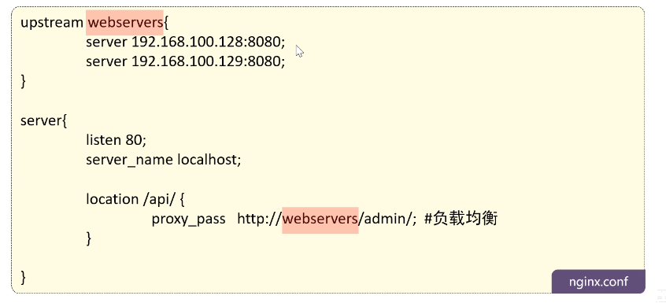
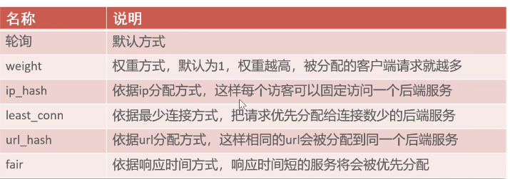
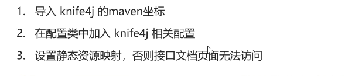
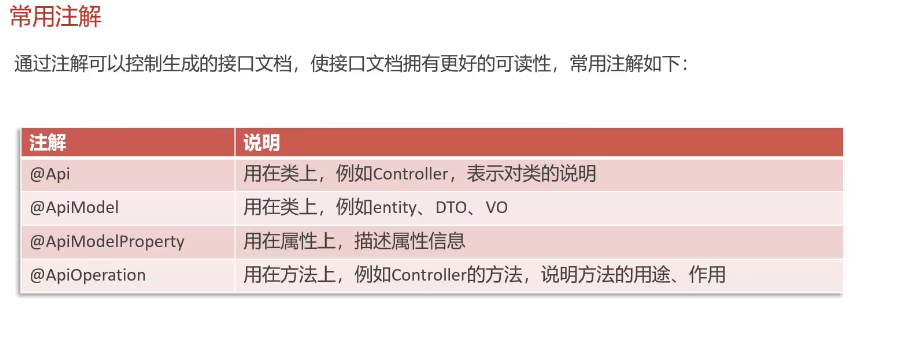

# Day01

## 概览

关于软件开发的流程



## 项目的整体介绍

管理端、用户端

各种页面进行展示

关于**技术选型**


## 开发环境搭建

重点是后端环境的搭建

后端工程基于**Maven**进行项目构建，并且分模块开发



在初始工程的基础上，进行开发

数据库什么的也导进入了

现在执行**前后端联调**！

吐了，第一天构写项目就遇到一个大坑，好在排查出来了！
>特别注意：本项目基于**SDK17**，如果使用**SDK22**会发生部分包不同步而导致的报错！

这边执行登录的时候又遇到了一个大坑：**记得去sky-server包下的yml文件中去把数据库密码改成自己的密码！！！**

### 关于Nginx反向代理

前端发送的请求，是如何请求到后端服务的？

Nginx反向代理，**就是将前端发送的动态请求由Nginx转发到Tomcat后端服务器**



之所以不直接从前端服务器转发到后端服务器，原因如下

nginx反向代理的好处：提高**访问速度**、进行**负载均衡**（通过nginx指定的方式均衡的分配给集群的每台服务器）、保证后端服务安全

nginx反向代理的配置方式

```config
server{
    listen 80;
    server_name localhost;
    location /api/ {
        proxy_pass http://localhost:8080/admin/; #反向代理
    }
}
```

nginx负载均衡的配置方式



nginx**负载均衡策略**：



### 完善登录功能

对密码进行**加密**

使用**MD5**加密方式对明文密码进行加密

> 说实话我觉得这个东西是真的鸡肋

## 导入接口文档

实际工作中**接口的设计**是非常漫长的过程

### 前后端分离开发流程

……

### 导入文档

把俩json接口文件导入到**YApi**

>这个YApi简直是答辩，建议从ApiFox平台导入数据（注意导入数据时类型选择为YApi）

## Swagger

这个的目的是为了**测试**接口的正确可行性

直接使用Swagger很麻烦，由此，我们使用了**Knife4j**

**Knife4j**：为Java MVC框架继承Swagger生成Api文档的增强解决方案



### 关于Swagger的常用注解



相当于给类、属性、方法等提供名称等注释
