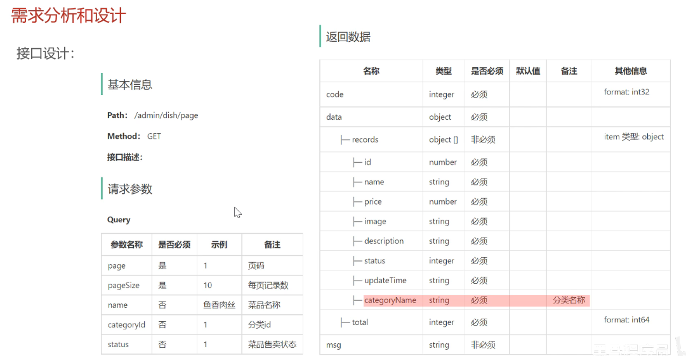
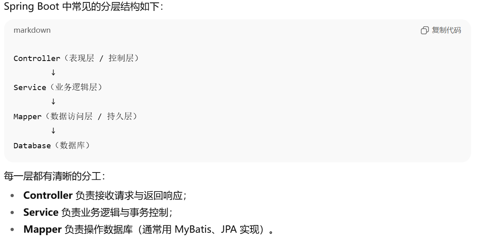

# Day03

## 概览

公共字段自动填充、新增菜品、菜品分页查询、删除菜品、修改菜品

### 公共字段自动填充

自定义注解AutoFill，用于标识需要进行公共字段自动填充的方法

自定义切面里AutoFillAspect，统一拦截加入了AutoFill注解的方法，通过反射为公共字段赋值

在Mapper的方法上加入AutoFill注解

>注意这边对于**AOP**的使用

### 新增菜品

>这边碰到的bug也是真的坑人，视频中提供的OSS已经过期了，还得自己配一个

**DTO**是什么？

@Transactional是什么东西？

### 分页查询

**接口设计**如下：



---

问题：**DTO和VO是什么东西？**

#### 关于DTO

所谓的DTO，也就是**Data** **Transfer** **Object**

DTO是**用于在不同层之间传递数据的对象**，本身不包含业务逻辑

其主要作用：

1. 从前端**接收数据**（比如说**Controller**的请求参数）
2. 向**前端**返回数据（组合多个实体字段的响应）

DTO通常出现在：

1. **Controller**和**Service**之间的数据传递
2. 在前后端分离的REST API中，用于**封装请求**或者是**响应数据**

在**Service**层，**DTO**通常会被转换为实体类（Entity）以便持久化到数据库

```java
User user = new User();
BeanUtils.copyProperties(userDTO, user);
userMapper.insert(user);
```

#### 关于VO

所谓的**VO**，也就是**Value** **Object**

**VO**是用于封装**展示层**数据的对象，常用于**向前端**返回复杂的，组合性的结果

主要出现在**Controller->前端**的响应中

案例：

```java
// 视图层展示对象
public class EmployeeVO {
    private String name;
    private String departmentName;
    private String position;
    private Double salary;
}
```

在**Service**层构造**VO**

```java
Employee employee = employeeMapper.selectById(id);
Department dept = deptMapper.selectById(employee.getDeptId());

EmployeeVO vo = new EmployeeVO();
vo.setName(employee.getName());
vo.setDepartmentName(dept.getName());
vo.setPosition(employee.getPosition());
vo.setSalary(employee.getSalary());
return vo;
```

然后我们在Controller层返回

```java
@GetMapping("/employee/{id}")
public Result<EmployeeVO> getEmployee(@PathVariable Long id) {
    EmployeeVO vo = employeeService.getEmployeeVO(id);
    return Result.success(vo);
}
```

---

问题：**Controller**，**Service**，**Mapper**这三层是什么，之间的联系是怎样的？

……SpringBoot学的实在是过于匆忙，后面要回过去把那部分内容补一下，不然真属于基础不牢



从**Controller**到**Service**，再从**Service**到**Mapper**，最后通过**Mapper**访问操作数据库

这边重新复习一下三个层各自的作用：

#### 关于**Controller**（表现层/控制层）

作用：
接收前端的**HTTP**请求；
调用**Service**层执行具体业务；
将结果封装之后返回给前端（通常是**Json**格式）

样例代码：

```java
@RestController
@RequestMapping("/employee")
public class EmployeeController {
    
    @Autowired
    private EmployeeService employeeService;

    @PostMapping("/login")
    public Result<EmployeeVO> login(@RequestBody LoginDTO loginDTO) {
        EmployeeVO vo = employeeService.login(loginDTO);
        return Result.success(vo);
    }
}

```

说明：

1. @**RestController**表示该类是一个Web控制器；
2. @**RequestMapping**定义接口路径；
3. @**RequestBody**用于接收**JSON**格式请求体；
4. Controller层**不应该包含具体的业务逻辑**！！！只用作请求分发和结果封装

#### 关于**Service**（业务逻辑层）

作用：
负责对业务逻辑的处理；
调用**Mapper**层完成数据查询和持久化；
控制事务；（这是什么玩意）
封装和组合多个Mapper调用，形成业务功能；

样例代码：

```java
@Service
public class EmployeeServiceImpl implements EmployeeService {

    @Autowired
    private EmployeeMapper employeeMapper;

    @Override
    public EmployeeVO login(LoginDTO dto) {
        Employee employee = employeeMapper.findByUsername(dto.getUsername());
        if (employee == null || !employee.getPassword().equals(dto.getPassword())) {
            throw new RuntimeException("账号或密码错误");
        }

        EmployeeVO vo = new EmployeeVO();
        BeanUtils.copyProperties(employee, vo);
        return vo;
    }
}
```

说明：

1. @Service表示该类为业务服务层；
2. **Service**层可以包括**事务控制**、**业务判断**、**缓存操作**等；
3. 通常会调用多个**Mapper**组成完整的业务流程；

#### 关于**Mapper**（数据访问层/持久层）

作用：
与数据库进行直接的交互；
执行SQL的增删改查；
只执行数据的相关操作，不掺杂业务逻辑；

样例代码（**MyBatis**实现）：

```java
@Mapper
public interface EmployeeMapper {

    @Select("select * from employee where username = #{username}")
    Employee findByUsername(String username);

    @Insert("insert into employee (name, username, password) values (#{name}, #{username}, #{password})")
    void insert(Employee employee);
}
```

说明：

1. @**Mapper**表示**MyBatis**的映射接口
2. 可以使用XML或者注解定义SQL；
3. 返回对象通常是实体类（**Entity**）
4. 只执行数据存取，不包含业务判断；

#### 关于Controller、Service、Mapper三者调用关系

从**请求**到**数据返回**的完整流程如下：

```pgsql
① 前端（浏览器 / Postman）
        ↓ 发送 HTTP 请求（JSON）
② Controller
        ↓ 解析参数 → 调用 Service
③ Service
        ↓ 执行业务逻辑 → 调用 Mapper
④ Mapper
        ↓ 执行 SQL → 访问数据库
⑤ Database
        ↑ 返回数据
⑥ Mapper 返回 Entity
        ↑
⑦ Service 处理业务逻辑，组装 VO
        ↑
⑧ Controller 返回 JSON 响应给前端
```

### 删除菜品

注意**删除**时候的业务规则

删除菜品时需要一并删除附带的口味数据

关于动态SQL，应该写到**Mapper**对应的**XML**文件中去

### 修改菜品

……
