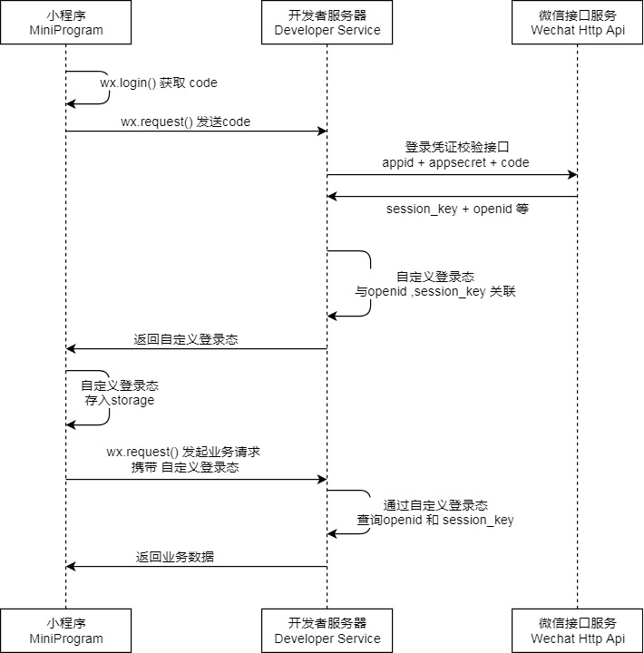

# Day06

## 概览

实现功能：微信登录、用户浏览

HTTPClient、微信小程序开发、微信登录、导入商品浏览功能代码

## HTTPClient

其可以用来提供高效的、最新的、功能丰富的支持**HTTP**协议的客户端编程工具包

核心API

- HttpClient
- HttpClients
- CloseableHttpClient
- HttpGet
- HttpPost

创建请求步骤：

- 创建HttpCLient对象
- 创建Http请求对象
- 调用HttpClient的execute方法发送请求

## 微信小程序开发

微信公众平台：<https://mp.weixin.qq.com/cgi-bin/wx?token=&lang=zh_CN>

注意个人小程序没有**支付权限**功能

注册地址：<https://mp.weixin.qq.com/wxopen/waregister?action=step1>

微信小程序开发者工具地址：<https://developers.weixin.qq.com/miniprogram/dev/devtools/stable.html>

这个**微信小程序开发**实在是太啥比了，直接跳过！

## 微信登录

具体流程：<https://developers.weixin.qq.com/miniprogram/dev/framework/open-ability/login.html>

code: 0f1rUS0w3PDuP53uiX0w31TK1l1rUS0A

>今天这课真的莫名其妙

### 需求分析&设计

……

这个微信小程序设计真是折磨人，功能点莫名其妙，而且软件也非常不好使

我吐了，还是得解决这个问题，因为后面的用户端开发还是需要使用到小程序

>md这边是我自己眼神不好使，一个key传错了，应该传入的是"openid"！！！

## 对于商品浏览的设计

主要以**浏览**为主
因此大部分使用**GET**
