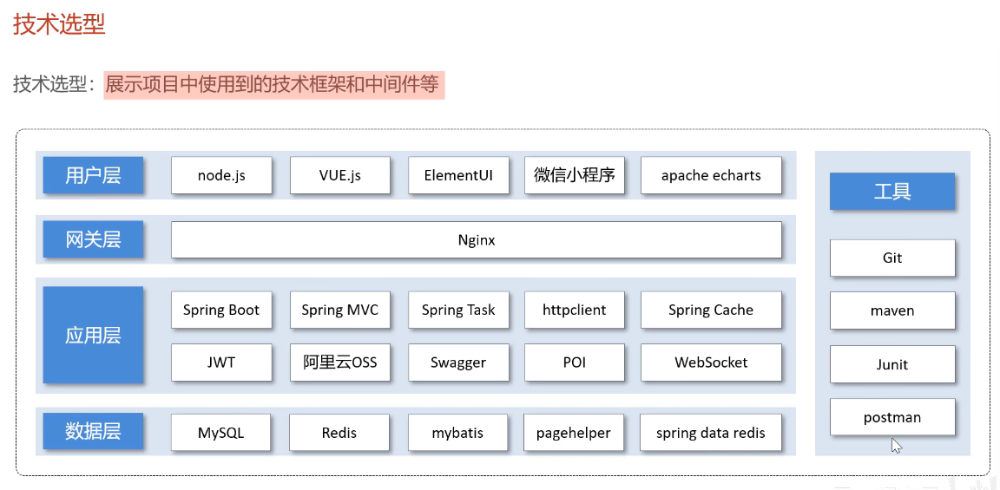

# Day01

## 概览

关于软件开发的流程

## 项目的整体介绍

管理端、用户端

各种页面进行展示

关于**技术选型**

## 开发环境搭建

重点是后端环境的搭建

后端工程基于**Maven**进行项目构建，并且分模块开发

在初始工程的基础上，进行开发

数据库什么的也导进入了

现在执行**前后端联调**！

吐了，第一天构写项目就遇到一个大坑，好在排查出来了！
>特别注意：本项目基于**SDK17**，如果使用**SDK22**会发生部分包不同步而导致的报错！
