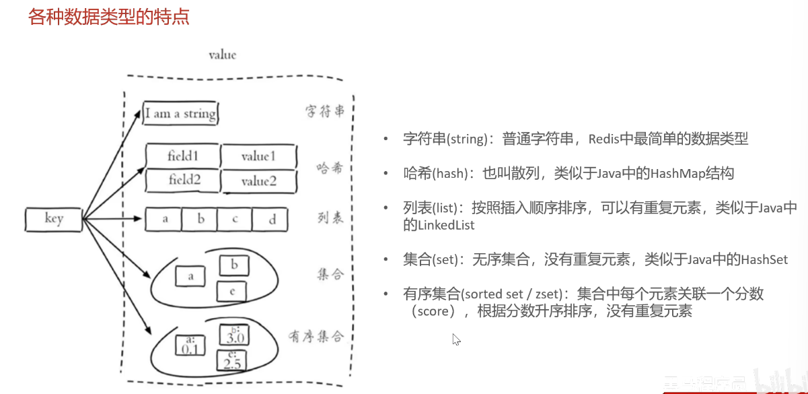
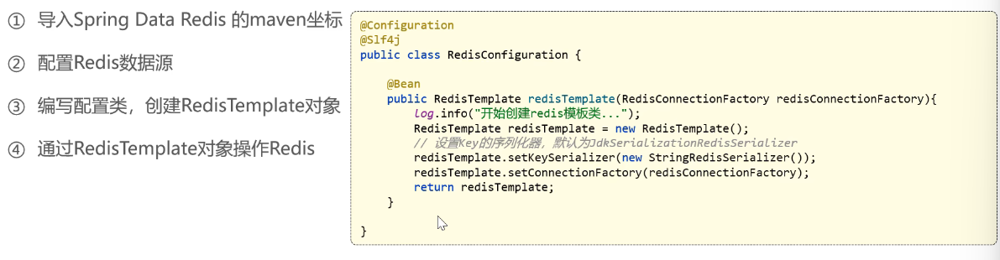

# Day05

## 概览

**Redis**入门、**Redis**数据类型、常用命令；在Java中操作**Redis**，以及店铺营业状态设置

## Redis入门

**Redis**是一个基于内存的**key-value**结构数据库

基于**内存**存储，读写性能更高
适合存储**热点数据**


这个的完整版似乎需要在Linux上进行配置

## Redis常用的数据类型

**key**是**字符串**类型，**value**有五种常用的数据类型

- 字符串 string
- 哈希 hash
- 列表 list
- 集合 set
- 有序集合 sorted set / zset

各种数据类型的特点：



## Redis常用命令

有字符串、哈希、列表、集合、有序集合和通用六种操作命令

### 字符串操作命令

- SET KEY value
- GET key
- SETEX key seconds value 设置指定key的值，并将key的过期时间设定位seconds秒
- SETNX key value 只有key不存在时，才设置key的值

比如说

```redis
setex code 15 858636
```

意味着code的值是858636，并且只有15s的有效期（这种可以用来设置验证码）

### 哈希操作命令

- HSET key field value 将哈希表key中的字段field的值设定为value
- HGET key field 将获取存储在哈希表中指定字段的值
- HDEL key field 删除存储在哈希表中的制定字段
- HKEYS key 获取哈希表中的所有字段
- HVALS key 获取哈希表中的所有值

### 列表操作名命令

注意列表按照**插入顺序排序**

- LPUSH key value1 [value2] 将一个或者多个值插入到列表头部
- Lrange key start stop 获取列表制定范围内的元素
- RPOP key 移除并且返回列表最后一个元素
- LLEN key 获取列表长度

### 集合操作命令

Redis set 是**String**类型的无序集合，集合成员是唯一的

- SADD key member1 [member2]
- SMEMBERS key 返回集合中的所有成员
- SCARD key 获取结合中的成员数量
- SINTER key1 [key2] 返回给定所有集合的交集
- SUNION key1 [key2] 返回给定所有集合的并集
- SREM key member1 [member2] 删除集合中一个或者多个成员

### 有序集合操作命令

Redis有序集合是string类型元素的集合，并且不允许含有重复成员。每个元素都会关联一个double类型的分数

- **ZADD** key score1 member1 [score2 member2] 向有序集合中添加一个或者多个成员
- **ZRANGE** key start stop [WITHSCORES] 通过索引区间返回有序集合中指定区间内的成员
- **ZINCRBY** key increment member 有序集合中对指定成员的分数加上增量increment
- **ZREM** key member [member] 移除有序集合中的一个或者多个成员

### Redis通用命令

- KEYS Pattern 查找所有符合给定模式(pattern)的key
- Exists key 检查给定key是否存在
- Type key 返回key所存储的值的类型
- DEL key 该命令用于在key存在时，删除key

## 在Java中操作Redis

### Redis的Java客户端

其中一种叫做Spring Data Redis
也是这个项目的重点使用方式

常见的几种Java客户端

- Jedis
- Lettuce
- Spring Data Redis

### Spring Data Redis使用方式

操作步骤：



## 店铺营业状态设置

接口设计：

- 设置营业状态
- 管理端查询营业状态
- 用户端查询营业状态

>并且注意本项目的约定：
>
> - 管理端发出的请求，统一使用/ admin 作为前缀
> - 用户端发出的请求，统一使用/user作为前缀
