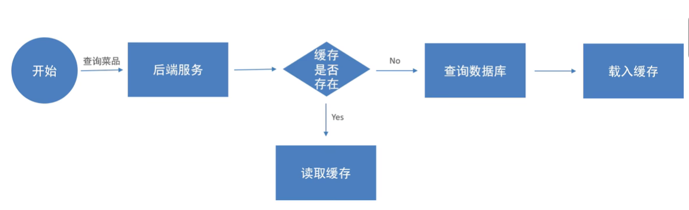
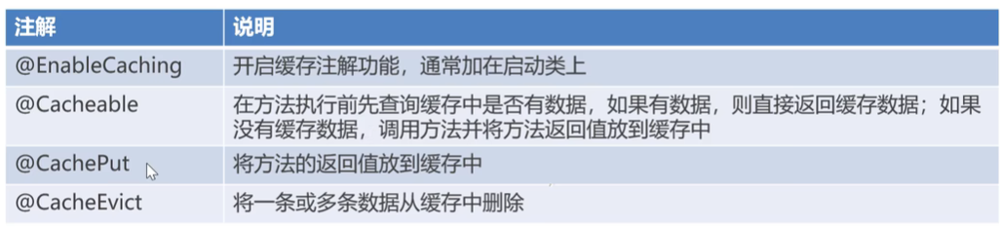

# Day07

## 概览

使用**Redis**

缓存菜品、套餐；
添加、查看、清空购物车

**清空购物车**是作业，记得写掉

## 缓存菜品

通过**Redis**来缓存菜品数据，减少数据库查询操作
（因为Redis数据在内存里面，而利用数据库操作是磁盘IO操作）

**注意**：

- 每个分类的菜品下保存有一份缓存数据
- 数据库中菜品数据有变更时清理缓存数据

>服了，这边前面的业务开发埋了一个坑，忘记写**菜品的起售停售业务**了，顺便写了一下

## 缓存套餐

利用他们提供的**注解**

### 关于Spring Cache

这个Spring Cache实际上是一个框架，实现了基于注解的**缓存功能**。

底层可以基于

- EHCache
- Caffeine
- Redis

**常用的注解**：

>md我真搞不懂这个功能有什么鸟用

## 添加购物车

冗余字段使得避免了多表连接查询，加快了查询速度

>顺便把清空和删除功能都写掉

现在大概搞明白这些**接口开发**是咋回事了，看文档，然后定义接口，从**Controller->Service->Mapper**构写功能
