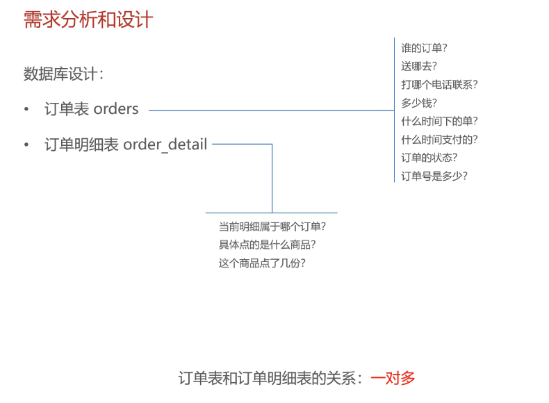

# Day08

## 概览

用户下单、订单支付

## 用户下单

**注意**：功能和接口并非一定一一对应，而可能是一对多

关于订单的数据库设计

订单表 **orders**
订单明细表 **order_detail**

## 订单支付

>这玩意了解流程即可

参考：<https://pay.weixin.qq.com/static/product/product_index.shtml>

>这讲的什么鸡毛，根本听不懂

利用**校园网**执行**内网穿透**失败，估计是屏蔽了这个操作
>目的实际上是获得一个**临时域名**，然后访问当前的项目

这节课讲的东西技术含量不大，只是了解即可
